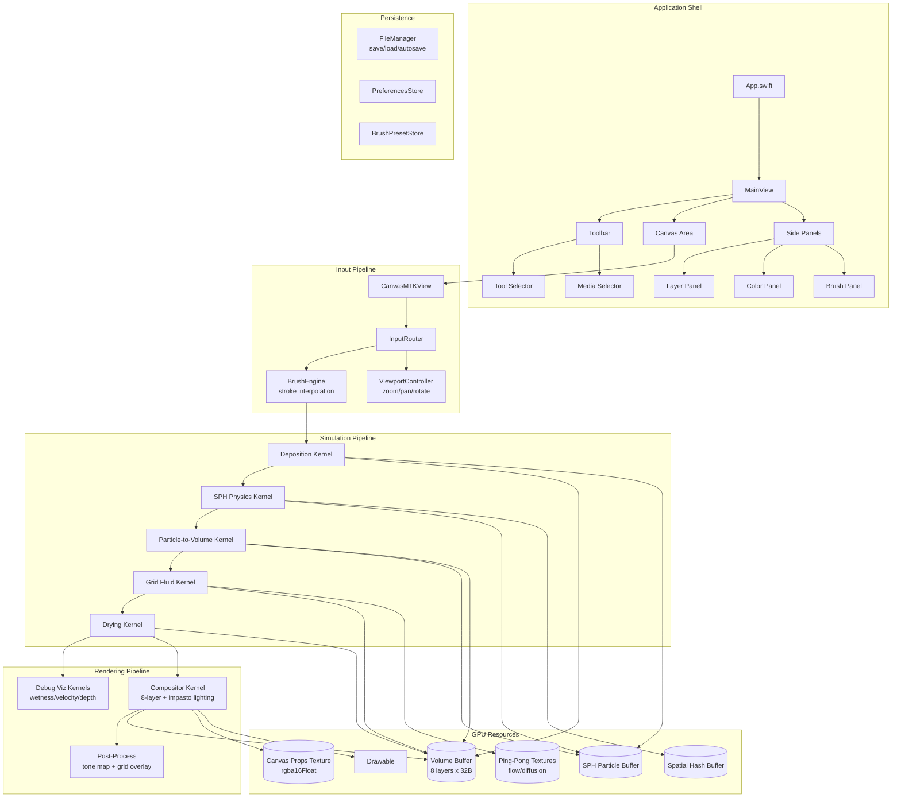
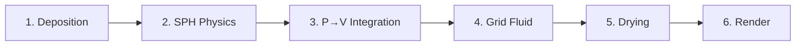
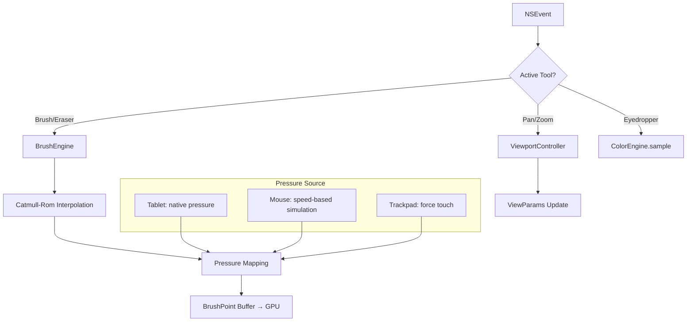
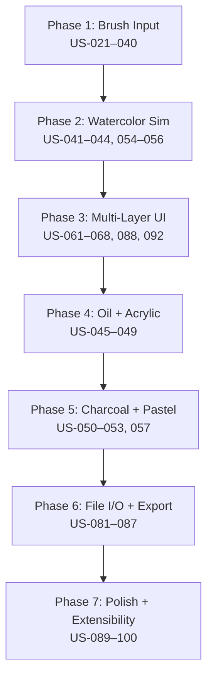

# Proposed Architecture

## Overview

This document describes the **target architecture** for TheRobotPaints — the full-featured paint simulator derived from 100 user stories across 7 personas. It extends the current architecture (3 compute kernels, no interaction) into a complete application with brush input, 5-media physics simulation, layer management, file I/O, and an extensible shader system.

## Tech Stack (Unchanged + Additions)

| Aspect | Choice | Status |
|--------|--------|--------|
| Platform | macOS 14+, Apple Silicon primary | Current |
| Language | Swift 6 + MSL | Current |
| Build | SPM | Current |
| Shader source | Swift string literals, runtime-compiled | Current |
| UI framework | SwiftUI (panels, dialogs, toolbar) + MTKView | Extended |
| Color model | Absorption (Beer-Lambert) | Current |
| Input | Tablet (pressure), mouse/trackpad, 3D mouse | New |
| File format | Custom binary (volume + metadata) | New |
| Plugin system | Swift protocol + dynamic MSL kernel loading | New |

## System Diagram



## Core Components

| Component | Module | Purpose |
|-----------|--------|---------|
| MetalEngine | `Rendering/` | Singleton: device, queue, compiler, texture factory (exists) |
| Renderer | `Rendering/` | MTKViewDelegate, frame orchestration, kernel dispatch (exists, extended) |
| BrushEngine | `Input/` | Stroke interpolation, pressure mapping, tool state (US-021–040) |
| InputRouter | `Input/` | Dispatches events to brush vs viewport based on active tool (US-021, 022, 040) |
| SimulationPipeline | `Simulation/` | Orchestrates 5-phase GPU simulation per frame (US-041–060) |
| LayerManager | `State/` | Layer visibility, active selection, metadata (US-061–080) |
| ColorEngine | `State/` | Absorption-aware picker, palette, history, eyedropper (US-072–076) |
| FileManager | `FileIO/` | Native format save/load, PNG/TIFF export, autosave (US-081–086) |
| PluginHost | `Extensions/` | Protocol-based media type registration, dynamic kernel loading (US-099) |
| PreferencesStore | `State/` | User settings, keyboard shortcuts, display defaults (US-090, 091) |

-> *See [arch/proposed-components.md](arch/proposed-components.md) for module details*

## Data Model (Extended)

### Existing (Unchanged)

- **VolumeLayer** (32B, FP16) — per-layer per-pixel paint state
- **Canvas Props Texture** (rgba16Float) — absorbency, roughness, porosity, sizing

### New Structures

| Struct | Size | Purpose | Stories |
|--------|------|---------|---------|
| SPHParticle | 48B | Fluid dynamics particle | US-055 |
| SpatialHashCell | 8B | Neighbor lookup for SPH | US-055 |
| BrushPoint | 32B | Interpolated stroke sample (position, pressure, tilt, timestamp) | US-021–023 |
| BrushParams | 64B | Active brush config (size, opacity, flow, media, shape) | US-024–032 |
| StrokeRecord | var | Undo unit: brush params + BrushPoint array | US-033, 034 |
| CanvasPreset | 128B | Paper type config (name + 4 material floats + noise params) | US-069 |
| PaintingFile | header | File format header: version, dimensions, layer count, metadata | US-081 |

-> *See [arch/proposed-data-model.md](arch/proposed-data-model.md) for layouts and memory*

## Simulation Pipeline

Six compute phases per frame (phases 1-5 only when simulation is active):



| Phase | Kernel | Input | Output | Stories |
|-------|--------|-------|--------|---------|
| Deposition | `deposit` | BrushPoint[], VolumeLayer[] | VolumeLayer[], SPHParticle[] | US-021–032 |
| SPH Physics | `sphPhysics` | SPHParticle[], SpatialHash | SPHParticle[] | US-055, 059 |
| P→V Integration | `particleToVolume` | SPHParticle[], VolumeLayer[] | VolumeLayer[] | US-041–053 |
| Grid Fluid | `gridFluid` | VolumeLayer[], PingPong textures | VolumeLayer[] | US-041, 047, 059 |
| Drying | `drying` | VolumeLayer[], CanvasProps | VolumeLayer[] | US-044, 047, 049, 056 |
| Render | `render` | VolumeLayer[], CanvasProps, ViewParams, LightParams | Drawable | US-001–020 |

-> *See [arch/proposed-simulation.md](arch/proposed-simulation.md) for kernel details*

## Input Architecture



Latency budget: < 16ms input-to-pixel (US-039). Stroke interpolation via Catmull-Rom (US-023). Undo operates at stroke granularity (US-033) — each stroke is a single `StrokeRecord` pushed to an undo stack.

-> *See [arch/proposed-input.md](arch/proposed-input.md) for details*

## UI Architecture

```mermaid
graph TB
    subgraph Window
        A[Toolbar — tools, media, shortcuts]
        B[Canvas — MTKView, fills available space]
        C[Bottom Bar — status, zoom %, memory, canvas dims]
    end

    subgraph Side Panels — collapsible
        D[Layer Panel<br/>8 layers, state badges, visibility, active selection]
        E[Color Panel<br/>absorption picker, palette, history, mixing preview]
        F[Brush Panel<br/>size, opacity, flow, presets, recent]
    end

    subgraph Dialogs
        G[New Canvas — size, paper type, media]
        H[Preferences — performance, display, shortcuts]
        I[Export — format, resolution, color profile]
    end

    subgraph Modes
        J[Simple Mode — hides advanced params]
        K[Debug Mode — wetness/velocity/depth overlays]
    end
```

Two UI modes (US-089): **Simple** (hobbyist — media picker, brush size, color only) and **Full** (all panels, simulation parameters, debug viz). Panels collapse to maximize canvas (US-088). Dark chrome default (US-014).

-> *See [arch/proposed-ui.md](arch/proposed-ui.md) for panel specs*

## File I/O Architecture

| Operation | Format | Contents | Stories |
|-----------|--------|----------|---------|
| Save/Load | `.trp` (native) | Header + VolumeLayer buffer + CanvasProps + metadata + brush presets | US-081, 082 |
| Auto-save | `.trp` | Same, written to temp dir on interval | US-083 |
| Export PNG | `.png` | Rendered composite at canvas or custom resolution | US-084, 085 |
| Export TIFF | `.tiff` | 16-bit per channel for print production | US-086 |
| Brush presets | `.json` | Serialized BrushParams + user label | US-038 |

Native format uses GPU→CPU readback via blit to `.managed` staging buffer. Export renders at target resolution via offscreen drawable.

## Debug Visualization (US-095–097)

Three overlay modes toggled via menu or shortcut, rendered as alternative compositor passes:

| Mode | Visualization | Primary Persona |
|------|---------------|-----------------|
| Wetness heatmap | Blue (wet) → Red (dry) per-pixel | Alex Kirchner |
| Velocity field | Arrow glyphs from velocity_xy | Alex Kirchner |
| Layer depth | Grayscale heightmap from depth field | Alex Kirchner, David Okafor |

## Extensibility (US-098, 099)

```
MediaTypeProtocol
├── depositionKernelSource: String
├── simulationKernelSource: String
├── dryingParameters: DryingConfig
├── defaultBrushParams: BrushParams
└── displayName: String
```

Built-in media (watercolor, oil, acrylic, charcoal, pastel) implement this protocol. External media types provide MSL source strings that compile at registration time via `MetalEngine.compilePipeline()`. Shader hot-reload (US-098) watches kernel source files during development and recompiles on change.

## Accessibility (US-100)

Keyboard-only painting: arrow keys position cursor, space deposits paint, bracket keys adjust size. VoiceOver announces active tool, layer, and color. All panels navigable via Tab. Reduced-motion preference disables simulation animation playback.

## Key Design Decisions (Proposed)

| Decision | Rationale | Stories |
|----------|-----------|---------|
| Stroke-granularity undo | Matches physical painting mental model; single VolumeLayer snapshot per stroke | US-033 |
| Protocol-based media types | Enables plugin extensibility without modifying core; MSL strings compile at registration | US-099 |
| Simple/Full mode split | Suki (hobbyist) and Priya (sketch) need minimal UI; Maya/Lena need full controls | US-089 |
| Absorption color picker | Must preview how colors appear under Beer-Lambert, not as raw RGB | US-072 |
| Speed-based pressure for mouse | No pressure hardware; stroke velocity inversely maps to brush pressure | US-022 |
| Native binary file format | Must preserve full VolumeLayer state including wetness, velocity, age — no lossy conversion | US-081 |
| Canvas paper presets over custom-only | Educator persona (James) needs named presets; Alex needs raw sliders — both served | US-069, 070 |

-> *See [arch/proposed-decisions.md](arch/proposed-decisions.md) for full ADRs*

## Migration Path: Current → Proposed



Each phase produces a usable increment. Phase 1 is the critical path — everything after depends on brush input.
