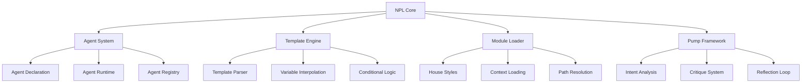
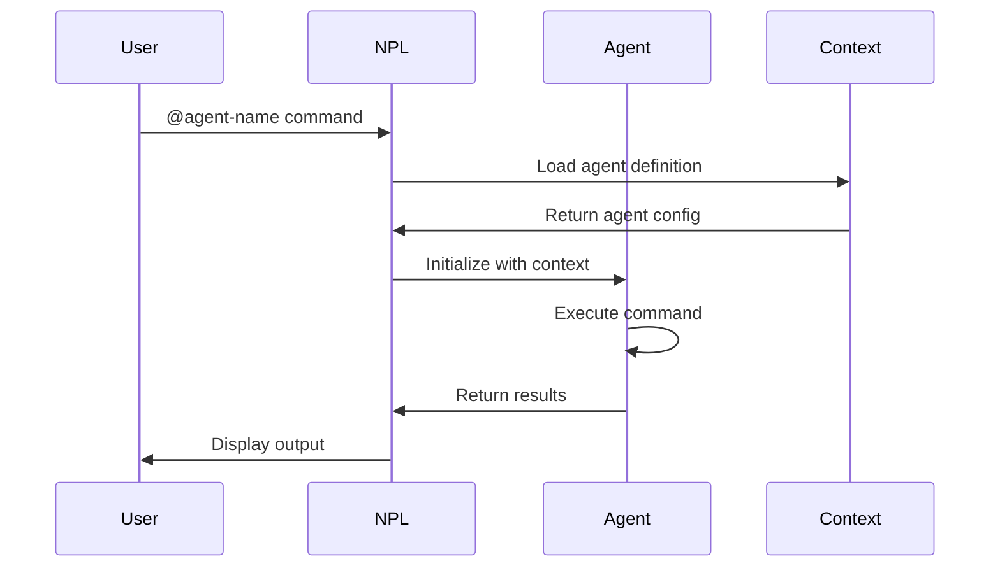
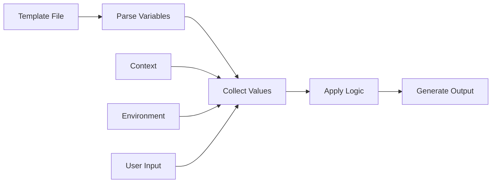

# Noizu PromptLingo (NPL) Technical Documentation

## Overview

Noizu PromptLingo (NPL) is a structured prompting framework for language model interactions. NPL provides a formal syntax for defining agent behaviors, template systems, and structured communication patterns between humans and AI systems.

The framework consists of:
- Formal syntax using Unicode boundary markers
- Agent system for specialized task execution
- Module loading system (NPL-M) for dynamic configuration
- Template hydration for project-specific customization
- Pump mechanisms for structured reasoning patterns
- Git-aware utility scripts with intelligent filtering support

## Architecture

### System Components



### Component Responsibilities

| Component | Description |
|-----------|-------------|
| **NPL Core** | Central framework managing syntax parsing and directive execution |
| **Agent System** | Manages agent lifecycle, registration, and invocation |
| **Template Engine** | Processes NPL templates using Handlebars-style syntax |
| **Module Loader** | Dynamically loads configuration, house styles, and context |
| **Pump Framework** | Provides structured reasoning patterns for complex tasks |

## Documentation Directory

### Core Framework
- **[NPL Syntax Reference](../npl.md)** - Complete NPL syntax and conventions
- **[Agent Ecosystem](agents/README.md)** - Agent definitions, orchestration patterns, and workflows

### Multi-Agent Orchestration
- **[Orchestration Patterns](multi-agent-orchestration.md)** - Theoretical patterns for coordinating multiple agents
- **[Practical Examples](orchestration-examples.md)** - Real-world examples using NPL agents

### Utilities
- **[Scripts Documentation](scripts/README.md)** - CLI tools and utility scripts
- **[Additional Agents](additional-agents/README.md)** - Extended agent collection by functional area

## NPL Syntax Reference

### Agent Declaration

Agents use Unicode boundary markers for clear scope definition:

```npl
⌜agent-name|type|version⌝
🙋 @alias capability1 capability2

# Agent Title
[Agent implementation and behavior]

⌞agent-name⌟
```

**Boundary Characters**:
- `⌜` (U+231C): Opens agent declaration
- `⌝` (U+231D): Closes opening declaration
- `⌞` (U+231E): Opens closing declaration
- `⌟` (U+231F): Closes agent scope

**Agent Types**: `agent`, `writer`, `evaluator`, `service`

### Directive Syntax

NPL directives provide explicit instructions using Unicode symbols:

```npl
↦ directive-name: parameter
➤ action: target
📂 load: path/to/file
🆔 identifier: unique-name
```

### Template Variables

Variable interpolation supports multiple formats:

```npl
{{variable_name}}              # Simple substitution
{{#if condition}}...{{/if}}    # Conditional blocks
{{#each collection}}...{{/each}} # Iteration
{{> partial_name}}              # Partial templates
```

### Fence Blocks

Structured content blocks for specific purposes:

```alg
function processData(input):
    validate(input)
    transform(input)
    return output
```

```format
key: value
nested:
  - item1
  - item2
```

## Agent System

### Agent Lifecycle



### Agent Registration

Agents are registered in `~/.claude/agents/` with standardized naming:
- Core agents: `npl-[function].md`
- Project agents: `[project]-[function].md`

For complete agent documentation, orchestration patterns, and multi-agent workflows, see **[Agent Ecosystem](agents/README.md)**.

## Module System (NPL-M)

### House Style Loading

House styles define project-specific writing and coding conventions. Loading order (later files override earlier):

1. **Global Home Style**: `~/.claude/npl-m/house-style/[type]-style.md`
2. **Project Global Style**: `.claude/npl-m/house-style/[type]-style.md`
3. **Path-Specific Styles**: From project root to target directory

```alg
function loadHouseStyles(target_path, style_type):
    styles = []

    # Environment variable overrides
    if env.HOUSE_STYLE_[TYPE]_ADDENDUM:
        styles.append(load(env.HOUSE_STYLE_[TYPE]_ADDENDUM))

    if env.HOUSE_STYLE_[TYPE]:
        content = load(env.HOUSE_STYLE_[TYPE])
        if not contains(content, "+load-default-styles"):
            return styles + [content]

    # Default loading hierarchy
    styles.append(load("~/.claude/npl-m/house-style/{style_type}-style.md"))
    styles.append(load(".claude/npl-m/house-style/{style_type}-style.md"))

    # Path-specific styles
    for path in hierarchy(project_root, target_path):
        style_file = path + "/house-style/{style_type}-style.md"
        if exists(style_file):
            styles.append(load(style_file))

    return styles
```

### Context Loading Directives

```npl
load path/to/file.md into context.
load .claude/npl.md into context.
{{#if condition}}
load conditional/file.md into context.
{{/if}}
```

### Module Types

- **Pumps**: Reasoning patterns (`npl-intent`, `npl-critique`, `npl-rubric`)
- **House Styles**: Writing conventions (`technical-style`, `marketing-style`)
- **Templates**: Reusable document structures
- **Agents**: Specialized task executors

## Template System

### Template Syntax

NPL templates use Handlebars-compatible syntax with extensions:

```npl
# {{project_name}} Configuration

## Environment: {{environment}}

{{#if use_database}}
### Database Configuration
- Type: {{database_type}}
- Host: {{database_host}}
{{/if}}

{{#each services}}
### Service: {{name}}
- Endpoint: {{endpoint}}
{{/each}}
```

### Template Hydration Process



### Variable Resolution

Variables are resolved in precedence order:
1. Explicit user-provided values
2. Environment variables
3. Context defaults
4. Template defaults

## Quick Start

### Common Orchestration Patterns

**Research -> Analysis -> Implementation**:
```bash
@npl-gopher-scout research "topic"
@npl-thinker analyze research.md --synthesize
@npl-author implement analysis.md --create-agent
```

**Multi-Perspective Validation**:
```bash
@npl-technical-writer assess --perspective="technical"
@npl-marketing-writer assess --perspective="user-value"
@npl-threat-modeler assess --perspective="security"
@npl-thinker synthesize perspectives --decision
```

**Quality-Gated Pipeline**:
```bash
@agent1 process | @npl-grader validate || @agent1 revise
@agent2 enhance | @npl-grader verify || @agent2 fix
@agent3 finalize | @npl-grader approve
```

## Configuration

### CLAUDE.md Structure

Project configuration file defining NPL integration:

```markdown
# CLAUDE.md

## Project Overview
[Project description and NPL usage]

## NPL Configuration
- NPL Version: 1.0
- Agent Set: [core, extended, custom]
- House Styles: [technical, marketing]

## Agent Loading
load .claude/npl.md into context.
load .claude/agents/*.md into registry.

## Custom Directives
[Project-specific NPL extensions]
```

### Environment Setup

```bash
# Core NPL setup
cp agentic/npl/verbose/npl.md ~/.claude/npl.md
cp agentic/scaffolding/agents/* ~/.claude/agents/

# Project-specific setup
mkdir -p .claude/npl-m/house-style
cp templates/house-style/*.md .claude/npl-m/house-style/

# Environment variables
export HOUSE_STYLE_TECHNICAL=/path/to/custom-style.md
export NPL_MODULE_PATH=~/.claude/npl-m
```

### File Structure

```
project/
├── .claude/
│   ├── npl.md                 # NPL syntax reference
│   ├── agents/                # Agent definitions
│   │   ├── npl-templater.md
│   │   ├── npl-grader.md
│   │   └── custom-agent.md
│   └── npl-m/                 # NPL modules
│       ├── house-style/       # Style guides
│       ├── templates/         # Reusable templates
│       └── pumps/            # Reasoning patterns
├── CLAUDE.md                  # Project configuration
└── src/                      # Project source
```

## Development Guide

### Creating Custom Agents

1. **Define Agent Boundary**
```npl
⌜my-agent|service|1.0⌝
🙋 @myagent analyze process generate
```

2. **Specify Context Loading**
```npl
load .claude/npl.md into context.
load project/specific/context.md into context.
```

3. **Implement Agent Logic**
```npl
# Core Functions
- Analyze input data
- Process according to rules
- Generate structured output

# Implementation
[Detailed agent behavior]
```

4. **Close Agent Scope**
```npl
⌞my-agent⌟
```

### Creating Templates

1. Define template structure with `{{variable}}` placeholders
2. Add conditional sections with `{{#if}}...{{/if}}`
3. Include iterations with `{{#each}}...{{/each}}`
4. Test with `@npl-templater hydrate template.md --var=value`

### Implementing Pumps

Pumps provide structured reasoning patterns:

```npl
<npl-custom-pump>
reasoning:
  step1: "Initial analysis"
  step2: "Pattern identification"
  step3: "Solution synthesis"
  conclusion: "Final output"
</npl-custom-pump>
```

## Troubleshooting

### Common Issues

| Issue | Solution |
|-------|----------|
| Agent not found | Verify agent file exists in `~/.claude/agents/` |
| Template variable undefined | Provide all required variables or add defaults |
| Context loading failure | Check file paths are absolute or relative to project root |
| House style not applied | Verify loading order and check for override flags |

### Error Codes

| Code | Message | Resolution |
|------|---------|------------|
| NPL-001 | Invalid agent boundary | Check Unicode characters and format |
| NPL-002 | Template variable missing | Provide required variables |
| NPL-003 | Context load failed | Verify file path and permissions |
| NPL-004 | Pump syntax error | Validate pump structure |
| NPL-005 | House style conflict | Check loading order and overrides |

### Debugging Techniques

```bash
# Enable verbose mode
@agent-name command --verbose

# Validate NPL syntax
@npl-grader validate agent-definition.md --syntax=strict
```

## Best Practices

### Agent Development
- Keep agents focused on single responsibilities
- Document all capabilities in header
- Use versioning for compatibility
- Test with various input scenarios

### Template Design
- Provide sensible defaults
- Document all variables
- Use clear naming conventions
- Include usage examples

### House Style Management
- Start with base styles, customize incrementally
- Document style decisions
- Version control style guides
- Test style application on sample content

### Module Organization
- Group related functionality
- Maintain clear dependency chains
- Document inter-module relationships
- Use consistent naming patterns

## Contributing

When adding new orchestration patterns:
1. Test with actual NPL agents (not hypothetical ones)
2. Include concrete examples with expected outputs
3. Document error handling and recovery strategies
4. Provide timing estimates and resource requirements
5. Add quality metrics and success criteria
