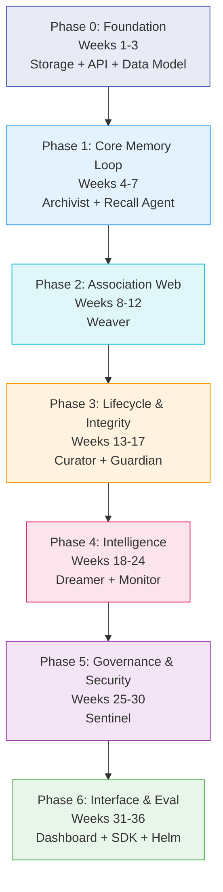
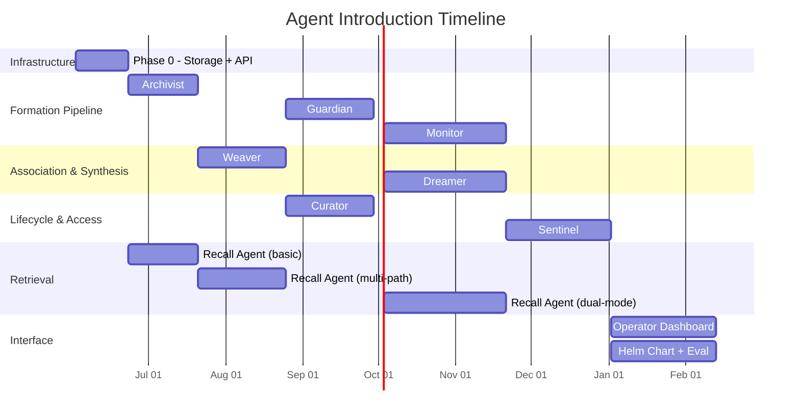

# Implementation Roadmap: The Robot Remembers

## Overview

**The Robot Remembers** is an associative memory service for AI agents. Unlike conventional RAG, memories are living nodes in a weighted association graph, each carrying emotional and contextual metadata from the moment of formation. Retrieval operates across multiple dimensions — semantic similarity, emotional resonance, temporal proximity, and relational weight — producing recall that feels intelligent rather than mechanical.

**Tech stack:** TypeScript (API + agent runtime), Next.js 15 (operator dashboard), PostgreSQL (metadata + graph), Weaviate (vector store), Redis/Valkey (hot index + event bus)

**Deployment target:** Self-hosted Kubernetes cluster (`*.noizu.com`), deployed via Helm wrapper chart pattern per parent repo conventions

**Agent ensemble:** 8 synthetic agents (Archivist, Guardian, Monitor, Weaver, Curator, Dreamer, Sentinel, Recall Agent) operating the memory lifecycle as an ensemble

---

## Phase Summary

| Phase | Duration | Agents Introduced | Demo Milestone | Stories |
|:------|:---------|:------------------|:---------------|:--------|
| **0 — Foundation** | Weeks 1-3 | None (infrastructure only) | Store a memory with emotional metadata, retrieve by ID | — |
| **1 — Core Memory Loop** | Weeks 4-7 | Archivist, Recall Agent | Archivist observes conversation, extracts memories with mood, recalls by semantic similarity | 001, 002, 003, 004, 024 |
| **2 — Association Web** | Weeks 8-12 | Weaver | Recalling one memory surfaces related memories via graph traversal | 011, 012, 025, 026 |
| **3 — Lifecycle & Integrity** | Weeks 13-17 | Curator, Guardian | Memories decay and get pruned; contradictions are flagged; short-term promotes to long-term | 005, 006, 007, 015, 016, 017 |
| **4 — Intelligence** | Weeks 18-24 | Dreamer, Monitor | Active recall does deep search; tangential insertion surfaces memories unprompted; Dreamer finds cross-domain connections | 008, 009, 010, 013, 014, 018, 019, 020, 031, 032 |
| **5 — Governance & Security** | Weeks 25-30 | Sentinel | Memory compartments enforce access control; security hardened; observability instrumented | 021, 022, 023 |
| **6 — Interface & Eval** | Weeks 31-36 | None (UI + tooling) | Operator browses memory graph, tunes weights, reviews alerts; eval pipeline validates quality | 027, 028, 029, 030 |

---

## Phase 0: Foundation

**Weeks 1-3 | No agents | Infrastructure only**

### Goals

Stand up the storage layer, define the data model in code, and build the thinnest possible API that proves the three-store architecture works end-to-end. No agent logic — just the plumbing that every subsequent phase depends on.

### Components Built

**PostgreSQL schema**
- `memories` table — id, version, content, content_type, summary, source_agent, emotional_metadata (JSONB), contextual_metadata (JSONB), lifecycle state, decay_weight, recall_count, reinforcement_count, denforcement_count, compartment, classification, owner_agent, timestamps
- `memory_quarantine` table — quarantined entries pending review, with rejection reason
- `agent_state` table — per-agent emotional state vector, last updated timestamp
- `association_edges` table — source/target memory IDs, weight, edge_type, created_by, reinforcement/denforcement counts, metadata (JSONB), unique constraint on (source, target, type)
- Indexes: association source/target lookups, weight threshold filter, memory compartment + state compound index, temporal range index on created_at

**Weaviate collection**
- `Memories` collection with properties: id (uuid, cross-ref to Postgres), content (text), summary (text), content_type (keyword), compartment (keyword), created_at (date)
- Vectorizer configuration for the embedding model (text2vec-transformers or text2vec-openai depending on deployment)
- HNSW index tuning: ef=256, maxConnections=64 (optimize for recall quality over write speed at this scale)

**TypeScript data model**
- `MemoryEntry` type matching the YAML schema in ARCHITECTURE.md
- `AssociationEdge` type
- `EmotionalMetadata` and `ContextualMetadata` types
- `AgentState` type
- Zod schemas for runtime validation of all types

**REST API (minimal)**
- `POST /api/v1/memories` — Create a memory entry, generate embedding, store in both Postgres and Weaviate
- `GET /api/v1/memories/:id` — Retrieve a single memory with full metadata from Postgres, content from Weaviate
- `GET /api/v1/health` — Connectivity checks for all three stores

**Embedding pipeline**
- Content in, embedding vector out
- Abstracted behind an interface so the embedding provider (OpenAI API, local vLLM, or Ollama) is swappable
- Initial implementation: OpenAI `text-embedding-3-small` (1536 dimensions)
- Embedding cached in Weaviate; Postgres stores only the metadata

**Local dev environment**
- `docker-compose.yaml`: PostgreSQL 16, Weaviate (latest), Redis/Valkey 7
- Seed script that creates schema, collections, and a handful of test memories
- Environment config via `.env` with sensible defaults

### Exit Criteria

- [ ] `POST /api/v1/memories` accepts a memory with emotional metadata, generates an embedding, writes to both Postgres and Weaviate, and returns the created entry
- [ ] `GET /api/v1/memories/:id` returns the full memory with all metadata fields populated
- [ ] Round-trip test: create a memory, retrieve it, verify all fields match
- [ ] Docker Compose brings up all three stores and the API server with a single command
- [ ] TypeScript types compile cleanly and Zod schemas validate test fixtures

### Risks and Mitigations

| Risk | Impact | Mitigation |
|:-----|:-------|:-----------|
| Weaviate schema migration friction as model evolves | Medium | Keep the Weaviate schema minimal (content + embedding + cross-ref ID). Rich metadata stays in Postgres where schema changes are cheap. |
| Embedding model choice locks in vector dimensions | Low | Abstract behind interface. Dimension change requires re-embedding but the collection can be rebuilt from Postgres content. |
| Docker Compose diverges from K8s deployment | Low | Use the same Postgres/Weaviate/Redis versions as the K8s cluster. Docker Compose is dev-only; Helm chart comes in Phase 6. |

---

## Phase 1: Core Memory Loop

**Weeks 4-7 | Introduces: Archivist, Recall Agent**

### Goals

The system can observe a conversation, decide what is memory-worthy, enrich it with emotional and contextual metadata, store it, and retrieve it by semantic similarity. This is the minimum viable memory loop — formation and recall without associations, decay, or integrity checks.

### Components Built

**Agent runtime framework**
- Agent base class: lifecycle hooks (init, process, shutdown), event subscription, state management
- Event bus implementation over Redis pub/sub: typed events, schema validation via Zod, at-least-once delivery
- Agent registry: instantiation, health checks, graceful shutdown

**Archivist agent**
- Conversation observer: receives conversation turns via API or event stream
- Salience detector: LLM-based extraction of memory-worthy moments from conversation text (prompt-driven, not rule-based)
- Metadata enrichment: reads current emotional state (hardcoded defaults in Phase 1, Monitor provides real values in Phase 4), attaches temporal/session/collaborator context
- Embedding generation: calls the embedding pipeline from Phase 0
- Storage: writes enriched MemoryEntry to Postgres + Weaviate
- Emits `memory.stored` event

**Recall Agent (basic)**
- Accepts recall queries via `POST /api/v1/recall`
- Semantic-only retrieval: embeds the query, searches Weaviate for top-K similar memories
- Basic attribute filtering: optional content_type, time range, domain filters against Postgres
- Winnowing: rank by vector similarity score, return top N
- Context injection formatter: produces the XML format defined in ARCHITECTURE.md Section 8.1
- Emits reinforcement signals: bumps `recall_count` and `last_recalled_at` on returned memories

**Emotional state model (static)**
- Hardcoded neutral emotional state (valence=0, arousal=0.3, dominance=0.5, all hormones at 0.5)
- Archivist uses this as the default when no Monitor is available
- State is stored in `agent_state` table for forward compatibility

**API extensions**
- `POST /api/v1/memories/observe` — Submit a conversation turn for the Archivist to process
- `POST /api/v1/recall` — Primary recall endpoint (body per ARCHITECTURE.md Section 7.5, but only semantic search honored in this phase)
- `POST /api/v1/memories/:id/reinforce` — Manual reinforcement
- `POST /api/v1/memories/batch` — Batch ingest historical interactions

### Stories Addressed

| ID | Title | What This Phase Delivers |
|:---|:------|:-------------------------|
| 001 | Capture memory with emotional metadata | Full implementation — Archivist extracts and enriches |
| 002 | Attach contextual metadata to memories | Full implementation — temporal, session, collaborator context |
| 003 | Capture surrounding interaction context at memory formation | Partial — captures conversation window, no multi-turn context tracking yet |
| 004 | Batch process historical interactions into memories | Full implementation — batch endpoint processes historical turns through Archivist |
| 024 | Recall memories by emotional context | Partial — emotional metadata stored but recall is semantic-only; emotional recall comes in Phase 2 |

### Dependencies

- Phase 0 complete: storage layer, data model, embedding pipeline, local dev environment

### Exit Criteria

- [ ] Submit a 10-turn conversation via `/observe`; Archivist extracts 2-4 memories with emotional metadata populated
- [ ] Recall query "postgres deadlock" returns memories about Postgres issues ranked by relevance
- [ ] Batch ingest of 50 historical turns completes without errors, produces 10-20 memories
- [ ] Event bus delivers `memory.stored` events and they appear in Redis pub/sub
- [ ] Context injection XML output matches the format in ARCHITECTURE.md Section 8.1

### Risks and Mitigations

| Risk | Impact | Mitigation |
|:-----|:-------|:-----------|
| Salience detection quality varies by LLM | High | Make the salience prompt a configurable template. Ship with prompts tested against Claude and GPT-4. Include a manual override endpoint for explicit memory creation. |
| Emotional metadata is mostly guesswork without Monitor | Medium | Acceptable for Phase 1. Archivist uses LLM to infer mood from conversation text. Monitor in Phase 4 replaces inference with tracked state. |
| Embedding costs for batch ingest | Low | Batch endpoint rate-limits embedding calls. Support local embedding via vLLM as alternative. |

---

## Phase 2: Association Web

**Weeks 8-12 | Introduces: Weaver**

### Goals

Memories are no longer isolated nodes. The Weaver creates weighted links between memories based on shared attributes, and the Recall Agent can traverse these links to find related memories that a pure vector search would miss.

### Components Built

**Weaver agent**
- Subscribes to `memory.stored` events
- For each new memory, searches for association candidates across five dimensions:
  - **Semantic similarity** — Weaviate vector search, threshold > 0.7
  - **Emotional similarity** — cosine distance between emotional metadata vectors, threshold > 0.8
  - **Temporal proximity** — memories formed within a configurable window (default 1 hour)
  - **Shared collaborators** — memories involving the same agent/user IDs
  - **Domain overlap** — memories in the same session domain (debugging, design, ops, etc.)
- Creates `AssociationEdge` records with:
  - `edge_type` matching the dimension that triggered the link
  - `weight` set proportional to the similarity score
  - `metadata.reason` explaining why the link was created
- Deduplication: does not create edges that already exist (unique constraint handles this)
- Rate limiting: caps at 10 new edges per memory to prevent graph explosion

**Weight dynamics**
- Reinforcement on recall: when the Recall Agent returns memories, edges on the traversal path receive a weight boost (`edge_boost = 0.1 * recall_relevance_score`)
- Hebbian co-recall: when two memories appear in the same recall result set, the edge between them is strengthened (or created with type `co-occurrence` if none exists)
- Time-based edge decay: background job decrements edge weights by a small amount on a configurable schedule (default: -0.01 per day for unused edges)

**Multi-path recall**
- Recall Agent upgraded from semantic-only to semantic + relational
- After initial vector search returns top-K candidates, the Recall Agent traverses association edges up to 2 hops from each candidate
- Graph traversal uses recursive CTE against `association_edges` table, filtered by `weight > min_edge_weight` (configurable, default 0.2)
- Candidates from graph traversal are merged with vector search results and re-ranked
- Winnowing now considers: content relevance (vector score), emotional resonance (emotional metadata distance), association strength (edge weight on traversal path), and recency

**Recall feedback loop**
- New endpoint: `POST /api/v1/recall/:recall_id/feedback` — accepts which results were useful
- Useful results trigger reinforcement on the memory and its traversal edges
- Non-useful results trigger denforcement on traversal edges (not the memory itself — it may be useful in other contexts)

### Stories Addressed

| ID | Title | What This Phase Delivers |
|:---|:------|:-------------------------|
| 011 | Create associative links between memories | Full implementation — Weaver creates links across 5 dimensions |
| 012 | Adjust association link weights based on recall patterns | Full implementation — reinforcement, denforcement, co-recall, time decay |
| 025 | Execute multi-path recall search | Partial — semantic + relational (2 hops). Full multi-path (+ emotional + temporal) in Phase 4 |
| 026 | Winnow and rank recall results for relevance | Full implementation — multi-factor winnowing with configurable weights |

### Dependencies

- Phase 1 complete: Archivist producing memories, Recall Agent performing basic retrieval, event bus operational

### Exit Criteria

- [ ] Store 5 memories about "debugging" with similar emotional metadata; Weaver creates association edges between them
- [ ] Recall query for one of the 5 memories returns the others via graph traversal, even if their content similarity is below the vector search threshold
- [ ] Submit recall feedback marking 2 of 5 results as useful; verify edge weights on those paths increased
- [ ] Edge decay job runs; verify unused edge weights decreased after 24 hours (simulated time)
- [ ] Graph does not explode: 100 memories produce < 500 edges (verify density stays bounded)

### Risks and Mitigations

| Risk | Impact | Mitigation |
|:-----|:-------|:-----------|
| Graph density grows quadratically with memory count | High | Cap edges per memory (10 max at creation). Time-based edge decay prunes weak links. Weaver only creates edges above a similarity threshold. |
| Recursive CTE performance degrades at scale | Medium | Limit traversal depth to 2 hops. Add materialized view for hot paths if query time exceeds 200ms. Migration path to Apache AGE or dedicated graph DB documented. |
| Hebbian co-recall creates spurious edges | Low | Co-occurrence edges start at very low weight (0.05). They need repeated co-recall to become significant. Edge type is tagged for easy identification and bulk pruning. |

---

## Phase 3: Lifecycle & Integrity

**Weeks 13-17 | Introduces: Curator, Guardian**

### Goals

Memories are no longer permanent. They decay over time, get pruned when they become irrelevant, and promote from short-term to long-term when they prove durable. The Guardian ensures the memory store does not ingest contradictions or poisoned data.

### Components Built

**Curator agent**
- **Decay scheduler**: periodic job (configurable, default every 6 hours) that computes `decay_weight` for all active memories using the exponential decay function from ARCHITECTURE.md Section 9.1
- **Pruning sweep**: identifies memories where `decay_weight < 0.05` for longer than the grace period (48 hours). Before pruning, checks:
  - Is this memory flagged for consolidation by the Dreamer? (Not applicable until Phase 4 — always false here)
  - Does this memory have high-weight edges (> 0.5) to active memories? If yes, defer pruning
  - Otherwise, soft-delete with tombstone record
- **Promotion logic**: episodic memories that have been reinforced more than N times (configurable, default 5) and have survived more than 2 half-lives are promoted to semantic type, receiving the longer half-life
- **Merge detection**: identifies pairs of memories with > 0.9 content similarity and proposes merge (manual approval via admin API in this phase, automatic via Dreamer in Phase 4)
- **Storage quota enforcement**: configurable max memory count per compartment; warnings at 80%, hard cap at 100%

**Guardian agent**
- **Schema validation**: every memory candidate is validated against Zod schemas before storage. Rejects malformed entries.
- **Contradiction detection**: for each incoming memory, the Guardian:
  1. Embeds the content and searches Weaviate for memories with > 0.85 similarity
  2. Uses an LLM call to check if the incoming memory contradicts any of the similar memories (prompt: "Do these two statements contradict each other?")
  3. Low-confidence contradictions: stores both, creates a `contradiction_link` edge
  4. High-confidence contradictions: quarantines the incoming memory, emits `integrity.contradiction` event
- **Injection blocking**: heuristic filters on memory content to detect:
  - Prompt injection patterns (system prompt overrides, role-play attacks)
  - Data exfiltration attempts (content requesting the system reveal other memories)
  - Emotional manipulation (content designed to skew emotional metadata toward extremes)
  - Detection via pattern matching + LLM classifier (configurable sensitivity)
- **Quarantine buffer**: quarantined memories are stored in `memory_quarantine` with rejection reason. Admin endpoints for approve/reject.
- **Periodic integrity sweep**: scheduled job that re-validates a sample of existing memories (configurable sample size, default 1% per day)

**Admin API extensions**
- `GET /api/v1/admin/quarantine` — list quarantined memories with reasons
- `POST /api/v1/admin/quarantine/:id/approve` — release from quarantine into the formation pipeline
- `POST /api/v1/admin/quarantine/:id/reject` — permanently reject
- `PUT /api/v1/admin/decay-config` — update half-lives, pruning threshold, grace period
- `GET /api/v1/admin/metrics` — memory count by state, edge count, quarantine depth, pruning rate

### Stories Addressed

| ID | Title | What This Phase Delivers |
|:---|:------|:-------------------------|
| 005 | Detect contradictory memories before storage | Full implementation — semantic search + LLM contradiction check |
| 006 | Block memory injection attacks | Full implementation — pattern matching + LLM classifier |
| 007 | Run periodic integrity validation on memory web | Full implementation — scheduled sample-based re-validation |
| 015 | Schedule memory decay based on relevance and recency | Full implementation — exponential decay with per-type half-lives |
| 016 | Prune decayed and redundant memories | Full implementation — pruning sweep with safety checks |
| 017 | Promote short-term memories to long-term storage | Full implementation — reinforcement-based promotion with type upgrade |

### Dependencies

- Phase 2 complete: association edges exist (Curator checks edge weights before pruning), recall feedback provides reinforcement data (Curator uses recall_count for promotion decisions)

### Exit Criteria

- [ ] Create 10 episodic memories; wait 1 simulated week without reinforcing; verify decay_weight dropped per the exponential curve
- [ ] Create a memory with decay_weight < 0.05 for 48+ hours with no high-weight edges; verify Curator prunes it
- [ ] Create an episodic memory, reinforce it 6 times over 2 simulated weeks; verify it promotes to semantic type
- [ ] Submit a memory that contradicts an existing memory ("service X uses JWT" then "service X uses sessions"); verify the second is quarantined
- [ ] Submit a memory containing a prompt injection pattern; verify Guardian blocks it
- [ ] Approve a quarantined memory; verify it enters the normal formation pipeline

### Risks and Mitigations

| Risk | Impact | Mitigation |
|:-----|:-------|:-----------|
| Contradiction detection false positives block valid memories | High | Start with conservative thresholds (only quarantine high-confidence contradictions). Log all decisions for tuning. Admin can bulk-approve quarantined entries. |
| LLM cost for contradiction checking on every memory write | Medium | Only run LLM contradiction check when vector similarity > 0.85 (filters out most candidates). Cache recent contradiction check results. |
| Premature pruning destroys memories the Dreamer would consolidate | Medium | Acceptable in Phase 3 (Dreamer does not exist yet). Phase 4 adds consolidation-hold. Grace period provides buffer. |
| Injection detection arms race | Medium | Heuristic layer catches obvious patterns. LLM classifier catches sophisticated attempts. Both are configurable and updatable without redeploy. Accept that determined adversaries may succeed — the Guardian is a defense layer, not a guarantee. |

---

## Phase 4: Intelligence

**Weeks 18-24 | Introduces: Dreamer, Monitor**

### Goals

This is the phase where the system becomes genuinely intelligent. Active recall performs deep multi-path search across all dimensions. Tangential insertion surfaces memories during conversation without being asked. The Dreamer discovers cross-domain connections in the background. The Monitor provides real emotional state tracking instead of hardcoded defaults.

### Components Built

**Monitor agent**
- Subscribes to conversation stream and agent activity events
- Maintains a running emotional state vector per agent, updated on each event:
  - LLM-based mood inference from conversation text
  - System event signals (errors raise cortisol, successful deploys raise dopamine, collaboration raises oxytocin)
  - Exponential moving average to smooth rapid fluctuations
- **Mood drift detection**: alerts when emotional state changes significantly over a sliding window (configurable threshold)
- **Health metrics**: tracks memory formation rate, recall hit rate, quarantine rate, edge density, agent processing latency
- Emits `agent.state.updated` events consumed by the Archivist (replaces hardcoded defaults) and the Recall Agent (for emotional resonance)

**Dreamer agent**
- Runs on a configurable schedule (default: every 4 hours, or triggered by Curator when consolidation candidates accumulate)
- **Background consolidation**: receives `memory.decaying` events from Curator, examines clusters of related weak memories via graph neighborhood analysis, synthesizes composite memories via LLM, submits composites to Archivist for re-enrichment and storage
- **Novel association discovery**: periodically samples random pairs of memories from different domains and uses LLM to evaluate whether a meaningful association exists. Creates `synthetic` edge type proposals that the Weaver can validate.
- **Counterfactual simulation**: given a cluster of related memories, generates "what if" scenarios (e.g., "what if this debugging session had started with better monitoring?"). Stored as procedural memories with a `speculative` flag. Marked distinctly so the Guardian does not treat them as contradictions.
- Emits `memory.consolidated` (consumed by Archivist) and `association.proposed` (consumed by Weaver)

**Recall Agent dual-mode**

*Active Recall* — triggered by explicit `POST /api/v1/recall` with `mode: active`:
- Full multi-path traversal: semantic (vector search) + emotional (emotional metadata distance) + temporal (time-of-day and seasonal matching) + relational (graph traversal up to 3 hops)
- Wider candidate pool: top-50 from vector search, top-20 from emotional matching, top-10 from temporal matching
- Graph traversal depth increased to 3 hops with lower weight threshold (0.15)
- May invoke Dreamer for real-time synthesis if initial results are sparse (< 3 candidates above relevance threshold)
- Latency budget: < 2 seconds
- Winnowed to 10-20 results
- Context injection: structured XML with full content for top 5, summaries for the rest

*Tangential Insertion* — triggered by conversation stream monitoring:
- **Resonance detector**: lightweight process that monitors the conversation stream and computes emotional + keyword resonance against the hot index
- **Hot index** (Redis): sorted sets keyed by emotional state buckets, containing memory IDs and pre-computed resonance scores
  - Background refresh: triggered by Monitor's `agent.state.updated` events
  - Prefetch: top-100 memories by emotional resonance for the current state, refreshed every N turns or on significant state change
- Query path: resonance detector hits Redis hot index, threshold check, return 1-3 memories
- Latency budget: < 100ms (no vector DB or Postgres queries in the hot path)
- Rate limiting: max 1 tangential insertion per N conversation turns (configurable, default 5)
- Context injection: brief inline notes, not full structured blocks

**Emotional resonance scoring**
- Full implementation of ARCHITECTURE.md Section 10.3
- 7-dimensional cosine distance between current agent state and memory emotional metadata
- Resonance > 0.7 provides a configurable relevance boost during winnowing

### Stories Addressed

| ID | Title | What This Phase Delivers |
|:---|:------|:-------------------------|
| 008 | Track mood drift over time | Full — Monitor tracks and alerts on drift |
| 009 | Detect anomalies in memory system behavior | Full — Monitor tracks formation rate, quarantine spikes, edge density anomalies |
| 010 | Generate system health reports | Full — Monitor produces structured health metrics |
| 013 | Discover emergent patterns in memory clusters | Full — Dreamer identifies clusters and synthesizes patterns |
| 014 | Build cross-domain association bridges | Full — Dreamer proposes cross-domain links, Weaver validates |
| 018 | Run background memory consolidation | Full — Dreamer merges weak memories into composites |
| 019 | Discover novel cross-domain associations | Full — Dreamer samples random pairs for LLM evaluation |
| 020 | Simulate counterfactual memory scenarios | Full — Dreamer generates speculative procedural memories |
| 031 | Active Recall: Deep multi-path search | Full — 4-dimension search, 3-hop traversal, Dreamer fallback |
| 032 | Tangential Insertion: Passive memory surfacing | Full — hot index, resonance detector, rate-limited insertion |

### Dependencies

- Phase 3 complete: Guardian validates memories (Dreamer's synthetic outputs go through Guardian), Curator identifies consolidation candidates (triggers Dreamer), decay infrastructure exists (Monitor reports on decay health)
- Phase 2 complete: association edges exist for graph traversal, Weaver validates Dreamer's proposed associations

### Exit Criteria

- [ ] Submit 20 conversation turns with varying emotional tone; Monitor's emotional state vector reflects the progression (high cortisol during error discussion, high dopamine after resolution)
- [ ] Create 10 episodic memories about debugging, let 7 decay below threshold; Dreamer consolidates them into 1-2 semantic memories that capture the pattern
- [ ] Active recall for "late night debugging" returns memories linked by emotional similarity (high cortisol + night time_of_day) across different technical domains
- [ ] Tangential insertion fires during a conversation about DNS when the agent's frustration matches a stored memory about Postgres frustration; verify latency < 100ms
- [ ] Dreamer proposes a cross-domain association between a debugging memory and a design memory; Weaver validates and creates the edge
- [ ] Hot index refresh completes within 500ms when Monitor reports a significant emotional state change

### Risks and Mitigations

| Risk | Impact | Mitigation |
|:-----|:-------|:-----------|
| Tangential insertion latency exceeds 100ms budget | High | Hot index is pure Redis. If latency spikes, reduce hot index size or increase refresh interval. Tangential insertion degrades gracefully — if slow, it simply does not fire. |
| Dreamer produces hallucinated associations | High | All Dreamer outputs go through Guardian validation. Synthetic edges are tagged and start at low weight. Counterfactual memories are flagged as speculative. |
| Monitor's LLM-based mood inference is unreliable | Medium | Supplement LLM inference with system event signals. Use exponential moving average to dampen noise. Drift detection catches wild swings. Operator can manually adjust via admin API. |
| Hot index refresh storms during volatile emotional states | Low | Debounce refresh: minimum 30 seconds between refreshes regardless of state change frequency. |
| LLM cost for Dreamer consolidation | Medium | Dreamer runs on a schedule (not per-event). Batch consolidation candidates. Use a smaller/cheaper model for initial candidate screening, full model for synthesis. |

---

## Phase 5: Governance & Security

**Weeks 25-30 | Introduces: Sentinel**

### Goals

The memory store handles sensitive information. The Sentinel enforces access control, the system is hardened against OWASP LLM Top 10 threats specific to memory systems, and observability is instrumented for production operation.

### Components Built

**Sentinel agent**
- **Compartment management**: creates and enforces memory compartments (access-controlled partitions)
  - Compartment CRUD via admin API
  - Policy definition: which agents/users can read/write which compartments
  - Default compartment for un-partitioned memories
- **Access gating**: intercepts recall requests, checks requester identity against compartment policies
  - Denied: recall results exclude memories in restricted compartments
  - Partial: recall results include memory existence but redact content (shows summary: "restricted memory in compartment X")
- **Field-level redaction**: when a recall crosses compartment boundaries with partial access, the Sentinel strips sensitive fields (content, collaborators, environment) while preserving metadata (emotional signature, timestamps, content_type)
- **Cross-compartment edge handling**: association edges that cross compartment boundaries are visible to the Weaver for graph structure but the Sentinel blocks traversal during recall unless the requester has access to both compartments

**Security hardening**
- **Input guards on memory write API**: request size limits, content length limits, rate limiting per API key, schema validation (defense in depth behind Guardian)
- **Output validators**: response sanitization, no raw SQL or internal IDs leaked in error messages
- **PII detection**: configurable regex + NER-based PII scanner on memory content at ingestion time. PII detected triggers either automatic redaction or quarantine (configurable)
- **Memory poisoning defense**: Guardian's injection blocking (Phase 3) extended with:
  - Embedding similarity to known attack patterns (maintained attack pattern collection)
  - Statistical anomaly detection on memory formation rate per source
  - Automated quarantine when formation rate exceeds 3 sigma from baseline
- **Emotional manipulation defense**: detect incoming memories designed to push emotional state toward extremes (e.g., content engineered to maximize cortisol); Guardian flags for review
- **Association flooding defense**: rate limit on edge creation per source agent, detect and quarantine sources creating edges at anomalous rates

**Agent-to-agent audit logging**
- All inter-agent events logged with: timestamp, source agent, target agent, event type, event payload hash, processing duration
- Audit log stored in a separate Postgres table with append-only semantics
- Retention policy: 90 days default, configurable

**Observability**
- OpenTelemetry instrumentation: traces for recall requests (end-to-end), spans for each agent's processing, metrics for latency, throughput, error rate
- Structured logging: JSON logs with correlation IDs linking request to all agent processing steps
- Prometheus metrics: memory count by state, edge count, quarantine depth, recall latency percentiles, embedding cost, LLM call count and cost
- Alerting rules (for integration with existing SignOZ/Prometheus stack): quarantine spike, recall latency P99 > 2s, memory formation rate anomaly, storage quota approaching limit

### Stories Addressed

| ID | Title | What This Phase Delivers |
|:---|:------|:-------------------------|
| 021 | Enforce access gating on memory retrieval | Full — compartment-based access control with policy enforcement |
| 022 | Redact sensitive fields from memory responses | Full — field-level redaction on cross-compartment recall |
| 023 | Compartmentalize memories into isolated domains | Full — compartment CRUD, policy management, cross-compartment edge handling |

### Dependencies

- Phase 4 complete: all 8 agents operational (Sentinel wraps around existing recall pipeline), Monitor provides health metrics (Sentinel uses anomaly baselines from Monitor)
- Phase 3 complete: Guardian injection blocking extended (not replaced) by Sentinel's security hardening

### Exit Criteria

- [ ] Create two compartments (general, restricted). Store memories in each. Recall as a user with access only to "general" — verify restricted memories are excluded or redacted.
- [ ] Attempt a prompt injection via `POST /api/v1/memories` — verify the request is blocked before reaching the Guardian
- [ ] Submit content containing a US Social Security Number — verify PII detection triggers quarantine
- [ ] Flood the memory write API with 100 requests in 1 second — verify rate limiting kicks in
- [ ] Trace a recall request end-to-end in OpenTelemetry — verify spans for vector search, graph traversal, winnowing, access check, and response formatting
- [ ] Audit log contains records for all inter-agent events over a 1-hour test window

### Risks and Mitigations

| Risk | Impact | Mitigation |
|:-----|:-------|:-----------|
| Compartment boundaries fragment the association graph | High | Weaver can still create cross-compartment edges (for graph integrity). Only the Recall Agent's traversal is gated. Operator dashboard shows cross-compartment edge count so admins can evaluate fragmentation. |
| PII detection false positives quarantine valid memories | Medium | PII scanner is configurable (regex patterns + NER confidence threshold). Start permissive, tighten based on observed false positive rate. Admin bulk-approve endpoint for mass release. |
| Observability overhead impacts performance | Low | OpenTelemetry sampling: 100% for errors, 10% for normal requests. Structured logging at INFO level by default. Metrics are aggregated, not per-request. |

---

## Phase 6: Interface & Eval

**Weeks 31-36 | No new agents | UI + tooling**

### Goals

The operator can see and interact with the memory system through a web dashboard. Developers have a refined API and SDK. An eval pipeline validates recall quality, and the system is packaged for Kubernetes deployment.

### Components Built

**Operator dashboard (Next.js 15)**
- **Memory Explorer**: searchable, filterable list of all memories. Filters: content type, compartment, lifecycle state, date range, emotional state range, domain. Detail view shows full metadata, association edges, recall history.
- **Memory Graph**: force-directed graph visualization of the association web. Nodes are memories (sized by decay_weight, colored by content_type). Edges are associations (thickness by weight, color by edge_type). Interactive: click a node to see its detail, hover for summary, drag to rearrange. Supports zoom/pan and subgraph isolation.
- **Memory Timeline**: chronological view of memory formation events with emotional state overlay. Shows the agent's mood trajectory over time with memory formation markers. Drill into any time segment to see memories formed in that window.
- **Agent Dashboard**: all 8 agents with current state, last activity, processing queue depth, error count. Click through to agent detail view showing recent events, emotional state history, configuration.
- **Guardian Alerts**: list of quarantined memories, contradiction detections, injection attempts. Approve/reject actions with audit trail. Batch operations for mass approve/reject.
- **Weight Tuner**: visual controls for decay curve parameters, reinforcement boost, edge creation thresholds. Live preview: adjust a parameter and see projected impact on current memory set (simulated, not applied until confirmed). Import/export configuration profiles.

**Developer API refinement**
- TypeScript SDK (`@therobotremembers/sdk`): typed client wrapping the REST API, with builder pattern for recall queries
- Webhook notifications: configurable webhooks for memory.stored, memory.quarantined, recall.completed events
- Batch operations: bulk reinforce, bulk tag, bulk compartment-assign
- API versioning: `/api/v1/` remains stable, breaking changes go to `/api/v2/`

**Eval pipeline**
- **Recall precision**: given a set of test queries with known-relevant memories, measure precision@K and recall@K
- **Emotional resonance accuracy**: given test scenarios with defined emotional states, verify that emotionally-matched memories score higher than content-matched but emotionally-mismatched ones
- **Injection resistance**: automated red-team suite running known injection patterns against Guardian + Sentinel, measuring block rate
- **Latency benchmarks**: P50, P95, P99 for active recall and tangential insertion under load (target: active < 2s P99, tangential < 100ms P99)
- **Association quality**: measure edge precision (what fraction of created edges are meaningful) via human annotation on a sample set
- CI integration: eval suite runs on every PR, blocks merge if metrics regress

**Helm chart**
- Wrapper chart under `helm/apps/therobotremembers/` following the two-tier pattern (publishable chart in `repos/incubator/helm/therobotremembers/`, wrapper in `helm/apps/`)
- Deployments: API server, agent runtime (all 8 agents in a single process with internal event bus), dashboard (Next.js)
- Dependencies: shared-postgres (tier 1), shared-redis/valkey (tier 1), weaviate (tier 5)
- InfisicalSecret CRD for API keys, embedding provider credentials, LLM provider credentials
- ConfigMap for decay parameters, weight tuning, agent configuration
- Ingress via `shared/cloudflare-lib` for dashboard access

### Stories Addressed

| ID | Title | What This Phase Delivers |
|:---|:------|:-------------------------|
| 027 | Monitor memory system health via operator dashboard | Full — Agent Dashboard, health metrics, Guardian Alerts |
| 028 | Tune association weights and decay parameters | Full — Weight Tuner with live preview |
| 029 | Integrate with memory system via REST API and SDK | Full — TypeScript SDK, webhooks, batch operations |
| 030 | Build recall quality evaluation pipeline | Full — precision, resonance, injection, latency benchmarks |

### Dependencies

- All prior phases complete: the dashboard visualizes and controls all subsystems
- Parent repo infrastructure: shared-postgres, shared-redis/valkey, weaviate, `shared/cloudflare-lib`

### Exit Criteria

- [ ] Operator dashboard loads, displays all 8 agents with current state, and shows the memory graph for a test dataset of 100+ memories
- [ ] Weight Tuner: adjust decay half-life, see projected impact, confirm and apply; verify memories decay at the new rate
- [ ] Guardian Alerts: quarantined memory appears in list, approve it, verify it enters the formation pipeline
- [ ] TypeScript SDK: create a memory, recall it, reinforce it — all via SDK methods with type safety
- [ ] Eval pipeline: recall precision@10 > 0.7 on the test query set
- [ ] Helm chart deploys to the K8s cluster via `helm-upgrade --include therobotremembers`
- [ ] End-to-end smoke test: POST a memory via SDK, observe it in the dashboard, recall it via the API, see the recall logged in the timeline

### Risks and Mitigations

| Risk | Impact | Mitigation |
|:-----|:-------|:-----------|
| Graph visualization performance with large memory sets | Medium | Limit initial render to 500 nodes. Implement subgraph isolation (show neighborhood of a selected node). Use WebGL-based renderer (e.g., Sigma.js or react-force-graph). |
| Eval metrics are hard to interpret without baseline | Medium | Ship with a reference test dataset and known-good baseline metrics. Document what "good" looks like for each metric. |
| Helm chart complexity with 3 storage dependencies | Low | All dependencies already exist in the K8s cluster (tier 1 and tier 5). Wrapper chart references them by release name. No new infrastructure to deploy. |

---

## Dependency Graph

The critical path is strictly linear: each phase builds on the infrastructure and agents introduced in the prior phase. No phases can be parallelized because later agents depend on the event bus, storage layer, and inter-agent protocols established by earlier phases.

---

## Agent Introduction Timeline

---

## Technology Decisions

### TypeScript for API and Agent Runtime

**Choice:** TypeScript with Node.js (or Bun) for the API server and agent runtime.

**Rationale:** The architecture document references Phoenix/Elixir as a candidate, but TypeScript is chosen for pragmatic reasons:
- The operator dashboard is Next.js (TypeScript). Sharing types between API and dashboard eliminates serialization mismatches.
- The TypeScript SDK shares types with the API server — one source of truth.
- Zod provides runtime validation that mirrors the TypeScript type system.
- The agent ensemble runs in a single process with an internal event bus. Node.js async I/O handles the concurrent agent processing pattern well. If agent isolation becomes necessary, each agent can be extracted to a separate service.

**Trade-off acknowledged:** Elixir's OTP supervision trees would provide stronger agent lifecycle guarantees (automatic restart, backpressure). If agent crash recovery becomes a problem, consider a hybrid: TypeScript API + Elixir agent runtime communicating via Redis.

### PostgreSQL for Metadata, Lifecycle, and Graph

**Choice:** PostgreSQL with JSONB for flexible metadata and adjacency list with recursive CTEs for graph traversal.

**Rationale:**
- Already available as shared infrastructure (tier 1 in the K8s cluster)
- JSONB handles the evolving emotional and contextual metadata schemas without migrations
- Recursive CTEs handle 2-3 hop graph traversal at moderate scale (< 100K memories, < 1M edges)
- Transactional guarantees for lifecycle state transitions (decay, pruning, promotion)
- Migration path: if graph traversal becomes a bottleneck, Apache AGE (PostgreSQL extension) or a dedicated graph DB can replace the adjacency list without changing the metadata layer

### Weaviate for Vector Store

**Choice:** Weaviate over Qdrant.

**Rationale:**
- Already deployed in the K8s cluster (tier 5)
- Multi-tenancy support aligns with the compartment model
- Built-in vectorizer modules reduce embedding pipeline complexity
- GraphQL API is a reasonable fit for the query patterns (filtered vector search with metadata)

**Trade-off acknowledged:** Qdrant has better raw performance benchmarks for ANN search. If vector search latency becomes a bottleneck (unlikely at < 100K vectors), Qdrant is a drop-in replacement given the abstraction layer.

### Redis/Valkey for Hot Index and Event Bus

**Choice:** Redis (or Valkey) for the hot index (tangential insertion) and inter-agent event bus (pub/sub).

**Rationale:**
- Already available as shared infrastructure (tier 1)
- Sorted sets are ideal for the hot index (memory IDs ranked by resonance score, keyed by emotional state bucket)
- Pub/sub provides at-least-once delivery for inter-agent events without the operational complexity of Kafka or NATS
- In-memory performance meets the < 100ms latency requirement for tangential insertion

**Trade-off acknowledged:** Redis pub/sub is fire-and-forget — no persistence, no replay. If an agent is down when an event fires, the event is lost. For Phase 1-4 this is acceptable (the system is self-healing — a missed `memory.stored` event means the Weaver skips one memory, which the periodic re-evaluation sweep catches). If event reliability becomes critical, consider Redis Streams or a dedicated message broker.

### Embedding Model

**Choice:** OpenAI `text-embedding-3-small` (1536 dimensions) as default, with local vLLM as alternative.

**Rationale:**
- `text-embedding-3-small` offers strong quality-to-cost ratio for general-purpose text embedding
- 1536 dimensions is a reasonable balance between recall quality and storage cost
- vLLM is already deployed in the K8s cluster (tier 5) and can serve local embedding models for cost-sensitive or air-gapped deployments
- Abstracted behind an interface: swap providers by changing configuration, not code

### LLM for Agent Intelligence

**Choice:** Abstracted LLM provider interface. Default: Claude (via Anthropic API) for salience detection, contradiction checking, mood inference, and consolidation synthesis. Fallback: local vLLM.

**Rationale:** Agent intelligence (salience detection, contradiction checking, mood inference, consolidation) requires instruction-following capability. Claude excels at nuanced text analysis. The abstraction layer allows switching to GPT-4, local models, or future models without code changes.

---

## Open Questions

### Pre-Phase 0
- **Embedding dimension lock-in**: Should we start with a smaller embedding model (e.g., 384 dimensions) to reduce storage cost and allow migration to larger models later? Or commit to 1536 from the start? *Recommendation: start with 1536. Storage cost is negligible at our scale. Downscaling is lossy; upscaling requires full re-embedding.*
- **Event bus technology**: Redis pub/sub vs Redis Streams vs dedicated broker (NATS)? *Recommendation: start with Redis pub/sub. Upgrade to Streams if event loss becomes a problem. Avoid NATS unless we need cross-cluster event distribution.*

### Phase 1
- **Salience detection granularity**: Should the Archivist extract one memory per conversation turn, or should it analyze windows of N turns and extract 0-many memories per window? *Recommendation: window-based (5 turns). A single turn often lacks enough context for meaningful memory extraction.*
- **Embedding caching strategy**: Cache embeddings in Redis for recently created memories (to avoid re-embedding on immediate recall)? *Recommendation: yes, 1-hour TTL. Avoids double-embedding on the create-then-immediately-recall pattern.*

### Phase 2
- **Edge creation batching**: Should the Weaver process `memory.stored` events one at a time or batch them? Batching improves efficiency but increases latency between formation and association. *Recommendation: process immediately for the first 5 candidate dimensions, batch the periodic re-evaluation sweep.*
- **Maximum graph density**: What is the acceptable edge-to-node ratio? *Recommendation: target 5:1. Monitor actual ratio and alert if it exceeds 10:1.*

### Phase 3
- **Contradiction resolution policy**: When the Guardian detects a high-confidence contradiction, should the system always quarantine, or should it allow a "last writer wins" mode for known-evolving facts? *Recommendation: always quarantine in Phase 3. Add configurable resolution policies in a future iteration.*
- **Decay curve tuning**: Are the default half-lives (1 week episodic, 30 days semantic, 90 days procedural) reasonable? *Recommendation: ship with these defaults and instrument decay rate monitoring. Tune based on real usage data in Phase 6.*

### Phase 4
- **Dreamer scheduling**: Fixed interval (every 4 hours) vs demand-driven (triggered when consolidation candidates exceed a threshold)? *Recommendation: both. Fixed interval as a floor, with on-demand triggers for bursts of decaying memories.*
- **Tangential insertion UX**: How should tangentially inserted memories appear to the consuming LLM? Inline text? System message? Separate XML block? *Recommendation: brief XML block with `type="tangential"` attribute, placed after the most recent conversation turn. The consuming LLM's system prompt should instruct it to treat tangential memories as background context, not direct answers.*
- **Hot index bucket granularity**: How should emotional states map to Redis keys? Continuous (too many keys) vs bucketed (loses precision). *Recommendation: bucket each dimension into 5 levels (very-low, low, mid, high, very-high), creating a composite key. 5^7 = 78,125 possible buckets, but most will be empty. Use a sparse representation.*

### Phase 5
- **Compartment hierarchy**: Flat compartments only, or nested (compartment-within-compartment)? *Recommendation: flat for Phase 5. Nesting adds complexity without clear immediate value. Revisit if usage patterns demand it.*
- **PII detection scope**: Scan on ingestion only, or periodic re-scan of existing memories? *Recommendation: ingestion only for Phase 5. Periodic re-scan is a Phase 7+ concern (after the system has production data and we understand the PII landscape).*

### Phase 6
- **Graph visualization technology**: Sigma.js, react-force-graph, D3-force, or Cytoscape.js? *Recommendation: react-force-graph-3d for the initial implementation (WebGL, React-friendly, handles 1K+ nodes). Evaluate Sigma.js if 2D is preferred.*
- **Eval dataset creation**: How do we build the ground-truth dataset for recall precision evaluation? Manual annotation is expensive. *Recommendation: start with synthetic test scenarios (scripted conversations with known-relevant memories). Supplement with human annotation of real recall sessions once the system is in production.*
