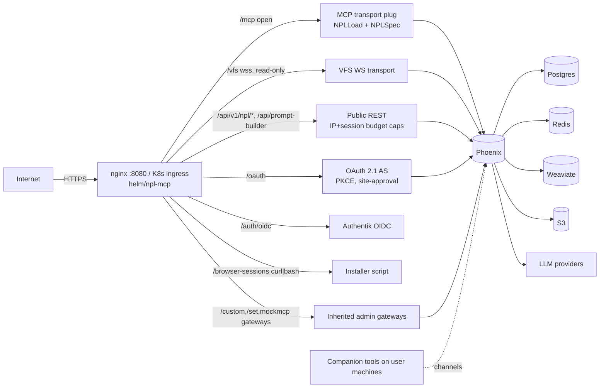

# Threat Model — NoizuPromptLingo (NPL)

Security counterpart to [PROJ-ARCH.md](PROJ-ARCH.md). Post PR #63 this product is a **public, unauthenticated corpus service**: the NPL syntax MCP (`/mcp` — `NPLLoad`/`NPLSpec`), the read-only VFS mount (`/vfs`), public REST (`/api/v1/npl/*`), and a public prompt-builder backing the `/keyboard` page — plus a signed-in conventions admin (Authentik OIDC) and inherited tobor admin surfaces (custom/set/mock MCP gateways) that still route from this host.

**Crown jewels**: the Infisical-held secrets, the OAuth AS signing keys (JWKS), MCP API keys, the Postgres/Redis/Weaviate stores, and LLM provider spend (prompt-builder budget).

**Trust boundaries** (see diagram): Internet → edge (nginx / K8s ingress, TLS) → Phoenix process → data stores; the OAuth AS issues tokens that cross the first boundary; companion tools (local-mcp, browser-controller, remote-access-client) sit on the *user's machine*, outside ours.

Grounding: components and routes per [PROJ-ARCH.md](PROJ-ARCH.md); implementing directories per [PROJ-LAYOUT.md](PROJ-LAYOUT.md).

## Attack Surface

## Vulnerability Register

| ID | Severity | STRIDE | Component | Status |
|----|----------|--------|-----------|--------|
| T-001 | Medium | DoS | Open `/mcp` endpoint | Partial — stateless read-only corpus; rate-limit pipelines cover auth'd routes, not bare `/mcp`; residual accepted (low cost per call) |
| T-002 | Medium | DoS | Public `/vfs` WebSocket | Partial — read-only mount, `--ro` semantics; no per-client quota on the WS transport |
| T-003 | High | DoS / abuse | `/api/prompt-builder` (LLM-backed, public by design) | Mitigated — callers keyed by IP + opaque client session id, capped by admin-editable rate/budget config (`PromptBuilder`) |
| T-004 | Medium | Spoofing / EoP | OAuth site-approval token (`sub=site:npl`) | Mitigated by design — token asserts site approval only, never a user; changeset 085 made the user column nullable so no principal can be implied |
| T-005 | Medium | Spoofing | Legacy `McpApiKey` → `/api/mcp/token` | Mitigated — key shown once, short-lived JWT mint, `rate_limited_auth` on mint + browser-bootstrap |
| T-006 | High | EoP | Inherited custom/set/mock MCP gateways still routed publicly | Open — admin surfaces from the pre-split platform remain reachable; PBAC/ToolGuard enforce roles, but the surfaces' continued exposure on a public corpus host should be a deliberate decision |
| T-007 | Medium | Tampering | `/browser-sessions` curl-to-bash installer | Partial — served over TLS from own host; no checksum/signature pinning in the install flow |
| T-008 | Medium | EoP / Info | remote-access-client frpc tunnels (`*.remote-access.noizu.com`) | Mitigated — named-tunnel claims are token-gated server-side |
| T-009 | Low | Info | Sandboxed Samba shares (sandbox image) | Accepted — local/dev-only, not deployed perimeter |
| T-010 | Medium | Info | Secrets | Mitigated — Infisical-held, `.env` gitignored, `make init` generates locally |
| T-011 | Medium | Tampering | Supply chain | Mitigated — `uv.lock`/`package-lock.json` pinned; images from private registry `ops.noizu.com`; gh-pages is a pinned submodule |
| T-012 | Low | Info | Weaviate / Redis exposure | Mitigated — cluster-internal stores, not ingress-exposed |

## Mitigation Coverage

5 mitigated · 4 partial · 1 open · 2 accepted. The single open item is T-006 (inherited gateway exposure) — decide whether the custom/set/mock gateways stay routed on promptlingo.dev or get disabled now that the work platform lives in agent-kit-mcp.

## Residual Risk

- Unauthenticated `/mcp` and `/vfs` accept per-client abuse up to bandwidth/CPU cost; the corpus is public by intent so confidentiality is not a concern.
- The installer script (T-007) inherits TLS trust only; users piping curl to bash accept that.
- The inherited tobor domain code remains in-tree and routed (T-006); its PBAC enforcement is assumed carried over from the pre-split platform rather than re-audited for the syntax-only deployment.

## Non-goals

Threats internal to agent-kit-mcp (the extracted work platform), the Python fleet's local tooling (`uv run npl-mcp`, port 8765, LiteLLM 4111 — local dev only), and monorepo-level infra are out of scope here.
