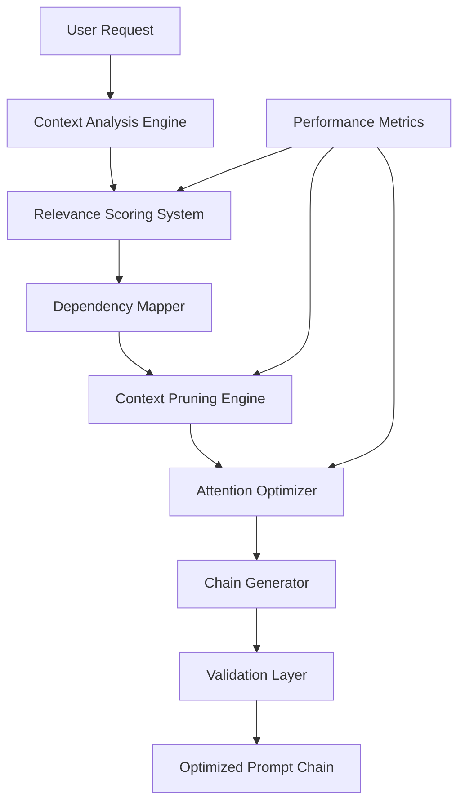

# npl-build-manager - Detailed Reference

Prompt chain optimization agent that analyzes requirements, scores tool relevance, prunes context, and generates optimized NPL configurations.

## Table of Contents

- [Architecture Overview](#architecture-overview)
- [Relevance Scoring Engine](#relevance-scoring-engine)
- [Context Pruning](#context-pruning)
- [Attention Optimization](#attention-optimization)
- [Build Operations](#build-operations)
- [Configuration Reference](#configuration-reference)
- [Integration Patterns](#integration-patterns)
- [Error Handling](#error-handling)
- [Performance Metrics](#performance-metrics)
- [Best Practices](#best-practices)
- [Limitations](#limitations)

---

## Architecture Overview

The build manager processes requests through a multi-stage pipeline:



### Pipeline Stages

| Stage | Function |
|:------|:---------|
| Context Analysis | Parse request, identify domain and complexity |
| Relevance Scoring | Score each available tool against requirements |
| Dependency Mapping | Resolve tool interdependencies |
| Context Pruning | Remove redundant/irrelevant content |
| Attention Optimization | Reorder for Claude processing patterns |
| Chain Generation | Produce final configuration |
| Validation | Verify correctness and compatibility |

---

## Relevance Scoring Engine

Determines which tools to include in a prompt chain based on semantic analysis.

### Scoring Algorithm

```yaml
relevance_calculation:
  base_score: "Semantic similarity between request and tool"
  modifiers:
    - dependency_bonus: "+0.2 for required dependencies"
    - performance_history: "+/-0.15 based on past results"
    - user_preference: "+/-0.1 from usage patterns"
    - complexity_match: "+/-0.1 for appropriate complexity"
  threshold: 0.6  # Minimum score for inclusion
```

### Score Interpretation

| Score Range | Classification | Action |
|:------------|:---------------|:-------|
| 0.9 - 1.0 | Critical | Always include |
| 0.7 - 0.89 | High | Include by default |
| 0.6 - 0.69 | Medium | Include if token budget allows |
| < 0.6 | Low | Exclude unless explicitly requested |

### Scoring Factors

**Semantic Similarity**: Embedding-based comparison between request text and tool descriptions. Weight: 40%.

**Performance History**: Historical effectiveness of tool for similar requests. Weight: 30%.

**User Preference**: Learned patterns from user behavior and explicit preferences. Weight: 20%.

**Complexity Match**: Alignment between task complexity and tool sophistication. Weight: 10%.

---

## Context Pruning

Reduces token usage while preserving output quality.

### Pruning Modes

| Mode | Token Reduction | Quality Risk | Use Case |
|:-----|:----------------|:-------------|:---------|
| `aggressive` | 50-70% | Moderate | Simple, well-defined tasks |
| `moderate` | 30-50% | Low | General usage |
| `conservative` | 10-30% | Minimal | Complex or ambiguous tasks |

### Pruning Rules

**Always Preserve**:
- NPL declarations and syntax definitions
- Critical instructions and constraints
- Output format specifications
- Core tool configurations

**Aggressive Pruning Targets**:
- Examples when pattern is clear
- Verbose descriptions
- Redundant explanations
- Historical context

**Moderate Pruning Targets**:
- Duplicate definitions across tools
- Overlapping context sections
- Secondary examples

**Conservative Pruning Targets**:
- Edge case documentation
- Error handling details
- Complex logic explanations

### Pruning Algorithm

```
for each section in chain:
  score = calculate_relevance(section, request)
  if score < pruning_threshold:
    if section not in preserve_always:
      mark_for_removal(section)

for each marked_section:
  verify_no_broken_references()
  verify_no_missing_dependencies()
  remove(marked_section)
```

---

## Attention Optimization

Restructures content for Claude's attention patterns.

### Optimization Techniques

**Section Reordering**: Places high-priority instructions at attention-optimal positions (beginning and end of context).

**Semantic Clustering**: Groups related concepts to reduce attention fragmentation.

**Token Distribution**: Balances information density across the context window.

**Context Hierarchies**: Nests content by importance level.

### Attention Patterns

```yaml
optimal_positions:
  highest_attention: [0-500, last_1000]  # tokens
  moderate_attention: [500-2000]
  lowest_attention: [middle_of_context]

placement_strategy:
  critical_instructions: highest_attention
  output_specifications: last_1000
  examples: near_relevant_instructions
  background_context: moderate_attention
```

---

## Build Operations

### analyze

Evaluates requirements and recommends tool combinations.

```bash
@build analyze --request="<requirements>" [--verbose] [--debug]
```

**Parameters**:
- `--request`: Natural language description of task requirements
- `--verbose`: Include detailed scoring breakdown
- `--debug`: Show all analysis steps

**Output**:
```
Task Analysis
-------------
Complexity: moderate
Domain: code-review, testing
Performance Focus: quality

Tool Relevance Scores:
- npl-code-reviewer:     0.92 [HIGH]
- npl-test-generator:    0.78 [MEDIUM]
- npl-prototyper:        0.34 [LOW]

Recommended Chain:
[npl-code-reviewer, npl-test-generator]

Confidence: 87%
Expected Tokens: ~3,200
```

### optimize

Reduces token usage in existing chains.

```bash
@build optimize --chain="<tools>" --target-tokens=<limit> [--preserve="<sections>"]
```

**Parameters**:
- `--chain`: Comma-separated tool list or chain file path
- `--target-tokens`: Maximum token budget
- `--preserve`: Sections to never prune (comma-separated)

**Output**:
```
Optimization Report
-------------------
Original Tokens: 8,432
Optimized Tokens: 3,956 (53% reduction)

Pruned Sections:
- Redundant examples (saved 1,800 tokens)
- Duplicate instructions (saved 1,200 tokens)
- Verbose descriptions (saved 1,476 tokens)

Quality Impact: Minimal (<2% degradation)
```

### validate

Checks chain configuration for errors and compatibility issues.

```bash
@build validate --chain-file="<path>" [--fix] [--explain]
```

**Parameters**:
- `--chain-file`: Path to chain configuration file
- `--fix`: Auto-apply recommended fixes
- `--explain`: Provide detailed explanations for issues

**Output**:
```
Validation Results
------------------
[PASS] NPL Syntax: Valid
[PASS] Tool Compatibility: No conflicts
[PASS] Dependency Resolution: Complete
[WARN] Performance: Chain may exceed token limits
[FAIL] Missing Component: npl-intent pump required

Recommendations:
1. Add npl-intent pump for task analysis
2. Consider pruning with --target-tokens=6000
```

### migrate

Converts legacy configurations to optimized NPL chains.

```bash
@build migrate --from="<source>" --to-npl [--analyze] [--optimize]
```

**Parameters**:
- `--from`: Source configuration (e.g., `collate.py all`)
- `--to-npl`: Generate NPL chain output
- `--analyze`: Show migration analysis without converting
- `--optimize`: Apply optimization after migration

### compare

Benchmarks different configurations.

```bash
@build compare --old="<config1>" --new="<config2>" --metrics=<list>
```

**Parameters**:
- `--old`: Reference configuration
- `--new`: Comparison configuration
- `--metrics`: Metrics to compare (`tokens`, `quality`, `speed`, `all`)

---

## Configuration Reference

### Build Parameters

```yaml
build_configuration:
  optimization:
    max_tokens: 8000           # Target token limit
    min_quality: 0.90          # Minimum quality threshold (0-1)
    pruning_level: "moderate"  # aggressive|moderate|conservative

  scoring:
    relevance_threshold: 0.6   # Minimum score for inclusion
    confidence_minimum: 0.75   # Minimum confidence for recommendations
    weights:
      semantic: 0.4            # Embedding similarity weight
      performance: 0.3         # Historical performance weight
      user_preference: 0.2     # User pattern weight
      complexity: 0.1          # Complexity match weight

  preferences:
    prefer_tools: ["npl-*"]    # Tool patterns to prioritize
    exclude_tools: []          # Tools to never include
    preserve_sections: []      # Sections to never prune
```

### Debug Settings

```yaml
debug_settings:
  logging:
    level: "verbose"          # verbose|normal|minimal
    include_scores: true      # Show scoring details
    show_pruning: true        # Display pruning decisions
    trace_optimization: true  # Track optimization steps

  validation:
    strict_mode: true         # Fail on warnings
    explain_errors: true      # Detailed error messages
    suggest_fixes: true       # Provide fix suggestions
```

---

## Integration Patterns

### Pipeline Execution

```bash
# Build and execute
@build create --for="code-review-pipeline" | @npl-prototyper execute

# Optimize then validate
@build optimize --chain="current.md" | @build validate

# Generate with metrics
@build generate --measure-performance --report="build-metrics.md"
```

### CI/CD Integration

```yaml
# GitHub Actions
- name: Validate NPL Chain
  run: |
    npl-build-manager validate \
      --chain-file=.npl/chain.yaml \
      --fail-on-warning
```

### Multi-Agent Coordination

```bash
# Chain with other agents
@build analyze --request="review auth module" \
  | @npl-code-reviewer execute \
  | @npl-technical-writer document
```

---

## Error Handling

### Error Categories

| Category | Cause | Recovery |
|:---------|:------|:---------|
| Validation Failure | Invalid syntax or missing components | Use `--fix` or manual correction |
| Optimization Failure | Cannot meet constraints | Reduce pruning aggressiveness |
| Compatibility Issue | Tool version mismatch | Check versions, update tools |
| Token Overflow | Chain exceeds limits | Increase pruning or split chain |

### Recovery Strategies

**Validation Failures**:
1. Identify specific issues from error output
2. Apply suggested corrections
3. Use `--fix` for auto-repair when available
4. Fall back to manual editing for complex issues

**Optimization Failures**:
1. Reduce `pruning_level` to `conservative`
2. Increase `max_tokens` if possible
3. Split into multiple smaller chains
4. Use minimal tool configurations

---

## Performance Metrics

### Target Metrics

| Metric | Target | Description |
|:-------|:-------|:------------|
| Token Reduction | 40-60% | Average compression ratio |
| Quality Preservation | 95%+ | Output quality maintained |
| Build Speed | <2 seconds | Standard chain construction |
| Cache Hit Rate | 80%+ | Common pattern reuse |
| Recommendation Accuracy | 90%+ | User satisfaction with suggestions |

### Metrics Collection

```yaml
performance_tracking:
  build_metrics:
    - chain_construction_time
    - token_reduction_ratio
    - quality_preservation_score

  optimization_metrics:
    - pruning_effectiveness
    - attention_improvement
    - relevance_accuracy
```

---

## Best Practices

### Chain Building

1. **Start Simple**: Begin with minimal tool sets, add as needed
2. **Measure Impact**: Compare before/after metrics
3. **Iterate on Data**: Use metrics to guide optimization
4. **Document Decisions**: Record tool inclusion/exclusion rationale

### Optimization

1. **Preserve Critical Context**: Never sacrifice correctness for size
2. **Benchmark Regularly**: Track optimization effectiveness over time
3. **Balance Trade-offs**: Consider speed vs quality vs tokens
4. **Enable Debugging**: Use `--verbose` during development

### Migration

1. **Gradual Approach**: Migrate incrementally, not all at once
2. **Maintain Compatibility**: Support existing workflows during transition
3. **Enable Rollback**: Keep original configurations accessible
4. **Validate Thoroughly**: Test migrated chains before deployment

---

## Limitations

**Scoring Accuracy**: Relevance scoring relies on semantic similarity which may miss domain-specific nuances. Manual review recommended for specialized domains.

**Pruning Safety**: Aggressive pruning can remove context that appears redundant but affects edge cases. Use conservative mode for critical tasks.

**Token Estimation**: Token counts are estimates. Actual usage varies with input content.

**Migration Coverage**: Not all legacy configurations map directly to NPL patterns. Some manual adjustment may be required.

**Cache Invalidation**: Pattern caches may become stale when tools are updated. Clear cache after tool updates.

---

## See Also

- [Infrastructure Agents Overview](./README.md)
- [npl-code-reviewer](./npl-code-reviewer.md)
- [npl-prototyper](./npl-prototyper.md)
- Core Definition: `core/additional-agents/infrastructure/npl-build-manager.md`
