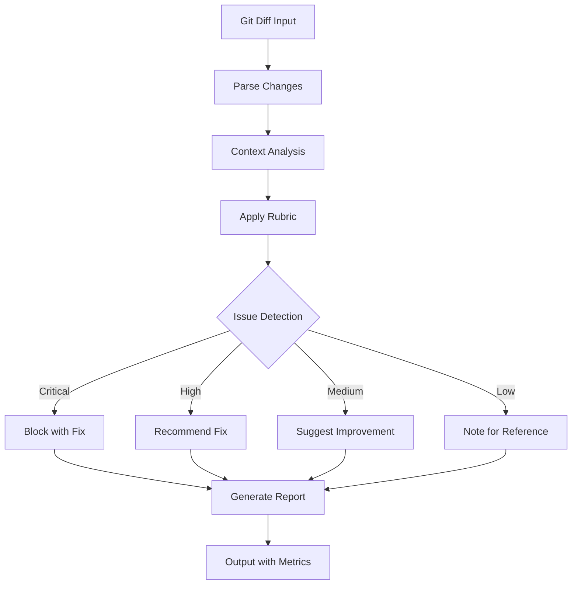

# npl-code-reviewer Detailed Reference

Advanced code review agent with real git integration, context-aware rubric evaluation, and actionable recommendations with file/line references.

**Source**: `core/additional-agents/infrastructure/npl-code-reviewer.md`

---

## Table of Contents

- [Overview](#overview)
- [Git Integration](#git-integration)
- [Rubric System](#rubric-system)
- [Review Operations](#review-operations)
- [Output Formats](#output-formats)
- [Configuration Options](#configuration-options)
- [CI/CD Integration](#cicd-integration)
- [Commands Reference](#commands-reference)
- [Usage Examples](#usage-examples)
- [Best Practices](#best-practices)
- [Limitations](#limitations)

---

## Overview

The `@reviewer` agent parses actual git diffs, applies context-aware rubrics, and generates actionable recommendations with precise file/line references. It replaces manual code review workflows with automated, measurable quality gates.



### Core Functions

| Function | Description |
|:---------|:------------|
| Diff Parsing | Extract and analyze git diffs from working directory |
| Branch Context | Understand feature branch purpose and history |
| Rubric Scoring | Apply weighted criteria based on file type |
| Actionable Output | Specific file/line references with fix examples |
| Performance Tracking | Before/after metrics with ROI calculation |

### Evolution from gpt-cr

| Aspect | gpt-cr (Legacy) | npl-code-reviewer |
|:-------|:----------------|:------------------|
| Input | Manual code snippets | Real git diffs |
| Rubric | Static 6 categories | Dynamic contextual |
| Output | YAML only | Multiple formats |
| References | None | File/line specific |
| Metrics | None | Before/after tracking |
| Integration | Text-based | Git, CI/CD, IDE |

---

## Git Integration

### Repository Analysis

The agent accesses the working directory to parse actual git state:

**Capabilities:**

- Diff parsing from HEAD, commits, or branches
- Branch comparison and merge conflict prediction
- Commit history context for understanding changes
- File relationship mapping for dependency impact analysis
- Test coverage gap identification

### Diff Processing Commands

```bash
# Analyze changes from last commit
@reviewer analyze --diff="HEAD~1" --focus="security,performance"

# Compare branches
@reviewer compare --from="main" --to="feature/new-api" --rubric="full"

# Review specific commit
@reviewer analyze --commit="abc123" --depth="detailed"

# Pull request review
@reviewer pr --number=123 --depth="comprehensive"
```

### Branch Context

The agent understands branch semantics:

| Branch Pattern | Default Focus |
|:---------------|:--------------|
| `feature/*` | Functionality, testing |
| `hotfix/*` | Security, minimal change |
| `release/*` | Stability, documentation |
| `refactor/*` | Maintainability, patterns |

---

## Rubric System

### Category Weights

| Category | Weight | Focus Areas |
|:---------|-------:|:------------|
| Security | Critical | OWASP Top 10, CVEs, input validation, auth |
| Performance | Contextual | Algorithm complexity, bottlenecks, caching |
| Code Quality | Dynamic | Readability, maintainability, best practices |
| Testing | High | Coverage, testability, assertions |
| Architecture | Moderate | Patterns, SOLID, separation, scalability |
| Documentation | Standard | Inline comments, API docs, examples |

### Contextual Weighting

The rubric adapts based on file type and project phase:

**By File Type:**

| File Type | Priority Order |
|:----------|:---------------|
| API endpoints | Security > Performance > Documentation |
| Database migrations | Security > Testing > Performance |
| Frontend components | Code Quality > Testing > Documentation |
| Configuration | Security > Documentation > Code Quality |

**By Project Phase:**

| Phase | Priority Order |
|:------|:---------------|
| Prototype | Code Quality > Documentation |
| Production | Security > Testing > Performance |
| Maintenance | Maintainability > Documentation > Testing |

### Scoring Method

- Scale: 0-100 with categorical grades (A-F)
- Method: Weighted contextual averaging
- Adaptation: Based on file type, project phase, team standards

---

## Review Operations

### Quick Review (Level 1)

Fast analysis for immediate feedback. Target time: 2-3 minutes.

```bash
@reviewer quick --files="src/api/*.py"
```

**Output:**

```
Quick Review Summary
====================
Critical Issues: 2
- SQL injection risk in user_api.py:45
- Missing authentication in admin_api.py:78

High Priority: 3
- Performance bottleneck in data_api.py:234
- Missing error handling in auth_api.py:56
- Deprecated function usage in utils.py:12

Action Items: 5 total (2 critical, 3 high)
Full report: review-123.md
```

### Detailed Analysis (Level 2)

Comprehensive file-level review with scoring.

```bash
@reviewer analyze --commit="abc123" --depth="detailed"
```

**Output:**

```
Detailed Code Review
====================
Commit: abc123
Author: developer@example.com
Files: 8 changed, +245/-67

Code Quality Score: 78/100 (B+)
├── Readability: 85/100
├── Maintainability: 72/100
└── Best Practices: 77/100

Security Assessment: PASS with warnings
├── No critical vulnerabilities
├── 2 medium-risk patterns detected
└── Input validation recommended

Performance Analysis:
├── O(n^2) algorithm in sort_helper.py:34
├── Suggested optimization: Use built-in sort
└── Expected improvement: 10x for n>1000

Test Coverage Impact:
├── Current: 67%
├── After changes: 64% (down 3%)
└── Suggested tests: 5 unit, 2 integration
```

### Comprehensive Audit (Level 3)

Full project audit with architecture review and technical debt assessment.

```bash
@reviewer audit --project="." --output="audit-report.md" --format="detailed"
```

**Sections:**

- Executive Summary with overall grade
- Architecture Review with diagrams
- Security Audit with vulnerability assessment
- Performance Profile with bottleneck analysis
- Testing Strategy with coverage gaps
- Technical Debt with remediation estimates
- Recommendations (immediate, short-term, long-term)

---

## Output Formats

### Inline Annotation Format

```markdown
## File: src/api/user_controller.py

### Line 45-47: SQL Injection Vulnerability [CRITICAL]
**Issue**: Direct string concatenation in SQL query
```python
# Current (vulnerable):
query = f"SELECT * FROM users WHERE id = {user_id}"

# Suggested fix:
query = "SELECT * FROM users WHERE id = ?"
cursor.execute(query, (user_id,))
```
**References**: [OWASP SQL Injection](https://owasp.org/www-community/attacks/SQL_Injection)
```

### Issue Structure

| Field | Description |
|:------|:------------|
| file | Full path to file |
| line | Specific line number or range |
| severity | critical, high, medium, low, info |
| category | security, performance, quality, test, style |
| issue | Clear problem description |
| suggestion | Specific fix recommendation |
| example | Code example when helpful |
| references | Links to documentation |

### Supported Output Formats

| Format | Use Case |
|:-------|:---------|
| markdown | Human-readable reports |
| json | Tool integration |
| html | Web dashboards |
| sarif | Static Analysis Results Interchange Format |

---

## Configuration Options

### Review Parameters

```yaml
review_configuration:
  depth:
    level: "comprehensive"  # quick|detailed|comprehensive
    focus_areas: ["security", "performance", "testing"]
    ignore_patterns: ["*.generated.*", "vendor/*"]

  rubric:
    preset: "balanced"      # strict|balanced|lenient
    custom_weights:
      security: 1.5
      performance: 1.2
      testing: 1.3

  output:
    format: "markdown"      # markdown|json|html|sarif
    verbosity: "normal"     # minimal|normal|verbose
    include_examples: true
    include_metrics: true
```

### Team Standards

```yaml
team_standards:
  code_style:
    language_specific:
      python: "PEP8"
      javascript: "ESLint:recommended"

  security_requirements:
    owasp_compliance: true
    custom_rules: ["no-eval", "parameterized-queries"]

  performance_thresholds:
    max_complexity: 10
    max_query_time: "100ms"

  documentation_requirements:
    public_api: "required"
    complex_logic: "required"
    minimum_coverage: 80
```

---

## CI/CD Integration

### Pre-Commit Hook

```bash
@reviewer pre-commit --staged --fail-on="critical"
```

Blocks commits with critical issues. Configurable severity threshold.

### Pull Request Automation

```bash
@reviewer pr-check --auto-comment --require-approval
```

Posts review comments directly to PR. Optionally requires approval before merge.

### Merge Validation

```bash
@reviewer merge-check --from="feature/*" --to="main" --strict
```

Validates branch compatibility and enforces standards before merge.

### GitHub Actions Example

```yaml
name: Code Review

on: [push, pull_request]

jobs:
  review:
    runs-on: ubuntu-latest
    steps:
      - uses: actions/checkout@v3
      - name: NPL Code Review
        run: |
          @reviewer analyze \
            --mode=pr \
            --output=github-comments \
            --fail-on=critical
```

### GitLab CI Example

```yaml
code-review:
  stage: review
  script:
    - @reviewer analyze --mode=gitlab-mr
  artifacts:
    reports:
      codequality: code-review-report.json
```

---

## Commands Reference

### Core Commands

| Command | Description |
|:--------|:------------|
| `quick --files=<pattern>` | Fast review of matching files |
| `analyze --commit=<ref> --depth=<level>` | Detailed commit analysis |
| `compare --from=<branch> --to=<branch>` | Branch comparison |
| `pr --number=<id>` | Pull request review |
| `audit --project=<path>` | Comprehensive project audit |

### Workflow Commands

| Command | Description |
|:--------|:------------|
| `pre-commit --staged` | Pre-commit hook mode |
| `pr-check --auto-comment` | PR automation with comments |
| `merge-check --strict` | Merge validation |
| `watch --on-save` | IDE file watch mode |

### Options

| Option | Values | Default |
|:-------|:-------|:--------|
| `--depth` | quick, detailed, comprehensive | detailed |
| `--focus` | security, performance, testing, style | all |
| `--output` | markdown, json, html, sarif | markdown |
| `--fail-on` | critical, high, medium, low | critical |
| `--rubric` | strict, balanced, lenient | balanced |

---

## Usage Examples

### Review Staged Changes

```bash
@reviewer quick --files="$(git diff --cached --name-only)"
```

### Security-Focused PR Review

```bash
@reviewer pr --number=123 --focus="security" --rubric="strict"
```

### Compare Feature Branch

```bash
@reviewer compare --from="main" --to="feature/new-auth" --depth="comprehensive"
```

### Team Standards Enforcement

```bash
@reviewer enforce --standards="team-style-guide.yaml"
```

### Learning Mode

```bash
@reviewer teach --explain-patterns --suggest-resources
```

Provides educational explanations for detected issues.

---

## Best Practices

### For Development Teams

1. **Start with quick reviews**: Build confidence with fast feedback
2. **Customize rubric weights**: Align priorities with team goals
3. **Track metrics over time**: Measure quality improvement
4. **Integrate early**: Add to CI/CD from project start
5. **Adjust based on feedback**: Tune configuration iteratively

### For Code Quality

1. **Focus on patterns**: Identify recurring issues across codebase
2. **Prioritize fixes**: Address critical and high severity first
3. **Automate prevention**: Use pre-commit hooks to prevent regression
4. **Document decisions**: Explain why issues matter for team learning

### For Performance

1. **Establish baselines**: Measure before optimizing
2. **Profile first**: Identify actual bottlenecks, not assumed ones
3. **Test improvements**: Verify optimization impact with benchmarks
4. **Monitor regression**: Detect performance degradation early

---

## Limitations

### Scope Constraints

- Parses git diffs; does not execute or test code
- Security detection based on patterns; not formal verification
- Performance analysis is static; runtime profiling requires separate tools

### Analysis Boundaries

- False positive rate: approximately 8%
- Detection rate: approximately 92% of critical issues
- Large diffs (>10,000 lines) may require chunked processing

### Integration Requirements

- Requires git repository access
- PR features require GitHub/GitLab API access
- IDE integration requires compatible editor

### Error Handling

When issues occur:

- Git access failure: Falls back to file-based review
- Parsing errors: Skips unparseable sections, continues with available code
- Timeout: Chunks large reviews, provides partial results
- Integration failures: Uses standalone mode, generates portable reports
