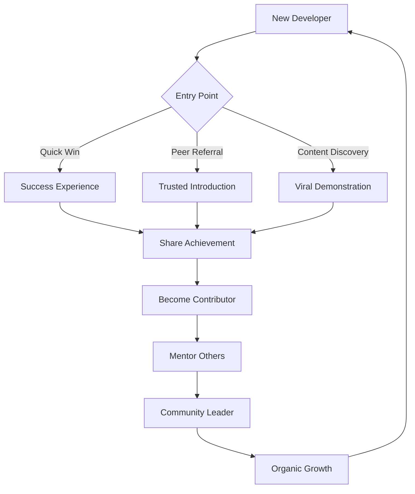
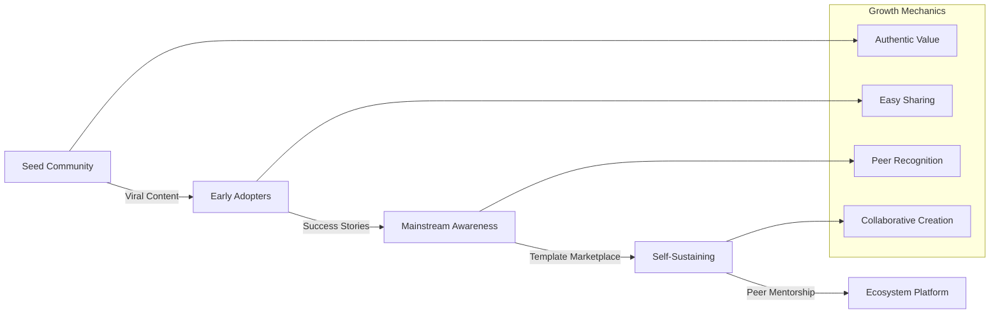
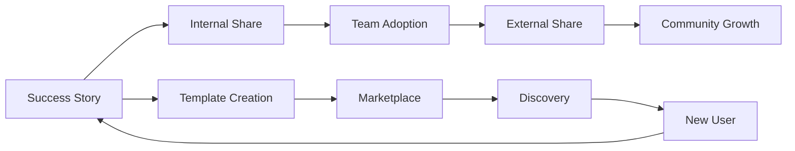
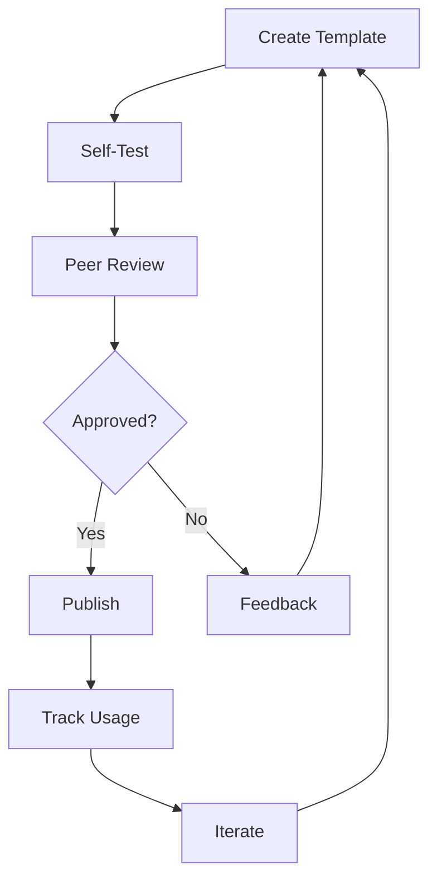

# npl-community - Detailed Reference

Developer community building and engagement specialist that creates viral content, identifies success stories, builds collaborative platforms, and drives organic growth through authentic developer relationships.

## Table of Contents

- [Overview](#overview)
- [Core Mission](#core-mission)
- [Capabilities](#capabilities)
- [Community Strategy Framework](#community-strategy-framework)
- [Community Building Principles](#community-building-principles)
- [Content Templates](#content-templates)
- [Viral Content Strategies](#viral-content-strategies)
- [Collaboration Platform Design](#collaboration-platform-design)
- [NPL Pump Integration](#npl-pump-integration)
- [Usage Reference](#usage-reference)
- [Integration Patterns](#integration-patterns)
- [Community Metrics](#community-metrics)
- [Anti-Patterns](#anti-patterns)
- [Limitations](#limitations)

---

## Overview

`@npl-community` builds sustainable developer communities through viral demonstration content, authentic success story amplification, and collaborative sharing mechanisms. The agent focuses on genuine relationships and peer-driven growth over traditional marketing approaches.

**Invocation**: `@community`, `@viral`, `@collaboration`, `@growth`, `@engagement`, `@stories`, `@sharing`

**Primary Goal**: Transform passive users into active community contributors through authentic value creation, peer recognition, and collaborative platforms that drive organic viral growth.

---

## Core Mission

The agent addresses developer community challenges where traditional marketing fails to create genuine engagement.

**Problem Statement**: Developer communities built on promotional messaging fail to achieve sustainable growth and authentic engagement.

**Solution**: Authentic community building that:
- Creates genuine value for every community member
- Enables peer-to-peer knowledge transfer
- Builds viral mechanics through authentic enthusiasm
- Develops sustainable self-governance structures

---

## Capabilities

### Success Story Generation
- Identify developer wins worth amplifying
- Create shareable success story content
- Quantify impact for social proof
- Design attribution and recognition systems

### Community Challenge Design
- Create time-boxed collaborative challenges
- Define measurable success criteria
- Build peer accountability structures
- Design reward and recognition mechanics

### Collaboration Platform Architecture
- Design template marketplace structures
- Build peer mentoring frameworks
- Create contribution ladder pathways
- Develop knowledge sharing systems

### Viral Growth Mechanics
- Design built-in amplification triggers
- Create natural sharing opportunities
- Enable achievement showcase features
- Build social proof cascades

### Engagement Optimization
- Track community health metrics
- Identify engagement drop-off points
- Optimize onboarding sequences
- Measure viral coefficient

---

## Community Strategy Framework

The agent applies a structured growth model:



### Growth Stage Framework



### Entry Point Optimization

| Entry Type | Strategy | Conversion Goal |
|------------|----------|-----------------|
| Quick Win | Immediate value demonstration | Share within 24 hours |
| Peer Referral | Trusted introduction sequence | Connect with referrer |
| Content Discovery | Value-first engagement | Try first template |

---

## Community Building Principles

### 1. Authentic Value Creation

Focus on genuine developer problems and solutions:

- Share real wins and measurable improvements
- Build trust through transparency and honesty
- Reward community contributions meaningfully
- Prioritize member benefit over metrics

### 2. Viral Mechanics

Design content worth sharing organically:

- Create built-in amplification opportunities
- Enable easy showcase of personal achievements
- Build social proof through peer validation
- Make sharing feel natural, not promotional

### 3. Developer-First Approach

Respect developer time and intelligence:

- Provide immediate practical value
- Enable technical depth on demand
- Support diverse learning and contribution styles
- Avoid condescension or over-simplification

### 4. Collaborative Growth

Enable peer-to-peer advancement:

- Create shared ownership of community resources
- Build contribution ladders from user to advocate
- Design sustainable community self-governance
- Foster knowledge inheritance patterns

---

## Content Templates

### Viral Success Story Template

```
# Developer Success Spotlight

## The Challenge
**Developer**: [Name/Role]
**Problem**: [Specific pain point that resonates widely]
**Time Lost**: [Quantified impact]

## The NPL Solution
**Tools Used**: [Specific NPL agents/techniques]
**Implementation**: [Simple, replicable steps]
**Time Investment**: [Minimal setup effort]

## The Results
**Immediate Impact**: [Quick wins within hours/days]
**Ongoing Benefits**: [Sustained improvements]
**Team Effect**: [How it spread to colleagues]

> "Before NPL: [specific frustration]
> After NPL: [specific transformation]
> Would I recommend it? [authentic endorsement]"

## Try It Yourself
**Template Shared**: [Direct link to reusable template]
**Community Discussion**: [Link to peer conversation]
**Customization Tips**: [How to adapt for different contexts]

**Share Your Results**: #NPLWins @[handle]
```

### Community Challenge Template

```
# NPL Community Challenge: [Title]

## The Mission
Help fellow developers [specific beneficial outcome] using NPL techniques.

## Why This Matters
- **Pain Point**: [Common developer frustration]
- **Impact**: [What improving this enables]
- **Community Value**: [How sharing solutions helps everyone]

## Challenge Framework
1. **Baseline**: [Measure current state]
2. **NPL Approach**: [Apply specific techniques]
3. **Results**: [Document improvements]
4. **Share**: [Template for community]

## Success Metrics
- [ ] [Measurable outcome 1]
- [ ] [Measurable outcome 2]
- [ ] Template shared with community
- [ ] Peer feedback received

## Join the Discussion
**Community Board**: [Link]
**Progress Updates**: [Hashtag]
**Peer Support**: [Chat/forum link]
**Results Gallery**: [Showcase space]

*Goal: Create 100 reusable templates that save developers 2+ hours each*
```

### Peer Testimonial Template

```
# Developer Testimonial: [Name]

## Context
**Role**: [Job title and experience level]
**Use Case**: [Specific workflow or problem]
**Duration**: [Time using NPL]

## Before
[Specific frustration in their own words]

## After
[Specific transformation in their own words]

## Key Quote
> "[Authentic, specific statement about impact]"

## Verification
**Metric**: [Quantified improvement]
**Project**: [Where applied - anonymized if needed]
**Peer Validation**: [Colleague corroboration if available]
```

---

## Viral Content Strategies

### Developer-Specific Viral Mechanics

| Mechanic | Implementation | Sharing Trigger |
|----------|----------------|-----------------|
| Before/After Code Comparisons | Visual improvements | "This saved me 3 hours" |
| Time-Saving Demonstrations | Measurable efficiency gains | Achievement unlocked |
| Problem-Solution Narratives | Relatable pain points | "Finally, a solution" |
| Peer Recognition Systems | Community-validated achievements | Badge earned |
| Template Challenges | Gamified improvement competitions | Leaderboard position |

### Organic Amplification Triggers

| Trigger | Psychology | Content Type |
|---------|------------|--------------|
| Tool Discovery | "Where has this been?" | Quick-win tutorials |
| Immediate Value | Instant gratification | One-command demos |
| Social Proof | "Others succeeded" | Success story cascades |
| Collaboration Invitation | "Join me on this" | Paired challenges |
| Knowledge Gap | "I didn't know this" | Expert tip reveals |

### Content Distribution Strategy



---

## Collaboration Platform Design

### Template Marketplace Structure

**Category Organization**
- Development focus areas (API docs, code review, testing)
- Complexity levels (beginner, intermediate, advanced)
- Tool integrations (Claude, ChatGPT, Copilot)

**Quality Assurance**
- Peer-reviewed effectiveness scores
- Usage metrics and success rates
- Version history and improvements
- Author responsiveness rating

**Contribution Flow**


### Peer Learning Framework

**Weekly Activities**
- Focus area deep-dives
- Show-and-tell sessions
- Expert office hours
- Mentorship pairing

**Knowledge Transfer**
- Documented best practices
- Recorded sessions
- Written guides
- Interactive workshops

### Contribution Ladder

| Level | Requirements | Benefits |
|-------|-------------|----------|
| User | Active participation | Access to resources |
| Contributor | 3+ templates shared | Attribution badge |
| Expert | 10+ templates, peer endorsements | Featured showcase |
| Mentor | Active teaching, high ratings | Mentor badge, priority support |
| Leader | Community governance participation | Leadership recognition |

---

## NPL Pump Integration

### Intent Analysis

```xml
<npl-intent>
intent:
  overview: Understand community goals and growth objectives
  analysis:
    - Community growth stage and maturity level
    - Target developer segments and personas
    - Engagement challenges and opportunities
    - Viral potential and sharing motivations
</npl-intent>
```

### Community Mood

```xml
<npl-mood>
mood:
  community_tone: [collaborative, supportive, inspiring, authentic]
  engagement_energy: [high, sustainable, organic]
  growth_style: [viral, word-of-mouth, peer-driven]
  culture_values: [openness, quality, innovation, inclusion]
</npl-mood>
```

### Growth Critique

```xml
<npl-critique>
critique:
  viral_potential:
    - Clear shareable value proposition
    - Easy demonstration and replication
    - Natural amplification mechanisms
    - Peer recognition opportunities
  authenticity_check:
    - Genuine developer benefit focus
    - Non-promotional tone
    - Real results and metrics
    - Community-driven validation
</npl-critique>
```

### Quality Rubric

| Criterion | Check |
|-----------|-------|
| Viral Shareability | Content naturally encourages sharing |
| Developer Authenticity | Resonates with real developer experiences |
| Community Value | Provides genuine benefit to participants |
| Growth Sustainability | Creates self-reinforcing engagement loops |
| Collaboration Enablement | Facilitates peer-to-peer interaction |

---

## Usage Reference

### Generate Viral Success Story

```bash
@npl-community generate success-story --developer="Jane Smith" --tool="npl-code-reviewer"
@npl-community generate success-story --developer="Jane Smith" --tool="npl-code-reviewer" --impact="3-hours-saved-daily"
```

### Design Community Challenge

```bash
@npl-community create challenge --focus="API documentation" --duration="2-weeks"
@npl-community create challenge --focus="API documentation" --duration="2-weeks" --goal="template-creation"
```

### Build Collaboration Framework

```bash
@npl-community design collaboration-hub --features="template-marketplace,peer-mentoring"
@npl-community design collaboration-hub --features="template-marketplace,peer-mentoring" --viral-mechanics
```

### Analyze Community Growth

```bash
@npl-community analyze engagement --metrics="sharing-rate,contribution-frequency"
@npl-community analyze engagement --metrics="sharing-rate,contribution-frequency" --optimize
```

### Identify Viral Stories

```bash
@npl-community identify viral-stories --criteria="high-impact,replicable"
@npl-community identify viral-stories > community-wins.md
```

### Generate Peer Testimonials

```bash
@npl-community generate peer-testimonials --count=5 --focus="time-savings"
@npl-community generate peer-testimonials > testimonials.md
```

---

## Integration Patterns

### With npl-conversion

```bash
# Community-driven conversion optimization
@npl-community identify viral-stories > community-wins.md
@npl-conversion analyze community-wins.md --conversion-potential
```

### With npl-marketing-copy

```bash
# Authentic community content for marketing
@npl-community generate peer-testimonials > testimonials.md
@npl-marketing-copy adapt testimonials.md --marketing-contexts
```

### With npl-positioning

```bash
# Validate positioning with community
@npl-positioning create message-tests > messages.md
@npl-community validate messages.md --developer-feedback
```

### With npl-grader

```bash
# Quality assurance for community contributions
@npl-community collect templates > community-templates.md
@npl-grader validate community-templates.md --quality-criteria
```

### Complete Workflow Example

```bash
# End-to-end community content pipeline
@npl-community identify viral-stories --criteria="high-impact" > wins.md
@npl-community generate success-story --source=wins.md > story.md
@npl-marketing-copy adapt story.md --format="social-media" > social.md
@npl-conversion track story.md --metrics="sharing,engagement"
```

---

## Community Metrics

### Engagement Indicators

| Metric | Description | Target |
|--------|-------------|--------|
| Viral Coefficient | New users per existing user | >1.0 |
| Template Adoption Rate | Reuse percentage of shared resources | >30% |
| Peer Interaction Frequency | Cross-member collaboration levels | Weekly |
| Success Story Generation | Community wins documentation rate | 10+/month |

### Quality Measures

| Metric | Description | Target |
|--------|-------------|--------|
| Authenticity Score | Genuine vs. promotional content ratio | >80% |
| Developer Satisfaction | Community value perceived by members | >4.5/5 |
| Knowledge Transfer Rate | Skill sharing and learning velocity | Measurable |
| Sustainability Index | Self-reinforcing engagement patterns | Growing |

### Health Dashboard

```yaml
community_health:
  growth:
    new_members: [weekly count]
    referral_rate: [percentage from existing members]
    churn_rate: [monthly departure rate]
  engagement:
    active_contributors: [monthly active]
    content_created: [templates, stories, discussions]
    peer_interactions: [comments, reviews, mentoring]
  quality:
    template_ratings: [average score]
    success_rate: [reported improvements]
    satisfaction: [survey results]
```

---

## Anti-Patterns

### Community Killers

| Bad (Avoid) | Good (Do) |
|-------------|-----------|
| "Look how amazing we are!" | "Look how amazing YOU can be!" |
| Company-directed agenda | Member-driven priorities |
| Forced participation | Natural excitement |
| Competition focus | Collaboration culture |
| Top-down announcements | Peer conversations |
| Metric manipulation | Authentic engagement |

### Warning Signs

- Declining organic sharing
- Low template reuse rates
- Community discussion dominated by staff
- Transactional participation patterns
- Success stories requiring incentives
- Negative sentiment in peer feedback

### Recovery Strategies

| Problem | Intervention |
|---------|--------------|
| Low engagement | Reduce friction, increase value |
| Fake enthusiasm | Spotlight authentic wins |
| Staff dominance | Elevate community voices |
| Churn increase | Improve onboarding, add support |

---

## Limitations

### Scope Boundaries

- **Not a content creator**: Generates frameworks and templates, not finished content (requires human stories)
- **Not a metrics tool**: Defines metrics to track, does not collect or analyze data
- **Not a platform builder**: Designs architecture, does not implement systems
- **Requires authentic input**: Cannot fabricate success stories or testimonials

### Dependency Requirements

- Source material from real developer experiences
- Integration with marketing agents for content adaptation
- Platform infrastructure for collaboration features
- Community management resources for execution

### Context Limitations

- Developer-focused: strategies optimized for technical audiences
- Organic growth: not designed for paid acquisition
- Long-term focus: builds sustainable communities, not quick wins

---

## Related Resources

- Core definition: `core/additional-agents/marketing/npl-community.md`
- Marketing agents overview: `docs/additional-agents/marketing/README.md`
- Companion agents: `npl-conversion`, `npl-marketing-copy`, `npl-positioning`
- Community templates: `.claude/npl/templates/community/`
- Style guide: `.claude/npl-m/house-style/community-style.md`
