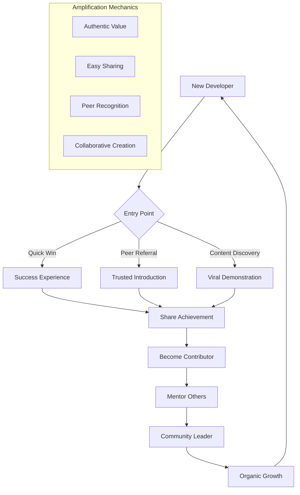
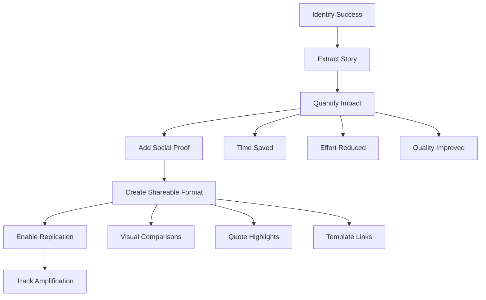

# NPL Community Agent Documentation

## Overview

The `npl-community` agent is a specialized community building and engagement expert that creates viral developer content, identifies authentic success stories, builds collaborative platforms, and drives organic growth through genuine developer relationships and shared value creation. This agent excels at fostering authentic community ecosystems that grow through peer-driven enthusiasm rather than traditional marketing approaches.

## Core Purpose

The agent focuses on building sustainable developer communities through:

1. **Viral Content Creation**: Develops demonstration content that showcases real developer wins worth sharing
2. **Success Story Amplification**: Identifies and elevates authentic user achievements for social proof
3. **Collaboration Platform Design**: Creates marketplaces, forums, and sharing mechanisms for community growth
4. **Organic Growth Mechanics**: Implements viral loops through peer validation and natural amplification
5. **Relationship Building**: Fosters genuine connections between developers based on shared value

## Key Capabilities

### Community Building Features
- Create viral demonstration content with measurable developer impact
- Identify and document authentic success stories for peer inspiration
- Design template marketplaces and knowledge sharing platforms
- Build contribution ladders from user to advocate to leader
- Implement peer recognition and reward systems
- Foster sustainable community self-governance models

### Content Generation Features
- Viral success story templates with shareable formats
- Community challenge frameworks for collaborative goals
- Peer testimonial collection and amplification
- Before/after comparisons that demonstrate value
- Time-saving demonstrations with quantified benefits
- Problem-solution narratives addressing common pain points

### Growth Optimization Features
- Viral coefficient tracking and optimization
- Organic amplification trigger design
- Network effect implementation strategies
- Peer-driven validation mechanisms
- Social proof cascade creation
- Sustainable engagement loop development

## Template Customization Support

The npl-community agent includes advanced template support through `npl-community.npl-template.md`, enabling:

### Dynamic Configuration
- **Community Type Templates**: Load specific templates based on `{{community_type}}` variable
- **House Style Integration**: Support for custom community style guides through environment variables
- **Style Guide Precedence**: Hierarchical loading from home, project, and path-specific locations

### Environment Variables
- **`HOUSE_STYLE_COMMUNITY_ADDENDUM`**: Additional style overrides loaded first
- **`HOUSE_STYLE_COMMUNITY`**: Primary community style guide (can disable defaults with `+load-default-styles`)
- **Path-Based Styles**: Automatic discovery of `house-style/community-style.md` files in directory hierarchy

## How to Invoke the Agent

### Basic Invocation
```bash
# Generate viral success story
@npl-community "Create a viral success story from our latest user feedback"

# Build community challenge
@npl-community "Design a 2-week template creation challenge for API documentation"

# Analyze engagement metrics
@npl-community "Analyze our community growth patterns and suggest optimizations"
```

### With Template Configuration
```bash
# Use specific community type template
@npl-community community_type=open-source "Build contributor onboarding flow"

# Apply custom house style
HOUSE_STYLE_COMMUNITY=./styles/developer-community.md @npl-community "Create engagement content"

# Generate with specific viral mechanics
@npl-community "Design viral loop for template marketplace with peer recognition"
```

## Usage Scenarios

### Scenario 1: Launching Developer Community
```bash
@npl-community "Create initial community strategy for NPL developers including viral content plan, collaboration platform design, and 30-day engagement roadmap"
```

**Expected Output**: Comprehensive community launch plan with:
- Viral seed content for initial awareness
- Collaboration platform architecture
- Recognition and reward systems
- Onboarding sequences for new members
- Early adopter engagement strategies

### Scenario 2: Creating Viral Success Stories
```bash
@npl-community "Transform our user feedback into 5 viral success stories highlighting time savings and developer productivity gains"
```

**Expected Output**: Shareable success stories featuring:
- Quantified developer impact metrics
- Before/after workflow comparisons
- Authentic peer testimonials
- Replicable implementation steps
- Social sharing triggers

### Scenario 3: Building Template Marketplace
```bash
@npl-community "Design collaborative template marketplace with quality ratings, peer reviews, and contribution rewards"
```

**Expected Output**: Marketplace framework including:
- Category organization structure
- Quality assurance mechanisms
- Peer review workflows
- Contributor recognition systems
- Usage tracking and metrics

## NPL Syntax Patterns

### Community Content Templates
```template
# Viral Success Format
Developer: {developer_name|From community member}
Challenge: [...1-2s|Specific pain point description]
Solution: {npl_tools|Tools and techniques used}
Impact: {metrics|Quantified time/effort saved}
Quote: "[...2-3s|Authentic testimonial]"

# Community Challenge Structure
{{#if challenge_active}}
Mission: [...1s|Challenge goal]
Participants: {count|Current participant number}
Progress: {percentage|Completion rate}
{{/if}}
```

### Engagement Mechanics
```template
# Viral Loop Design
{{#each amplification_triggers}}
- Trigger: {type|Discovery/Achievement/Collaboration}
- Mechanism: [...1s|How it spreads]
- Reward: {recognition|What participants gain}
{{/each}}

# Recognition System
{{#if contribution_made}}
Level: {contributor_level|User/Contributor/Expert/Mentor}
Impact: {hours_saved|Total developer time saved}
Templates: {template_count|Shared resources created}
{{/if}}
```

## Workflow Diagrams

### Community Growth Lifecycle


### Viral Content Creation Flow


## Integration Patterns

### With Marketing Agents

#### npl-conversion Integration
```bash
# Community insights for conversion optimization
@npl-community "Identify high-converting community stories"
@npl-conversion "Optimize landing pages with community proof"
```

#### npl-marketing-copy Integration
```bash
# Authentic community voice in marketing
@npl-community "Collect peer testimonials and success metrics"
@npl-marketing-copy "Adapt community stories for marketing channels"
```

### With Development Agents

#### npl-templater Integration
```bash
# Community-driven template creation
@npl-community "Identify most requested template needs"
@npl-templater "Create templates based on community requests"
```

#### npl-grader Integration
```bash
# Quality assurance for community contributions
@npl-community "Collect community-created templates"
@npl-grader "Validate template quality and NPL compliance"
```

## Example Code and Commands

### Creating Viral Success Story
```bash
@npl-community "Generate viral success story for developer who saved 3 hours daily using npl-code-reviewer for PR reviews"
```

**Expected Output**:
```markdown
# 🚀 From 3-Hour PR Reviews to 30-Minute Mastery

## The Challenge
**Developer**: Sarah Chen, Senior Backend Engineer
**Problem**: Daily PR reviews consuming 3+ hours of deep focus time
**Team Impact**: 5-person team bottlenecked on review cycles

## The NPL Solution
**Tools Used**: npl-code-reviewer with custom rubrics
**Setup Time**: 15 minutes initial configuration
**Learning Curve**: First productive use within an hour

## The Transformation
**Week 1**: 50% reduction in review time
**Week 2**: Consistent 30-minute review cycles
**Month 1**: Team adopted, 15 hours/week saved collectively

> "I was skeptical about AI code review, but NPL changed everything. 
> It catches the nitpicky stuff so I can focus on architecture and logic.
> My team now ships 2x faster with better code quality."

## Try Sarah's Setup
**Template**: github.com/npl-community/backend-review-rubric
**Discussion**: community.npl.dev/success/sarah-chen
**Video Demo**: 5-minute walkthrough of her workflow
```

### Building Community Challenge
```bash
@npl-community "Create 30-day challenge for building and sharing NPL documentation templates"
```

### Designing Collaboration Platform
```bash
@npl-community "Design template marketplace with categories for code-review, documentation, testing, and deployment"
```

## Advanced Usage Patterns

### Multi-Stage Community Building
```bash
# Stage 1: Seed community with early adopters
@npl-community "Create early adopter program with exclusive benefits"

# Stage 2: Generate viral content
@npl-community "Develop 10 success stories from early adopters"

# Stage 3: Build collaboration infrastructure
@npl-community "Design marketplace and mentorship programs"

# Stage 4: Enable self-governance
@npl-community "Create community-led governance model"
```

### Viral Loop Optimization
```bash
# Analyze current viral coefficient
@npl-community "Calculate viral coefficient and identify bottlenecks"

# Design improved mechanics
@npl-community "Create 3 new amplification triggers based on analysis"

# Test and iterate
@npl-community "A/B test viral mechanics and measure impact"
```

## Best Practices

### Community Building Principles

1. **Authenticity First**: Never fake enthusiasm or success stories
2. **Value Before Growth**: Ensure every initiative provides developer value
3. **Peer Validation**: Let community members verify and endorse quality
4. **Progressive Engagement**: Create clear paths from user to contributor
5. **Recognition Matters**: Acknowledge contributions meaningfully

### Content Creation Guidelines

1. **Quantify Impact**: Always include measurable benefits
2. **Show Don't Tell**: Use before/after comparisons
3. **Enable Replication**: Provide templates and guides
4. **Celebrate Peers**: Focus on community member achievements
5. **Natural Sharing**: Design content worth sharing organically

### Growth Optimization Tactics

1. **Quick Wins**: Enable immediate value within first interaction
2. **Social Proof**: Showcase peer success prominently
3. **Easy Sharing**: Remove friction from amplification
4. **Collaborative Creation**: Enable co-creation opportunities
5. **Sustainable Loops**: Build self-reinforcing engagement patterns

## Common Use Cases

### Developer Community Launch
```bash
@npl-community "Create complete community launch strategy including seed content, platform design, and 90-day roadmap"
```

### Success Story Campaign
```bash
@npl-community "Generate weekly success stories for next quarter highlighting different NPL use cases"
```

### Template Marketplace Development
```bash
@npl-community "Design and implement community-driven template marketplace with quality assurance"
```

### Engagement Optimization
```bash
@npl-community "Analyze current engagement metrics and design optimization experiments"
```

## Troubleshooting

### Community Engagement Issues

**Problem**: Low participation rates
**Solution**: Focus on immediate value delivery and reduce barriers to entry

**Problem**: Lack of viral spread
**Solution**: Enhance shareability with visual comparisons and quantified benefits

**Problem**: Quality control challenges
**Solution**: Implement peer review systems with clear quality rubrics

### Content Creation Challenges

**Problem**: Inauthentic feeling content
**Solution**: Use real community voices and genuine success metrics

**Problem**: Limited success stories
**Solution**: Proactively identify wins through user analytics and feedback

**Problem**: Low sharing rates
**Solution**: Add explicit sharing triggers and peer recognition mechanics

## Tips for Effective Usage

1. **Start with Early Adopters**: Build core community before scaling
2. **Measure Everything**: Track viral coefficient, engagement, and value metrics
3. **Iterate Quickly**: Test and refine viral mechanics based on data
4. **Empower Leaders**: Identify and support community champions
5. **Stay Authentic**: Resist promotional language in favor of peer voice
6. **Design for Sharing**: Every piece of content should be inherently shareable
7. **Reward Contribution**: Create meaningful recognition systems
8. **Enable Collaboration**: Foster peer-to-peer connections and co-creation

## Anti-Patterns to Avoid

### Community Killers
- **Forced Enthusiasm**: Artificial excitement that feels inauthentic
- **Top-Down Control**: Company-directed rather than community-led
- **Promotional Focus**: Product pushing over value creation
- **Zero-Sum Thinking**: Competition instead of collaboration
- **Metric Gaming**: Optimizing vanity metrics over genuine engagement

The npl-community agent excels at building authentic developer communities that grow through genuine enthusiasm and shared value creation. Use it to foster sustainable engagement ecosystems that amplify through peer excitement rather than traditional marketing approaches.