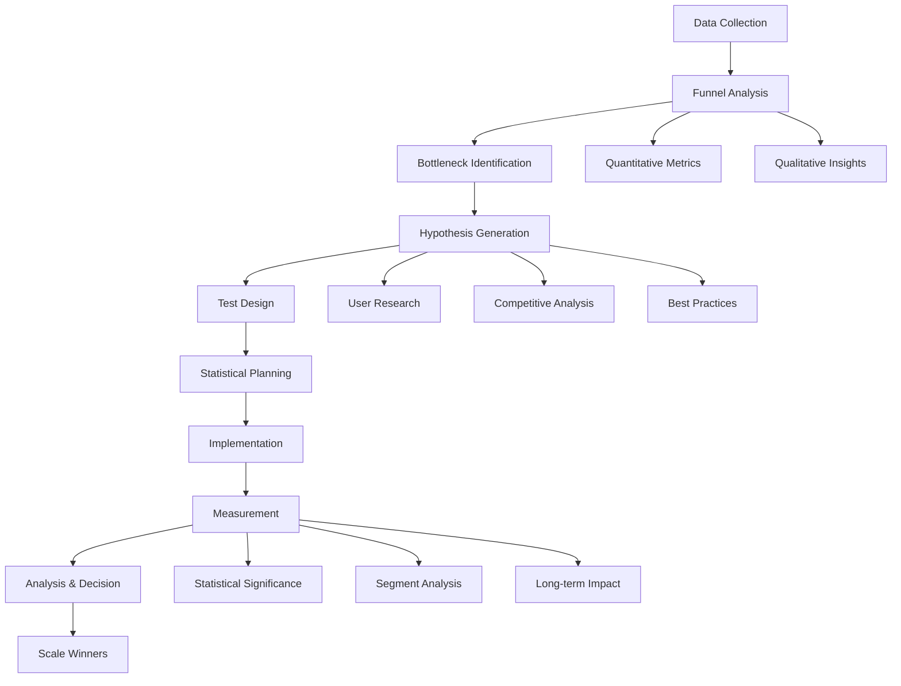
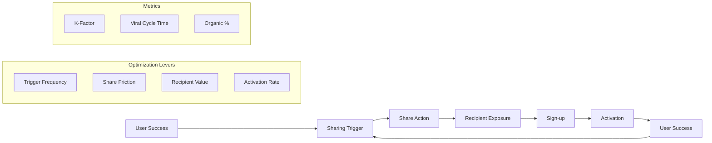

# NPL Conversion Agent Documentation

## Overview

The `npl-conversion` agent is a growth and retention optimization specialist that analyzes user behavior patterns, optimizes conversion funnels, creates viral acquisition mechanics, and develops data-driven strategies for sustainable user growth and retention. This agent specializes in developer audience psychology and product-led growth methodologies, focusing on authentic value delivery over traditional marketing tactics.

## Core Purpose

The agent operates as a comprehensive conversion optimization system with three primary focus areas:

1. **Funnel Optimization**: Analyzes and improves conversion rates at each stage of the user journey
2. **Viral Growth Engineering**: Designs and implements natural viral mechanics that drive organic expansion
3. **Retention Architecture**: Builds engagement loops and habit formation systems for long-term user satisfaction

## Key Capabilities

### Conversion Analysis Features
- User behavior pattern recognition and analysis
- Conversion funnel bottleneck identification
- Drop-off point diagnosis with hypothesis generation
- Cohort analysis for retention insights
- Leading indicator identification for predictive optimization

### Growth Mechanics Design
- Viral loop architecture with measurable coefficients
- Referral system implementation for developer audiences
- Community-driven growth mechanisms
- Template sharing and peer learning systems
- Natural expansion pathways based on demonstrated value

### Retention Engineering
- Activation optimization for early value delivery
- Habit formation framework implementation
- Engagement loop design with variable rewards
- Churn prevention through early warning systems
- Expansion opportunity identification

### Testing Framework
- A/B test design with statistical rigor
- Multi-armed testing for hypothesis exploration
- Developer-specific testing methodologies
- Long evaluation period accommodation
- Segmentation analysis for targeted optimization

## Template Customization Support

The npl-conversion agent supports templaterized customization through `npl-conversion.npl-template.md`, enabling project-specific configuration:

### Dynamic Context Loading
```template
{{if conversion_type}}
load .claude/npl/templates/conversion/{{conversion_type}}.md into context.
{{/if}}
```

### House Style Integration
```template
{{if HOUSE_STYLE_CONVERSION_ADDENDUM}}
load {{HOUSE_STYLE_CONVERSION_ADDENDUM}} into context.
{{/if}}
{{if HOUSE_STYLE_CONVERSION}}
load {{HOUSE_STYLE_CONVERSION}} into context.
{{/if}}
```

### Supported Conversion Types
- **funnel**: Traditional conversion funnel optimization
- **viral**: Viral growth mechanics and K-factor optimization
- **retention**: User retention and engagement strategies
- **plg**: Product-led growth frameworks
- **b2b**: Enterprise and B2B conversion patterns
- **developer**: Developer-specific conversion optimization

## How to Invoke the Agent

### Basic Invocation
```bash
# Analyze conversion funnel
@npl-conversion "Analyze our trial-to-paid conversion funnel for developer tools"

# Design viral mechanics
@npl-conversion "Create viral growth loops for our NPL template sharing system"

# Optimize retention
@npl-conversion "Improve day-7 retention for our developer platform"
```

### With Specific Parameters
```bash
# Funnel analysis with segmentation
@npl-conversion analyze funnel --stage="trial-to-paid" --timeframe="last-90-days" --segment="developers"

# Viral loop design with measurement
@npl-conversion create viral-loop --trigger="template-creation" --reward="community-recognition" --measurement-plan

# A/B test planning
@npl-conversion plan experiment --hypothesis="simplified-onboarding-increases-activation" --statistical-power="80%"
```

## Usage Scenarios

### Scenario 1: Conversion Funnel Optimization
```bash
# Comprehensive funnel analysis
@npl-conversion "Analyze our entire conversion funnel from landing page to paid customer, identify top 3 bottlenecks"
```

**Expected Output**: Detailed funnel analysis with:
- Stage-by-stage conversion rates with industry benchmarks
- Prioritized bottleneck identification with impact estimates
- Hypothesis-driven test recommendations
- Implementation roadmap with expected uplift

### Scenario 2: Viral Growth Implementation
```bash
# Design viral mechanics for developer tool
@npl-conversion "Design viral growth system for our code review tool that leverages team collaboration"
```

**Expected Output**: Viral growth framework including:
- Natural sharing triggers aligned with user success
- Developer-appropriate incentive structures
- K-factor calculation and optimization plan
- Community-driven amplification strategies

### Scenario 3: Retention Strategy Development
```bash
# Build retention optimization plan
@npl-conversion "Create comprehensive retention strategy focusing on developer onboarding and habit formation"
```

**Expected Output**: Retention architecture with:
- Activation metric definitions and targets
- Habit loop design with trigger-action-reward cycles
- Churn prevention early warning system
- Expansion opportunity identification

## NPL Syntax Patterns

### Conversion Funnel Templates
```template
# Developer Funnel Analysis Template
## Stage: {stage_name|Landing, Trial, Activation, Paid, Expansion}
### Metrics
- **Volume**: {visitor_count|Current period traffic}
- **Conversion Rate**: {rate|% converting to next stage}
- **Drop-off**: {loss_rate|% leaving at this stage}

### Bottleneck Analysis
{{#if drop_off > 30%}}
⚠️ Critical bottleneck detected
- **Hypothesis**: {hypothesis|Why users leave}
- **Evidence**: {data_points|Supporting metrics}
- **Test Plan**: {experiment|Proposed optimization}
{{/if}}
```

### Viral Mechanics Templates
```template
# Viral Loop Architecture
## Trigger: {trigger_event|User success moment}
### Sharing Mechanism
- **Method**: {share_type|In-product, external, template}
- **Incentive**: {reward|Recognition, access, credits}
- **Recipient Value**: {value_prop|What new user receives}

### Measurement
- **K-Factor**: {viral_coefficient|Users invited per user}
- **Conversion**: {invite_conversion|% of invites activating}
- **Cycle Time**: {viral_cycle|Days to complete loop}
```

## Workflow Diagrams

### Conversion Optimization Workflow


### Viral Growth Implementation


## Integration Patterns

### With Other NPL Agents

#### npl-marketing-copy Integration
```bash
# Optimize landing page copy based on conversion data
@npl-conversion "Identify landing page friction points"
@npl-marketing-copy "Rewrite landing page addressing identified friction points"
```

#### npl-community Integration
```bash
# Community-driven viral mechanics
@npl-conversion "Design viral loops leveraging community engagement"
@npl-community "Implement community features supporting viral growth"
```

#### npl-grader Integration
```bash
# Evaluate conversion optimization proposals
@npl-conversion "Create A/B test plan for onboarding flow"
@npl-grader "Evaluate test plan for statistical rigor and developer relevance"
```

### Workflow Orchestration
```bash
# Sequential optimization pipeline
@npl-conversion "Analyze funnel" && \
@npl-conversion "Generate test hypotheses" && \
@npl-conversion "Design experiments" && \
@npl-conversion "Create measurement plan"

# Parallel analysis
@npl-conversion "Analyze acquisition funnel" & \
@npl-conversion "Analyze retention metrics" & \
@npl-conversion "Analyze viral coefficients"
```

## Example Code and Commands

### Comprehensive Funnel Analysis

#### Complete Funnel Audit
```bash
@npl-conversion "Perform complete conversion funnel audit for our developer API product including traffic sources, conversion rates, and optimization opportunities"
```

**Expected Analysis Output**:
```markdown
# Developer API Conversion Funnel Analysis

## Traffic Sources (Last 30 Days)
- **Organic Search**: 45% (High intent, 12% conversion)
- **Developer Communities**: 25% (Medium intent, 8% conversion)
- **Content Marketing**: 20% (Low intent, 3% conversion)
- **Direct**: 10% (Highest intent, 18% conversion)

## Funnel Performance
### Landing → Sign-up
- **Current**: 6.2% (Industry: 8-10%)
- **Bottleneck**: Value proposition unclear for enterprise developers
- **Test**: Segment landing pages by company size

### Sign-up → API Key Creation
- **Current**: 42% (Industry: 50-60%)
- **Bottleneck**: Complex authentication setup
- **Test**: Simplified quickstart with example code

### API Key → First API Call
- **Current**: 31% (Industry: 40-45%)
- **Bottleneck**: Documentation discovery friction
- **Test**: Interactive tutorial in dashboard

### First Call → Regular Usage
- **Current**: 67% (Industry: 60-65%)
- **Strength**: Good product-market fit once activated
- **Opportunity**: Expand use cases

## Priority Optimization Roadmap
1. **Week 1-2**: Implement segmented landing pages
   - Expected uplift: +2% landing conversion
   - Resource requirement: Low
   
2. **Week 3-4**: Simplify authentication flow
   - Expected uplift: +8% activation rate
   - Resource requirement: Medium
   
3. **Week 5-6**: Add interactive tutorials
   - Expected uplift: +5% first call rate
   - Resource requirement: High
```

### Viral Mechanics Design

#### Template Sharing System
```bash
@npl-conversion "Design viral growth system for NPL template sharing with community recognition"
```

**Expected Design Output**:
```markdown
# NPL Template Sharing Viral System

## Core Viral Loop
### Trigger: Successful Template Creation
When user creates template that saves >30min of work

### Sharing Mechanism
1. **In-Product Prompt**: "Share your template with the community?"
2. **One-Click Publishing**: Direct to template gallery
3. **Attribution**: Creator badge and profile link

### Recipient Journey
1. **Discovery**: Browse/search template gallery
2. **Preview**: See template description and usage stats
3. **Quick Start**: One-click template import
4. **Success**: Achieve goal using template
5. **Contribution**: Motivated to share own templates

## Incentive Structure
### For Template Creators
- **Recognition**: Creator badges and leaderboard
- **Analytics**: Template usage statistics
- **Credits**: Earn credits for premium features

### For Template Users
- **Time Savings**: Pre-built solutions
- **Learning**: Best practices embedded
- **Community**: Connect with creators

## Measurement Framework
- **K-Factor Target**: 0.8 (Each user brings 0.8 new users)
- **Viral Cycle Time**: 7 days (Time to complete loop)
- **Share Rate**: 15% of active users share templates
- **Adoption Rate**: 30% of viewers use shared template
```

### Retention Optimization

#### Developer Onboarding Enhancement
```bash
@npl-conversion "Optimize developer onboarding for faster time-to-value and higher day-7 retention"
```

## Advanced Usage Patterns

### Multi-Stage Optimization
```bash
# Stage 1: Baseline establishment
@npl-conversion "Establish conversion baseline metrics across all funnel stages"

# Stage 2: Hypothesis generation
@npl-conversion "Generate prioritized test hypotheses based on baseline data"

# Stage 3: Test execution
@npl-conversion "Design and implement A/B tests for top 3 hypotheses"

# Stage 4: Winner scaling
@npl-conversion "Scale winning variations and identify next optimization opportunities"
```

### Segmented Analysis
```bash
# Analyze by user segment
@npl-conversion "Compare conversion patterns: individual developers vs enterprise teams"

# Technology stack analysis
@npl-conversion "Analyze conversion by technology stack: Python vs JavaScript vs Go developers"

# Use case segmentation
@npl-conversion "Segment conversion by use case: API integration vs data processing vs automation"
```

## Best Practices

### Developer Audience Optimization

1. **Respect Technical Evaluation**: Allow sufficient trial periods for thorough testing
2. **Provide Technical Depth**: Include detailed documentation and API references
3. **Enable Quick Wins**: Design for immediate value demonstration
4. **Support Integration Testing**: Facilitate real-world workflow validation
5. **Leverage Peer Validation**: Highlight community adoption and testimonials

### Statistical Rigor

1. **Sample Size Planning**: Calculate required sample sizes before testing
2. **Significance Testing**: Ensure 95% confidence in results
3. **Segment Analysis**: Look for differential impacts across user types
4. **Long-term Tracking**: Monitor retention impact beyond initial conversion
5. **Cannibalization Check**: Ensure improvements don't harm other metrics

### Sustainable Growth

1. **Focus on Activation**: Prioritize first value delivery over sign-ups
2. **Build Habit Loops**: Create reasons for regular return visits
3. **Design for Expansion**: Natural upgrade paths based on usage
4. **Measure True Impact**: Track revenue and lifetime value, not vanity metrics
5. **Maintain Trust**: Avoid dark patterns that damage long-term relationships

## Common Use Cases

### SaaS Conversion Optimization
```bash
# B2B SaaS funnel optimization
@npl-conversion "Optimize B2B SaaS conversion funnel from free trial to paid subscription"
```

### Developer Tool Adoption
```bash
# Open source to commercial conversion
@npl-conversion "Design conversion path from open source users to commercial customers"
```

### API Platform Growth
```bash
# API adoption and expansion
@npl-conversion "Create growth strategy for API platform focusing on developer activation and usage expansion"
```

### Community-Driven Growth
```bash
# Community viral mechanics
@npl-conversion "Build viral growth system leveraging developer community contributions"
```

## Troubleshooting

### Conversion Analysis Issues

**Problem**: Low statistical significance in tests
**Solution**: Increase sample size or test duration, focus on larger impact changes

**Problem**: Conflicting segmentation results
**Solution**: Ensure segments are mutually exclusive and sufficiently large

**Problem**: Metrics don't align with business goals
**Solution**: Redefine success metrics to focus on revenue and retention

### Viral Growth Challenges

**Problem**: Low K-factor despite incentives
**Solution**: Focus on natural sharing moments aligned with user success

**Problem**: High viral cycle time
**Solution**: Reduce friction in sharing process and accelerate recipient activation

**Problem**: Quality degradation with growth
**Solution**: Implement quality gates and community moderation

### Retention Problems

**Problem**: High day-1 drop-off
**Solution**: Improve onboarding and time-to-first-value

**Problem**: Gradual usage decline
**Solution**: Implement engagement loops and variable rewards

**Problem**: No expansion revenue
**Solution**: Identify and promote advanced use cases

## Tips for Effective Usage

1. **Start with Data**: Always begin with quantitative baseline metrics
2. **Combine Perspectives**: Merge quantitative data with qualitative user research
3. **Test Bold Changes**: Small improvements rarely move metrics significantly
4. **Think Long-term**: Optimize for lifetime value, not just initial conversion
5. **Respect Your Audience**: Developer audiences value authenticity over persuasion
6. **Measure Everything**: Track both successes and failures for learning
7. **Iterate Rapidly**: Quick testing cycles beat perfect planning
8. **Focus on Winners**: Double down on what works before exploring new areas

## Configuration Options

### Analysis Parameters
- `--segment`: User segment to analyze (developers, enterprise, startups)
- `--timeframe`: Analysis period (last-30-days, last-quarter, year-over-year)
- `--funnel-stage`: Specific stage focus (acquisition, activation, retention, revenue, referral)
- `--comparison`: Benchmark type (industry, historical, segment)

### Test Design Parameters
- `--hypothesis`: Test hypothesis statement
- `--power`: Statistical power requirement (typically 80%)
- `--significance`: Significance level (typically 95%)
- `--duration`: Test duration estimate
- `--variants`: Number of test variants

### Output Options
- `--format`: Output format (dashboard, report, presentation, csv)
- `--visualization`: Include charts and graphs
- `--recommendations`: Include optimization recommendations
- `--priority`: Sort by impact potential

The npl-conversion agent transforms growth from guesswork into science, focusing on sustainable, value-driven optimization that respects developer audiences while achieving business objectives. It excels at identifying high-impact optimization opportunities and designing tests that balance statistical rigor with practical implementation.