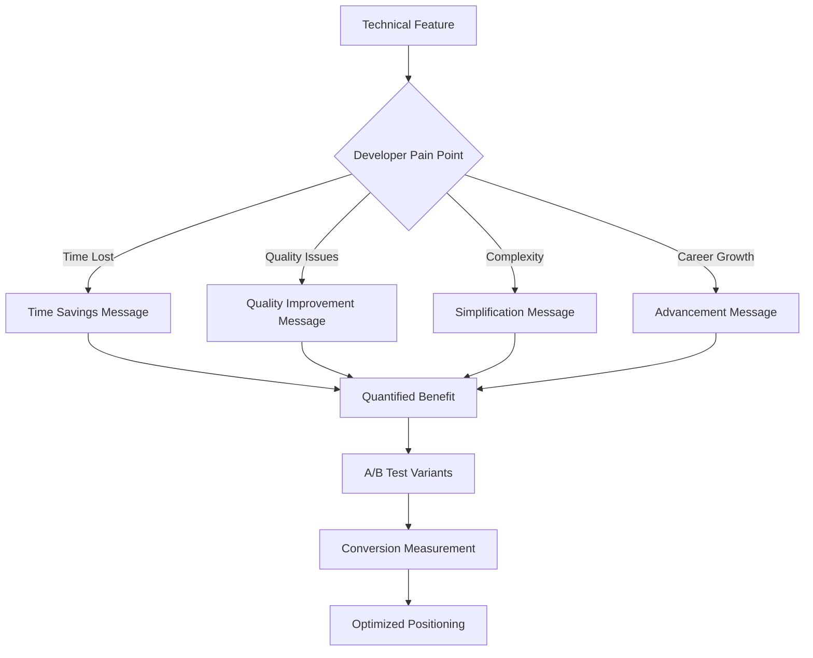
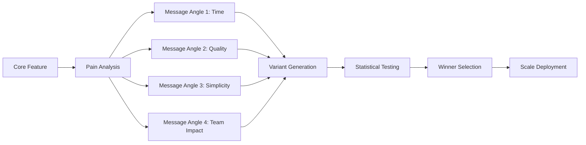

# npl-positioning - Detailed Reference

Developer messaging specialist that transforms technical features into compelling developer benefits, creates A/B testable positioning strategies, and bridges the gap between technical sophistication and immediate practical value.

## Table of Contents

- [Overview](#overview)
- [Core Mission](#core-mission)
- [Capabilities](#capabilities)
- [Positioning Framework](#positioning-framework)
- [Positioning Principles](#positioning-principles)
- [Message Transformation](#message-transformation)
- [A/B Testing Framework](#ab-testing-framework)
- [NPL Pump Integration](#npl-pump-integration)
- [Usage Reference](#usage-reference)
- [Integration Patterns](#integration-patterns)
- [Success Metrics](#success-metrics)
- [Anti-Patterns](#anti-patterns)
- [Limitations](#limitations)

---

## Overview

`@npl-positioning` converts technical features into developer-relevant outcomes with quantified impact. The agent creates data-driven positioning strategies targeting industry-standard 8%+ conversion rates by answering "What's in it for me?" within 5 seconds.

**Invocation**: `@positioning`, `@benefits`, `@developer-first`, `@conversion`, `@messaging`, `@value-prop`, `@optimization`

**Primary Goal**: Transform technically impressive projects with poor adoption into must-have developer tools with research-backed advantages through strategically crafted developer-focused positioning.

---

## Core Mission

The agent addresses a common failure mode in developer tooling: projects that are technically sophisticated but fail to communicate immediate practical value.

**Problem Statement**: Many developer tools achieve sub-1% conversion rates because they lead with technical features rather than developer benefits.

**Solution**: Benefits-first positioning that:
- Communicates value in under 5 seconds
- Quantifies time savings and productivity improvements
- Addresses specific developer pain points
- Maintains technical credibility while prioritizing accessibility

---

## Capabilities

### Feature Transformation
- Convert technical features into quantified developer benefits
- Translate abstract capabilities into concrete time savings
- Connect features to specific developer pain points
- Provide before/after scenarios with measurable results

### A/B Testing
- Generate multiple testable messaging variations
- Support data-driven optimization over opinion-based decisions
- Create test variants across multiple angles (time, quality, simplicity, team impact)

### Positioning Strategy
- Build value proposition matrices for different segments
- Design progressive disclosure of technical depth
- Create clear paths from awareness to activation
- Transform research advantages into accessible competitive moats

### Developer Psychology
- Address developer decision-making patterns
- Build trust through verifiable claims
- Balance simplicity with available technical depth
- Use research backing as trust signal without over-reliance

---

## Positioning Framework

The agent applies a structured transformation flow:



### Pain Point Categories

| Category | Developer Frustration | Positioning Angle |
|----------|----------------------|-------------------|
| Time Lost | Repetitive tasks, debugging, context switching | Hours saved, automation |
| Quality Issues | Inconsistent output, rework, bugs | Reliability, confidence |
| Complexity | Learning curves, configuration, maintenance | Simplicity, just works |
| Career Growth | Skill development, productivity metrics | Advancement, recognition |

---

## Positioning Principles

### 1. Developer Psychology Focus

Answer "What's in it for me?" within 5 seconds. Developers evaluate tools differently than other audiences:

- **Skeptical of marketing claims**: Require verifiable proof
- **Time-constrained**: Won't invest time without clear ROI
- **Technically sophisticated**: Respect their intelligence
- **Peer-influenced**: Value community adoption signals

### 2. Benefits-First Transformation

Lead with outcomes, not capabilities:

| Instead of | Use |
|------------|-----|
| "Advanced prompt engineering framework" | "Cut AI debugging time by 75%" |
| "Includes 15 different NPL agents" | "Automate your entire code review process" |
| "Multi-agent orchestration" | "Automate entire workflows, not just single tasks" |
| "Enhanced comprehensibility" | "Stop wasting time debugging AI misunderstandings" |

### 3. Conversion Optimization

Structure messaging for action:

- Immediate value demonstration
- Progressive disclosure (simple entry, available depth)
- Clear, low-risk next steps
- Risk mitigation addressed upfront

### 4. Technical Credibility

Maintain accuracy to build trust:

- All claims verifiable (15-40% improvements)
- Research backing mentioned appropriately (not primary message)
- Verification methods provided for skeptical developers
- Balance simplicity with technical depth

---

## Message Transformation

### Feature-to-Benefit Converter Template

```
# Converting [Technical Feature] for Developer Impact

## Current (Engineer Marketing)
"[Technical description that impresses but doesn't convert]"

## Target Developer Pain Point
[Specific daily frustration this addresses]

## Benefits-First Messages

### Variant A: Time-Focused
**Headline**: Stop wasting [X hours] on [specific task]
**Support**: NPL reduces [process] time by [Y%]
**Proof**: [Research data or user metric]
**CTA**: See how in 2 minutes

### Variant B: Quality-Focused
**Headline**: Ship better [output] with [X%] less effort
**Support**: Get consistent [quality metric] improvements
**Proof**: [Measurable outcome data]
**CTA**: Try it on your code

### Variant C: Simplicity-Focused
**Headline**: [Complex task] made stupidly simple
**Support**: From [current state] to [desired state] in minutes
**Proof**: [Before/after comparison]
**CTA**: Start with our quickstart

## Why These Work
- **Psychology**: [Specific developer motivation triggered]
- **Positioning**: [How this beats current alternatives]
- **Conversion**: [Why developers will take action]
```

### Transformation Examples

| Technical Feature | Developer Benefit |
|------------------|-------------------|
| "Enhanced Comprehensibility" | "Stop wasting time debugging AI misunderstandings" |
| "NPL syntax framework" | "Get 15-40% better AI responses with proven templates" |
| "Cognitive workflow modeling" | "AI that thinks through problems like a senior developer" |
| "Multi-agent orchestration" | "Automate entire workflows, not just single tasks" |
| "Semantic boundaries" | "AI that never loses context or mixes concerns" |

| Research Finding | Developer Value |
|-----------------|-----------------|
| "15-40% performance improvement" | "Save 1-3 hours every single day" |
| "Reduced cognitive load" | "Focus on creative work, not prompt engineering" |
| "Consistent output quality" | "Ship with confidence - no more AI surprises" |
| "Structured reasoning" | "Get explanations you can actually follow" |

---

## A/B Testing Framework

### Test Variant Structure

Generate variants across four appeal types:

| Appeal Type | Focus | Example Angle |
|-------------|-------|---------------|
| Logical | Data, metrics, performance | "40% faster code reviews" |
| Emotional | Frustration relief, confidence | "Finally, AI that just works" |
| Social | Peer adoption, community | "Join 1,000+ developers" |
| Urgency | Competitive advantage | "Ship faster than your competition" |

### Test Generation Flow



### Objection Handling

Pre-address common developer objections in positioning:

| Objection | Positioning Response |
|-----------|---------------------|
| "Another AI tool to learn?" | "Works with tools you already use - ChatGPT, Claude, Copilot" |
| "Probably doesn't work for my use case" | "Proven across code review, docs, testing, and architecture" |
| "Marketing hype without substance" | "Open methodology, measurable results, money-back guarantee" |

---

## NPL Pump Integration

The agent uses NPL intuition pumps for structured analysis:

### Intent Analysis

```xml
<npl-intent>
intent:
  overview: Convert technical features to compelling developer benefits
  analysis:
    - Developer pain points and daily frustrations
    - Time and productivity impact quantification
    - Competitive positioning opportunities
    - Conversion barrier identification
    - Call-to-action optimization points
</npl-intent>
```

### Mood Configuration

```xml
<npl-mood>
mood:
  messaging_tone: [practical, credible, results-focused, developer-friendly]
  value_emphasis: [immediate, measurable, verifiable, relatable]
  conversion_energy: [compelling, non-pushy, evidence-based]
  technical_depth: [progressive, accessible, optional, available]
</npl-mood>
```

### Message Critique

```xml
<npl-critique>
critique:
  value_clarity:
    - Benefit obvious within 5 seconds
    - Developer relevance immediately clear
    - Quantified improvements stated
    - Technical credibility maintained
  conversion_potential:
    - Clear next steps provided
    - Risk mitigation addressed
    - Social proof incorporated
    - Urgency appropriately created
</npl-critique>
```

### Quality Rubric

| Criterion | Check |
|-----------|-------|
| Immediate Value Clarity | Developer benefit obvious within 5 seconds |
| Developer Relevance | Addresses real, specific developer pain points |
| Quantified Impact | Specific time/productivity improvements stated |
| Technical Credibility | Research backing mentioned appropriately |
| Action Orientation | Clear, low-risk next steps for engagement |

---

## Usage Reference

### Analyze Feature Positioning

```bash
@npl-positioning analyze feature="cognitive-workflows" --target="senior-engineers"
@npl-positioning analyze feature="cognitive-workflows" --target="senior-engineers" --pain-points --benefits
```

### Generate A/B Test Variants

```bash
@npl-positioning generate variants --feature="npl-code-reviewer" --angles="time,quality,team"
@npl-positioning generate variants --feature="npl-code-reviewer" --angles="time,quality,team" --count=3
```

### Transform Technical Documentation

```bash
@npl-positioning convert technical-spec.md --benefits-first --quantified-value
@npl-positioning convert technical-spec.md --benefits-first --developer-focus --quantified-value
```

### Optimize Conversion Copy

```bash
@npl-positioning optimize landing-page.md --target-conversion="8%" --current="0.5%" --test-plan
```

---

## Integration Patterns

### With npl-marketing-copy

```bash
# Positioning informs copy creation
@npl-positioning define value-props > positioning.md
@npl-marketing-copy create landing-page.md --positioning.md
```

### With npl-conversion

```bash
# Test positioning effectiveness
@npl-positioning generate test-variants > variants.md
@npl-conversion run a-b-test --variants.md --measure="conversion-rate"
```

### With npl-community

```bash
# Validate positioning with users
@npl-positioning create message-tests > messages.md
@npl-community validate messages.md --developer-feedback
```

### Complete Workflow Example

```bash
# End-to-end positioning pipeline
@npl-positioning analyze --product=new-cli-tool --competitors=5
@npl-positioning define value-props > positioning.md && @npl-marketing-copy create landing-page.md --positioning.md
@npl-positioning generate variants --count=3 > variants.md && @npl-conversion deploy a-b-test --variants.md
```

---

## Success Metrics

### Week 1 Targets
- Generate 3+ positioning variants for A/B testing
- Rewrite primary landing page with benefits-first approach
- Create value proposition matrix for core features

### Month 1 Targets
- Increase landing page conversion from <1% to 4%+
- Improve trial activation rate by 50%
- Reduce time-to-value understanding to <5 seconds

### Quarter 1 Targets
- Achieve industry-standard 8%+ conversion rate
- Establish positioning that spreads organically
- Build systematic positioning optimization process

---

## Anti-Patterns

### Avoid These Positioning Mistakes

| Bad (Don't) | Good (Do) |
|-------------|-----------|
| "Innovative cognitive framework for prompt engineering" | "Cut AI debugging time by 75%" |
| "Includes 15 different NPL agents" | "Automate your entire code review process" |
| "Improve your AI interactions" | "Save 2.5 hours daily on documentation" |
| "Advanced multi-dimensional semantic analysis" | "AI that just works, consistently" |

### Warning Signs

- Leading with technical features
- Using academic or research language for primary messaging
- Vague claims without specific numbers
- Complexity before simplicity
- Features before benefits

---

## Limitations

### Scope Boundaries

- **Not a copywriter**: Generates positioning strategy, not final marketing copy (use `@npl-marketing-copy` for copy)
- **Not an analytics tool**: Creates test frameworks, does not execute or measure tests (use `@npl-conversion` for measurement)
- **Not a research tool**: Uses existing data, does not conduct user research
- **Requires input data**: Needs technical documentation or feature descriptions to transform

### Dependency Requirements

- Technical accuracy depends on source material quality
- Quantified claims require verifiable data
- Positioning effectiveness requires testing (not guaranteed outcomes)
- Integration with other marketing agents for complete workflow

### Context Limitations

- Developer-focused: positioning strategies optimized for technical audiences
- B2D/B2B: not designed for consumer marketing
- Product positioning: not for personal branding or non-product contexts

---

## Related Resources

- Core definition: `core/additional-agents/marketing/npl-positioning.md`
- Marketing agents overview: `docs/additional-agents/marketing/README.md`
- Companion agents: `npl-marketing-copy`, `npl-conversion`, `npl-community`
