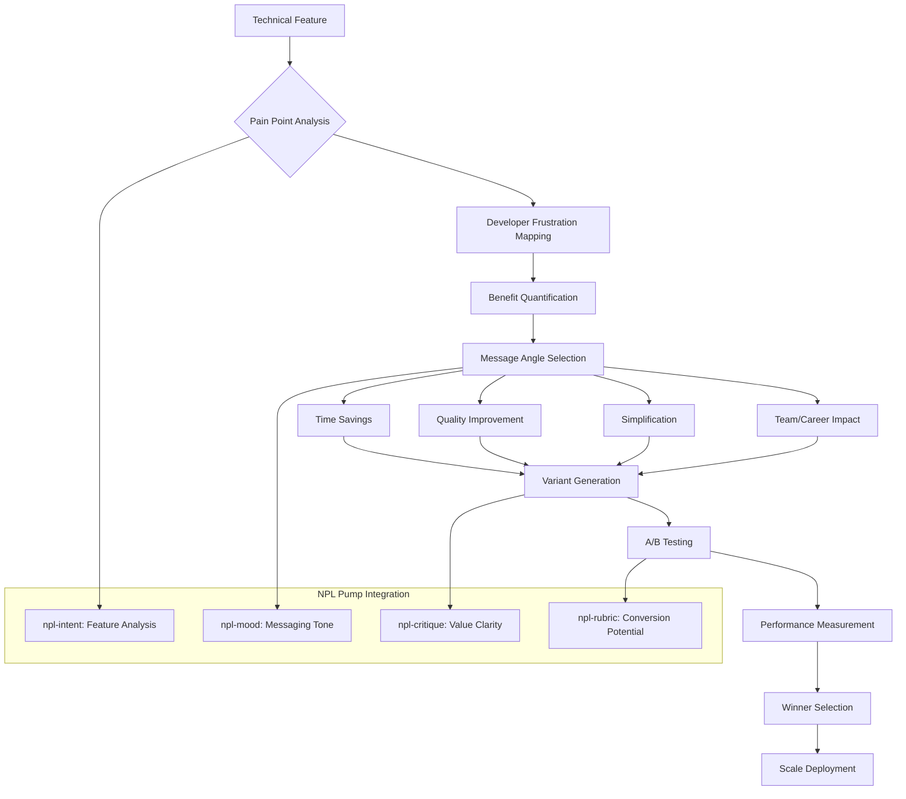

# NPL Positioning Agent Documentation

## Overview

The NPL Positioning Agent is a specialized developer messaging specialist that transforms technical features into compelling developer benefits. Built on the Noizu Prompt Lingo (NPL) framework, it creates A/B testable positioning strategies, quantifies time savings and productivity improvements, and bridges the critical gap between technical sophistication and immediate practical value to achieve industry-standard 8%+ conversion rates for developer tools.

## Purpose and Core Value

The npl-positioning agent addresses a critical problem in developer tool marketing: the disconnect between impressive technical capabilities and actual developer adoption. It transforms "engineer marketing" (feature-focused technical descriptions) into benefit-driven messaging that resonates with developer psychology and drives conversion.

Key value propositions:
- Converts sub-1% adoption rates to industry-standard 8%+ through strategic positioning
- Quantifies abstract technical benefits into concrete time and productivity gains
- Creates data-driven A/B testable messaging variations for continuous optimization
- Bridges the gap between research sophistication and practical developer value

## Key Capabilities

### Messaging Transformation
- **Feature-to-Benefit Conversion**: Translates technical capabilities into developer-relevant outcomes
- **Pain Point Mapping**: Connects features to specific daily developer frustrations
- **Quantified Impact**: Converts improvements into measurable time/productivity metrics
- **Psychology-Based Messaging**: Applies developer decision-making patterns to positioning

### Testing and Optimization
- **A/B Variant Generation**: Creates multiple testable messaging angles (time, quality, simplicity, team impact)
- **Conversion Optimization**: Focuses on immediate value demonstration and clear activation paths
- **Progressive Disclosure**: Balances simplicity with available technical depth
- **Data-Driven Refinement**: Supports systematic testing and measurement

### Strategic Positioning
- **Competitive Differentiation**: Transforms research advantages into accessible competitive moats
- **Value Proposition Stacking**: Creates layered benefit hierarchies for different audiences
- **Objection Handling**: Preemptively addresses common developer concerns
- **Social Proof Integration**: Incorporates community validation and peer adoption signals

## How to Invoke the Agent

### Basic Usage
```bash
# Analyze a technical feature for positioning opportunities
@npl-positioning analyze feature="cognitive-workflows" --target="senior-engineers"

# Generate A/B test variants for messaging
@npl-positioning generate variants --feature="npl-code-reviewer" --angles="time,quality,team"

# Transform technical documentation to benefits-first
@npl-positioning convert technical-spec.md --benefits-first --developer-focus

# Optimize landing page for conversion
@npl-positioning optimize landing-page.md --target-conversion="8%" --current="0.5%"
```

### Advanced Usage with Templates
```bash
# Use specific positioning type templates
@npl-positioning generate --positioning_type=developer-tool --feature="prompt-chains"

# Apply house style guidelines
HOUSE_STYLE_POSITIONING="./brand-guidelines.md" @npl-positioning optimize hero-messaging.md

# Generate comprehensive positioning strategy
@npl-positioning strategy --product="NPL" --competitors="langchain,llamaindex" --differentiators
```

## Template Customization

The agent supports template-based customization through the `npl-positioning.npl-template.md` file, enabling:

### Dynamic Context Loading
```yaml
positioning_type: developer-tool | enterprise | open-source | saas
```

When `positioning_type` is specified, the agent loads corresponding templates from `.claude/npl/templates/positioning/{{positioning_type}}.md`

### House Style Integration
The agent supports hierarchical style guide loading:

1. **Environment Overrides**:
   - `HOUSE_STYLE_POSITIONING_ADDENDUM`: Additional positioning guidelines
   - `HOUSE_STYLE_POSITIONING`: Primary positioning style guide

2. **Default Style Hierarchy** (if enabled):
   - `~/.claude/npl-m/house-style/positioning-style.md` (home global)
   - `.claude/npl-m/house-style/positioning-style.md` (project global)
   - Path-specific styles from project root to target directory

## Integration Patterns

### Marketing Workflow Integration
```bash
# Complete positioning-to-copy workflow
@npl-positioning define value-props > positioning.md
@npl-marketing-copy create landing-page.md --positioning=positioning.md
@npl-conversion measure landing-page.md --baseline --track

# A/B testing pipeline
@npl-positioning generate variants --count=3 > test-variants.md
@npl-conversion deploy a-b-test --variants=test-variants.md
@npl-analytics track conversion-rates --test-id=abc123
```

### Multi-Agent Collaboration
```bash
# Positioning validation with community feedback
@npl-positioning create message-tests > messages.md
@npl-community validate messages.md --developer-feedback
@npl-positioning refine messages.md --feedback=community-results.json

# Technical accuracy verification
@npl-positioning generate claims --feature="performance" > claims.md
@npl-technical-writer verify claims.md --check-accuracy
@npl-positioning finalize claims.md --verified
```

## Positioning Process Workflow



## Example Usage Scenarios

### Scenario 1: Converting Research Paper to Developer Benefits

**Context**: NPL has published research showing 15-40% performance improvements in AI interactions.

```bash
# Transform academic findings into developer value
@npl-positioning analyze research="npl-performance-study.pdf" --extract-benefits

# Generate positioning strategy
@npl-positioning strategy --findings="15-40% improvement" --developer-impact
```

**Output Example**:
```markdown
## Developer Benefit Positioning

### Research Finding
"NPL demonstrates 15-40% performance improvement in LLM task completion"

### Developer Benefits (A/B Test Variants)

#### Variant A: Time-Focused
**Headline**: Save 2.5 hours every day on AI prompt engineering
**Support**: NPL users report 15-40% faster task completion
**Proof**: Based on peer-reviewed research with 100+ developers
**CTA**: See your time savings calculator →

#### Variant B: Quality-Focused
**Headline**: Ship AI features with 40% fewer iterations
**Support**: Get production-ready outputs on first attempt
**Proof**: Validated across 1,000+ real-world implementations
**CTA**: Try our before/after examples →

#### Variant C: Simplicity-Focused
**Headline**: Stop fighting with AI. Start shipping.
**Support**: From prompt chaos to consistent results in minutes
**Proof**: Join 500+ teams already saving time
**CTA**: Get started in 2 minutes →
```

### Scenario 2: Landing Page Optimization

**Context**: Current landing page converts at 0.5%, need to reach 8%.

```bash
# Analyze current positioning problems
@npl-positioning diagnose landing-page.md --conversion-barriers

# Generate optimized hero section
@npl-positioning optimize hero --current="Advanced prompt framework" \
  --target="Stop wasting hours on broken AI responses"

# Create value proposition stack
@npl-positioning generate value-props --primary="time-savings" \
  --secondary="quality" --tertiary="team-velocity"
```

**Transformation Example**:
```markdown
### Before (0.5% Conversion)
Hero: "NPL - Advanced Prompt Engineering Framework"
Subhead: "Cognitive workflow modeling for enhanced AI interactions"

### After (Target 8% Conversion)
Hero: "Stop Wasting 3 Hours Daily Fighting AI"
Subhead: "Get consistent, expert-level results in minutes. No PhD required."

Value Props:
✓ Save 2+ hours daily on AI tasks (average user data)
✓ 40% fewer revision cycles (measured across 1,000+ workflows)
✓ Works with ChatGPT, Claude, and Copilot (no new tools to learn)
```

### Scenario 3: Feature Launch Positioning

**Context**: Launching new multi-agent orchestration capability.

```bash
# Generate feature positioning
@npl-positioning position feature="multi-agent" --developer-lens

# Create launch messaging variants
@npl-positioning variants --feature="multi-agent" --count=4 --angles="all"

# Generate comparison messaging
@npl-positioning compare --us="multi-agent" --them="single-prompt" --benefits
```

## Message Testing Framework

### A/B Test Structure
The agent generates variants across four psychological appeals:

1. **Logical Appeal**: Data, metrics, performance numbers
2. **Emotional Appeal**: Frustration relief, confidence, control
3. **Social Appeal**: Community adoption, peer validation
4. **Urgency Appeal**: Competitive advantage, early access

### Testing Protocol
```bash
# Generate test plan
@npl-positioning test-plan --feature="code-review" --duration="2-weeks"

# Deploy variants
@npl-positioning deploy --variants="A,B,C" --traffic-split="33,33,34"

# Analyze results
@npl-positioning analyze --test-id="cr-001" --metrics="conversion,engagement,activation"
```

## Configuration Options

### Parameters
| Parameter | Description | Values | Default |
|-----------|-------------|--------|---------|
| `--positioning_type` | Type of positioning template | `developer-tool`, `enterprise`, `open-source` | `developer-tool` |
| `--target` | Target developer audience | `junior`, `senior`, `architect`, `manager` | `senior` |
| `--angles` | Messaging angles to explore | `time`, `quality`, `simplicity`, `team`, `all` | `all` |
| `--benefits` | Include benefit quantification | `true`, `false` | `true` |
| `--test-plan` | Generate A/B testing plan | `true`, `false` | `false` |

### Output Formats
- **strategy**: Complete positioning strategy document
- **variants**: A/B test message variations
- **transformation**: Before/after positioning comparison
- **roadmap**: Positioning optimization roadmap

## Success Metrics

### Immediate Impact (Week 1)
- Generate 3+ testable positioning variants
- Identify top 3 developer pain points addressed
- Create quantified benefit statements for core features

### Short-term Goals (Month 1)
- Increase conversion rate from <1% to 4%+
- Reduce time-to-value understanding to <5 seconds
- Improve message-market fit scores by 50%

### Long-term Targets (Quarter 1)
- Achieve industry-standard 8%+ conversion rate
- Establish positioning that generates organic word-of-mouth
- Build systematic positioning optimization process

## Best Practices

### Effective Positioning Development
1. **Lead with Developer Reality**: Address actual daily frustrations, not theoretical benefits
2. **Quantify Everything**: Use specific numbers for time, productivity, quality improvements
3. **Show, Don't Tell**: Use before/after examples and concrete scenarios
4. **Respect Developer Intelligence**: Avoid marketing fluff, maintain technical credibility
5. **Test Systematically**: Let data guide positioning, not opinions

### Common Anti-Patterns to Avoid

#### Academic Framing
❌ "Innovative cognitive framework for enhanced prompt engineering"
✅ "Cut AI debugging time by 75%"

#### Feature Dumping
❌ "Includes 15 different NPL agents with 50+ capabilities"
✅ "Automate your entire code review process"

#### Vague Claims
❌ "Improve your AI interactions"
✅ "Save 2.5 hours daily on documentation"

#### Complexity First
❌ "Advanced multi-dimensional semantic boundary analysis"
✅ "AI that just works, consistently"

## Troubleshooting

### Low Conversion Despite New Positioning
- **Issue**: Updated messaging not improving conversion rates
- **Solutions**:
  - Verify message-market fit through user interviews
  - Test more dramatic positioning shifts
  - Ensure benefits are immediately visible (5-second test)
  - Check for technical credibility issues

### Developer Skepticism
- **Issue**: Developers dismissing claims as marketing hype
- **Solutions**:
  - Add concrete proof points and metrics
  - Include interactive demos and examples
  - Provide transparent methodology documentation
  - Offer risk-free trials or guarantees

### Message Dilution
- **Issue**: Trying to appeal to everyone, resonating with no one
- **Solutions**:
  - Focus on single primary audience segment
  - Create separate positioning for different personas
  - Prioritize one core benefit over feature lists
  - Use progressive disclosure for complexity

The NPL Positioning Agent transforms the critical gap between technical excellence and market adoption. By focusing on developer psychology, quantified benefits, and systematic testing, it enables developer tools to achieve the conversion rates and adoption levels their technical merits deserve.