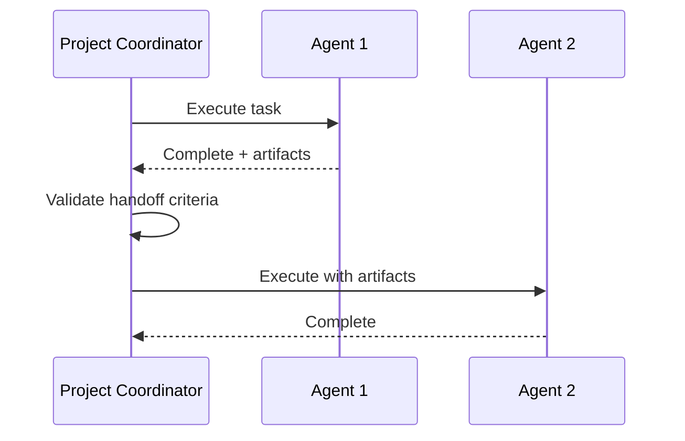
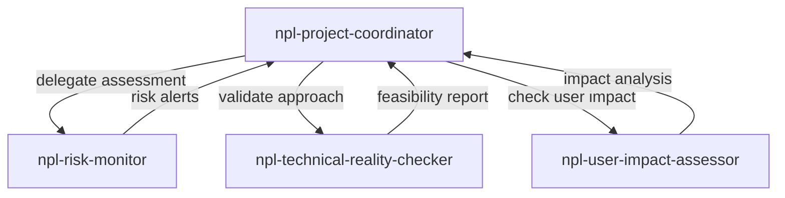
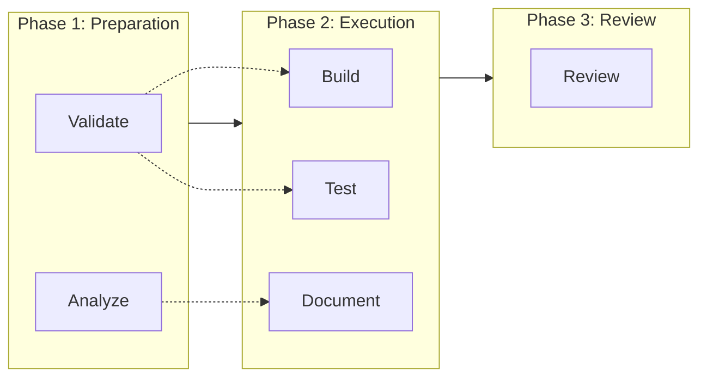

# npl-project-coordinator (Detailed Reference)

Cross-agent dependency management and orchestration specialist for multi-agent workflows.

## Overview

The `npl-project-coordinator` serves as the central orchestration hub for NPL agent ecosystems. It manages dependencies between agents, sequences operations, facilitates handoffs, and ensures efficient project execution across complex AI/ML workflows.

**Primary Functions:**
- Determine optimal execution order for multi-agent tasks
- Map and resolve inter-agent dependencies
- Coordinate simultaneous agent operations
- Track progress across multiple workstreams
- Generate consolidated status updates

## Capabilities

### Workflow Orchestration

Determines optimal execution order based on:
- Agent input/output dependencies
- Resource availability and constraints
- Priority weighting and deadlines
- Parallelization opportunities

```bash
@npl-project-coordinator "Plan execution sequence for 5-agent validation pipeline"
```

### Dependency Management

Maps dependencies between agents and resolves conflicts:

| Dependency Type | Description | Resolution Strategy |
|:----------------|:------------|:--------------------|
| Data | Output from agent A required by agent B | Sequential execution |
| Resource | Shared resource access conflicts | Queue or parallelize |
| Temporal | Time-based ordering requirements | Schedule coordination |
| Conditional | Execution depends on prior results | Branch logic |

### Agent Handoffs

Manages clean transitions between agent operations:



**Handoff validation includes:**
- Output format verification
- Required artifact presence
- Quality threshold checks
- State consistency validation

### Parallel Coordination

Coordinates simultaneous agent operations:

```bash
# Parallel execution with synchronization
@npl-project-coordinator "Execute parallel documentation workflow" && \
  @npl-technical-writer "Generate API docs" & \
  @npl-technical-writer "Generate user guide" & \
  wait
```

**Parallel execution strategies:**
- Fork-join: Split work, merge results
- Pipeline: Stream data between agents
- Map-reduce: Distribute, aggregate
- Scatter-gather: Broadcast, collect

### Progress Tracking

Tracks multi-agent workflow status:

```yaml
workflow_status:
  total_agents: 5
  completed: 3
  in_progress: 1
  pending: 1
  blockers: []
  estimated_completion: "2h 15m"
```

### Impediment Detection

Proactively identifies workflow blockers:

- Stalled agent operations
- Dependency deadlocks
- Resource contention
- Quality gate failures
- Timeout conditions

## Usage Examples

### Basic Orchestration

```bash
# Single workflow coordination
@npl-project-coordinator "Orchestrate feature development pipeline"

# Multi-phase project
@npl-project-coordinator "Plan and execute: validation -> prototyping -> testing -> review"
```

### Status Reporting

```bash
# Generate consolidated status
@npl-project-coordinator "Generate status report for API redesign project"

# Specific agent status
@npl-project-coordinator "Report on npl-tester and npl-validator progress"
```

### Handoff Management

```bash
# Explicit handoff
@npl-project-coordinator "Manage handoff from npl-prototyper to npl-code-reviewer with artifacts"

# Conditional handoff
@npl-project-coordinator "Hand off to npl-tester if validation passes, otherwise npl-validator"
```

### Conflict Resolution

```bash
# Resolve conflicting outputs
@npl-project-coordinator "Resolve conflicting documentation recommendations from parallel reviewers"

# Resource conflict
@npl-project-coordinator "Coordinate shared database access between npl-tester and npl-integrator"
```

## Integration Patterns

### Sequential Pipeline

```bash
@npl-project-coordinator "Orchestrate sequential pipeline" && \
  @npl-validator "Validate requirements" && \
  @npl-prototyper "Build prototype" && \
  @npl-tester "Execute tests" && \
  @npl-code-reviewer "Review implementation"
```

### Parallel with Aggregation

```bash
@npl-project-coordinator "Coordinate parallel analysis" && \
  @npl-risk-monitor "Assess risks" & \
  @npl-technical-reality-checker "Check feasibility" & \
  @npl-user-impact-assessor "Evaluate user impact" & \
  wait && \
  @npl-project-coordinator "Aggregate findings into report"
```

### Conditional Branching

```bash
# Risk-aware execution
@npl-project-coordinator "If high risk detected, route to npl-technical-reality-checker before proceeding"
```

### Integration with Project Management Agents

The coordinator works closely with sibling agents:

| Agent | Coordination Pattern |
|:------|:--------------------|
| `npl-risk-monitor` | Receives risk alerts, adjusts workflows |
| `npl-technical-reality-checker` | Validates feasibility before execution |
| `npl-user-impact-assessor` | Incorporates user feedback into planning |



## Coordination Strategies

### Sequential Strategy

Use when:
- Strict dependency ordering required
- Output from one agent feeds next
- Order of operations matters

```bash
@npl-project-coordinator strategy=sequential "Execute validation then testing pipeline"
```

### Parallel Strategy

Use when:
- Tasks are independent
- Resource constraints allow
- Time optimization needed

```bash
@npl-project-coordinator strategy=parallel "Run all quality checks simultaneously"
```

### Hybrid Strategy

Combines sequential phases with parallel sub-tasks:



### Adaptive Strategy

Adjusts execution based on runtime conditions:

- Re-prioritizes on blocker detection
- Scales parallelism based on resources
- Reroutes on agent failure

## Output Formats

### Workflow Plan

```yaml
workflow:
  name: "Feature Development Pipeline"
  phases:
    - name: "Validation"
      agents: [npl-validator]
      parallel: false
    - name: "Implementation"
      agents: [npl-prototyper, npl-tester]
      parallel: true
    - name: "Review"
      agents: [npl-code-reviewer]
      parallel: false
  dependencies:
    - from: npl-validator
      to: npl-prototyper
      artifact: "validated_requirements"
    - from: npl-prototyper
      to: npl-code-reviewer
      artifact: "implementation"
```

### Status Report

```yaml
status:
  workflow: "API Redesign"
  progress: 65%
  agents:
    npl-validator: completed
    npl-prototyper: in_progress
    npl-tester: pending
    npl-code-reviewer: pending
  blockers: []
  next_milestone: "Prototype complete"
  eta: "2024-01-15T14:00:00Z"
```

### Handoff Record

```yaml
handoff:
  from: npl-prototyper
  to: npl-code-reviewer
  timestamp: "2024-01-15T12:30:00Z"
  artifacts:
    - name: "prototype.py"
      validated: true
    - name: "design_notes.md"
      validated: true
  quality_gate: passed
  notes: "Implementation matches spec, ready for review"
```

## Best Practices

### Workflow Design

1. **Define clear boundaries** - Each agent should have well-defined inputs and outputs
2. **Minimize dependencies** - Reduce coupling between agents where possible
3. **Plan for failure** - Include fallback paths and retry logic
4. **Document handoff criteria** - Explicit quality gates between agents

### Execution Optimization

1. **Parallelize independent tasks** - Identify opportunities for concurrent execution
2. **Cache intermediate results** - Avoid redundant agent invocations
3. **Set realistic timeouts** - Prevent workflows from hanging indefinitely
4. **Monitor resource usage** - Balance parallelism with available resources

### Error Handling

1. **Graceful degradation** - Continue partial workflows when possible
2. **Clear error reporting** - Identify which agent failed and why
3. **Automatic retry** - Transient failures should retry with backoff
4. **Escalation paths** - Route persistent failures to human review

## Limitations

### Coordination Constraints

- Cannot force agent behavior changes
- Limited visibility into internal agent state
- Dependency resolution is advisory, not enforced
- No real-time agent communication

### Scalability Considerations

- Complex workflows may exceed context limits
- Large numbers of parallel agents may cause resource contention
- Long-running workflows may require checkpointing

### Known Edge Cases

- Circular dependencies require manual resolution
- Agent output format mismatches need explicit handling
- Time-sensitive workflows need external scheduling

## Success Metrics

| Metric | Target | Description |
|:-------|:-------|:------------|
| Workflow completion | >95% | Percentage of workflows completing successfully |
| Handoff success | >98% | Successful agent-to-agent transitions |
| Parallel efficiency | >80% | Utilization of parallelization opportunities |
| Blocker detection | <5 min | Time to detect and report workflow impediments |
| Status accuracy | >95% | Correctness of progress reporting |

## Related Documentation

- [Project Management README](./README.md) - Category overview
- [npl-risk-monitor](./npl-risk-monitor.md) - Risk assessment integration
- [npl-technical-reality-checker](./npl-technical-reality-checker.md) - Feasibility validation
- [npl-user-impact-assessor](./npl-user-impact-assessor.md) - User impact analysis
