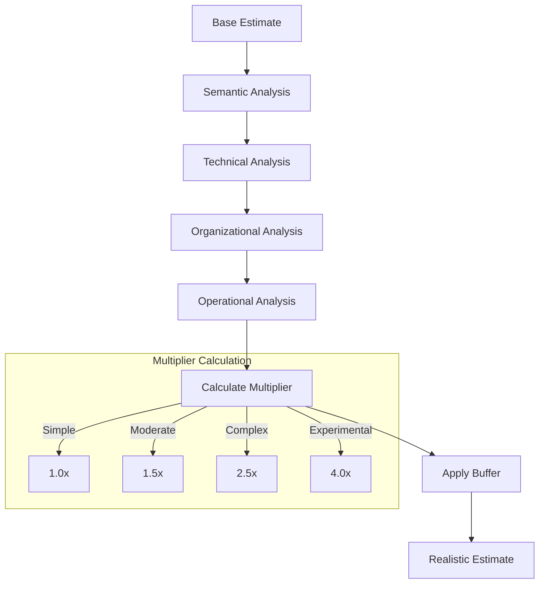
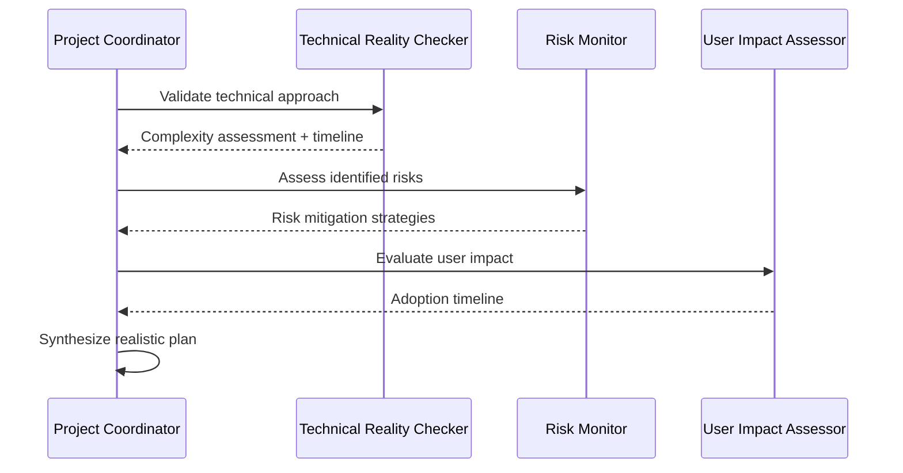

# npl-technical-reality-checker (Detailed Reference)

Complexity buffer planning specialist that transforms optimistic estimates into realistic, achievable timelines through evidence-based analysis.

## Overview

The `npl-technical-reality-checker` specializes in validating technical feasibility and providing realistic timeline adjustments for AI/ML projects. It analyzes multi-dimensional complexity factors, applies evidence-based buffer calculations, and identifies hidden implementation challenges before they impact delivery.

**Primary Functions:**
- Assess semantic and cognitive complexity in prompt engineering tasks
- Apply complexity-based buffer multipliers (1.0x to 4.0x)
- Validate technical approaches against real constraints
- Identify hidden technical debt and maintenance costs
- Account for learning curves and skill acquisition time

## Complexity Assessment Framework

### Complexity Dimensions

The agent evaluates complexity across multiple dimensions:

| Dimension | Factors Assessed | Impact Range |
|:----------|:-----------------|:-------------|
| Semantic | Prompt structure, cognitive load, ambiguity | 1.0x - 2.0x |
| Technical | Stack maturity, integration points, dependencies | 1.0x - 2.5x |
| Organizational | Team skills, process overhead, coordination | 1.0x - 1.5x |
| Operational | Deployment complexity, monitoring, maintenance | 1.0x - 2.0x |

### Complexity Levels

```yaml
complexity_levels:
  simple:
    multiplier: 1.0x
    characteristics:
      - Well-understood technology
      - Clear requirements
      - Experienced team
      - Minimal dependencies
    buffer: 0-25%

  moderate:
    multiplier: 1.5x
    characteristics:
      - Some new technology
      - Requirements need clarification
      - Team has partial experience
      - Manageable dependencies
    buffer: 25-50%

  complex:
    multiplier: 2.5x
    characteristics:
      - Significant unknowns
      - Cross-system integration
      - Learning curve required
      - Multiple stakeholders
    buffer: 75-150%

  experimental:
    multiplier: 4.0x
    characteristics:
      - Novel approaches
      - Unproven technology
      - Research required
      - High uncertainty
    buffer: 150-200%
```

### Buffer Calculation



**Formula:**
```
Realistic_Estimate = Base_Estimate × Complexity_Multiplier × (1 + Risk_Buffer)
```

## Capabilities

### Semantic Complexity Analysis

Evaluates prompt engineering and AI/ML-specific complexity:

```yaml
semantic_factors:
  prompt_structure:
    - Chain depth and composition
    - Context window utilization
    - Few-shot example requirements
    - Output format constraints

  cognitive_load:
    - Reasoning chain complexity
    - Domain knowledge requirements
    - Ambiguity resolution needs
    - Edge case coverage

  evaluation_difficulty:
    - Output quality metrics
    - Ground truth availability
    - A/B testing requirements
    - Regression detection
```

```bash
@npl-technical-reality-checker "Assess semantic complexity for multi-agent orchestration prompt"
```

### Technical Feasibility Validation

Validates proposed approaches against technical constraints:

| Validation Area | Checks Performed |
|:----------------|:-----------------|
| Architecture | Scalability, maintainability, security patterns |
| Integration | API compatibility, data format alignment, protocol support |
| Performance | Latency requirements, throughput capacity, resource limits |
| Dependencies | Version conflicts, license compliance, maintenance status |

```bash
@npl-technical-reality-checker "Validate feasibility of serverless LLM inference architecture"
```

### Hidden Cost Discovery

Identifies costs often missed in initial estimates:

```yaml
hidden_costs:
  technical_debt:
    - Workaround accumulation rate
    - Refactoring requirements
    - Documentation gaps
    - Test coverage deficits

  maintenance:
    - Model retraining cycles
    - Prompt drift monitoring
    - Dependency updates
    - Security patches

  operational:
    - Monitoring setup
    - Alerting configuration
    - Runbook creation
    - On-call training

  learning:
    - Team skill gaps
    - Technology ramp-up
    - Process adaptation
    - Tool familiarization
```

### Technology Stack Assessment

Evaluates stack maturity and compatibility:

```bash
@npl-technical-reality-checker "Assess technology stack for vector database migration"
```

**Assessment criteria:**
- Production readiness level
- Community support health
- Documentation quality
- Integration ecosystem
- Long-term viability

### Learning Curve Estimation

Accounts for skill acquisition time:

| Skill Level | Ramp-up Time | Productivity Impact |
|:------------|:-------------|:--------------------|
| Familiar | 0-1 week | 0% reduction |
| Related | 1-2 weeks | 10-20% reduction |
| New | 2-4 weeks | 20-40% reduction |
| Novel | 4-8 weeks | 40-60% reduction |

## Usage Examples

### Initial Project Assessment

```bash
# Comprehensive complexity assessment
@npl-technical-reality-checker "Assess complexity for authentication system redesign"
```

**Output format:**
```yaml
assessment:
  project: "Authentication System Redesign"
  base_estimate: "4 weeks"

  complexity_analysis:
    semantic: moderate
    technical: complex
    organizational: simple
    operational: moderate

  overall_complexity: complex
  multiplier: 2.5x

  realistic_estimate: "10 weeks"
  confidence: 75%

  key_risks:
    - "Legacy integration complexity underestimated"
    - "OAuth2 expertise gap in team"
    - "Session migration requires downtime planning"

  recommendations:
    - "Add 2 weeks for legacy adapter development"
    - "Schedule OAuth2 training before sprint 2"
    - "Plan phased rollout to minimize migration risk"
```

### Mid-Project Reality Check

```bash
# Evaluate progress and adjust timeline
@npl-technical-reality-checker "Evaluate progress at week 3 of 10-week project"
```

**Checks performed:**
- Actual vs. planned velocity
- Scope creep indicators
- Technical debt accumulation
- Risk materialization

### Scope Change Impact

```bash
# Analyze feature addition impact
@npl-technical-reality-checker "Analyze impact of adding real-time notification feature"
```

**Analysis includes:**
- Direct implementation effort
- Integration complexity increase
- Testing scope expansion
- Operational overhead growth

### Technology Validation

```bash
# Validate architecture decision
@npl-technical-reality-checker "Validate feasibility of event-sourcing for audit trail"
```

## Integration Patterns

### With Technical Thinker

```bash
# Approach design with feasibility validation
@npl-thinker "Design technical approach for feature X" && \
  @npl-technical-reality-checker "Validate approach feasibility and timeline"
```

### With Risk Monitor

```bash
# Technical risks to mitigation planning
@npl-technical-reality-checker "Identify technical risks for ML pipeline" && \
  @npl-risk-monitor "Create risk mitigation plan"
```

### With Project Coordinator

```bash
# Complexity-aware sprint planning
@npl-technical-reality-checker "Assess sprint backlog complexity" && \
  @npl-project-coordinator "Plan sprint with complexity buffers"
```

### With User Impact Assessor

```bash
# Balance technical and user considerations
@npl-technical-reality-checker "Assess API redesign complexity" && \
  @npl-user-impact-assessor "Evaluate user migration impact"
```

### Multi-Agent Validation Pipeline



## Output Formats

### Complexity Assessment Report

```yaml
complexity_report:
  summary:
    overall_level: complex
    multiplier: 2.5x
    confidence: 80%

  dimensions:
    semantic:
      level: moderate
      score: 1.5
      factors:
        - "Multi-step reasoning chains"
        - "Domain-specific terminology"

    technical:
      level: complex
      score: 2.5
      factors:
        - "Three external API integrations"
        - "Database schema migration required"

    organizational:
      level: simple
      score: 1.0
      factors:
        - "Single team ownership"
        - "Clear decision authority"

    operational:
      level: moderate
      score: 1.5
      factors:
        - "New monitoring requirements"
        - "Rollback procedure needed"

  timeline:
    original_estimate: "3 weeks"
    adjusted_estimate: "7-8 weeks"
    breakdown:
      development: "4 weeks"
      integration: "2 weeks"
      testing: "1 week"
      buffer: "1 week"
```

### Feasibility Validation

```yaml
feasibility:
  approach: "Serverless LLM Inference"
  verdict: conditionally_feasible

  requirements_met:
    - "Latency under 500ms achievable"
    - "Cost within budget at projected volume"

  requirements_at_risk:
    - "Cold start may exceed SLA during low-traffic periods"
    - "Context size limits may require prompt optimization"

  blockers: []

  recommendations:
    - "Implement provisioned concurrency for critical paths"
    - "Design prompt compression strategy before sprint 3"
```

### Timeline Adjustment

```yaml
timeline_adjustment:
  original: "6 weeks"
  adjusted: "9 weeks"
  change_reason: "Hidden complexity discovered"

  adjustments:
    - area: "Integration"
      original: "1 week"
      adjusted: "2.5 weeks"
      reason: "Legacy API versioning requires adapter layer"

    - area: "Testing"
      original: "1 week"
      adjusted: "2 weeks"
      reason: "Regression suite expansion needed"

  risk_buffer: "0.5 weeks"
  total_buffer_percentage: 50%
```

## Best Practices

### Assessment Timing

1. **Pre-planning** - Run comprehensive assessment before sprint commitment
2. **Sprint start** - Validate story complexity before work begins
3. **Mid-sprint** - Check progress against complexity assumptions
4. **Scope change** - Assess impact before accepting new requirements

### Effective Prompts

```bash
# Specific context yields better analysis
@npl-technical-reality-checker "Assess complexity of implementing JWT refresh token rotation for 50K DAU mobile app with existing session store"

# Avoid vague requests
# Bad: "Check if this is hard"
# Good: "Assess implementation complexity considering team has no Kubernetes experience"
```

### Calibration

Track actual vs. estimated to improve future accuracy:

```yaml
calibration_tracking:
  project: "Q4 Feature Release"
  estimated_complexity: complex
  actual_complexity: complex
  estimated_duration: "8 weeks"
  actual_duration: "9 weeks"
  variance: +12.5%
  lessons:
    - "External API changes added 1 week"
    - "Buffer utilization: 80%"
```

## Limitations

### Assessment Boundaries

- Cannot predict external blockers (vendor delays, policy changes)
- Limited visibility into team dynamics and morale factors
- Cannot account for organizational priority shifts
- Assessments based on disclosed information only

### Accuracy Constraints

- Novel technologies have wider confidence intervals
- Cross-organizational projects have higher uncertainty
- Long-horizon estimates (>6 months) degrade in accuracy
- Requires honest input about team capabilities

### Known Edge Cases

- Very small tasks (<1 day) may receive disproportionate buffers
- Highly experimental work may exceed 4.0x multiplier
- Regulatory requirements can introduce unpredictable delays

## Success Metrics

| Metric | Target | Description |
|:-------|:-------|:------------|
| Estimation accuracy | >85% | Actual within 15% of adjusted estimate |
| Complexity discovery | >90% | Hidden complexity identified before impact |
| Buffer utilization | 70-85% | Healthy buffer usage (not too conservative) |
| Risk identification | >80% | Technical risks surfaced during assessment |
| Stakeholder satisfaction | >4.0/5.0 | Planning confidence rating |

## Related Documentation

- [Project Management README](./README.md) - Category overview
- [npl-project-coordinator](./npl-project-coordinator.md) - Workflow orchestration
- [npl-risk-monitor](./npl-risk-monitor.md) - Risk assessment integration
- [npl-user-impact-assessor](./npl-user-impact-assessor.md) - User impact analysis
