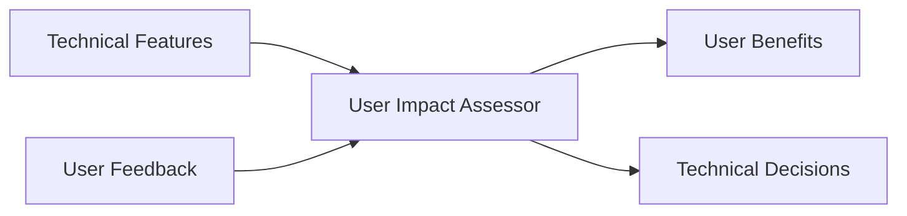
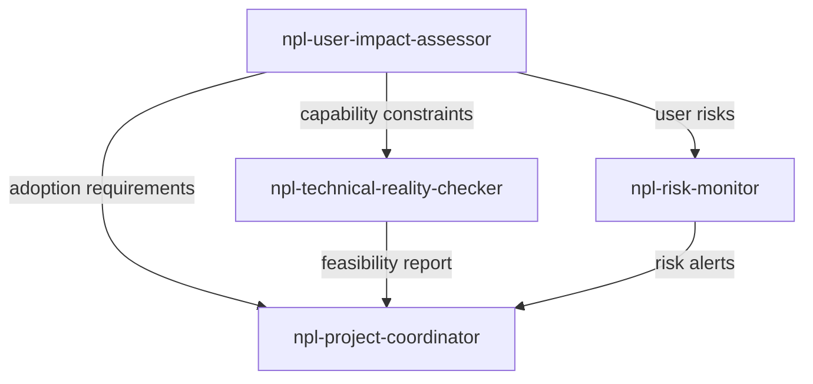

# npl-user-impact-assessor (Detailed Reference)

User-centric planning specialist that analyzes user adoption phases, measures impact on workflows, and ensures continuous feedback loops throughout project development.

## Overview

The `npl-user-impact-assessor` bridges technical implementation and user value delivery. It ensures planning decisions consider user adoption patterns, measure real impact on workflows, and maintain continuous feedback integration throughout development.

**Primary Functions:**
- Map user journey from discovery to mastery
- Define measurable user value metrics
- Design continuous feedback collection systems
- Create progressive disclosure learning paths
- Translate technical features to user benefits
- Quantify ROI from user time savings

## Capabilities

### User Adoption Phase Analysis

Maps the complete user journey with adoption barriers and friction points:

```bash
@npl-user-impact-assessor "Map user adoption journey for new CLI tool"
```

**Analysis Components:**
- Current workflow pain points
- User skill level assessment
- Change readiness evaluation
- Success criteria from user perspective

### Adoption Phase Framework

| Phase | Timeline | Focus | Key Metrics |
|:------|:---------|:------|:------------|
| Discovery | Weeks 1-2 | First contact, quick wins | Time to value <5 min |
| Core Adoption | Weeks 3-8 | Regular usage, feature exploration | Weekly active >70% |
| Advanced Integration | Weeks 9-16 | Complex features, customization | Advanced usage >30% |
| Advocacy | Weeks 16+ | Teaching others, community contribution | Recommendation >40% |

### Impact Measurement Framework

Defines quantifiable metrics for user value:

```yaml
impact_measurement:
  user_value_delivery:
    weight: 30%
    measures: [time_saved, quality_improved, frustration_reduced]
  adoption_success:
    weight: 25%
    measures: [usage_frequency, feature_penetration, retention_rates]
  learning_curve:
    weight: 20%
    measures: [time_to_competency, support_requests, documentation_clarity]
  workflow_integration:
    weight: 15%
    measures: [process_compatibility, disruption_minimization]
  user_satisfaction:
    weight: 10%
    measures: [feedback_sentiment, advocacy_behaviors, recommendation_rates]
```

### Feedback Loop Integration

Designs continuous user feedback collection:

| Frequency | Activity | Deliverable |
|:----------|:---------|:------------|
| Weekly | Feedback review sessions | Prioritized action items |
| Monthly | Adoption metrics analysis | Trend reports |
| Quarterly | User journey optimization | UX improvements |
| Semi-annual | User needs reassessment | Strategy adjustments |

### Cross-Functional User Advocacy

Translates between technical and user perspectives:



**Advocacy activities:**
- Represent user needs in technical discussions
- Balance complexity with accessibility
- Coordinate user-centered design across teams

## Usage Examples

### Initial Project Planning

```bash
# Define adoption requirements for target audience
@npl-user-impact-assessor "Plan user adoption phases for NPL agent rollout targeting junior developers"

# Output: adoption milestones, measurement framework, feedback loops
```

### Mid-Project Evaluation

```bash
# Assess current adoption and adjust
@npl-user-impact-assessor "Evaluate current user adoption metrics and recommend timeline adjustments"

# Output: usage data review, barrier identification, intervention strategies
```

### Post-Launch Optimization

```bash
# Analyze journey data and improve
@npl-user-impact-assessor "Analyze 3-month user journey data and optimize onboarding flow"

# Output: progression patterns, friction points, UX improvements, training updates
```

### Feedback Synthesis

```bash
# Prioritize based on user input
@npl-user-impact-assessor "Synthesize beta testing feedback and prioritize feature improvements"

# Output: feedback themes, impact quantification, prioritized actions
```

## Integration Patterns

### With Technical Reality Checker

Aligns user capability with technical complexity:

```bash
@npl-user-impact-assessor "Define user adoption requirements for ML feature" && \
  @npl-technical-reality-checker "Assess feasibility of adoption timeline"
```

**Integration points:**
- User capability assessment informs complexity planning
- Adoption timeline provides implementation constraints
- User feedback guides technical priorities

### With Risk Monitor

Tracks user-related project risks:

```bash
@npl-user-impact-assessor "Identify adoption risks for enterprise rollout" && \
  @npl-risk-monitor "Track user adoption risks"
```

**Monitored risks:**
- Learning curve too steep
- Change fatigue
- Unclear value proposition
- Inadequate support

### With Project Coordinator

Integrates user milestones into project planning:

```bash
@npl-user-impact-assessor "Analyze user requirements" && \
  @npl-technical-reality-checker "Validate feasibility" && \
  @npl-project-coordinator "Create integrated plan"
```



## User Journey Planning

### Discovery Phase

```yaml
goals:
  - Immediate value demonstration (first 5 minutes)
  - Clear learning path visualization
  - Quick win achievement (first session)
  - Support accessibility establishment

success_metrics:
  time_to_first_value: "<5 minutes"
  first_session_completion_rate: ">80%"
  support_request_volume: "<10% of new users"
  second_session_return_rate: ">60%"
```

### Adoption Phase

```yaml
goals:
  - Regular usage pattern establishment
  - Core workflow integration
  - Intermediate feature exploration
  - Peer sharing and recommendation

success_metrics:
  weekly_active_usage: ">70% of onboarded users"
  feature_utilization_depth: ">3 core features"
  workflow_integration_time: "<2 weeks"
  user_recommendation_rate: ">40%"
```

### Mastery Phase

```yaml
goals:
  - Advanced feature utilization
  - Workflow optimization and customization
  - Teaching and mentoring others
  - Feature enhancement contribution

success_metrics:
  advanced_feature_usage: ">30% of active users"
  user_generated_content: ">20% participation"
  internal_advocacy_behaviors: ">50% of power users"
  retention_at_6_months: ">80%"
```

## Risk Assessment

### User Adoption Risks

| Risk | Impact | Mitigation | Monitoring |
|:-----|:-------|:-----------|:-----------|
| Learning curve too steep | Users abandon | Progressive complexity | Time-to-competency |
| Change fatigue | Resistance to adoption | Phased rollout | Sentiment analysis |
| Value unclear | Low engagement | Enhanced demonstration | Value perception surveys |
| Support inadequate | User frustration | Proactive capacity planning | Ticket analysis |

### Impact Measurement Risks

| Risk | Mitigation |
|:-----|:-----------|
| Metrics not meaningful | User-defined success criteria |
| Data collection gaps | Multiple measurement methods |
| Feedback bias | Diverse user voice inclusion |
| Long-term tracking loss | Automated analytics integration |

## Output Formats

### Adoption Assessment

```yaml
assessment:
  target_users: "Junior developers"
  current_state:
    skill_level: "Intermediate"
    change_readiness: "Moderate"
    pain_points: ["manual processes", "inconsistent tooling"]
  adoption_plan:
    phase_1:
      duration: "2 weeks"
      focus: "Core functionality"
      success_criteria: "80% completing onboarding"
    phase_2:
      duration: "6 weeks"
      focus: "Workflow integration"
      success_criteria: "70% weekly active"
```

### Impact Report

```yaml
impact_report:
  period: "Q1 2024"
  metrics:
    adoption_rate: "85%"
    time_to_value: "4 minutes"
    satisfaction_score: "4.6/5.0"
    support_requests: "8% of users"
  improvements:
    - "Reduced onboarding time by 40%"
    - "Increased feature discovery by 25%"
  recommendations:
    - "Add interactive tutorials for advanced features"
    - "Implement progress tracking dashboard"
```

### Feedback Synthesis

```yaml
feedback_synthesis:
  collection_period: "2024-01-01 to 2024-03-31"
  total_responses: 156
  themes:
    - theme: "Documentation clarity"
      frequency: 45
      priority: high
      action: "Rewrite getting started guide"
    - theme: "Feature discoverability"
      frequency: 32
      priority: medium
      action: "Add contextual tooltips"
```

## Best Practices

### User-Centered Planning

1. **Start with user research** - Understand current workflows before planning changes
2. **Define success from user perspective** - Metrics should reflect user value, not just usage
3. **Plan for learning curves** - Allow adequate time for adoption at each phase
4. **Build feedback loops early** - Collect input before, during, and after launch

### Adoption Management

1. **Progressive disclosure** - Introduce complexity gradually
2. **Quick wins first** - Demonstrate value within first session
3. **Support scaling** - Plan support capacity for each adoption phase
4. **Celebrate milestones** - Recognize user progress and achievements

### Measurement Quality

1. **Multiple data sources** - Combine quantitative metrics with qualitative feedback
2. **Baseline establishment** - Measure before/after for accurate impact assessment
3. **Long-term tracking** - Monitor sustained adoption, not just initial uptake
4. **Actionable insights** - Every metric should inform a potential improvement

## Limitations

### Assessment Constraints

- Requires user access for research and feedback
- Cannot predict individual user behavior precisely
- Limited visibility into organizational adoption barriers
- Feedback quality depends on user participation

### Integration Constraints

- User requirements may conflict with technical feasibility
- Adoption timelines may not align with development schedules
- Cross-team coordination needed for comprehensive assessment
- Budget constraints may limit research scope

### Known Edge Cases

- Enterprise deployments with diverse user populations
- Products with multiple distinct user personas
- Rapid iteration cycles that outpace adoption measurement
- Legacy system migrations with forced adoption

## Success Metrics

| Metric | Target | Description |
|:-------|:-------|:------------|
| Adoption rate | >80% | Active engagement of target users |
| Time to value | <10 min | First meaningful outcome |
| Learning efficiency | <2 weeks | Core competency achievement |
| Satisfaction score | >4.5/5.0 | Average user rating |
| Metric coverage | 100% | Key workflows measured |
| Feedback response | >60% | User participation rate |
| Improvement velocity | 20%/month | Month-over-month gains |
| ROI documentation | 90% | Features with quantified value |

## Related Documentation

- [Project Management README](./README.md) - Category overview
- [npl-project-coordinator](./npl-project-coordinator.md) - Workflow orchestration
- [npl-risk-monitor](./npl-risk-monitor.md) - Risk tracking integration
- [npl-technical-reality-checker](./npl-technical-reality-checker.md) - Feasibility validation
