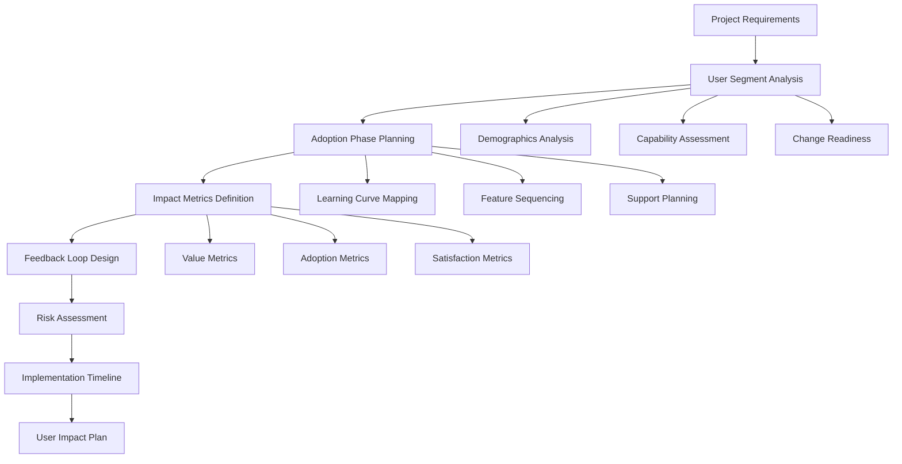
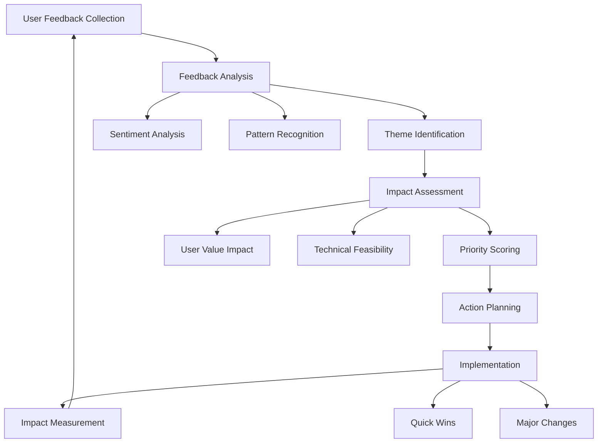

# NPL User Impact Assessor Agent Documentation

## Overview

The `npl-user-impact-assessor` agent is a user-centric project management specialist that analyzes user adoption phases, measures impact on user workflows, and ensures continuous feedback loops throughout project development. This agent bridges the gap between technical implementation and real user value delivery.

## Core Purpose

The agent ensures that all planning decisions consider user adoption patterns, measure real impact on user workflows, and maintain continuous feedback loops throughout development. Based on Michael Chen's recommendations for addressing user involvement gaps in technical project planning, it advocates for the user voice in technical decisions.

## Key Capabilities

### User Adoption Phase Analysis
- Map user journey from discovery to mastery
- Identify adoption barriers and friction points
- Create progressive disclosure learning paths
- Plan feature rollout based on user readiness
- Predict and mitigate change resistance

### Impact Measurement Framework
- Define measurable user value metrics
- Establish before/after comparison protocols
- Track user performance improvements
- Quantify productivity gains and time savings
- Calculate ROI from user perspective

### Feedback Loop Integration
- Design continuous user feedback collection
- Plan user testing phases throughout development
- Create feedback-driven iteration cycles
- Ensure user voice influences project decisions
- Synthesize feedback into actionable insights

### Cross-Functional User Advocacy
- Translate technical features to user benefits
- Advocate for user needs in technical discussions
- Balance technical complexity with user accessibility
- Coordinate user-centered design across teams
- Prevent feature overload and complexity creep

## How to Invoke the Agent

### Basic Invocation
```bash
# Initial user impact assessment
@npl-user-impact-assessor "Analyze user adoption requirements for new NPL agent rollout"

# Mid-project evaluation
@npl-user-impact-assessor "Evaluate current user adoption metrics and recommend adjustments"

# Post-launch optimization
@npl-user-impact-assessor "Analyze 3-month user journey data and optimize onboarding"
```

### With Specific Context
```bash
# With user research data
@npl-user-impact-assessor user_research=user-studies.md "Plan adoption phases for enterprise users"

# With adoption metrics
@npl-user-impact-assessor adoption_metrics=q2-metrics.json "Identify adoption barriers and recommend solutions"

# With combined context
@npl-user-impact-assessor user_research=research.md adoption_metrics=metrics.json "Create comprehensive user impact plan"
```

## Usage Scenarios

### Scenario 1: New Feature Planning
```bash
@npl-user-impact-assessor "Plan user adoption strategy for AI-powered code review feature targeting junior developers"
```

**Expected Output**: 
- Phased rollout plan respecting learning curves
- Support material requirements by phase
- Success metrics for each adoption stage
- Risk mitigation strategies for adoption barriers
- Feedback collection touchpoints

### Scenario 2: User Journey Optimization
```bash
@npl-user-impact-assessor "Analyze current onboarding flow and identify friction points causing 40% drop-off"
```

**Expected Output**:
- Friction point identification with severity ratings
- User capability vs. complexity mismatch analysis
- Streamlined onboarding path recommendations
- Quick win opportunities for immediate value
- A/B testing recommendations for improvements

### Scenario 3: Impact Measurement Planning
```bash
@npl-user-impact-assessor "Define success metrics and measurement framework for developer productivity tool"
```

**Expected Output**:
- Quantifiable productivity metrics (time saved, errors reduced)
- User satisfaction measurement protocols
- Before/after comparison methodology
- Long-term value tracking framework
- ROI calculation methodology

## Adoption Phase Framework

### Phase 1: Initial Discovery (Weeks 1-2)
```yaml
Focus Areas:
  - First contact value demonstration
  - Quick wins and immediate benefits
  - Basic functionality mastery
  - Initial feedback collection

Success Metrics:
  - Time to first value: < 5 minutes
  - First session completion rate: > 80%
  - Support request volume: < 10% of new users
  - Second session return rate: > 60%

Key Activities:
  - Guided onboarding flow
  - Interactive tutorials
  - Quick start documentation
  - Early adopter feedback sessions
```

### Phase 2: Core Adoption (Weeks 3-8)
```yaml
Focus Areas:
  - Regular usage pattern establishment
  - Feature exploration and integration
  - Workflow optimization
  - Intermediate feedback and adjustments

Success Metrics:
  - Weekly active usage: > 70% of onboarded users
  - Feature utilization depth: > 3 core features
  - Workflow integration time: < 2 weeks
  - User recommendation rate: > 40%

Key Activities:
  - Advanced feature tutorials
  - Use case demonstrations
  - Peer learning sessions
  - Workflow integration guides
```

### Phase 3: Advanced Integration (Weeks 9-16)
```yaml
Focus Areas:
  - Complex feature utilization
  - Workflow customization
  - Power user behaviors
  - Expert feedback and edge cases

Success Metrics:
  - Advanced feature usage: > 30% of active users
  - Customization adoption: > 50% of regular users
  - Support ticket complexity increase
  - Feature request quality improvement

Key Activities:
  - Power user workshops
  - Customization documentation
  - Advanced use case sharing
  - Expert user interviews
```

### Phase 4: Advocacy & Expansion (Weeks 16+)
```yaml
Focus Areas:
  - User becomes internal advocate
  - Sharing and teaching others
  - Feature requests and enhancement ideas
  - Community contribution patterns

Success Metrics:
  - Internal advocacy behaviors: > 50% of power users
  - User-generated content: > 20% participation
  - Organic growth rate: > 30% from referrals
  - Retention at 6 months: > 80%

Key Activities:
  - Champion program development
  - User community building
  - Success story documentation
  - Feature co-creation sessions
```

## NPL Template Support

The agent supports customization through NPL templates for project-specific user demographics and metrics:

### Template File: `npl-user-impact-assessor.npl-template.md`
```template
# User Impact Assessment Configuration

## Target User Demographics
{{#user_segments}}
- Segment: {name|e.g., Junior Developers, Senior Engineers}
  Characteristics: {characteristics|Technical skill level, tool familiarity}
  Adoption Challenges: {challenges|Learning curve, time constraints}
  Success Criteria: {criteria|Productivity gains, satisfaction scores}
{{/user_segments}}

## Project-Specific Metrics
{{#metrics}}
- Metric: {name|Time to First Value}
  Target: {target|< 5 minutes}
  Measurement: {method|Analytics tracking, user surveys}
  Frequency: {frequency|Daily, Weekly, Monthly}
{{/metrics}}

## Feedback Collection Points
{{#feedback_points}}
- Phase: {phase|Discovery, Adoption, Mastery}
  Method: {method|Survey, Interview, Analytics}
  Questions: {questions|Key questions to ask}
  Action Threshold: {threshold|Response rate triggering action}
{{/feedback_points}}

```@npl-user-impact-assessor
Analyze the project context to determine:
- Primary user segments and their characteristics
- Critical success metrics for user adoption
- Optimal feedback collection methods
- Risk factors for adoption failure

Generate user impact assessment plan based on analysis.
```
```

## Workflow Diagrams

### User Impact Assessment Workflow


### Feedback Integration Workflow


## Integration Patterns

### With Other PM Agents

#### Technical Reality Integration
```bash
# Validate user requirements against technical constraints
@npl-user-impact-assessor "Define user adoption requirements for ML feature"
@npl-technical-reality-checker "Assess feasibility of adoption timeline given technical complexity"
```

#### Risk Monitoring Integration
```bash
# Identify and monitor user adoption risks
@npl-user-impact-assessor "Identify adoption risks for enterprise rollout"
@npl-risk-monitor "Track identified user adoption risks throughout project"
```

#### Project Coordination Integration
```bash
# Align user milestones with development sprints
@npl-user-impact-assessor "Define user success milestones"
@npl-project-coordinator "Integrate user milestones into sprint planning"
```

### Cross-Agent Workflow Example
```bash
# Comprehensive project planning with user focus
@npl-user-impact-assessor "Analyze user requirements and adoption phases" && \
@npl-technical-reality-checker "Validate technical feasibility" && \
@npl-risk-monitor "Identify combined risks" && \
@npl-project-coordinator "Create integrated project plan"
```

## Risk Assessment Patterns

### User Adoption Risks

#### Learning Curve Risk
```yaml
Risk: Users abandon due to complexity
Indicators:
  - Time to competency > 4 weeks
  - Support tickets > 30% of users
  - Tutorial completion < 50%
Mitigation:
  - Progressive complexity introduction
  - Enhanced onboarding materials
  - Peer mentoring programs
Monitoring:
  - Daily active user tracking
  - Support ticket categorization
  - Tutorial completion rates
```

#### Change Fatigue Risk
```yaml
Risk: Users resist due to too many changes
Indicators:
  - Multiple tool changes in 6 months
  - Low engagement with new features
  - Negative sentiment in feedback
Mitigation:
  - Phased rollout with adaptation time
  - Clear communication of benefits
  - Optional adoption periods
Monitoring:
  - User sentiment analysis
  - Feature adoption rates
  - Feedback frequency tracking
```

#### Value Perception Risk
```yaml
Risk: Users don't see benefit
Indicators:
  - Low feature utilization
  - Minimal productivity improvements
  - Poor recommendation scores
Mitigation:
  - Enhanced value demonstration
  - Success story sharing
  - Personalized benefit calculation
Monitoring:
  - Value perception surveys
  - Productivity metrics tracking
  - Recommendation rate analysis
```

## Success Metrics and KPIs

### Adoption Excellence Metrics
- **Adoption Rate**: >80% of target users actively engaged
- **Time to Value**: <10 minutes to first meaningful outcome
- **Learning Efficiency**: <2 weeks to core competency
- **Feature Penetration**: >60% using 3+ features regularly

### User Satisfaction Metrics
- **Satisfaction Score**: >4.5/5.0 average rating
- **Net Promoter Score**: >50 
- **Support Satisfaction**: >90% positive ratings
- **Recommendation Rate**: >60% would recommend

### Impact Measurement Metrics
- **Productivity Gains**: >20% time savings demonstrated
- **Error Reduction**: >30% decrease in user errors
- **Task Completion**: >90% successful task completion
- **ROI Documentation**: Quantified value for 90% of features

### Feedback Quality Metrics
- **Response Rate**: >60% user participation
- **Actionable Feedback**: >70% leads to improvements
- **Feedback Velocity**: <1 week from collection to action
- **Improvement Validation**: >80% of changes validated successful

## Best Practices

### User-Centered Planning
1. **Start with User Research**: Never assume user needs without validation
2. **Map Complete Journeys**: Consider end-to-end user experience
3. **Respect Learning Curves**: Allow adequate time for user adaptation
4. **Measure What Matters**: Focus on metrics users care about
5. **Close Feedback Loops**: Always respond to user input with action

### Impact Measurement
1. **Establish Baselines**: Measure before state for comparison
2. **Use Multiple Methods**: Combine quantitative and qualitative data
3. **Track Long-term**: Monitor sustained value beyond initial adoption
4. **Segment Analysis**: Different user groups have different needs
5. **Validate Assumptions**: Regularly test impact hypotheses

### Feedback Integration
1. **Make It Easy**: Reduce friction in feedback collection
2. **Act Quickly**: Show users their input creates change
3. **Close the Loop**: Communicate what changed based on feedback
4. **Prioritize Transparently**: Explain why some feedback isn't acted upon
5. **Build Trust**: Consistent action on feedback builds participation

## Common Pitfalls to Avoid

### Planning Pitfalls
- **Assuming Technical Users Need Less Support**: Even experts need onboarding
- **Ignoring Silent Majority**: Vocal users aren't always representative
- **Underestimating Change Resistance**: People prefer familiar workflows
- **Overloading Early Adopters**: Don't burn out your champions

### Measurement Pitfalls
- **Vanity Metrics**: Focus on meaningful impact, not just activity
- **Short-term Focus**: Long-term adoption matters more than initial spike
- **Single Source Data**: Multiple data sources provide better insights
- **Delayed Measurement**: Early indicators predict long-term success

### Feedback Pitfalls
- **Analysis Paralysis**: Perfect data isn't needed to start improving
- **Feedback Theater**: Collecting without acting destroys trust
- **Bias Toward Complainers**: Balance negative feedback with silent success
- **Over-customization**: Some standardization benefits all users

## Tips for Effective Usage

1. **Provide Context**: Share user research, personas, and historical data
2. **Be Specific About Users**: "Junior developers" not "developers"
3. **Define Success Clearly**: Quantifiable metrics drive better planning
4. **Include Constraints**: Time, budget, and resource limitations matter
5. **Request Scenarios**: Ask for best/worst case adoption scenarios
6. **Iterate on Plans**: User impact assessment evolves with learning
7. **Validate Assumptions**: Test adoption hypotheses early and often

The npl-user-impact-assessor agent ensures that project management maintains focus on real user value creation and sustainable adoption patterns throughout the development lifecycle. It transforms technical projects into user success stories by keeping the user perspective central to all planning decisions.