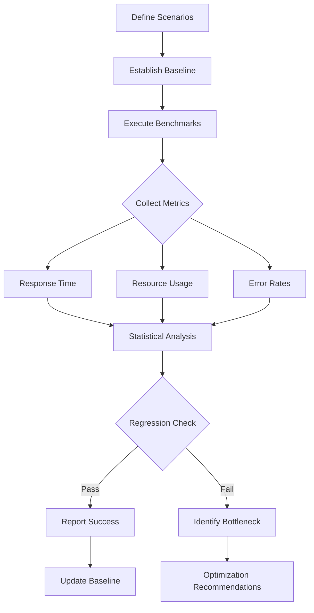
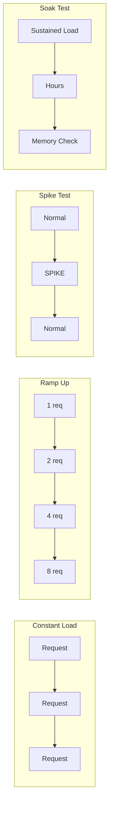

# npl-benchmarker - Detailed Reference

Performance and reliability testing specialist that ensures NPL agents meet production-ready performance standards through systematic benchmarking and regression detection.

## Table of Contents

- [Overview](#overview)
- [Core Mission](#core-mission)
- [Capabilities](#capabilities)
- [Benchmarking Framework](#benchmarking-framework)
- [Metrics Collection](#metrics-collection)
- [Regression Detection](#regression-detection)
- [Load Testing](#load-testing)
- [NPL Pump Integration](#npl-pump-integration)
- [Usage Reference](#usage-reference)
- [Integration Patterns](#integration-patterns)
- [Output Formats](#output-formats)
- [CI/CD Integration](#cicd-integration)
- [Anti-Patterns](#anti-patterns)
- [Limitations](#limitations)

---

## Overview

`@npl-benchmarker` transforms ad-hoc performance testing into reproducible, data-driven benchmarking processes. The agent establishes performance baselines, detects regressions, identifies bottlenecks, and provides optimization recommendations with SLA compliance validation.

**Invocation**: `@benchmarker`, `@perf`, `@performance`, `@benchmark`, `@load-test`

**Primary Goal**: Ensure NPL agents and workflows meet production performance requirements through systematic measurement, comparison, and continuous monitoring.

---

## Core Mission

The agent addresses performance blindness in agent development: systems that work correctly but fail under load or degrade over time.

**Problem Statement**: Without systematic benchmarking, performance regressions go undetected until production failures occur.

**Solution**: Data-driven performance management that:
- Establishes measurable baselines for all critical paths
- Detects regressions before deployment
- Identifies bottlenecks with actionable metrics
- Validates SLA compliance continuously

---

## Capabilities

### Response Time Analysis
- Percentile tracking (P50, P95, P99, P999)
- Latency distribution histograms
- Response time trend analysis over sessions
- Cold start vs warm performance differentiation

### Load Testing
- Concurrent request simulation
- Sustained load over configurable durations
- Ramp-up and ramp-down patterns
- Connection pool and resource exhaustion testing

### Regression Detection
- Statistical significance testing (configurable alpha)
- Version-to-version comparison
- Automated baseline management
- Alert threshold configuration

### Resource Monitoring
- Memory consumption tracking
- Token usage analysis (input/output/total)
- CPU utilization correlation
- Context window efficiency metrics

### Bottleneck Identification
- Hot path analysis
- Slow component isolation
- Dependency latency attribution
- Optimization opportunity ranking

### SLA Validation
- Threshold-based pass/fail criteria
- Compliance percentage reporting
- Violation alerting and logging
- Historical compliance trending

---

## Benchmarking Framework

The agent applies a structured measurement flow:



### Scenario Definition

| Component | Description | Example |
|-----------|-------------|---------|
| Agent | Target agent under test | `npl-technical-writer` |
| Scenario | Specific use case | `document-generation` |
| Input | Representative workload | `input-samples/` |
| Duration | Test length | `10m`, `1h` |
| Concurrency | Parallel requests | `1`, `5`, `10` |
| Thresholds | Pass/fail criteria | `p95<2000ms` |

---

## Metrics Collection

### Response Time Metrics

| Metric | Description | Use Case |
|--------|-------------|----------|
| P50 (Median) | 50th percentile latency | Typical user experience |
| P95 | 95th percentile latency | Most users experience |
| P99 | 99th percentile latency | Tail latency detection |
| P999 | 99.9th percentile | Worst case scenarios |
| Mean | Average response time | Overall trend tracking |
| Std Dev | Response time variance | Consistency measurement |
| Min/Max | Range boundaries | Outlier identification |

### Resource Metrics

| Metric | Description | Unit |
|--------|-------------|------|
| Memory Peak | Maximum memory usage | MB |
| Memory Avg | Average consumption | MB |
| Token Input | Input tokens consumed | count |
| Token Output | Output tokens generated | count |
| Token Total | Combined token usage | count |
| Context Fill | Context window utilization | percentage |

### Error Metrics

| Metric | Description | Target |
|--------|-------------|--------|
| Error Rate | Failed requests percentage | <1% |
| Timeout Rate | Requests exceeding limit | <0.1% |
| Retry Rate | Requests requiring retry | <5% |

---

## Regression Detection

### Statistical Testing

The agent uses statistical significance testing to distinguish real regressions from noise:

```yaml
regression_config:
  significance_level: 0.05  # Alpha for t-test
  min_samples: 30           # Minimum data points
  effect_size: 0.1          # Minimum meaningful change
  comparison_method: welch  # Welch's t-test (unequal variance)
```

### Regression Thresholds

| Severity | Threshold | Action |
|----------|-----------|--------|
| Critical | >25% degradation | Block deployment |
| Warning | 10-25% degradation | Flag for review |
| Minor | 5-10% degradation | Log and monitor |
| Pass | <5% change | Continue |

### Baseline Management

```bash
# Create new baseline
@npl-benchmarker baseline --create --version="v1.0" --agents="all"

# Compare against baseline
@npl-benchmarker compare --baseline="v1.0" --current="HEAD"

# Update baseline after optimization
@npl-benchmarker baseline --update --version="v1.1" --from="latest-run"

# List available baselines
@npl-benchmarker baseline --list
```

---

## Load Testing

### Load Patterns



### Load Test Configuration

| Pattern | Purpose | Duration | Use Case |
|---------|---------|----------|----------|
| Constant | Baseline performance | 5-15 min | Standard benchmarks |
| Ramp-up | Find breaking point | 15-30 min | Capacity planning |
| Spike | Recovery testing | 5 min | Resilience validation |
| Soak | Memory leak detection | 1-4 hours | Stability testing |

### Concurrency Settings

```bash
# Light load (baseline)
@npl-benchmarker load-test --concurrent=1 --duration="5m"

# Normal load
@npl-benchmarker load-test --concurrent=5 --duration="15m"

# Heavy load
@npl-benchmarker load-test --concurrent=10 --duration="30m"

# Stress test
@npl-benchmarker load-test --concurrent=20 --ramp-up="5m" --duration="1h"
```

---

## NPL Pump Integration

The agent uses NPL intuition pumps for structured analysis:

### Intent Analysis

```xml
<npl-intent>
intent:
  overview: Measure and validate agent performance characteristics
  analysis:
    - Response time distribution across scenarios
    - Resource consumption patterns
    - Performance regression indicators
    - Bottleneck identification opportunities
    - SLA compliance status
</npl-intent>
```

### Benchmark Critique

```xml
<npl-critique>
critique:
  measurement_validity:
    - Sufficient sample size collected
    - Statistical significance achieved
    - Outliers appropriately handled
    - Baseline comparison meaningful
  optimization_value:
    - Bottlenecks clearly identified
    - Recommendations actionable
    - Impact estimates provided
    - Priority ranking logical
</npl-critique>
```

### Quality Rubric

| Criterion | Check |
|-----------|-------|
| Statistical Validity | Sufficient samples, proper significance testing |
| Reproducibility | Consistent results across runs |
| Coverage | All critical paths measured |
| Actionability | Clear optimization recommendations |
| Threshold Clarity | Pass/fail criteria unambiguous |

---

## Usage Reference

### Basic Measurement

```bash
# Single agent benchmark
@npl-benchmarker measure --agent="npl-technical-writer"

# With duration and request count
@npl-benchmarker measure --agent="npl-technical-writer" --duration="10m" --requests="100"

# Multiple scenarios
@npl-benchmarker measure --agent="npl-grader" --scenarios="code-review,doc-review,rubric-eval"
```

### Load Testing

```bash
# Basic load test
@npl-benchmarker load-test --agent="npl-persona" --concurrent=5

# Extended load test
@npl-benchmarker load-test --agents="npl-grader,npl-templater" --concurrent=5 --duration="30m"

# Stress test with ramp-up
@npl-benchmarker stress-test --agent="npl-technical-writer" --max-concurrent=20 --ramp-up="10m"
```

### Regression Analysis

```bash
# Compare versions
@npl-benchmarker regression --baseline="v1.0" --current="v1.1"

# With significance threshold
@npl-benchmarker regression --baseline="v1.0" --current="v1.1" --significance=0.05

# CI/CD gate
@npl-benchmarker regression --baseline="main" --current="HEAD" --fail-on-regression=5%
```

### Resource Monitoring

```bash
# Memory and CPU tracking
@npl-benchmarker resources --agent="npl-persona" --monitoring="memory,cpu"

# Token usage analysis
@npl-benchmarker resources --agent="npl-technical-writer" --monitoring="tokens" --scenarios="complex"

# Full resource profile
@npl-benchmarker resources --agent="npl-grader" --monitoring="memory,cpu,tokens,context"
```

### Continuous Monitoring

```bash
# Periodic checks
@npl-benchmarker monitor --interval="5m" --duration="1h"

# With alerting
@npl-benchmarker monitor --interval="5m" --alert-threshold="p95>3000ms" --notify="slack"

# Dashboard mode
@npl-benchmarker monitor --interval="1m" --dashboard --metrics="p50,p95,p99,errors"
```

---

## Integration Patterns

### With npl-tester

```bash
# Run functional tests, then benchmark
@npl-tester run --suite=tests/ && @npl-benchmarker measure --agents="all"

# Performance regression in test suite
@npl-tester run --suite=perf-tests/ && @npl-benchmarker regression --baseline="last-release"
```

### With npl-integrator

```bash
# Benchmark multi-agent workflows
@npl-integrator test-workflow --scenario="doc-generation" > workflow.log
@npl-benchmarker analyze-workflow --input="workflow.log" --bottlenecks

# Integration performance gates
@npl-benchmarker measure --workflow="content-pipeline" && @npl-integrator validate --perf-results="latest"
```

### With npl-validator

```bash
# Validate then benchmark
@npl-validator validate src/ && @npl-benchmarker measure --agents="modified"

# Combined quality gate
@npl-validator check --strict && @npl-benchmarker regression --fail-on-regression=10%
```

### Complete Workflow Example

```bash
# Full performance validation pipeline
@npl-benchmarker baseline --create --agents="all" --save="baseline-$(date +%Y%m%d).json"
@npl-benchmarker measure --agents="all" --scenarios="standard,complex,edge-case"
@npl-benchmarker regression --baseline="baseline-latest.json" --report="regression-report.md"
@npl-benchmarker resources --agents="all" --monitoring="memory,tokens" --duration="30m"
```

---

## Output Formats

### JSON Report

```json
{
  "benchmark_id": "bench-2024-001",
  "agent": "npl-technical-writer",
  "timestamp": "2024-01-15T10:30:00Z",
  "metrics": {
    "response_time": {
      "p50": 1250,
      "p95": 2100,
      "p99": 3500,
      "mean": 1380,
      "std_dev": 450
    },
    "resources": {
      "memory_peak_mb": 128,
      "tokens_avg": 2500
    },
    "errors": {
      "error_rate": 0.005,
      "timeout_rate": 0.001
    }
  },
  "thresholds": {
    "p95_limit": 3000,
    "passed": true
  }
}
```

### Markdown Report

```markdown
# Benchmark Report: npl-technical-writer

## Summary
- **Status**: PASS
- **Date**: 2024-01-15
- **Duration**: 10 minutes
- **Requests**: 100

## Response Time
| Percentile | Value (ms) | Threshold | Status |
|------------|------------|-----------|--------|
| P50 | 1,250 | - | - |
| P95 | 2,100 | 3,000 | PASS |
| P99 | 3,500 | 5,000 | PASS |

## Resource Usage
- Memory Peak: 128 MB
- Avg Tokens: 2,500

## Recommendations
1. P99 approaching threshold - monitor for degradation
```

### Dashboard Output

```bash
@npl-benchmarker monitor --dashboard

# Output:
# ┌─────────────────────────────────────────────────────┐
# │ npl-benchmarker Live Dashboard                      │
# ├─────────────────────────────────────────────────────┤
# │ Agent: npl-technical-writer                         │
# │ Status: HEALTHY                                     │
# │                                                     │
# │ Response Time (ms)                                  │
# │ P50: 1,250 ████████░░░░ P95: 2,100 ███████████░     │
# │                                                     │
# │ Error Rate: 0.5% ░░░░░░░░░░ Threshold: 1%          │
# │                                                     │
# │ Last Update: 10s ago                                │
# └─────────────────────────────────────────────────────┘
```

---

## CI/CD Integration

### GitHub Actions Example

```yaml
- name: Performance Regression Check
  run: |
    @npl-benchmarker regression \
      --baseline="main" \
      --current="${{ github.sha }}" \
      --fail-on-regression=5% \
      --format=junit-xml \
      --output=perf-results.xml

- name: Upload Performance Results
  uses: actions/upload-artifact@v3
  with:
    name: performance-results
    path: perf-results.xml
```

### Pre-merge Gate

```bash
# Block merge if performance regresses
@npl-benchmarker regression \
  --baseline="origin/main" \
  --current="HEAD" \
  --significance=0.05 \
  --fail-on-regression=10% \
  --exit-code
```

### Scheduled Benchmarks

```bash
# Nightly performance validation
0 2 * * * @npl-benchmarker measure --agents="all" --save="nightly-$(date +%Y%m%d)"
0 3 * * * @npl-benchmarker regression --baseline="release-latest" --current="nightly-latest" --notify="slack"
```

---

## Anti-Patterns

### Avoid These Benchmarking Mistakes

| Bad (Don't) | Good (Do) |
|-------------|-----------|
| Single-run benchmarks | Minimum 30 samples for significance |
| Ignoring cold starts | Separate cold/warm measurements |
| P50-only tracking | Track P95, P99 for tail latency |
| Manual threshold checks | Automated regression detection |
| Point-in-time snapshots | Trend tracking over time |

### Warning Signs

- Highly variable results without investigation
- P99 >>3x P50 without explanation
- Baselines never updated after optimizations
- Thresholds set arbitrarily without data
- Resource monitoring disabled for "speed"

---

## Limitations

### Scope Boundaries

- **Not a profiler**: Identifies bottlenecks, does not provide line-level profiling
- **Not a load generator**: Simulates concurrent requests, not distributed load testing
- **Not a monitoring system**: Point-in-time benchmarks, not continuous APM
- **Agent-focused**: Optimized for NPL agents, not general application benchmarking

### Measurement Constraints

- Results depend on execution environment consistency
- Token-based metrics require model API access
- Cold start measurements require fresh context
- Concurrent testing limited by available resources

### Statistical Limitations

- Minimum sample sizes required for significance
- Non-normal distributions may require alternative tests
- Effect size thresholds are configurable but require calibration
- Baseline drift requires periodic revalidation

---

## Related Resources

- Core definition: `core/additional-agents/quality-assurance/npl-benchmarker.md`
- Quality assurance overview: `docs/additional-agents/quality-assurance/README.md`
- Companion agents: `npl-tester`, `npl-validator`, `npl-integrator`
