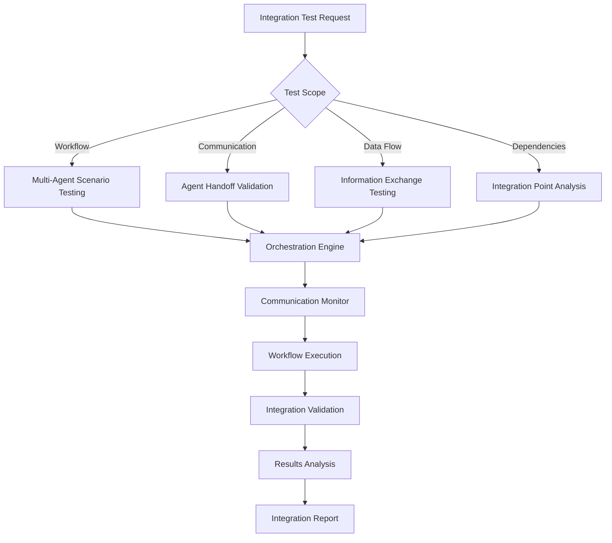

# npl-integrator - Detailed Reference

Multi-agent workflow testing and integration specialist that validates collaboration patterns, tests complex scenarios, and ensures reliable agent coordination.

## Table of Contents

- [Overview](#overview)
- [Core Mission](#core-mission)
- [Capabilities](#capabilities)
- [Technical Architecture](#technical-architecture)
- [Testing Categories](#testing-categories)
- [Workflow Definition Format](#workflow-definition-format)
- [NPL Pump Integration](#npl-pump-integration)
- [Usage Reference](#usage-reference)
- [Configuration Options](#configuration-options)
- [Output Format](#output-format)
- [Integration Quality Framework](#integration-quality-framework)
- [Advanced Features](#advanced-features)
- [Best Practices](#best-practices)
- [Limitations](#limitations)

---

## Overview

`@npl-integrator` validates multi-agent workflows, tests communication protocols, and ensures reliable coordination between NPL agents. The agent provides comprehensive integration quality assurance for production environments.

**Invocation**: `@integrator`, `@npl-integrator`

**Primary Goal**: Transform complex multi-agent coordination into validated, reliable workflows through systematic integration testing.

---

## Core Mission

The agent addresses reliability concerns in multi-agent systems where individual agents may work correctly but fail when combined.

**Problem Statement**: Multi-agent workflows introduce failure points at communication boundaries, data handoffs, and coordination sequences that unit testing cannot detect.

**Solution**: Systematic integration testing that:
- Validates agent-to-agent communication protocols
- Tests data flow and context preservation
- Identifies bottlenecks and failure modes
- Provides actionable reliability metrics

---

## Capabilities

### Workflow Scenario Testing
- Test sequential agent handoffs
- Validate parallel execution and synchronization
- Test conditional branching based on outputs
- Verify error recovery and resilience

### Communication Protocol Validation
- Validate data exchange between agents
- Test context preservation across transitions
- Verify message integrity and consistency
- Test timeout handling and retry logic

### Integration Point Analysis
- Map agent interdependencies
- Validate interface compatibility
- Test cross-version integration
- Verify shared configuration consistency

### Performance Testing
- Measure end-to-end workflow duration
- Identify bottlenecks in agent chains
- Test throughput under load
- Monitor resource utilization

---

## Technical Architecture



### Execution Flow

1. **Request Analysis**: Parse test scope and parameters
2. **Orchestration**: Initialize agents and workflow configuration
3. **Execution**: Run workflow with monitoring
4. **Validation**: Check integration points and data flow
5. **Reporting**: Generate comprehensive results

---

## Testing Categories

### 1. Critical Path Integration
Core workflow sequences that must function for system operation.

```yaml
critical_path:
  - document_generation_pipeline
  - code_review_workflow
  - quality_assurance_chain
```

### 2. Communication Protocol Testing
Agent-to-agent messaging validation.

| Test Type | Description |
|-----------|-------------|
| Format Validation | Consistent data structures |
| Timing Analysis | Handoff latency measurement |
| Retry Logic | Failure recovery verification |
| Protocol Compliance | Standard adherence |

### 3. Error Handling Integration
Failure recovery testing across agent boundaries.

```yaml
failure_scenarios:
  - single_agent_timeout
  - cascading_failures
  - partial_recovery
  - resource_exhaustion
```

### 4. Performance Integration
Workflow efficiency under various conditions.

| Metric | Target |
|--------|--------|
| Communication Success Rate | >98% |
| Workflow Completion Rate | >95% |
| Error Recovery Rate | >90% |
| Complex Workflow Time | <30s |

---

## Workflow Definition Format

Define workflows using YAML configuration:

```yaml
workflow:
  name: document-review-pipeline
  agents:
    - id: writer
      type: npl-technical-writer
      output: draft_document
    - id: validator
      type: npl-validator
      input: ${writer.output}
      output: validation_report
    - id: grader
      type: npl-grader
      input:
        - ${writer.output}
        - ${validator.output}
      output: quality_assessment

  flow:
    - step: generate_draft
      agent: writer
      timeout: 30s
    - step: validate_syntax
      agent: validator
      depends_on: generate_draft
      timeout: 10s
    - step: assess_quality
      agent: grader
      depends_on:
        - generate_draft
        - validate_syntax
      timeout: 20s
```

### Workflow Elements

| Element | Description |
|---------|-------------|
| `agents` | Agent definitions with input/output mappings |
| `flow` | Execution sequence with dependencies |
| `timeout` | Maximum step duration |
| `depends_on` | Prerequisite steps |

---

## NPL Pump Integration

### Intent Analysis

```xml
<npl-intent>
intent:
  workflow_complexity: Assess multi-agent scenario requirements
  integration_points: Identify critical agent communication boundaries
  data_flow_patterns: Map information exchange between agents
  failure_scenarios: Define edge cases and error handling requirements
</npl-intent>
```

### Integration Critique

```xml
<npl-critique>
critique:
  communication_reliability: Verify consistent agent-to-agent messaging
  workflow_completeness: Ensure all steps execute successfully
  error_propagation: Validate proper failure handling across agents
  performance_consistency: Check integration performance under load
</npl-critique>
```

### Integration Reflection

```xml
<npl-reflection>
reflection:
  integration_health: Overall workflow reliability assessment
  coordination_quality: Agent collaboration effectiveness
  failure_resilience: System recovery capabilities
  optimization_opportunities: Workflow improvement recommendations
</npl-reflection>
```

---

## Usage Reference

### Test Multi-Agent Workflow

```bash
@npl-integrator test-workflow --agents="npl-tester,npl-grader,npl-technical-writer" --scenario="document-review-pipeline"
```

### Validate Agent Communication

```bash
@npl-integrator test-communication --source="npl-templater" --target="npl-grader" --iterations=50
```

### Integration Health Check

```bash
@npl-integrator health-check --workflow="content-generation" --depth="comprehensive"
```

### Performance Testing

```bash
@npl-integrator performance-test --workflow="complex-analysis" --concurrent-flows=3 --duration="15m"
```

### CI/CD Validation

```bash
@npl-integrator ci-validate --workflow-dir=".claude/workflows" --fail-on-error
```

### Custom Workflow Testing

```bash
@npl-integrator test-workflow --workflow-config=".claude/workflows/custom-pipeline.yaml"
```

### Failure Injection

```bash
@npl-integrator test-workflow --scenario="document-pipeline" --mock-failures --failure-rate=0.1
```

---

## Configuration Options

### Integration Parameters

| Parameter | Description |
|-----------|-------------|
| `--workflow` | Path to workflow definition file |
| `--agents` | List of agents to test |
| `--scenario` | Predefined test scenario name |
| `--iterations` | Number of test iterations |
| `--concurrent-flows` | Parallel workflow executions |

### Testing Options

| Option | Description |
|--------|-------------|
| `--depth` | Testing depth: quick, standard, comprehensive |
| `--timeout` | Maximum workflow execution time |
| `--retry` | Retry failed integrations |
| `--isolation` | Run in isolated environment |
| `--mock-failures` | Inject synthetic failures |
| `--failure-rate` | Failure injection frequency (0.0-1.0) |

---

## Output Format

### Integration Test Report Structure

```markdown
# Integration Test Report: [Workflow Name]

## Executive Summary
- **Workflow**: [Name]
- **Agents Involved**: [List]
- **Total Steps**: [Number]
- **Success Rate**: [XX%]
- **Total Duration**: [Time]

## Workflow Execution
[State diagram showing execution flow]

## Communication Analysis
| Source | Target | Messages | Success Rate | Avg Latency |
|--------|--------|----------|--------------|-------------|

## Integration Points
| Integration Point | Status | Issues | Risk Level |
|------------------|--------|--------|------------|

## Data Flow Validation
- **Initial Context**: [Size/complexity]
- **Final Context**: [Size/complexity]
- **Data Integrity**: [Status]
- **Information Loss**: [Details]

## Error Handling
| Failure Type | Occurrences | Recovery Success | Avg Recovery Time |
|--------------|-------------|------------------|-------------------|

## Performance Metrics
- **End-to-End Time**: [Duration]
- **Bottleneck**: [Agent/Step]
- **Resource Usage**: [Metrics]
- **Throughput**: [Rate]

## Recommendations
1. [Critical Issues]
2. [Performance Improvements]
3. [Reliability Enhancements]
```

---

## Integration Quality Framework

### Key Performance Indicators

| KPI | Target |
|-----|--------|
| Communication Success Rate | >98% |
| Workflow Completion Rate | >95% |
| Error Recovery Rate | >90% |
| Complex Workflow Time | <30s |
| Peak Resource Usage | <80% |

### Quality Standards

| Standard | Requirement |
|----------|-------------|
| Completion Rate | >95% for critical workflows |
| Performance Variance | <10% |
| Recovery Time | <30 seconds |
| Resource Efficiency | Optimized usage patterns |

---

## Advanced Features

### Workflow Pattern Analysis

| Analysis Type | Purpose |
|---------------|---------|
| Common Patterns | Identify frequently used agent combinations |
| Anti-Pattern Detection | Find problematic integration patterns |
| Performance Optimization | Suggest workflow improvements |
| Scalability Analysis | Predict behavior under load |

### Failure Scenario Testing

| Scenario | Test Purpose |
|----------|--------------|
| Cascading Failures | Multiple agent failure behavior |
| Partial Recovery | Graceful degradation testing |
| Timeout Handling | Retry and timeout validation |
| Resource Exhaustion | Constraint behavior testing |

---

## Best Practices

1. **Define Clear Workflows**: Document agent interactions precisely
2. **Test Incrementally**: Start simple, increase complexity gradually
3. **Monitor Continuously**: Track integration health metrics
4. **Automate Testing**: Include in CI/CD pipelines
5. **Document Patterns**: Share successful integration patterns

### Risk Mitigation

| Risk | Mitigation |
|------|------------|
| Production Impact | Test environment isolation |
| Unrealistic Results | Use actual usage patterns |
| Missing Coverage | Test all critical paths |
| Breaking Changes | Automated regression testing |

---

## Limitations

### Scope Boundaries

- **Not a unit tester**: Tests integration points, not individual agent behavior (use `@npl-tester` for unit tests)
- **Not a performance profiler**: Identifies bottlenecks, does not optimize agent internals
- **Requires workflow definitions**: Cannot test undefined or ad-hoc workflows
- **Simulated environment**: Production behavior may differ under real conditions

### Dependency Requirements

- Valid workflow definitions
- Access to all agents in workflow
- Sufficient resources for concurrent execution
- Network access for distributed agents

### Context Limitations

- Tests agent interactions, not business logic correctness
- Cannot validate output quality (use `@npl-grader` for quality assessment)
- Results depend on test scenario coverage

---

## Related Resources

- Core definition: `core/additional-agents/quality-assurance/npl-integrator.md`
- Quality assurance overview: `docs/additional-agents/quality-assurance/README.md`
- Companion agents: `npl-tester`, `npl-validator`, `npl-benchmarker`
