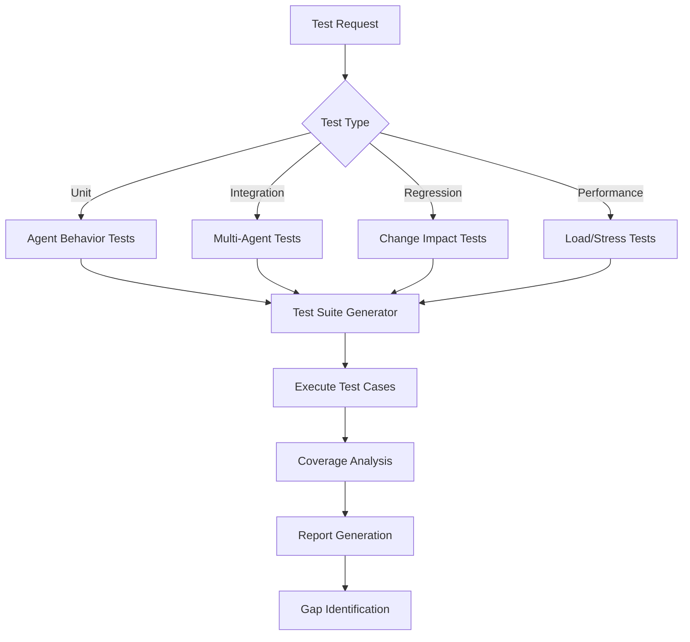
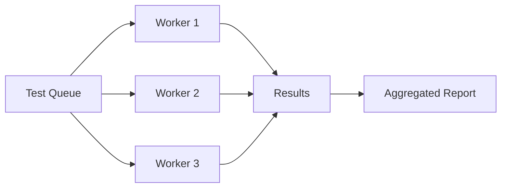

# npl-tester Detailed Documentation

Comprehensive testing framework for NPL agents, prompts, and workflows.

## Table of Contents

- [Architecture](#architecture)
- [Test Types](#test-types)
- [NPL Pump Integration](#npl-pump-integration)
- [Test Generation](#test-generation)
- [Coverage Analysis](#coverage-analysis)
- [Test Data Management](#test-data-management)
- [Configuration Reference](#configuration-reference)
- [Output Formats](#output-formats)
- [Execution Strategies](#execution-strategies)
- [CI/CD Integration](#cicd-integration)
- [Best Practices](#best-practices)

---

## Architecture



The tester operates in four phases:

1. **Intent Analysis** - Determine test scope, depth, and validation criteria
2. **Test Generation** - Create test cases based on agent definitions and usage patterns
3. **Execution** - Run tests with parallel workers, capture results
4. **Reporting** - Generate coverage metrics, identify gaps, provide recommendations

---

## Test Types

### Unit Tests

Validate individual agent behaviors in isolation.

```test-framework
Behavioral Validation:
- Prompt Response Consistency: Same inputs produce consistent outputs
- Parameter Variation Testing: Different configs yield appropriate responses
- Error Handling Validation: Graceful failure and recovery
- Performance Boundaries: Response time and resource limits
```

**Usage:**
```bash
@npl-tester test --agent="npl-grader" --type="unit"
```

### Integration Tests

Validate multi-agent workflows and handoffs.

```test-framework
Multi-Agent Workflows:
- Agent Coordination: Test handoffs and collaboration
- Data Flow Validation: Information passing between agents
- Context Preservation: State maintenance across transitions
- Error Propagation: Failure handling in complex workflows
```

**Usage:**
```bash
@npl-tester test --agents="npl-grader,npl-persona" --type="integration"
```

### Regression Tests

Detect changes in behavior across versions.

```test-framework
Change Impact Analysis:
- Modification Detection: Identify affected components
- Backward Compatibility: Ensure existing functionality preserved
- Performance Regression: Monitor for degradation
- Output Quality Tracking: Compare results across versions
```

**Usage:**
```bash
@npl-tester regression --baseline="v1.0" --current="v1.1" --focus="behavior-consistency"
```

### Performance Tests

Measure response times and resource consumption under load.

**Usage:**
```bash
@npl-tester performance --agent="npl-grader" --concurrent-requests=10 --duration="5m"
```

### NPL Syntax Tests

Validate NPL prompt structure and semantics.

```test-framework
Syntax Compliance:
- Structure Validation: Proper NPL formatting and organization
- Semantic Accuracy: Pump activation and context handling
- Template Rendering: Variable substitution and conditionals
- Unicode Handling: Semantic boundary character validation
```

**Usage:**
```bash
@npl-tester validate-syntax --directory="npl/pumps" --report-format="detailed"
```

---

## NPL Pump Integration

### Intent Analysis (`npl-intent`)

```xml
<npl-intent>
intent:
  test_scope: Identify components and behaviors to validate
  test_depth: Determine thoroughness level and edge case coverage
  validation_criteria: Define success/failure conditions
  regression_focus: Assess impact of changes and modifications
</npl-intent>
```

### Test Design (`npl-critique`)

```xml
<npl-critique>
critique:
  test_completeness: Verify all critical paths are covered
  scenario_realism: Ensure tests reflect actual usage patterns
  edge_case_coverage: Validate boundary conditions and error states
  behavioral_consistency: Check agent responses across variations
</npl-critique>
```

### Test Synthesis (`npl-reflection`)

```xml
<npl-reflection>
reflection:
  coverage_assessment: Overall test coverage and gap analysis
  risk_evaluation: Identify untested critical paths
  quality_metrics: Test effectiveness and reliability measures
  improvement_opportunities: Recommendations for better testing
</npl-reflection>
```

---

## Test Generation

### Systematic Test Case Creation

The tester generates cases across four dimensions:

| Dimension | Description |
|:----------|:------------|
| `input_variations` | Diverse input scenarios covering normal and edge cases |
| `boundary_testing` | Edge cases and limit conditions |
| `error_injection` | Simulated failure modes and recovery paths |
| `performance_profiling` | Stress tests with varying loads |

### Generation Command

```bash
@npl-tester generate --agent="npl-technical-writer" --coverage="comprehensive" --include-edge-cases
```

**Coverage levels:**

- `minimal` - Critical paths only
- `standard` - Common use cases and error handling
- `comprehensive` - All paths including edge cases and performance

### Generated Test Suite Format

```yaml
test_suite:
  name: npl-technical-writer-tests
  agent: npl-technical-writer
  coverage: comprehensive

  tests:
    - id: tt-001
      category: critical_path
      name: basic_readme_generation
      input:
        command: "generate readme"
        context: "simple JavaScript project"
      expected:
        contains: ["## Overview", "## Installation", "## Usage"]
        format: markdown

    - id: tt-002
      category: edge_case
      name: empty_project_context
      input:
        command: "generate readme"
        context: ""
      expected:
        behavior: graceful_fallback
        error_handling: true
```

---

## Coverage Analysis

### Coverage Dimensions

| Dimension | Target | Description |
|:----------|:-------|:------------|
| Code Paths | 90% | All agent logic branches tested |
| Scenarios | 85% | Common and uncommon use cases |
| Error Paths | 80% | All failure modes and recovery paths |
| Integration | 75% | All agent interaction patterns |

### Coverage Report

```bash
@npl-tester coverage --agent="npl-grader" --format="detailed"
```

**Output:**
```
Coverage Report: npl-grader
===========================

| Category    | Coverage | Target | Status |
|-------------|----------|--------|--------|
| Code Paths  | 92%      | 90%    | PASS   |
| Scenarios   | 87%      | 85%    | PASS   |
| Error Paths | 78%      | 80%    | FAIL   |
| Integration | 81%      | 75%    | PASS   |

Gaps Identified:
- Error path: timeout handling not tested
- Error path: malformed input recovery not tested

Recommendations:
1. Add tests for timeout scenarios
2. Test recovery from malformed rubric input
```

---

## Test Data Management

### Fixtures

Define reusable test inputs in YAML format:

```yaml
fixtures:
  standard_inputs:
    - name: basic_prompt
      content: "Standard NPL prompt for testing"
    - name: complex_workflow
      content: "Multi-agent coordination scenario"

  edge_cases:
    - name: empty_input
      content: ""
    - name: malformed_syntax
      content: "<<unclosed bracket"
    - name: unicode_stress
      content: "Test with unicode boundaries"
```

### Mock Scenarios

- **Simulated agent responses** - Controlled outputs for deterministic testing
- **Predefined workflow states** - Integration testing at specific points
- **Error injection points** - Controlled failure testing
- **Performance baselines** - Regression detection data

### Fixture Location

Store fixtures in project test directory:
```
.claude/
  tests/
    fixtures/
      standard_inputs.yaml
      edge_cases.yaml
      mocks/
        agent_responses.yaml
```

---

## Configuration Reference

### Test Parameters

| Parameter | Values | Description |
|:----------|:-------|:------------|
| `--coverage` | `minimal`, `standard`, `comprehensive` | Target coverage level |
| `--include-edge-cases` | flag | Add boundary condition testing |
| `--parallel` | number | Parallel test executions |
| `--timeout` | duration | Maximum time per test case |
| `--retry` | number | Retry attempts for flaky tests |

### Reporting Options

| Parameter | Values | Description |
|:----------|:-------|:------------|
| `--format` | `text`, `json`, `junit-xml`, `html` | Output format |
| `--verbose` | flag | Detailed execution logs |
| `--compare` | path | Compare with previous run |
| `--metrics` | flag | Include performance metrics |
| `--coverage-report` | flag | Generate coverage visualization |

### Example Configuration File

```yaml
# .claude/test-config.yaml
test_config:
  default_coverage: standard
  parallel_workers: 4
  timeout_per_test: 30s
  retry_count: 2

  reporting:
    format: junit-xml
    output_dir: ./test-results
    include_metrics: true

  thresholds:
    coverage_minimum: 85
    pass_rate: 95
    max_duration: 300s

  ci:
    fail_on_regression: true
    block_on_coverage_drop: true
```

---

## Output Formats

### Test Execution Report

```markdown
# Test Execution Report: [Test Suite Name]

## Executive Summary
- **Total Tests**: 47
- **Passed**: 44 (94%)
- **Failed**: 2 (4%)
- **Skipped**: 1 (2%)
- **Duration**: 2m 34s

## Coverage Analysis
| Category   | Coverage | Target | Status |
|------------|----------|--------|--------|
| Code Paths | 91%      | 90%    | PASS   |
| Scenarios  | 88%      | 85%    | PASS   |
| Error Paths| 82%      | 80%    | PASS   |

## Failed Tests Analysis
| Test Name            | Failure Reason         | Impact | Priority |
|----------------------|------------------------|--------|----------|
| timeout_handling     | Expected timeout error | High   | 1        |
| edge_unicode_input   | Encoding mismatch      | Low    | 3        |

## Regression Analysis
- **New Failures**: timeout_handling (was passing in v1.0)
- **Fixed Issues**: empty_input_recovery (was failing in v1.0)
- **Performance Changes**: +5% response time (within threshold)

## Recommendations
1. Fix timeout handling in input parser
2. Add unicode normalization step
3. Consider performance optimization for large inputs
```

### JUnit XML Format

For CI/CD integration:

```xml
<?xml version="1.0" encoding="UTF-8"?>
<testsuite name="npl-grader-tests" tests="47" failures="2" errors="0" skipped="1" time="154.2">
  <testcase name="basic_grading" classname="critical_path" time="2.3"/>
  <testcase name="timeout_handling" classname="error_paths" time="30.0">
    <failure message="Expected TimeoutError, got None"/>
  </testcase>
</testsuite>
```

---

## Execution Strategies

### Parallel Execution



**Usage:**
```bash
@npl-tester run --suite=tests.yaml --parallel=4
```

### Progressive Testing

Run tests in phases, failing fast on critical issues:

1. **Smoke Tests** - Quick validation of critical functionality (< 30s)
2. **Standard Tests** - Comprehensive functional validation (< 5m)
3. **Extended Tests** - Edge cases and performance testing (< 15m)
4. **Full Suite** - Complete regression and integration testing (< 30m)

```bash
@npl-tester run --suite=tests.yaml --progressive --stop-on-failure
```

### Parallel Multi-Agent Testing

Test multiple agents concurrently:

```bash
@npl-tester test --agent="npl-grader" --type="unit" &
@npl-tester test --agent="npl-templater" --type="unit" &
@npl-tester test --agent="npl-persona" --type="unit"
```

---

## CI/CD Integration

### Quality Gates

```bash
@npl-tester ci-test --config=.claude/test-config.yaml --fail-threshold=95
```

**Exit codes:**
- `0` - All tests passed, coverage met
- `1` - Tests failed
- `2` - Coverage below threshold
- `3` - Performance regression detected

### GitHub Actions Example

```yaml
# .github/workflows/npl-tests.yml
name: NPL Agent Tests

on: [push, pull_request]

jobs:
  test:
    runs-on: ubuntu-latest
    steps:
      - uses: actions/checkout@v4

      - name: Run NPL Tests
        run: |
          @npl-tester ci-test \
            --config=.claude/test-config.yaml \
            --format=junit-xml \
            --output=test-results.xml

      - name: Publish Test Results
        uses: dorny/test-reporter@v1
        with:
          name: NPL Test Results
          path: test-results.xml
          reporter: java-junit
```

### Pre-Commit Hook

```bash
#!/bin/bash
# .git/hooks/pre-commit

@npl-tester run --type=smoke --changed-only
if [ $? -ne 0 ]; then
  echo "Smoke tests failed. Commit aborted."
  exit 1
fi
```

---

## Best Practices

### Test Organization

1. **Test Early and Often** - Integrate testing into development workflow
2. **Maintain Test Hygiene** - Keep tests updated and relevant
3. **Focus on Critical Paths** - Prioritize testing of essential functionality
4. **Use Realistic Data** - Test with production-like scenarios
5. **Monitor Test Metrics** - Track coverage, performance, and reliability trends

### Test Categories and Priorities

| Priority | Category | Description |
|:---------|:---------|:------------|
| 1 | Critical Path | Core functionality that must always work |
| 2 | Integration | Multi-agent workflows and dependencies |
| 3 | Edge Cases | Boundary conditions and error scenarios |
| 4 | Performance | Response time and resource validation |
| 5 | Regression | Ensure changes do not break existing features |

### Success Criteria

**Technical:**
- Generate test suites with >90% code path coverage
- Identify behavioral inconsistencies across variations
- Detect regression issues before production deployment
- Complete standard tests in <5 minutes
- Provide actionable error reports with fix suggestions

**Quality:**
- Reduce agent failure rate by 80% through testing
- Achieve <1% false positive rate in test results
- Enable continuous integration with quality gates
- Support test-driven development workflows

---

## See Also

- [npl-benchmarker](./npl-benchmarker.md) - Performance testing and optimization
- [npl-integrator](./npl-integrator.md) - CI/CD pipeline management
- [npl-validator](./npl-validator.md) - Schema and data validation
- [Quality Assurance Overview](./README.md) - Full category documentation
