# NPL Tester Agent Documentation

## Overview

The NPL Tester Agent is a comprehensive quality assurance framework designed to generate, execute, and analyze test suites for NPL agents, prompts, and workflows. Built on the Noizu Prompt Lingo (NPL) framework, it provides systematic testing capabilities that ensure behavioral consistency, validate system reliability, and support continuous integration workflows through structured test generation and coverage analysis.

## Purpose and Core Value

The npl-tester agent transforms ad-hoc testing into systematic quality assurance processes. It serves as an automated testing framework that can:

- Generate comprehensive test suites from specifications and requirements
- Validate agent behaviors across diverse scenarios and edge cases
- Identify gaps in test coverage and suggest improvements
- Ensure regression-free deployments through automated testing
- Support CI/CD pipelines with configurable test execution

## Key Capabilities

### Testing Framework Architecture
- **Test Suite Generation**: Automatic creation of test cases from agent specifications
- **Behavioral Validation**: Consistency checking across input variations
- **Coverage Analysis**: Gap identification and completeness metrics
- **Edge Case Creation**: Boundary condition and error scenario generation
- **Regression Testing**: Change impact analysis and backward compatibility verification

### Test Categories
The agent excels at:

- **Unit Testing**: Individual agent behavior and response validation
- **Integration Testing**: Multi-agent workflow and coordination testing
- **Regression Testing**: Change impact detection and prevention
- **Performance Testing**: Load, stress, and resource utilization validation
- **Syntax Testing**: NPL structure and semantic validation

## How to Invoke the Agent

### Basic Usage
```bash
# Generate test suite for an agent
@npl-tester generate --agent="npl-technical-writer" --coverage="standard"

# Run existing test suite
@npl-tester run --suite="tests/agent-behaviors.yaml"

# Validate NPL syntax
@npl-tester validate-syntax --directory="npl/pumps"

# Perform regression testing
@npl-tester regression --baseline="v1.0" --current="v1.1"
```

### Advanced Usage Options
```bash
# Comprehensive testing with edge cases
@npl-tester generate --agent="npl-grader" --coverage="comprehensive" --include-edge-cases --parallel=4

# Performance testing with load simulation
@npl-tester performance --agent="npl-thinker" --concurrent-requests=10 --duration="5m" --profile="production"

# CI/CD integration with failure thresholds
@npl-tester ci-test --config=.claude/test-config.yaml --fail-threshold=95 --format=junit-xml

# Coverage analysis with gap identification
@npl-tester coverage --directory="agentic/scaffolding/agents" --target=90 --report-gaps
```

## Template-Based Customization

### NPL Template Support
The npl-tester agent supports templaterized customization through `npl-tester.npl-template.md`, enabling framework-specific and CI/CD-specific test generation:

```bash
# Load custom test framework configuration
@npl-tester generate --config=.claude/test-frameworks/pytest-config.yaml

# Use project-specific test suite template
@npl-tester generate --test_suite=.claude/test-suites/integration-tests.yaml

# Apply coverage configuration
@npl-tester coverage --coverage_config=.claude/coverage-config.yaml
```

### Template Variables
The agent template supports the following customization variables:

- `{{test_suite}}`: Path to custom test suite definition
- `{{coverage_config}}`: Coverage requirements and thresholds
- `{{config_file}}`: General configuration for test execution

## Integration Patterns

### Continuous Integration Integration
```yaml
# GitHub Actions example
name: NPL Agent Testing
on: [pull_request, push]
jobs:
  test-agents:
    runs-on: ubuntu-latest
    steps:
      - uses: actions/checkout@v2
      - name: Generate Test Suite
        run: |
          @npl-tester generate \
            --agent="npl-*" \
            --coverage="comprehensive" \
            --output=test-suite.yaml
      
      - name: Execute Tests
        run: |
          @npl-tester run \
            --suite=test-suite.yaml \
            --parallel=4 \
            --format=junit-xml > test-results.xml
      
      - name: Coverage Analysis
        run: |
          @npl-tester coverage \
            --suite=test-suite.yaml \
            --target=90 \
            --fail-on-gap
```

### Multi-Agent Testing Workflows
```bash
# Parallel test execution across agents
parallel:
  - @npl-tester test --agent="npl-grader" --type="unit"
  - @npl-tester test --agent="npl-templater" --type="unit"
  - @npl-tester test --agent="npl-persona" --type="unit"

# Integration test workflow
@npl-tester generate --type="integration" --agents="npl-grader,npl-templater"
@npl-tester run --suite=integration-tests.yaml --verbose

# Performance baseline establishment
@npl-tester performance --agent="all" --profile="baseline" --save-results
```

### Integration with Other NPL Agents
```bash
# Generate tests from specifications
@npl-technical-writer generate spec > agent-spec.md
@npl-tester generate --from-spec=agent-spec.md

# Template-driven test generation
@npl-templater generate test-template --framework=pytest > test-template.py
@npl-tester generate --template=test-template.py

# Graded test quality assessment
@npl-tester generate --output=test-suite.yaml
@npl-grader evaluate test-suite.yaml --rubric=.claude/rubrics/test-quality.md
```

## Testing Process Workflow

```mermaid
flowchart TD
    A[🎯 Test Request] --> B[📋 Load Configuration]
    B --> C{Test Mode}
    C -->|Generate| D[🔨 Create Test Suite]
    C -->|Execute| E[▶️ Run Test Cases]
    C -->|Analyze| F[📊 Coverage Analysis]
    
    D --> G[📝 Test Case Generation]
    G --> H[🔍 Edge Case Creation]
    H --> I[✅ Validation Rules]
    
    E --> J[🏃 Parallel Execution]
    J --> K[📈 Result Collection]
    K --> L[🎯 Pass/Fail Analysis]
    
    F --> M[📉 Gap Identification]
    M --> N[💡 Improvement Suggestions]
    N --> O[📑 Report Generation]
    
    subgraph "NPL Pump Integration"
        P[npl-intent: Test Purpose]
        Q[npl-critique: Test Design]
        R[npl-reflection: Coverage Synthesis]
    end
    
    C --> P
    G --> Q
    O --> R
```



## Example Usage Scenarios

### Scenario 1: Comprehensive Agent Testing

**Context**: Testing a new NPL agent before deployment.

```bash
# Create test configuration
cat > .claude/test-config.yaml << EOF
agent: npl-technical-writer
test_levels:
  - unit
  - integration
  - regression
  
coverage_targets:
  code_paths: 90
  scenarios: 85
  error_paths: 80
  
test_data:
  fixtures: ./test-fixtures/
  mocks: ./test-mocks/
  
performance:
  max_response_time: 2000ms
  max_memory: 512MB
EOF

# Generate comprehensive test suite
@npl-tester generate \
  --config=.claude/test-config.yaml \
  --coverage="comprehensive" \
  --include-edge-cases \
  --output=test-suite.yaml

# Execute tests with detailed reporting
@npl-tester run \
  --suite=test-suite.yaml \
  --parallel=4 \
  --verbose \
  --format=html > test-report.html
```

**Expected Output**:
```markdown
# Test Execution Report: npl-technical-writer

## Executive Summary
- **Total Tests**: 247
- **Passed**: 239 (96.8%)
- **Failed**: 6 (2.4%)
- **Skipped**: 2 (0.8%)
- **Duration**: 3m 42s

## Coverage Analysis
| Category | Coverage | Target | Status |
|----------|----------|--------|--------|
| Code Paths | 92.3% | 90% | ✅ |
| Scenarios | 87.5% | 85% | ✅ |
| Error Paths | 78.9% | 80% | ❌ |
| Edge Cases | 84.2% | - | - |

## Test Results by Category

### Unit Tests (156 tests)
- ✅ Prompt parsing and validation: 42/42 passed
- ✅ Template rendering: 38/38 passed
- ✅ Output formatting: 35/35 passed
- ⚠️ Error handling: 39/41 passed (2 failures)

### Integration Tests (68 tests)
- ✅ Multi-document generation: 25/25 passed
- ✅ Diagram integration: 20/20 passed
- ⚠️ External tool coordination: 21/23 passed (2 failures)

### Regression Tests (23 tests)
- ✅ Backward compatibility: 15/15 passed
- ⚠️ Performance regression: 6/8 passed (2 failures)

## Failed Tests Analysis
| Test Name | Failure Reason | Impact | Fix Priority |
|-----------|---------------|--------|--------------|
| test_malformed_template_handling | Unexpected exception on invalid syntax | Medium | High |
| test_unicode_boundary_parsing | Incorrect handling of nested boundaries | Low | Medium |
| test_concurrent_generation | Race condition in parallel execution | High | Critical |
```

### Scenario 2: Regression Testing for Prompt Updates

**Context**: Validating that prompt modifications don't break existing functionality.

```bash
# Capture baseline behavior
@npl-tester baseline \
  --agents="all" \
  --scenarios=".claude/test-scenarios/" \
  --save-as="baseline-v1.0"

# After prompt modifications, run regression tests
@npl-tester regression \
  --baseline="baseline-v1.0" \
  --current="HEAD" \
  --focus="behavior-consistency" \
  --threshold=0.95
```

**Regression Report**:
```markdown
# Regression Test Report

## Summary
Comparing current version against baseline v1.0
- **Behavioral Consistency**: 97.3% (Target: 95%)
- **Performance Delta**: +3.2% improvement
- **New Failures**: 2
- **Fixed Issues**: 5

## Behavioral Changes Detected
### npl-grader agent
- Output format modification in rubric scoring (intentional)
- Additional validation step added (enhancement)

### npl-templater agent
- Template variable parsing improved (bug fix)
- No breaking changes detected

## Performance Comparison
| Agent | Baseline Avg | Current Avg | Delta |
|-------|-------------|-------------|-------|
| npl-grader | 1.2s | 1.15s | -4.2% |
| npl-templater | 0.8s | 0.78s | -2.5% |
| npl-persona | 1.5s | 1.48s | -1.3% |

## Recommendations
1. Review and update tests for intentional format changes
2. Document performance improvements
3. No critical regressions detected - safe to deploy
```

### Scenario 3: CI/CD Pipeline Integration

**Context**: Automated testing in continuous integration pipeline.

```bash
# CI configuration file (.claude/ci-test-config.yaml)
cat > .claude/ci-test-config.yaml << EOF
test_suites:
  - name: smoke_tests
    agents: ["npl-grader", "npl-templater"]
    coverage: minimal
    timeout: 60s
    
  - name: standard_tests
    agents: all
    coverage: standard
    timeout: 300s
    
  - name: comprehensive_tests
    agents: all
    coverage: comprehensive
    timeout: 900s
    
quality_gates:
  smoke_tests:
    pass_rate: 100
    coverage: 70
  standard_tests:
    pass_rate: 95
    coverage: 85
  comprehensive_tests:
    pass_rate: 90
    coverage: 90
    
reporting:
  format: junit-xml
  artifacts:
    - test-results.xml
    - coverage-report.html
    - failed-test-logs/
EOF

# Execute CI test pipeline
@npl-tester ci-test \
  --config=.claude/ci-test-config.yaml \
  --stage="${CI_STAGE}" \
  --fail-fast
```

## Test Framework Features

### Test Data Management

**Test Fixtures**:
```yaml
# .claude/test-fixtures/agent-inputs.yaml
fixtures:
  standard_prompts:
    - id: basic_request
      content: "Generate a technical specification"
      expected_behavior: "Produces structured specification document"
    
    - id: complex_workflow
      content: "Create multi-agent coordination scenario"
      expected_behavior: "Orchestrates multiple agents successfully"
  
  edge_cases:
    - id: empty_input
      content: ""
      expected_behavior: "Graceful error handling with helpful message"
    
    - id: malformed_npl
      content: "⟪unclosed semantic boundary"
      expected_behavior: "Syntax error detection and reporting"
```

**Mock Configurations**:
```yaml
# .claude/test-mocks/agent-responses.yaml
mocks:
  npl_grader_responses:
    - scenario: standard_evaluation
      response: |
        Total Score: 85/100
        Grade: B
        Recommendations: [...]
    
    - scenario: error_condition
      response: |
        Error: Unable to load rubric
        Fallback to default evaluation
```

### Coverage Analysis Capabilities

**Coverage Dimensions**:
- **Code Path Coverage**: Execution of all agent logic branches
- **Scenario Coverage**: Testing of common and uncommon use cases
- **Error Path Coverage**: Validation of all failure modes
- **Integration Coverage**: Multi-agent interaction patterns
- **Edge Case Coverage**: Boundary conditions and limits

**Gap Identification**:
```bash
# Analyze coverage gaps
@npl-tester coverage \
  --directory="agentic/scaffolding/agents" \
  --report-gaps \
  --suggest-tests
```

Output:
```markdown
## Coverage Gap Analysis

### Untested Code Paths
1. **npl-grader**: Custom rubric validation branch (lines 145-167)
2. **npl-templater**: Recursive template inclusion (lines 234-251)
3. **npl-persona**: Multi-persona coordination (lines 89-103)

### Missing Test Scenarios
1. Concurrent agent execution with resource constraints
2. Template rendering with circular dependencies
3. Error recovery in multi-stage workflows

### Suggested Test Cases
```yaml
test_cases:
  - name: test_custom_rubric_validation
    agent: npl-grader
    input: malformed_rubric.md
    expected: ValidationError with specific message
  
  - name: test_recursive_template_depth_limit
    agent: npl-templater
    input: deeply_nested_template.md
    expected: Graceful handling with depth limit warning
```

## Performance Testing Capabilities

### Load Testing
```bash
# Simulate concurrent user load
@npl-tester performance \
  --type="load" \
  --agents="all" \
  --concurrent-users=50 \
  --ramp-up="30s" \
  --duration="5m" \
  --profile="production"
```

### Stress Testing
```bash
# Find breaking points
@npl-tester performance \
  --type="stress" \
  --agent="npl-grader" \
  --start-load=10 \
  --increment=10 \
  --max-load=1000 \
  --step-duration="30s"
```

### Performance Baselines
```bash
# Establish performance baseline
@npl-tester performance \
  --type="baseline" \
  --agents="all" \
  --iterations=100 \
  --save-baseline="perf-baseline-v1.0"

# Compare against baseline
@npl-tester performance \
  --type="comparison" \
  --baseline="perf-baseline-v1.0" \
  --threshold-degradation=10
```

## Configuration Options

### Test Parameters
| Parameter | Description | Values | Default |
|-----------|-------------|--------|---------|
| `--coverage` | Test coverage level | `minimal`, `standard`, `comprehensive` | `standard` |
| `--include-edge-cases` | Add boundary testing | Boolean | `false` |
| `--parallel` | Parallel test execution | Number (1-16) | `1` |
| `--timeout` | Test case timeout | Duration | `30s` |
| `--retry` | Retry attempts for flaky tests | Number (0-5) | `2` |

### Reporting Options
| Parameter | Description | Values | Default |
|-----------|-------------|--------|---------|
| `--format` | Output format | `text`, `json`, `junit-xml`, `html` | `text` |
| `--verbose` | Detailed execution logs | Boolean | `false` |
| `--compare` | Compare with previous run | Run ID | None |
| `--metrics` | Include performance metrics | Boolean | `false` |
| `--coverage-report` | Generate coverage visualization | Boolean | `true` |

### Execution Modes
| Mode | Description | Use Case |
|------|-------------|----------|
| `generate` | Create new test suites | Initial test creation |
| `run` | Execute existing tests | Regular testing |
| `regression` | Compare versions | Pre-deployment validation |
| `performance` | Load/stress testing | Performance validation |
| `coverage` | Analyze test coverage | Quality assessment |
| `validate-syntax` | NPL syntax checking | Syntax validation |

## Best Practices

### Test Suite Design
1. **Hierarchical Organization**: Structure tests by category, priority, and dependency
2. **Meaningful Names**: Use descriptive test names that explain what is being tested
3. **Independent Tests**: Ensure tests can run in any order without dependencies
4. **Fast Feedback**: Prioritize quick-running tests for rapid iteration
5. **Comprehensive Coverage**: Include positive, negative, and edge cases

### Test Data Management
1. **Fixture Reuse**: Create reusable test data fixtures for consistency
2. **Mock Isolation**: Use mocks to isolate components under test
3. **Realistic Scenarios**: Use production-like data for meaningful results
4. **Data Cleanup**: Ensure proper cleanup after test execution
5. **Version Control**: Track test data changes alongside code changes

### CI/CD Integration
1. **Progressive Testing**: Run fast tests first, comprehensive tests later
2. **Quality Gates**: Define clear pass/fail criteria for each stage
3. **Parallel Execution**: Maximize parallelization for faster feedback
4. **Artifact Collection**: Save test results and logs for investigation
5. **Automated Reporting**: Generate reports for stakeholder visibility

### Performance Testing
1. **Baseline Establishment**: Create performance baselines before optimization
2. **Regular Monitoring**: Run performance tests regularly to detect degradation
3. **Realistic Load Patterns**: Simulate actual usage patterns
4. **Resource Monitoring**: Track CPU, memory, and I/O during tests
5. **Incremental Load**: Gradually increase load to find breaking points

## Troubleshooting Common Issues

### Flaky Tests
- **Issue**: Tests pass intermittently without code changes
- **Solutions**:
  - Add retry logic for transient failures
  - Increase timeouts for slow operations
  - Improve test isolation and cleanup
  - Use deterministic test data
  - Mock external dependencies

### Slow Test Execution
- **Issue**: Test suite takes too long to complete
- **Solutions**:
  - Increase parallelization
  - Optimize test data setup
  - Use test categorization for selective running
  - Cache expensive operations
  - Profile and optimize slow tests

### Low Coverage
- **Issue**: Test coverage below target thresholds
- **Solutions**:
  - Use coverage gap analysis to identify missing tests
  - Generate tests from specifications
  - Add edge case and error path testing
  - Review and test conditional logic
  - Implement property-based testing

### False Positives/Negatives
- **Issue**: Tests report incorrect results
- **Solutions**:
  - Review test assertions for accuracy
  - Ensure proper test data setup
  - Check for race conditions
  - Validate mock behavior
  - Update tests for intentional changes

The NPL Tester Agent provides a comprehensive testing framework that ensures the quality and reliability of NPL agents and workflows. Through systematic test generation, execution, and analysis, it enables teams to maintain high quality standards while supporting rapid development and deployment cycles.