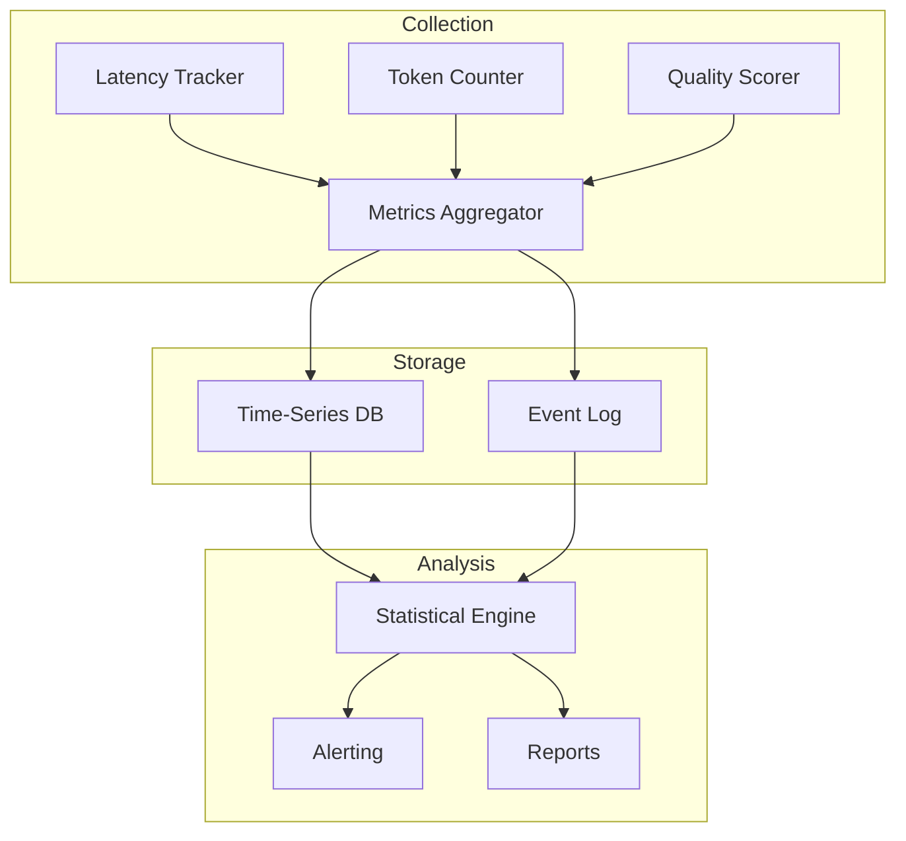

# npl-performance-monitor

Real-time metrics collection and performance analysis agent for NPL systems.

## Overview

`npl-performance-monitor` provides empirical measurement infrastructure for validating NPL performance claims. The agent tracks latency distributions, token consumption, response quality scores, and experiment results with minimal runtime overhead.

Primary use cases:
- Production monitoring with sub-second latency tracking
- A/B testing with statistical validation
- Regression detection within 5-minute windows
- Academic-grade reporting for research publication

## Architecture



### Components

| Component | Function |
|:----------|:---------|
| Latency Tracker | Captures P50/P95/P99 response times |
| Token Counter | Tracks input/output/total token usage |
| Quality Scorer | Evaluates response correctness and coherence |
| Metrics Aggregator | Combines streams into unified records |
| Statistical Engine | Computes significance, confidence intervals |
| Alerting | Triggers on threshold violations |

## Metrics Reference

### Latency Metrics

| Metric | Description | Unit |
|:-------|:------------|:-----|
| `latency.ttft` | Time to first token | ms |
| `latency.total` | Time to completion | ms |
| `latency.p50` | 50th percentile | ms |
| `latency.p95` | 95th percentile | ms |
| `latency.p99` | 99th percentile | ms |

### Token Metrics

| Metric | Description | Unit |
|:-------|:------------|:-----|
| `tokens.input` | Input token count | count |
| `tokens.output` | Output token count | count |
| `tokens.total` | Combined token count | count |
| `tokens.efficiency` | Output/Input ratio | ratio |
| `tokens.cache_hit_rate` | Prompt cache utilization | percentage |

### Quality Metrics

| Metric | Description | Range |
|:-------|:------------|:------|
| `quality.accuracy` | Correctness against ground truth | 0-1 |
| `quality.coherence` | Response logical consistency | 0-1 |
| `quality.completeness` | Coverage of required elements | 0-1 |
| `quality.composite` | Weighted combination | 0-1 |

### Cognitive Metrics

| Metric | Description | Unit |
|:-------|:------------|:-----|
| `cognitive.learning_time` | Time to proficiency | hours |
| `cognitive.error_rate` | User errors per session | count |
| `cognitive.adoption_rate` | Feature usage percentage | percentage |
| `cognitive.dropout_stage` | Abandonment point | stage |

## Commands

### start

Initialize a monitoring session.

```bash
@npl-performance-monitor start --experiment="<name>" [--config=<path>]
```

**Parameters:**
- `--experiment`: Session identifier for grouping metrics
- `--config`: YAML configuration file path (optional)

**Example:**
```bash
@npl-performance-monitor start --experiment="NPL-validation-2025-Q1"
```

### track

Monitor specific agent or workflow performance.

```bash
@npl-performance-monitor track agent=<name> [duration=<time>] [--metrics=<list>]
```

**Parameters:**
- `agent`: Target agent identifier(s), comma-separated
- `duration`: Monitoring window (e.g., `1h`, `30m`, `7d`)
- `--metrics`: Specific metrics to track (default: all)

**Example:**
```bash
@npl-performance-monitor track agent=npl-grader,npl-thinker duration=2h --metrics=latency,quality
```

### baseline

Capture performance baseline for comparison.

```bash
@npl-performance-monitor baseline [--save=<name>] [--samples=<n>]
```

**Parameters:**
- `--save`: Named baseline for later comparison
- `--samples`: Minimum sample count before saving (default: 100)

**Example:**
```bash
@npl-performance-monitor baseline --save=pre-optimization --samples=200
```

### compare

Compare current performance against baseline.

```bash
@npl-performance-monitor compare --baseline=<name> [--significance=<level>]
```

**Parameters:**
- `--baseline`: Named baseline to compare against
- `--significance`: Required p-value (default: 0.05)

**Output:**
```yaml
comparison:
  baseline: pre-optimization
  current: post-optimization
  metrics:
    latency.p50:
      baseline: 1250ms
      current: 980ms
      change: -21.6%
      p_value: 0.003
      significant: true
    tokens.efficiency:
      baseline: 1.2
      current: 1.5
      change: +25.0%
      p_value: 0.001
      significant: true
```

### experiment

Manage A/B testing experiments.

```bash
# Create experiment
@npl-performance-monitor experiment create \
  --control="<variant>" \
  --treatment="<variant>" \
  --duration=<time> \
  [--traffic-split=<ratio>]

# Analyze results
@npl-performance-monitor experiment analyze --id=<experiment_id>

# Stop experiment
@npl-performance-monitor experiment stop --id=<experiment_id>
```

**Parameters:**
- `--control`: Baseline variant identifier
- `--treatment`: Test variant identifier
- `--duration`: Experiment runtime
- `--traffic-split`: Control/treatment ratio (default: 50/50)

**Example:**
```bash
@npl-performance-monitor experiment create \
  --control="standard-prompts" \
  --treatment="npl-enhanced" \
  --duration=14d \
  --traffic-split=50/50
```

### report

Generate performance reports.

```bash
@npl-performance-monitor report \
  --format=<type> \
  --timerange=<period> \
  [--output=<path>]
```

**Formats:**
- `dashboard`: Interactive HTML dashboard
- `academic`: LaTeX-formatted tables and figures
- `csv`: Raw data export
- `json`: Structured data for programmatic use

**Example:**
```bash
@npl-performance-monitor report --format=academic --timerange=30d --output=results/
```

### alert

Configure performance alerts.

```bash
@npl-performance-monitor alert create \
  --metric=<name> \
  --condition=<expr> \
  --action=<handler>
```

**Example:**
```bash
@npl-performance-monitor alert create \
  --metric="latency.p95" \
  --condition=">2000" \
  --action="slack://alerts-channel"
```

## Configuration

### YAML Configuration Schema

```yaml
# monitor-config.yaml
experiment:
  name: "NPL Validation Study"
  version: "1.0"

collection:
  interval: 1000  # ms
  buffer_size: 1000

metrics:
  latency:
    enabled: true
    percentiles: [50, 95, 99]
  tokens:
    enabled: true
    track_cache: true
  quality:
    enabled: true
    rubric: "./quality-rubric.yaml"

storage:
  type: sqlite  # sqlite | postgres | influxdb
  path: ".npl/metrics/performance.db"
  retention: 90d

alerts:
  - metric: latency.p99
    threshold: 3000
    window: 5m
    action: log
  - metric: quality.accuracy
    threshold: 0.8
    comparison: "<"
    action: email

reporting:
  auto_generate: daily
  formats: [dashboard, csv]
  output_dir: "./reports"
```

### Environment Variables

| Variable | Description | Default |
|:---------|:------------|:--------|
| `NPL_MONITOR_INTERVAL` | Collection interval (ms) | 1000 |
| `NPL_MONITOR_BUFFER_SIZE` | In-memory buffer entries | 1000 |
| `NPL_MONITOR_DB_PATH` | Storage location | `.npl/metrics/` |
| `NPL_MONITOR_RETENTION` | Data retention period | 90d |
| `NPL_MONITOR_ALERT_EMAIL` | Alert recipient | none |
| `NPL_MONITOR_LOG_LEVEL` | Logging verbosity | INFO |

## Statistical Methods

### Power Analysis

Before experiments, calculate required sample size:

```bash
@npl-performance-monitor power-analysis \
  --effect-size=0.3 \
  --power=0.8 \
  --alpha=0.05
```

Output includes:
- Required samples per group
- Detectable effect size at current sample
- Duration estimate based on traffic

### Significance Testing

The agent applies appropriate statistical tests:

| Comparison | Test Used |
|:-----------|:----------|
| Two groups, continuous | Welch's t-test |
| Multiple groups | ANOVA with Tukey HSD |
| Proportions | Chi-square or Fisher exact |
| Time series | Mann-Kendall trend test |

All tests report:
- p-value
- Effect size (Cohen's d or similar)
- 95% confidence interval
- Practical significance assessment

### Multiple Comparisons

When analyzing multiple metrics, Bonferroni or Holm corrections prevent false positives:

```bash
@npl-performance-monitor experiment analyze \
  --id=exp_001 \
  --corrections=holm
```

## Workflow Examples

### Pre-Deployment Validation

```bash
# 1. Establish baseline
@npl-performance-monitor start --experiment="deploy-v2.1"
@npl-performance-monitor baseline --save=current-prod --samples=500

# 2. Test candidate
@npl-performance-monitor track agent=candidate-v2.1 duration=1h

# 3. Compare
@npl-performance-monitor compare --baseline=current-prod --significance=0.01

# 4. Generate deployment report
@npl-performance-monitor report --format=json --output=deploy-decision.json
```

### Research Publication Pipeline

```bash
# 1. Run controlled experiment
@npl-performance-monitor experiment create \
  --control="natural-language" \
  --treatment="npl-structured" \
  --duration=14d

# 2. Wait for completion, then analyze
@npl-performance-monitor experiment analyze --id=exp_npl_001

# 3. Generate academic-grade output
@npl-performance-monitor report \
  --format=academic \
  --timerange=14d \
  --output=paper-figures/

# 4. Hand off to research validator
@npl-research-validator verify --data=paper-figures/results.json
```

### Continuous Monitoring

```bash
# Start persistent monitoring
@npl-performance-monitor start --experiment="production" --config=prod-monitor.yaml

# View live dashboard
@npl-performance-monitor report --format=dashboard --live

# Check current status
@npl-performance-monitor status
```

## Integration

### With npl-claude-optimizer

```bash
# Baseline before optimization
@npl-performance-monitor baseline --save=before

# Run optimizer
@npl-claude-optimizer optimize --config=current.yaml

# Measure improvement
@npl-performance-monitor compare --baseline=before
```

### With npl-research-validator

```bash
# Generate data for validation
@npl-performance-monitor experiment analyze --id=exp_001 --output=results.csv

# Validate statistical claims
@npl-research-validator analyze --data=results.csv --corrections=bonferroni
```

### With npl-cognitive-load-assessor

```bash
# Track user metrics during cognitive assessment
@npl-performance-monitor track \
  --metrics=cognitive.learning_time,cognitive.error_rate \
  agent=npl-cognitive-load-assessor \
  duration=4h
```

## Output Formats

### Dashboard Output

Interactive HTML with:
- Real-time metric charts
- Percentile distribution graphs
- Experiment comparison tables
- Alert history timeline

### Academic Output

LaTeX-ready:
- Publication-quality figures (PDF/SVG)
- Properly formatted tables with captions
- Statistical result summaries
- Appendix with raw data references

### Structured Output

JSON schema for programmatic access:

```json
{
  "experiment": "NPL-validation-v1",
  "timerange": {
    "start": "2025-01-01T00:00:00Z",
    "end": "2025-01-14T23:59:59Z"
  },
  "metrics": {
    "latency": {
      "p50": { "value": 980, "unit": "ms", "ci_95": [950, 1010] },
      "p95": { "value": 1850, "unit": "ms", "ci_95": [1780, 1920] }
    },
    "quality": {
      "accuracy": { "value": 0.92, "ci_95": [0.89, 0.95] }
    }
  },
  "comparison": {
    "baseline": "standard",
    "improvement": {
      "latency.p50": { "change_pct": -21.6, "p_value": 0.003 },
      "quality.accuracy": { "change_pct": +8.2, "p_value": 0.012 }
    }
  }
}
```

## Performance Overhead

The agent operates with minimal impact:

| Metric | Overhead |
|:-------|:---------|
| Latency added | <5ms per request |
| Memory usage | ~50MB baseline |
| Storage growth | ~1KB per tracked request |
| CPU utilization | <1% during collection |

Overhead increases during report generation and statistical analysis; run these operations during low-traffic periods.

## Troubleshooting

### High Latency Variance

**Symptom:** P99 >> P50 (10x or more difference)

**Causes:**
- Cold start effects
- Context window overflow
- Network instability

**Resolution:**
```bash
@npl-performance-monitor analyze --metric=latency --breakdown=percentile
```

### Insufficient Statistical Power

**Symptom:** Experiments report "insufficient samples"

**Resolution:**
- Extend experiment duration
- Increase traffic to test variants
- Accept larger effect size threshold

### Alert Fatigue

**Symptom:** Too many false-positive alerts

**Resolution:**
- Increase alert window duration
- Adjust thresholds based on baseline variance
- Use composite metrics instead of individual

## See Also

- `npl-claude-optimizer` - Optimization based on monitor data
- `npl-research-validator` - Statistical validation of results
- `npl-cognitive-load-assessor` - User experience metrics
- `npl/pumps/npl-metrics.md` - Metrics pump integration
