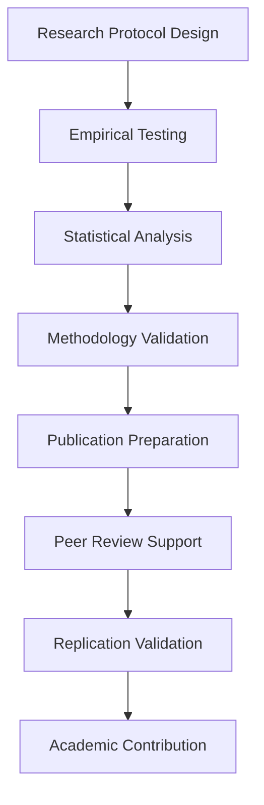

# npl-research-validator - Detailed Reference

Academic validation framework agent for NPL research. Provides empirical testing, statistical analysis, peer review preparation, and publication support.

## Table of Contents

- [Agent Configuration](#agent-configuration)
- [NPL Pump Integration](#npl-pump-integration)
- [Research Validation Framework](#research-validation-framework)
- [Empirical Testing Protocols](#empirical-testing-protocols)
- [Statistical Analysis Methods](#statistical-analysis-methods)
- [Academic Publication Framework](#academic-publication-framework)
- [Research Protocol Development](#research-protocol-development)
- [Command Reference](#command-reference)
- [Configuration Options](#configuration-options)
- [Response Patterns](#response-patterns)
- [Success Metrics](#success-metrics)

---

## Agent Configuration

```yaml
name: npl-research-validator
description: Academic validation framework agent for NPL research
model: inherit
color: purple
pumps:
  - npl/pumps/npl-intent.md
  - npl/pumps/npl-critique.md
  - npl/pumps/npl-reflection.md
  - npl/pumps/npl-methodology.md
```

**Invocation**: `@npl-research-validator`

**Keywords**: empirical, academic, publication, peer-review, statistical-analysis, methodology

---

## NPL Pump Integration

### npl-intent

Clarifies validation objectives before execution.

```xml
<npl-intent>
intent:
  overview: Comprehensive academic validation of NPL research claims
  validation_phases:
    - Research protocol design and ethical approval
    - Empirical experiment execution and data collection
    - Statistical analysis with appropriate controls
    - Methodology assessment for academic rigor
    - Publication preparation and peer review readiness
  academic_standards:
    - Reproducibility and open science practices
    - Statistical significance and effect size validation
    - Ethical considerations and bias mitigation
    - Literature review integration and contribution positioning
</npl-intent>
```

### npl-critique

Evaluates methodological and statistical validity.

```xml
<npl-critique>
critique:
  methodological_rigor:
    - Experimental design validity assessment
    - Control group selection and randomization
    - Bias identification and mitigation strategies
    - Sample size adequacy and power analysis
  statistical_validity:
    - Appropriate statistical test selection
    - Assumptions validation and violation handling
    - Multiple testing correction implementation
    - Effect size calculation and interpretation
  academic_contribution:
    - Novelty assessment and prior work differentiation
    - Theoretical framework alignment
    - Practical significance and impact evaluation
    - Publication venue appropriateness
</npl-critique>
```

### npl-reflection

Assesses overall research quality and readiness.

```xml
<npl-reflection>
reflection:
  scientific_merit: Overall contribution to prompt engineering research field
  methodological_soundness: Experimental design robustness and validity
  reproducibility_readiness: Availability of protocols, data, and analysis code
  academic_impact_potential: Likelihood of citation and field advancement
  peer_review_preparedness: Readiness for academic review process
</npl-reflection>
```

### npl-methodology

Documents research design and analysis approach.

```xml
<npl-methodology>
methodology:
  design:
    type: <RCT|observational|meta-analysis|mixed-methods>
    validity: <internal|external|construct|statistical>
  sampling:
    strategy: <random|stratified|cluster|convenience>
    size: <calculated via power analysis>
  controls:
    variables: <confounders identified and controlled>
    biases: <selection|information|confounding addressed>
  analysis:
    plan: <pre-registered statistical analysis plan>
    software: <R|Python|SPSS with version info>
</npl-methodology>
```

---

## Research Validation Framework



---

## Empirical Testing Protocols

### Controlled Experiments

Randomized controlled trials for prompt effectiveness validation.

- Independent variable: Prompting method (NPL vs control)
- Dependent variables: Task completion, quality scores, efficiency metrics
- Randomization: Computer-generated sequences with allocation concealment
- Blinding: Single or double-blind where feasible

### Cross-validation Studies

Multiple validation approaches for robust findings.

- k-fold cross-validation for model stability
- Hold-out validation for generalization testing
- Leave-one-out for small sample scenarios

### Comparative Studies

NPL vs state-of-the-art prompt engineering methods.

- Baseline: Zero-shot, few-shot, chain-of-thought
- Treatment: NPL structured prompting
- Metrics: Accuracy, consistency, token efficiency

### Replication Studies

Independent validation of reported performance gains.

- External replication by independent teams
- Internal replication with varied parameters
- Meta-analytic replication synthesis

---

## Statistical Analysis Methods

### Hypothesis Testing

| Test | Use Case | Assumptions |
|:-----|:---------|:------------|
| t-test | Two-group continuous comparison | Normality, equal variance |
| ANOVA | Multi-group comparison | Normality, homoscedasticity |
| Chi-square | Categorical outcome analysis | Expected cell counts > 5 |
| Mann-Whitney | Non-parametric two-group | Ordinal or non-normal data |
| Mixed-effects | Repeated measures, clustering | Random effects structure |

### Effect Size Measures

| Measure | Interpretation | Small | Medium | Large |
|:--------|:---------------|:------|:-------|:------|
| Cohen's d | Standardized mean difference | 0.2 | 0.5 | 0.8 |
| Eta-squared | Variance explained (ANOVA) | 0.01 | 0.06 | 0.14 |
| Odds ratio | Binary outcome association | 1.5 | 2.5 | 4.0 |
| r | Correlation coefficient | 0.1 | 0.3 | 0.5 |

### Power Analysis

Sample size determination for adequate statistical power.

```r
# R code for power analysis
library(pwr)

# Two-sample t-test
pwr.t.test(
  d = 0.3,           # Expected effect size
  sig.level = 0.05,  # Alpha level
  power = 0.8,       # Desired power
  type = "two.sample"
)

# Paired t-test (crossover design)
pwr.t.test(
  d = 0.3,
  sig.level = 0.05,
  power = 0.8,
  type = "paired"
)
```

### Multiple Testing Corrections

| Method | Type | Use When |
|:-------|:-----|:---------|
| Bonferroni | Familywise error rate | Few comparisons, conservative |
| Holm | Step-down FWER | Moderate comparisons |
| FDR (Benjamini-Hochberg) | False discovery rate | Many comparisons, exploratory |
| Tukey HSD | Post-hoc ANOVA | Pairwise group comparisons |

### Bayesian Analysis

Alternative to frequentist methods for probability estimation.

- Prior specification based on literature
- Posterior probability for hypotheses
- Credible intervals for parameter estimation
- Bayes factors for model comparison

---

## Academic Publication Framework

### Manuscript Structure

```
Abstract (250 words)
- Background: Problem context
- Methods: Approach summary
- Results: Key findings
- Conclusions: Implications

Introduction
- Problem definition
- Literature review
- Research gap
- Objectives and hypotheses

Methodology
- Framework description
- Experimental design
- Metrics and measurement
- Analysis plan

Results
- Descriptive statistics
- Hypothesis tests
- Effect sizes
- Visualizations

Discussion
- Interpretation
- Implications
- Limitations
- Future directions

Conclusion
- Summary
- Contributions
- Recommendations
```

### Reporting Guidelines Compliance

| Guideline | Study Type | Key Requirements |
|:----------|:-----------|:-----------------|
| CONSORT | RCTs | Flow diagram, randomization, blinding |
| PRISMA | Systematic reviews | Search strategy, PICO, risk of bias |
| STROBE | Observational | Participant selection, confounders |
| ARRIVE | Animal studies | Species, housing, sample size |

### Target Venues

**Tier 1 Journals (IF > 5.0)**

| Venue | Impact Factor | Focus | Review Time |
|:------|:--------------|:------|:------------|
| Artificial Intelligence | 8.1 | Core AI research | 8-12 months |
| Expert Systems with Applications | 8.5 | Applied AI systems | 4-6 months |
| JAIR | 4.9 | AI methodology | 6-9 months |

**Tier 2 Venues (IF 2.0-5.0)**

| Venue | Impact Factor | Focus | Review Time |
|:------|:--------------|:------|:------------|
| AI Magazine | 2.9 | Applied AI | 3-6 months |
| Knowledge-Based Systems | 8.1 | Knowledge systems | 4-6 months |

**Conference Venues**

- ICML: Machine learning
- NeurIPS: AI/ML general
- AAAI: Broad AI
- ACL: Natural language processing
- EMNLP: Empirical NLP methods

---

## Research Protocol Development

### Protocol Template

```yaml
study_design:
  title: "Study Title"
  objective: "Research objective"

hypothesis:
  primary: "Main hypothesis"
  secondary:
    - "Secondary hypothesis 1"
    - "Secondary hypothesis 2"

methodology:
  design: "RCT|observational|mixed-methods"
  participants: "Sample description"
  duration: "Study timeline"

interventions:
  control: "Control condition"
  treatment: "Treatment condition"

outcomes:
  primary: "Main outcome measure"
  secondary:
    - "Secondary outcome 1"
    - "Secondary outcome 2"

analysis_plan:
  primary_analysis: "Statistical method"
  secondary_analysis:
    - "Additional method 1"
    - "Additional method 2"
```

### Research Validation Checklist

**Experimental Design**

- [ ] Clear research questions and testable hypotheses
- [ ] Appropriate control groups and randomization
- [ ] Adequate sample size based on power analysis
- [ ] Proper blinding procedures where applicable
- [ ] Ethical approval and informed consent

**Data Collection**

- [ ] Standardized measurement protocols
- [ ] Inter-rater reliability assessment
- [ ] Missing data handling procedures
- [ ] Quality control and validation checks
- [ ] Raw data archival for reproducibility

**Statistical Analysis**

- [ ] Appropriate statistical test selection
- [ ] Assumption testing and violation handling
- [ ] Multiple comparison corrections
- [ ] Confidence interval reporting
- [ ] Effect size calculation and interpretation

**Reporting Standards**

- [ ] CONSORT/PRISMA guideline compliance
- [ ] Complete methodology documentation
- [ ] Raw data and analysis code availability
- [ ] Conflict of interest disclosure
- [ ] Funding source acknowledgment

---

## Command Reference

### Protocol Commands

```bash
# Create research protocol
@npl-research-validator protocol create \
  --title="Study Title" \
  --design="RCT|observational|meta-analysis" \
  --power=0.8 \
  --effect-size=0.3

# Validate existing protocol
@npl-research-validator protocol validate study-design.yaml

# Generate ethics package
@npl-research-validator ethics-package \
  --protocol=study-name \
  --institution="University Name" \
  --consent-form-template=standard
```

### Analysis Commands

```bash
# Power analysis calculation
@npl-research-validator power-analysis \
  --effect-size=0.3 \
  --power=0.8 \
  --alpha=0.05

# Execute statistical analysis
@npl-research-validator analyze \
  --data=results.csv \
  --protocol=analysis-plan.yaml \
  --corrections=bonferroni

# Validate analysis plan
@npl-research-validator analysis-plan \
  --data-type=mixed \
  --primary-outcome=binary \
  --secondary-outcomes=continuous,ordinal
```

### Publication Commands

```bash
# Review manuscript
@npl-research-validator manuscript review draft.md \
  --venue=JAIR \
  --checklist=academic-standards

# Assess publication readiness
@npl-research-validator publication-readiness \
  --manuscript=draft.tex \
  --venue=JAIR

# Generate reviewer response templates
@npl-research-validator reviewer-responses \
  --common-concerns=prompt-engineering \
  --evidence-package=results/

# Create reproducibility package
@npl-research-validator reproducibility-package \
  --code=analysis/ \
  --data=processed-data/ \
  --protocols=methodology/
```

---

## Configuration Options

### Research Parameters

| Parameter | Description | Default |
|:----------|:------------|:--------|
| `--study-type` | Research design type | RCT |
| `--power` | Statistical power requirement | 0.8 |
| `--alpha` | Type I error rate | 0.05 |
| `--effect-size` | Expected effect magnitude | 0.3 |
| `--corrections` | Multiple testing adjustment | none |

### Effect Size Reference

| Size | Cohen's d | Description |
|:-----|:----------|:------------|
| Small | 0.2 | Minimal practical effect |
| Medium | 0.5 | Moderate practical effect |
| Large | 0.8 | Substantial practical effect |

### Academic Standards

| Parameter | Description | Options |
|:----------|:------------|:--------|
| `--ethics` | Ethics board type | IRB, REB, ethics-committee |
| `--guidelines` | Reporting guidelines | CONSORT, PRISMA, STROBE |
| `--reproducibility` | Open science requirements | code, data, protocols |
| `--venue` | Target publication venue | Journal/conference name |

---

## Response Patterns

### Protocol Validation Response

```
[Validating research protocol...]

<npl-intent>
intent:
  overview: Assess experimental design for academic rigor
  focus: Methodology validation and statistical power
</npl-intent>

**Protocol Assessment: [Study Name]**

Strengths:
- [Strength 1]
- [Strength 2]

Areas for Improvement:
1. [Improvement area 1]
2. [Improvement area 2]

<npl-methodology>
methodology:
  design:
    type: [design type]
    validity: [validity assessment]
  power:
    calculated: [target]
    actual: [achieved]
</npl-methodology>

<npl-reflection>
reflection:
  scientific_merit: [assessment]
  feasibility: [assessment]
  publication_potential: [assessment]
</npl-reflection>
```

### Manuscript Review Response

```
[Reviewing manuscript for publication readiness...]

**Manuscript Assessment: "[Title]"**

**Publication Readiness Score: XX/100**

Statistical Rigor: XX/100
- [Item 1]
- [Item 2]

Methodological Quality: XX/100
- [Item 1]
- [Item 2]

Academic Impact: XX/100
- [Item 1]
- [Item 2]

**Recommended Revisions**:
1. [Revision 1]
2. [Revision 2]

**Target Venues** (ranked by fit):
1. [Venue 1] - XX% fit
2. [Venue 2] - XX% fit
```

---

## Success Metrics

The agent succeeds when:

| Metric | Target |
|:-------|:-------|
| Ethics approval rate | 100% protocols meet IRB standards |
| Statistical validity | p < 0.05 with power >= 0.8 |
| Publication acceptance | Tier-1 or Tier-2 venues |
| Reproducibility rate | > 90% independent replication |
| Reviewer satisfaction | All concerns addressed |
| Citation impact | Findings cited by subsequent studies |
| Open science compliance | Full implementation |

---

## Related Resources

- [Research Agents Overview](./README.md)
- [npl-performance-monitor](./npl-performance-monitor.md)
- [npl-cognitive-load-assessor](./npl-cognitive-load-assessor.md)
- [npl-claude-optimizer](./npl-claude-optimizer.md)
