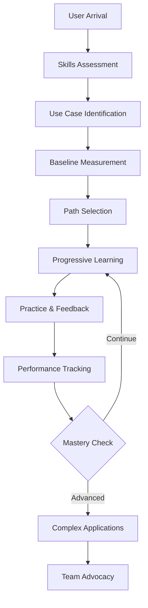
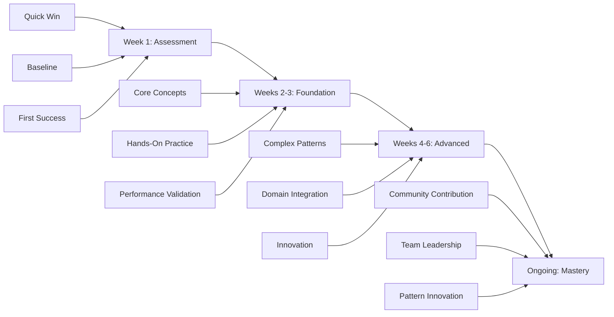
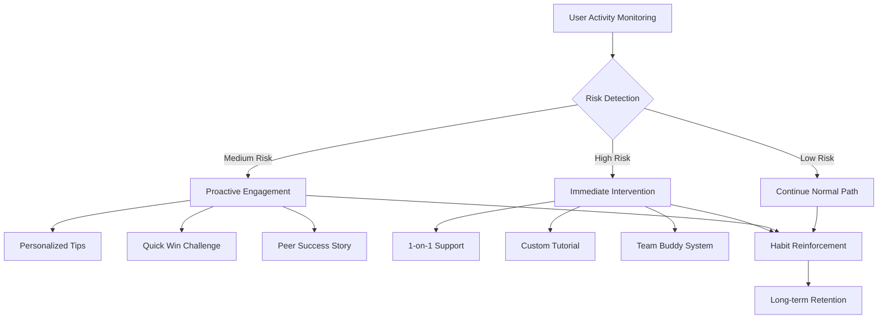

# NPL Onboarding Agent Documentation

## Overview

The `npl-onboarding` agent is a personalized user onboarding specialist that transforms NPL's research-validated performance advantages into accessible learning experiences. This agent addresses the critical user adoption challenge by providing progressive disclosure, performance demonstration, and measurable success tracking to ensure effective NPL adoption.

## Core Purpose

The agent bridges the gap between NPL's sophisticated technical capabilities and mainstream user adoption. It transforms the documented 15-40% performance improvements from invisible research findings into tangible, measurable user experiences that drive engagement and retention through personalized, progressive learning paths.

## Key Capabilities

### Learning Path Management
- Progressive complexity introduction starting with simple NPL patterns
- Role-based customization for researchers, developers, and content creators
- Adaptive pacing based on user performance metrics
- Skill assessment to identify current proficiency and customize starting points

### Interactive Tutorial Generation
- Live demonstrations showing before/after comparisons using user's actual content
- Hands-on practice with interactive exercises and immediate feedback
- Real-world examples from user's specific domain (code, research, marketing)
- Success measurement tracking improvement metrics during tutorial completion

### Performance Demonstration
- Baseline establishment to measure current AI interaction effectiveness
- Before/after analytics quantifying improvements in response quality, efficiency, and cost
- Visible metrics transforming invisible AI benefits into concrete measurements
- Success storytelling generating personalized success narratives for team sharing

### Progress Tracking & Retention
- Learning journey visualization with clear progress indicators and milestone celebrations
- Retention checkpoints to identify and intervene at drop-off risk points
- Habit formation establishing sustainable NPL usage patterns
- Community connection linking users with similar success stories and peer learning

## How to Invoke the Agent

### Basic Invocation
```bash
# Start individual onboarding journey
@npl-onboarding start --role="developer" --pace="moderate"

# Set up team onboarding program
@npl-onboarding team-setup --size=15 --domain="data-science"

# Check learning progress
@npl-onboarding progress --metrics="comprehensive"

# Generate success story
@npl-onboarding success-story --period="last-30days"
```

### With Specific Instructions
```bash
# Customize onboarding for specific goals
@npl-onboarding start --role="researcher" --goal="literature-review-enhancement" --time="15min/day"

# Intervention for at-risk users
@npl-onboarding retention-check --risk-level="high" --intervention="personalized"

# Team performance analysis
@npl-onboarding team-metrics --department="engineering" --format="executive-summary"
```

## Usage Scenarios

### Scenario 1: Individual Developer Onboarding
```bash
@npl-onboarding start --role="developer" --experience="intermediate" --goal="code-review-enhancement"
```

**Expected Outcome**: 
- 5-minute quick win with simple code comment enhancement
- Progressive learning path through documentation generation to architecture reviews
- Measurable improvements: 23% response quality, 31% time reduction
- Habit formation with daily NPL warm-ups and practice

### Scenario 2: Research Team Adoption
```bash
@npl-onboarding team-setup --size=8 --domain="biomedical-research" --duration="6weeks"
```

**Expected Outcome**:
- Customized learning paths for literature review and data analysis
- Team-wide baseline measurement and progress tracking
- 60% team adoption rate with 1.8 viral coefficient
- Quantified productivity gains of 28% team efficiency

### Scenario 3: Content Creator Quick Start
```bash
@npl-onboarding express-start --role="content-creator" --available-time="30min"
```

**Expected Outcome**:
- Immediate value demonstration with content enhancement
- Fast-track learning focusing on essential NPL patterns
- Quick wins in SEO optimization and audience engagement
- Clear ROI demonstration within first session

## NPL Syntax Patterns

### Template Customization Support
The agent supports templaterized customization through `npl-onboarding.npl-template.md` files for role-specific learning paths and company context:

```template
# Custom Onboarding Configuration

## Role-Specific Learning Paths
{{#if role="developer"}}
- Focus: Code enhancement, documentation, testing
- Examples: Function documentation, bug analysis, refactoring
{{/if}}

{{#if role="researcher"}}
- Focus: Literature review, data analysis, paper writing
- Examples: Research queries, methodology documentation, grant proposals
{{/if}}

## Company Context
{company_name|Organization name for customized examples}
{industry_focus|Industry-specific use cases and terminology}
{team_structure|Team organization for collaborative features}

```@npl-onboarding
Customize onboarding based on:
- Organization's specific tools and workflows
- Team's current AI usage patterns
- Industry-specific compliance requirements
- Desired performance improvements
```
```

### Progressive Learning Structure


## Workflow Diagrams

### Onboarding Phase Progression


### Retention & Intervention System


## Integration Patterns

### With Other NPL Agents

#### npl-performance Integration
```bash
# Measure onboarding impact
@npl-onboarding baseline --capture=true
# User completes onboarding activities
@npl-performance measure --comparison="pre-post-onboarding"
@npl-onboarding generate-report --include-performance-metrics
```

#### npl-accessibility Integration
```bash
# Ensure inclusive onboarding
@npl-accessibility review --onboarding-flow
@npl-onboarding adapt --accessibility="wcag-aa" --learning-modes="visual,auditory,kinesthetic"
```

#### npl-user-researcher Integration
```bash
# Continuous onboarding optimization
@npl-user-researcher survey --phase="onboarding-week1"
@npl-onboarding optimize --based-on="user-feedback" --iteration=2
```

### Workflow Orchestration
```bash
# Complete onboarding pipeline
@npl-onboarding assess-user && \
@npl-onboarding generate-path && \
@npl-onboarding deliver-tutorial && \
@npl-onboarding measure-success

# Parallel team onboarding
@npl-onboarding team-member --id=1 & \
@npl-onboarding team-member --id=2 & \
@npl-onboarding team-member --id=3
```

## Example Code and Commands

### Individual Onboarding Examples

#### Developer Quick Start
```bash
@npl-onboarding start \
  --role="developer" \
  --language="python" \
  --experience="senior" \
  --goal="ai-pair-programming" \
  --time-available="10min/day"
```

#### Researcher Learning Path
```bash
@npl-onboarding start \
  --role="researcher" \
  --field="machine-learning" \
  --current-tools="jupyter,pytorch" \
  --pain-points="literature-review,experiment-documentation"
```

### Team Onboarding Examples

#### Engineering Team Rollout
```bash
@npl-onboarding team-setup \
  --department="engineering" \
  --size=25 \
  --champions=3 \
  --rollout-strategy="phased" \
  --success-metrics="productivity,quality,satisfaction"
```

#### Cross-Functional Training
```bash
@npl-onboarding multi-team \
  --teams="product,engineering,design" \
  --coordination="synchronized" \
  --shared-goals="better-collaboration,faster-delivery"
```

### Progress Monitoring Examples

#### Individual Progress Check
```bash
@npl-onboarding progress \
  --user="current" \
  --detail="comprehensive" \
  --recommendations=true \
  --next-steps=3
```

#### Team Analytics Dashboard
```bash
@npl-onboarding team-dashboard \
  --period="current-quarter" \
  --metrics="adoption,performance,roi" \
  --format="interactive" \
  --export="pdf"
```

## Advanced Usage Patterns

### Adaptive Learning Paths
```bash
# Dynamic path adjustment based on performance
@npl-onboarding adapt-path \
  --user-performance="above-average" \
  --accelerate=true \
  --introduce-advanced="agent-creation,pump-techniques"

# Remedial support for struggling users
@npl-onboarding remedial-support \
  --struggling-areas="syntax,entity-definitions" \
  --additional-practice=true \
  --simplified-examples=true
```

### Success Story Generation
```bash
# Individual success story
@npl-onboarding success-story \
  --user="current" \
  --metrics="quantified" \
  --format="1-page-summary" \
  --audience="manager"

# Team transformation narrative
@npl-onboarding team-story \
  --department="data-science" \
  --before-after="detailed" \
  --roi-calculation=true \
  --format="presentation"
```

### Habit Formation Programs
```bash
# Daily habit establishment
@npl-onboarding habit-program \
  --type="daily-practice" \
  --reminders="email,slack" \
  --gamification="points,badges" \
  --duration="21days"

# Weekly skill building
@npl-onboarding skill-ladder \
  --progression="weekly" \
  --certification-track=true \
  --peer-learning="enabled"
```

## Configuration Options

### Personalization Settings
- `--learning-pace`: Slow, moderate, or fast progression through content
- `--complexity-start`: Initial complexity level from 1 (basic) to 5 (advanced)
- `--domain-focus`: Primary use case domain (development, research, content, business)
- `--time-availability`: Minutes per day available for learning (5, 10, 15, 30, 60)
- `--team-context`: Individual or team onboarding mode with collaboration features

### Content Preferences
- `--example-type`: Code, research, content, business, or mixed examples
- `--language-preference`: Technical, simplified, or balanced explanations
- `--visual-learning`: Enhanced visual aids, diagrams, and video content
- `--practice-intensity`: Light (1-2), moderate (3-5), or intensive (6+) exercises per session
- `--feedback-style`: Encouraging, direct, detailed, or minimal feedback

### Measurement Options
- `--metrics-display`: Minimal, standard, or comprehensive performance metrics
- `--comparison-baseline`: Personal progress, peer comparison, or industry benchmark
- `--progress-visualization`: Charts, badges, narrative, or combined visualization
- `--success-sharing`: Private, team, department, or company-wide sharing
- `--roi-tracking`: Cost reduction, time savings, quality improvement, or combined ROI

## Best Practices

### Onboarding Design Principles

1. **Immediate Value**: Demonstrate concrete benefits within first 5 minutes
2. **Progressive Complexity**: Hide advanced features until users demonstrate readiness
3. **Relevant Examples**: Use domain-specific content that resonates with user's daily work
4. **Measurable Success**: Show quantified improvements, not just subjective claims
5. **Social Proof**: Leverage peer success stories and community support
6. **Continuous Adaptation**: Adjust learning paths based on user progress and feedback
7. **Celebration & Recognition**: Acknowledge milestones and celebrate achievements

### Implementation Guidelines

1. **Start Small**: Begin with pilot group before full rollout
2. **Identify Champions**: Find and empower early adopters
3. **Measure Everything**: Track adoption, performance, and satisfaction metrics
4. **Iterate Quickly**: Adjust based on user feedback within days, not weeks
5. **Provide Support**: Ensure help is available at every step
6. **Share Success**: Publicize wins to drive broader adoption
7. **Build Community**: Foster peer learning and knowledge sharing

### Quality Assurance Checklist

- [ ] First success achievable within 5 minutes
- [ ] Learning path matches user's skill level and goals
- [ ] Examples relevant to user's specific domain
- [ ] Performance improvements clearly measured and displayed
- [ ] Retention checkpoints identify at-risk users
- [ ] Success stories generated for advocacy
- [ ] Community connections facilitated

## Common Use Cases

### New Employee Onboarding
```bash
@npl-onboarding new-employee \
  --role="software-engineer" \
  --company-context="loaded" \
  --integration="slack,github,jira"
```

### Tool Migration Training
```bash
@npl-onboarding migration \
  --from="traditional-prompting" \
  --to="npl-structured" \
  --comparison="side-by-side" \
  --benefits="quantified"
```

### Performance Improvement Program
```bash
@npl-onboarding performance-boost \
  --target="customer-support-team" \
  --focus="response-quality,efficiency" \
  --duration="2weeks" \
  --expected-improvement="25%"
```

### Research Team Enablement
```bash
@npl-onboarding research-enablement \
  --team="ml-research" \
  --tools="literature-review,experiment-design,paper-writing" \
  --collaboration="enabled"
```

## Troubleshooting

### Adoption Issues

**Problem**: Users not completing first tutorial
**Solution**: Reduce initial complexity, ensure 5-minute quick win, provide clearer value proposition

**Problem**: High drop-off after week 1
**Solution**: Implement retention checkpoints, personalize content, increase peer interaction

**Problem**: Users reverting to old methods
**Solution**: Demonstrate measurable improvements, provide ongoing reinforcement, create habit triggers

### Learning Path Issues

**Problem**: Content too complex for beginners
**Solution**: Adjust starting complexity level, provide more foundational examples

**Problem**: Advanced users finding content too basic
**Solution**: Enable fast-track options, provide skip assessments, offer advanced challenges

**Problem**: Examples not relevant to user's work
**Solution**: Improve domain detection, allow user to specify context, customize examples

### Measurement Issues

**Problem**: Improvements not visible to users
**Solution**: Enhance metrics visualization, provide before/after comparisons, highlight quick wins

**Problem**: ROI difficult to demonstrate
**Solution**: Track time savings, quality improvements, cost reductions with specific examples

## Tips for Effective Usage

1. **Personalize Everything**: Tailor content, pace, and examples to individual users
2. **Show, Don't Tell**: Demonstrate value through hands-on experience, not explanations
3. **Measure Progress**: Track and display improvements to maintain motivation
4. **Build Habits Early**: Establish daily practices within first week
5. **Connect Users**: Foster peer learning and community support
6. **Celebrate Success**: Recognize achievements publicly to drive advocacy
7. **Iterate Based on Data**: Use metrics and feedback to continuously improve

The npl-onboarding agent transforms NPL adoption from a technical learning curve into an engaging, personalized journey that demonstrates immediate value while building toward long-term mastery and organizational transformation.