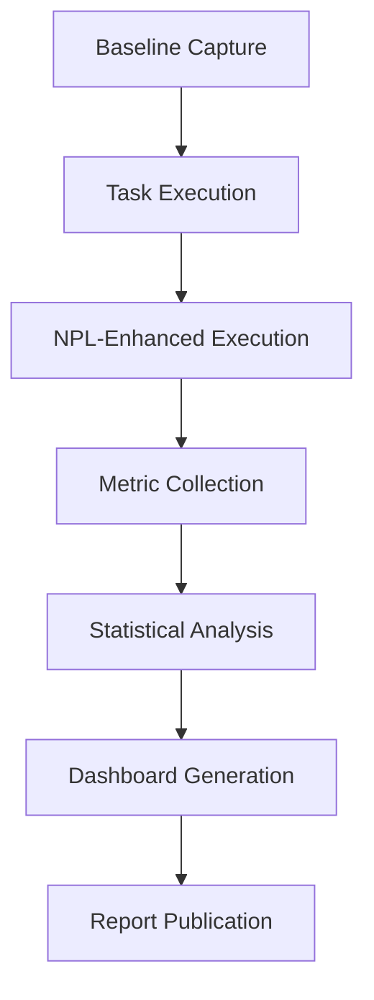
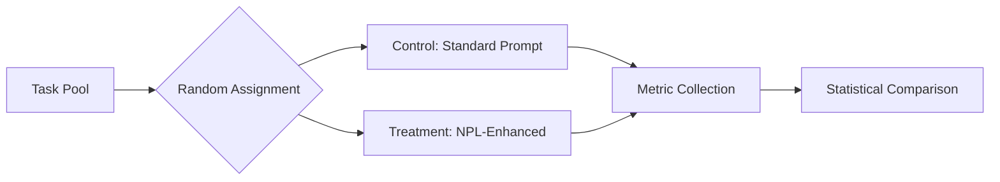
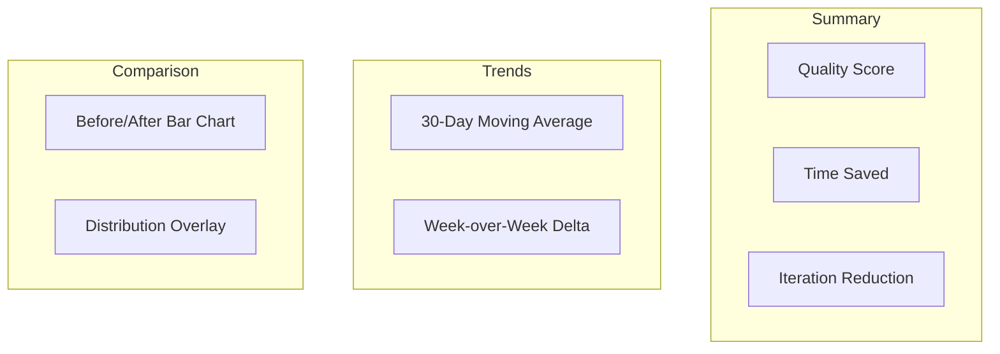

# npl-performance Detailed Reference

User performance measurement specialist that transforms invisible AI improvements into tangible metrics through baseline capture, A/B testing, statistical validation, and analytics dashboards.

**Source**: `core/additional-agents/user-experience/npl-performance.md`

---

## Table of Contents

- [Overview](#overview)
- [Measurement Framework](#measurement-framework)
- [Baseline Capture](#baseline-capture)
- [A/B Testing](#ab-testing)
- [Statistical Validation](#statistical-validation)
- [Dashboard Generation](#dashboard-generation)
- [Commands Reference](#commands-reference)
- [Report Formats](#report-formats)
- [Configuration Options](#configuration-options)
- [Usage Examples](#usage-examples)
- [Integration Patterns](#integration-patterns)
- [Best Practices](#best-practices)
- [Limitations](#limitations)

---

## Overview

The `@npl-performance` agent addresses a fundamental UX challenge: users cannot perceive 15-40% improvements in AI-assisted tasks until those improvements are measured and visualized. This agent provides the measurement infrastructure to transform abstract benefits into concrete, defensible metrics.



### Core Functions

| Function | Description |
|:---------|:------------|
| Baseline Capture | Establish pre-NPL performance measurements |
| A/B Testing | Controlled experiments comparing approaches |
| Statistical Validation | Effect size, significance, confidence intervals |
| Dashboard Generation | Real-time visualization of trends |
| Report Generation | Peer-reviewable validation documentation |

### Measurement Philosophy

The agent follows evidence-based measurement principles:

1. **Measure before optimizing**: Capture baselines before any NPL implementation
2. **Control for variables**: Isolate NPL's contribution from other factors
3. **Statistical rigor**: Report confidence intervals, not point estimates
4. **Longitudinal tracking**: Detect improvement trends over time

---

## Measurement Framework

### Metrics Categories

The agent tracks four primary metric categories:

| Category | Metrics | Collection Method |
|:---------|:--------|:------------------|
| Quality | Accuracy, completeness, error rate | Rubric scoring, automated validation |
| Speed | Task completion time, time-to-first-output | Timestamp delta |
| Efficiency | Iteration count, revision frequency | Interaction logging |
| Satisfaction | User rating, NPS, task confidence | Post-task survey |

### Quality Metrics

Quality measurement uses multi-dimensional scoring:

**Accuracy**: Correctness of output against ground truth or expert evaluation
- Binary (correct/incorrect) for discrete tasks
- Scaled (0-100) for continuous quality assessment

**Completeness**: Coverage of required elements
- Checklist completion rate
- Missing component count

**Error Rate**: Defects per unit of output
- Syntax errors
- Logic errors
- Omissions

### Speed Metrics

Temporal measurements capture efficiency gains:

**Task Completion Time**: Total time from task start to acceptable output

**Time-to-First-Output**: Latency before initial response

**Edit Cycles**: Number of refinement iterations required

### Satisfaction Metrics

Subjective measurements capture user perception:

**Confidence Score**: User's self-reported confidence in output quality (1-10)

**Effort Rating**: Perceived cognitive load (1-10)

**Net Promoter Score**: Likelihood to recommend NPL-enhanced workflow

---

## Baseline Capture

Baselines establish reference points for improvement measurement.

### Baseline Types

| Type | Description | Use Case |
|:-----|:------------|:---------|
| Individual | Single user's pre-NPL performance | Personal improvement tracking |
| Cohort | Group average pre-NPL performance | Team-level analysis |
| Task | Specific task type baseline | Task-specific optimization |
| Rolling | Moving average baseline | Long-term trend detection |

### Capture Process

```
captureBaseline(task_type, duration, metrics)
  INPUT:
    task_type: Category of work being measured
    duration: Minimum capture period (recommended: 5+ samples)
    metrics: List of metrics to capture
  PROCESS:
    1. Disable NPL enhancements for baseline period
    2. Execute standard workflow for each task
    3. Capture specified metrics automatically
    4. Calculate mean, standard deviation, confidence intervals
  OUTPUT:
    baseline:
      mean: Average performance
      std_dev: Variation measure
      n: Sample count
      ci_95: 95% confidence interval
```

### Baseline Quality Criteria

Baselines must meet minimum quality standards:

| Criterion | Requirement |
|:----------|:------------|
| Sample size | n >= 5 tasks |
| Consistency | CV < 50% (coefficient of variation) |
| Recency | Captured within last 30 days |
| Task match | Same task type as comparison |

---

## A/B Testing

Controlled experiments isolate NPL's contribution to performance improvements.

### Experiment Design



### Design Parameters

| Parameter | Description | Default |
|:----------|:------------|:--------|
| `--control` | Control condition specification | Standard prompt |
| `--treatment` | Treatment condition specification | NPL-enhanced prompt |
| `--iterations` | Number of trials per condition | 10 |
| `--randomization` | Assignment method | Balanced random |
| `--blinding` | Blinding protocol | Single-blind |

### Randomization Methods

| Method | Description |
|:-------|:------------|
| `balanced` | Equal samples per condition |
| `stratified` | Balance across user segments |
| `adaptive` | Shift allocation toward better-performing |
| `block` | Randomize within fixed-size blocks |

### Carryover Control

For within-subject designs, control for learning effects:

- **Counterbalancing**: Alternate condition order
- **Washout period**: Gap between conditions
- **Baseline reset**: Re-establish baseline between conditions

---

## Statistical Validation

The agent applies rigorous statistical methods to validate improvements.

### Effect Size Calculation

Effect sizes quantify improvement magnitude independent of sample size:

**Cohen's d**: For continuous metrics

```
d = (mean_treatment - mean_control) / pooled_std_dev
```

| d Value | Interpretation |
|:--------|:---------------|
| 0.2 | Small effect |
| 0.5 | Medium effect |
| 0.8 | Large effect |

**Relative Improvement**: Percentage change

```
improvement = (treatment - control) / control * 100%
```

### Significance Testing

| Test | Use Case | Assumption |
|:-----|:---------|:-----------|
| t-test | Compare two means | Normal distribution |
| Mann-Whitney U | Compare two medians | Non-parametric |
| ANOVA | Compare multiple groups | Normal, equal variance |
| Kruskal-Wallis | Multiple groups, non-parametric | Ordinal or continuous |

### Confidence Intervals

All metrics report 95% confidence intervals by default:

```
ci_95 = mean +/- (t_critical * standard_error)
```

Interpret as: "We are 95% confident the true improvement lies within this range."

### Power Analysis

Pre-study power analysis determines required sample size:

```
required_n = f(effect_size, alpha, power, std_dev)
```

| Power | Description |
|:------|:------------|
| 0.80 | 80% chance of detecting true effect (minimum) |
| 0.90 | 90% chance (recommended) |
| 0.95 | 95% chance (rigorous) |

---

## Dashboard Generation

Real-time analytics dashboards visualize performance trends.

### Dashboard Components

| Component | Content |
|:----------|:--------|
| Summary Cards | Key metrics with trend indicators |
| Time Series | Performance over time |
| Comparison Charts | Control vs treatment |
| Distribution Plots | Metric distributions |
| Statistical Summary | Effect sizes, confidence intervals |

### Visualization Types



### Dashboard Timeframes

| Timeframe | Aggregation | Refresh Rate |
|:----------|:------------|:-------------|
| `daily` | Per-day averages | Every 24h |
| `weekly` | 7-day windows | Every 7 days |
| `monthly` | 30-day windows | Every 30 days |
| `rolling` | Configurable window | Continuous |

---

## Commands Reference

### baseline

Establish performance baseline before NPL implementation.

```bash
@npl-performance baseline --task="<task-type>" --duration="<time>" --metrics="<metric-list>"
```

| Option | Description | Default |
|:-------|:------------|:--------|
| `--task` | Task category to measure | Required |
| `--duration` | Minimum capture period | 5min |
| `--metrics` | Comma-separated metrics | quality,time,satisfaction |
| `--samples` | Minimum sample count | 5 |
| `--output` | Baseline file path | .npl/baselines/<task>.json |

### compare

Run A/B comparison between control and treatment conditions.

```bash
@npl-performance compare --control="<spec>" --treatment="<spec>" --iterations=<n>
```

| Option | Description | Default |
|:-------|:------------|:--------|
| `--control` | Control condition | Required |
| `--treatment` | Treatment condition | Required |
| `--iterations` | Trials per condition | 10 |
| `--metrics` | Metrics to compare | quality,time,satisfaction |
| `--randomization` | Assignment method | balanced |
| `--significance` | Alpha level | 0.05 |

### measure

Capture performance metrics for a single task or session.

```bash
@npl-performance measure --task="<task-type>" --compare=<baseline>
```

| Option | Description | Default |
|:-------|:------------|:--------|
| `--task` | Task being measured | Required |
| `--compare` | Baseline to compare against | none |
| `--after-onboarding` | Compare with pre-onboarding | false |
| `--accessibility-enabled` | Note accessibility context | false |

### dashboard

Generate analytics dashboard with trend visualization.

```bash
@npl-performance dashboard --timeframe="<period>" --visualizations="<types>"
```

| Option | Description | Default |
|:-------|:------------|:--------|
| `--timeframe` | Data window | 30days |
| `--visualizations` | Chart types | trends,stats,insights |
| `--format` | Output format | html |
| `--refresh` | Auto-refresh interval | none |

### report

Generate statistical validation report.

```bash
@npl-performance report --study-period="<range>" --confidence=<level> --format="<type>"
```

| Option | Description | Default |
|:-------|:------------|:--------|
| `--study-period` | Date range (YYYY-MM-DD:YYYY-MM-DD) | last 30 days |
| `--confidence` | Confidence level (%) | 95 |
| `--format` | Report type | executive-summary |
| `--methodology` | Include methods section | true |

### correlate

Correlate performance metrics with external data sources.

```bash
@npl-performance correlate --data-source="<source>" --metrics="<metric-list>"
```

| Option | Description | Default |
|:-------|:------------|:--------|
| `--data-source` | External data source | Required |
| `--metrics` | Metrics to correlate | all |
| `--method` | Correlation method | pearson |

---

## Report Formats

### Executive Summary

High-level overview for stakeholders:

```
# Performance Report: Executive Summary

## Key Findings
- Quality improved [X]% (95% CI: [Y-Z]%)
- Task completion time reduced [X]% (95% CI: [Y-Z]%)
- User satisfaction increased [X] points

## Statistical Confidence
Effect sizes and significance levels for each metric.

## Recommendations
Prioritized actions based on findings.
```

### Detailed Technical Report

Full methodology and analysis:

```
# Performance Validation Report

## Study Design
- Period: [dates]
- Sample size: n=[X] control, n=[Y] treatment
- Randomization: [method]
- Blinding: [protocol]

## Methodology
### Baseline Capture
[Description of baseline process]

### Intervention
[NPL implementation details]

### Measurement
[Metric collection procedures]

## Results
### Primary Outcomes
[Effect sizes, confidence intervals, p-values]

### Secondary Outcomes
[Additional metrics]

### Subgroup Analysis
[Segment-specific findings]

## Discussion
### Limitations
[Study constraints]

### Threats to Validity
[Potential confounds]

## Conclusions
[Summary and implications]

## Appendix
### Raw Data Summary
### Statistical Tests
### Power Analysis
```

---

## Configuration Options

### Environment Variables

| Variable | Description | Default |
|:---------|:------------|:--------|
| `NPL_PERFORMANCE_BASELINE_PATH` | Baseline storage location | .npl/baselines |
| `NPL_PERFORMANCE_CONFIDENCE` | Default confidence level | 95 |
| `NPL_PERFORMANCE_MIN_SAMPLES` | Minimum sample requirement | 5 |
| `NPL_PERFORMANCE_EFFECT_THRESHOLD` | Minimum reportable effect | 0.2 |

### Runtime Flags

```
@npl-performance.strict_validation = true
@npl-performance.auto_baseline = true
@npl-performance.dashboard_refresh = "1h"
```

---

## Usage Examples

### Basic Performance Tracking

```bash
# Capture baseline
@npl-performance baseline --task="code-review" --duration="5min"

# Implement NPL enhancement
# [configure NPL prompts]

# Measure improvement
@npl-performance measure --task="code-review" --compare=baseline
```

### Rigorous A/B Study

```bash
# Design experiment
@npl-performance compare \
  --control="standard-prompt" \
  --treatment="npl-enhanced" \
  --iterations=20 \
  --randomization=stratified \
  --metrics="quality,time,satisfaction"

# Generate statistical report
@npl-performance report \
  --study-period="2024-01-01:2024-01-31" \
  --confidence=95 \
  --format="detailed-technical"
```

### Continuous Monitoring

```bash
# Set up dashboard
@npl-performance dashboard \
  --timeframe="rolling-30days" \
  --visualizations="trends,alerts,insights" \
  --refresh="daily"

# Configure alerts
@npl-performance alert \
  --metric="quality" \
  --threshold="regression" \
  --notify="team-channel"
```

---

## Integration Patterns

### With Onboarding

```bash
# Pre-onboarding baseline
@npl-onboarding baseline --performance-tracking=enabled

# Post-onboarding measurement
@npl-performance measure --after-onboarding --compare=baseline
```

### With Accessibility

```bash
# Enable accessibility features
@npl-accessibility enable --high-contrast --large-text

# Measure impact on performance
@npl-performance measure --accessibility-enabled --baseline-comparison
```

### With User Research

```bash
# Correlate survey responses with performance
@npl-user-researcher survey --include-performance-metrics
@npl-performance correlate --user-feedback-data
```

### CI/CD Integration

```bash
# Pre-merge performance check
@npl-performance regression-test \
  --current="branch-head" \
  --baseline="main" \
  --fail-threshold="5%"
```

---

## Best Practices

### Baseline Quality

1. **Sufficient samples**: Minimum 5 tasks, prefer 10+
2. **Representative tasks**: Match actual work patterns
3. **Consistent conditions**: Control for time-of-day, fatigue
4. **Documentation**: Record baseline capture conditions

### Experiment Design

1. **Random assignment**: Prevent selection bias
2. **Adequate power**: 80% minimum, 90% preferred
3. **Pre-registration**: Define hypotheses before testing
4. **Multiple metrics**: Capture quality, speed, satisfaction

### Statistical Reporting

1. **Effect sizes**: Report Cohen's d or relative improvement
2. **Confidence intervals**: Always include uncertainty bounds
3. **Sample sizes**: Report n for all conditions
4. **Limitations**: Acknowledge study constraints

### Dashboard Design

1. **Actionable metrics**: Focus on metrics users can influence
2. **Context**: Show baselines and targets alongside actuals
3. **Trends**: Emphasize change over time
4. **Alerts**: Highlight regressions early

---

## Limitations

### Measurement Constraints

- **Subjective metrics**: Satisfaction ratings have inherent variability
- **Learning effects**: Users improve over time regardless of intervention
- **Hawthorne effect**: Measurement itself may influence behavior
- **Task variability**: Same task type may vary in difficulty

### Statistical Constraints

- **Small samples**: Effect sizes unreliable with n < 5
- **Multiple comparisons**: Increased false positive risk
- **Non-normality**: Some tests assume normal distributions
- **Correlation vs causation**: Observational data cannot prove causation

### Practical Constraints

- **Baseline decay**: Baselines become stale over time
- **Condition contamination**: Users may learn NPL techniques in control
- **Incomplete data**: Missing metrics reduce analysis power
- **External factors**: Performance affected by factors outside measurement

### Scope Boundaries

- Does not measure underlying AI model quality
- Cannot validate semantic correctness of outputs
- Does not replace user research for qualitative insights
- Assumes consistent task definitions across measurements
