# NPL Performance Agent Documentation

## Overview

The NPL Performance Agent is a specialized measurement and validation system that makes AI performance improvements visible and measurable. Built on the Noizu Prompt Lingo (NPL) framework, it provides comprehensive before/after comparisons, A/B testing frameworks, analytics dashboards, and statistical validation to demonstrate concrete user value from NPL adoption.

## Purpose and Core Value

The npl-performance agent addresses a fundamental UX challenge: users cannot perceive the 15-40% performance improvements that NPL provides until they are measured, visualized, and contextualized. This agent transforms abstract AI improvements into tangible, measurable benefits that drive user adoption through:

- Establishing comprehensive performance baselines before NPL implementation
- Creating controlled experiments with statistical validation
- Building real-time analytics dashboards with clear visualizations
- Generating actionable insights from performance data
- Providing peer-reviewable validation of improvement claims

## Key Capabilities

### Performance Measurement Framework
- **Baseline Establishment**: Comprehensive measurement of pre-NPL performance metrics
- **Controlled Comparisons**: Before/after analysis with proper statistical controls
- **A/B Testing Infrastructure**: Systematic testing frameworks with randomization
- **Real-time Analytics**: Live performance monitoring and trend visualization
- **Statistical Validation**: Rigorous analysis with confidence intervals and significance testing

### Measurement Dimensions
The agent evaluates performance across multiple dimensions:

- **Response Quality**: Semantic accuracy, factual correctness, relevance scoring
- **Task Efficiency**: Time-to-completion, iteration count, prompt refinement needs
- **User Satisfaction**: Subjective experience ratings, friction point identification
- **Learning Curves**: Adaptation speed, skill development tracking
- **ROI Metrics**: Productivity gains, cost reductions, business impact

## How to Invoke the Agent

### Basic Usage
```bash
# Establish baseline performance
@npl-performance baseline --task="code-review" --duration="5min"

# Run before/after comparison
@npl-performance compare --control="standard-prompt" --treatment="npl-enhanced"

# Generate performance dashboard
@npl-performance dashboard --timeframe="30days"

# Create statistical report
@npl-performance report --confidence=95 --format="executive-summary"

# Validate performance claims
@npl-performance validate --claim="30% efficiency improvement"
```

### Advanced Usage Options
```bash
# Domain-specific measurement with templates
@npl-performance measure --domain="legal-review" --template="legal-performance.npl-template.md"

# Multi-metric evaluation
@npl-performance evaluate --metrics="quality,time,satisfaction,error-rate" --iterations=100

# Accessibility-focused performance measurement
@npl-performance measure --accessibility-mode --screen-reader-compatible

# Continuous monitoring setup
@npl-performance monitor --real-time --alert-thresholds="improvement<10%"

# Generate peer-reviewable validation
@npl-performance validate --evidence-level="peer-reviewable" --include-raw-data
```

## Integration Patterns

### Continuous Performance Monitoring
```yaml
# GitHub Actions example for PR performance tracking
name: NPL Performance Validation
on: [pull_request]
jobs:
  performance-check:
    runs-on: ubuntu-latest
    steps:
      - uses: actions/checkout@v2
      - name: Measure NPL Performance Impact
        run: |
          @npl-performance baseline --task="pr-review"
          @npl-performance compare --control="baseline" --treatment="with-npl" \
            --format=json > performance-report.json
      - name: Validate Improvements
        run: |
          @npl-performance validate --report=performance-report.json \
            --threshold="15%" --confidence=95
```

### Multi-Agent Workflows
```bash
# Onboarding performance measurement
@npl-performance baseline --new-user
@npl-onboarding guide --performance-tracking=enabled
@npl-performance measure --after-onboarding --compare=baseline

# Accessibility impact validation
@npl-accessibility review --performance-impact-analysis
@npl-performance measure --accessibility-enhanced --compare=standard

# User research correlation
@npl-user-researcher survey --include-performance-metrics
@npl-performance correlate --user-feedback-data --statistical-analysis
```

### Integration with Other NPL Agents
```bash
# Template-driven measurement frameworks
@npl-templater generate performance-framework --domain=medical > medical-performance.md
@npl-performance measure --framework=medical-performance.md

# Persona-specific performance evaluation
@npl-persona create evaluator --expertise=data-science
@npl-performance evaluate --evaluator=data-science-expert --focus=statistical-rigor

# Complex performance analysis
@npl-thinker analyze performance-patterns --data=30days
@npl-performance optimize --based-on=performance-patterns-analysis
```

## Performance Measurement Workflow

```mermaid
flowchart TD
    A[📊 User Request] --> B[⏱️ Baseline Measurement]
    B --> C[🔧 NPL Implementation]
    C --> D[📈 Performance Measurement]
    D --> E[📊 Statistical Analysis]
    E --> F[📉 Visualization]
    F --> G[💡 Actionable Insights]
    
    subgraph "Measurement Dimensions"
        H[Response Quality]
        I[Task Completion Time]
        J[Iteration Count]
        K[User Satisfaction]
        L[Error Rate]
    end
    
    subgraph "NPL Pump Integration"
        M[npl-intent: Measurement Goals]
        N[npl-critique: Validity Check]
        O[npl-rubric: Scoring Framework]
        P[npl-reflection: Insight Generation]
    end
    
    B --> H & I & J & K & L
    D --> H & I & J & K & L
    E --> M & N & O & P
```



## Example Usage Scenarios

### Scenario 1: Establishing Performance Baselines

**Context**: New team adopting NPL for code review processes.

```bash
# Step 1: Establish baseline without NPL
@npl-performance baseline \
  --task="code-review" \
  --participants=10 \
  --duration="1week" \
  --metrics="quality,time,iterations,satisfaction"

# Step 2: Implement NPL-enhanced workflows
# ... NPL implementation ...

# Step 3: Measure with NPL
@npl-performance measure \
  --task="code-review" \
  --participants=10 \
  --duration="1week" \
  --compare=baseline

# Step 4: Generate report
@npl-performance report \
  --before="baseline-week1" \
  --after="npl-week2" \
  --format="dashboard"
```

**Expected Output**:
```markdown
# Performance Analysis Report: Code Review Process

## Executive Summary
NPL implementation shows 28% overall efficiency improvement with 95% statistical confidence.

## Baseline Measurements (Week 1 - Standard Approach)
- Average Review Time: 45 minutes
- Quality Score: 6.8/10
- Iterations Required: 3.2 per review
- User Satisfaction: 3.4/5

## NPL-Enhanced Results (Week 2)
- Average Review Time: 32 minutes (-29%)
- Quality Score: 8.2/10 (+21%)
- Iterations Required: 1.8 per review (-44%)
- User Satisfaction: 4.3/5 (+26%)

## Statistical Validation
- Sample Size: 10 participants × 2 weeks
- Effect Size: Cohen's d = 0.82 (large effect)
- Statistical Significance: p < 0.001
- Confidence Interval: [23%, 33%] improvement

## Key Insights
1. Largest gains in iteration reduction (44% fewer prompt refinements needed)
2. Quality improvements most pronounced in complex reviews
3. Learning curve minimal - benefits apparent from day 2
```

### Scenario 2: A/B Testing Framework

**Context**: Validating NPL improvements for customer support chatbot.

```bash
# Design A/B test
@npl-performance design-test \
  --type="a/b" \
  --control="standard-prompts" \
  --treatment="npl-enhanced" \
  --sample-size=1000 \
  --stratification="user-experience-level"

# Run test
@npl-performance run-test \
  --duration="2weeks" \
  --randomization="balanced" \
  --metrics="resolution-time,satisfaction,escalation-rate"
```

**A/B Test Configuration**:
```yaml
test_design:
  type: randomized_controlled_trial
  groups:
    control: 
      name: "Standard Prompts"
      size: 500
      prompt_style: traditional
    treatment:
      name: "NPL-Enhanced"
      size: 500
      prompt_style: npl_structured
  
  metrics:
    primary:
      - resolution_time_minutes
      - customer_satisfaction_score
    secondary:
      - escalation_rate_percentage
      - first_contact_resolution
  
  analysis_plan:
    - t_test_for_continuous_variables
    - chi_square_for_categorical
    - effect_size_calculation
    - confidence_interval_95_percent
```

### Scenario 3: Real-time Performance Dashboard

**Context**: Live monitoring of NPL impact on development team productivity.

```bash
# Initialize dashboard
@npl-performance dashboard \
  --mode="real-time" \
  --refresh="5min" \
  --metrics="all" \
  --visualizations="trends,comparisons,heatmaps"

# Configure alerts
@npl-performance alerts \
  --threshold-drop="performance<baseline-10%" \
  --threshold-gain="improvement>25%" \
  --notification="slack,email"
```

**Dashboard Display**:
```
═══════════════════════════════════════════════════════════════════
                   NPL Performance Dashboard - Live
═══════════════════════════════════════════════════════════════════

Current Performance (Last 24 Hours)
├── Response Quality:     8.7/10 ↑23% (vs baseline: 7.1/10)
├── Task Completion:      4.2min ↓31% (vs baseline: 6.1min)
├── Success Rate:         94%    ↑18% (vs baseline: 79%)
└── User Satisfaction:    4.6/5  ↑28% (vs baseline: 3.6/5)

Trend Analysis (7-Day Rolling Average)
┌─────────────────────────────────────────────────────────────┐
│ Quality  ━━━━━━━━━━╱╱╱╱╱━━━━━━━━━━━━━━━━━━━ ↑ Improving    │
│ Speed    ━━━━━╲╲╲╲╲╲╲╲╲━━━━━━━━━━━━━━━━━━━━ ↑ Faster      │
│ Accuracy ━━━━━━━━━━━━━━━━━━━━━━━━━━━━━━━━━━ → Stable      │
└─────────────────────────────────────────────────────────────┘

Statistical Confidence
├── Current Effect Size: d=0.74 (medium-large)
├── Confidence Level:    95% CI [0.62, 0.86]
└── Significance:        p < 0.001 ✓
```

## Custom Template Support

### Domain-Specific Performance Templates

The agent supports customizable measurement frameworks through NPL templates:

**Legal Domain Template** (`legal-performance.npl-template.md`):
```markdown
# Legal Document Review Performance Framework

## Specialized Metrics
- **Accuracy**: Citation correctness, legal precedent relevance
- **Compliance**: Regulatory requirement coverage
- **Risk Assessment**: Issue identification rate
- **Efficiency**: Documents per hour, revision cycles

## Baseline Establishment
- Measure senior attorney performance
- Track junior attorney improvement rates
- Document complexity scoring

## NPL Enhancement Targets
- Contract review: 35% time reduction expected
- Due diligence: 40% coverage improvement expected
- Risk assessment: 25% issue detection improvement expected
```

**Medical Domain Template** (`medical-performance.npl-template.md`):
```markdown
# Medical Documentation Performance Framework

## Clinical Metrics
- **Diagnostic Accuracy**: Differential diagnosis completeness
- **Documentation Quality**: SOAP note compliance
- **Safety Checks**: Drug interaction identification
- **Efficiency**: Patient notes per hour

## Performance Standards
- Match attending physician baseline
- Exceed resident performance by 20%
- Maintain 99.5% safety check accuracy
```

## Configuration and Customization

### Available Parameters

| Parameter | Description | Values | Default |
|-----------|-------------|--------|---------|
| `--baseline-duration` | Time period for baseline | Time string | `1week` |
| `--measurement-frequency` | Data collection interval | Time string | `1hour` |
| `--significance-level` | Statistical significance | 0.01-0.10 | `0.05` |
| `--confidence-interval` | Confidence level | 90%, 95%, 99% | `95%` |
| `--effect-size-threshold` | Minimum practical significance | Float | `0.3` |
| `--visualization-style` | Dashboard appearance | `minimal`, `detailed`, `executive` | `detailed` |
| `--accessibility-mode` | Enhanced accessibility | Boolean | `false` |

### Measurement Methodologies

**Quick Performance Check** (5 minutes):
```bash
@npl-performance quick-check \
  --task="single-prompt" \
  --compare="with-without-npl" \
  --report="instant"
```

**Comprehensive Analysis** (1-2 weeks):
```bash
@npl-performance comprehensive \
  --duration="2weeks" \
  --participants=50 \
  --controls="full" \
  --analysis="deep"
```

**Continuous Monitoring** (ongoing):
```bash
@npl-performance monitor \
  --continuous \
  --baseline-update="rolling-30days" \
  --reports="weekly"
```

## Output Formats

### Executive Summary Format
Concise, business-focused reporting with key metrics and ROI calculations.

### Technical Report Format
Detailed statistical analysis with methodology, raw data, and peer-review readiness.

### Dashboard Format
Interactive visualizations with real-time updates and trend analysis.

### API Format
```json
{
  "measurement": {
    "timestamp": "2024-01-15T10:30:00Z",
    "baseline": {
      "quality_score": 6.8,
      "completion_time_min": 45,
      "iteration_count": 3.2,
      "satisfaction_rating": 3.4
    },
    "npl_enhanced": {
      "quality_score": 8.2,
      "completion_time_min": 32,
      "iteration_count": 1.8,
      "satisfaction_rating": 4.3
    },
    "improvements": {
      "quality_improvement_pct": 21,
      "time_reduction_pct": 29,
      "iteration_reduction_pct": 44,
      "satisfaction_increase_pct": 26
    },
    "statistical_validation": {
      "effect_size": 0.82,
      "p_value": 0.0001,
      "confidence_interval": [0.23, 0.33],
      "sample_size": 100
    }
  }
}
```

## Best Practices

### Measurement Design
1. **Establish Clear Baselines**: Measure thoroughly before NPL implementation
2. **Control Variables**: Account for user experience, task complexity, and context
3. **Use Appropriate Statistics**: Match statistical methods to data types and distributions
4. **Focus on User Value**: Measure metrics that directly impact user productivity
5. **Validate Claims**: Back all improvement claims with statistical evidence

### Dashboard Creation
1. **Progressive Disclosure**: Show high-level metrics first, details on demand
2. **Visual Clarity**: Use consistent colors, clear labels, and intuitive layouts
3. **Real-time Updates**: Provide live data where possible, cached where necessary
4. **Actionable Insights**: Convert data into specific recommendations
5. **Accessibility First**: Ensure dashboards work with screen readers and keyboard navigation

### Statistical Rigor
1. **Sample Size Planning**: Use power analysis to determine adequate sample sizes
2. **Multiple Comparisons**: Adjust for multiple testing when evaluating many metrics
3. **Effect Size Reporting**: Report practical significance, not just statistical significance
4. **Confidence Intervals**: Always provide confidence intervals with point estimates
5. **Reproducibility**: Document methods sufficiently for independent validation

## Troubleshooting Common Issues

### Small or Inconsistent Improvements
- **Issue**: Measured improvements are smaller than expected or vary widely
- **Solutions**:
  - Increase sample size for more statistical power
  - Control for confounding variables (experience, task type)
  - Segment analysis by user groups or task complexity
  - Extend measurement period to capture learning effects

### Dashboard Performance Issues
- **Issue**: Real-time dashboards slow or unresponsive
- **Solutions**:
  - Implement appropriate caching strategies
  - Use aggregated data for trends, detailed data on demand
  - Optimize database queries for performance metrics
  - Consider sampling for very large datasets

### User Skepticism of Results
- **Issue**: Users doubt the validity of performance improvements
- **Solutions**:
  - Provide transparent methodology documentation
  - Include confidence intervals and limitations
  - Offer user-specific performance tracking
  - Enable independent validation of results

### Accessibility Challenges
- **Issue**: Performance visualizations not accessible to all users
- **Solutions**:
  - Provide text alternatives for all visualizations
  - Ensure keyboard navigation for interactive elements
  - Use high-contrast colors and scalable fonts
  - Include audio descriptions for complex charts

The NPL Performance Agent transforms invisible AI improvements into visible, measurable benefits that drive user adoption. By providing rigorous measurement frameworks, statistical validation, and clear visualizations, it makes the value of NPL concrete and undeniable, addressing the fundamental challenge of demonstrating AI performance improvements in user-friendly ways.