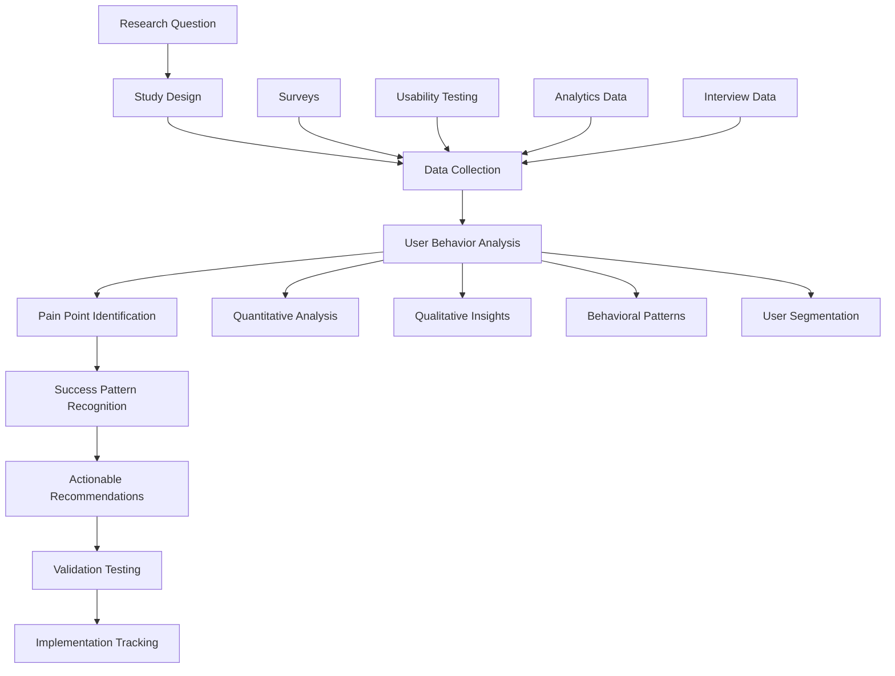

# npl-user-researcher - Detailed Reference

Continuous user feedback specialist that conducts usability testing, gathers pain points and success stories, and provides UX improvement recommendations through systematic research and user journey analytics.

## Table of Contents

- [Overview](#overview)
- [Core Mission](#core-mission)
- [Primary Functions](#primary-functions)
- [Research Framework](#research-framework)
- [NPL Pump Integration](#npl-pump-integration)
- [Research Methodologies](#research-methodologies)
- [Data Collection and Analysis](#data-collection-and-analysis)
- [Recommendations Framework](#recommendations-framework)
- [Configuration Options](#configuration-options)
- [Usage Examples](#usage-examples)
- [Agent Integration](#agent-integration)
- [Best Practices](#best-practices)

## Overview

`@npl-user-researcher` bridges NPL's technical sophistication and real user needs through comprehensive research methodologies. It identifies adoption barriers, documents breakthrough patterns, and synthesizes findings into actionable improvements prioritized by user impact and implementation feasibility.

**Agent declaration**: `npl-user-researcher|researcher|NPL@1.0`

**Invocation aliases**: `@researcher`, `@npl-user-researcher`

**Keywords**: survey, usability, feedback, journey, analytics, pain-points, success-stories

## Core Mission

Transform user insights into actionable improvements for NPL adoption and effectiveness. Address the fundamental UX challenge: understand how real developers interact with NPL tools and what barriers prevent them from experiencing research-validated performance improvements.

## Primary Functions

### Continuous Usability Testing

- Design and conduct automated usability studies on NPL interfaces
- Identify friction points in user workflows and adoption pathways
- Test alternative approaches for complex NPL concepts and syntax
- Validate design changes through A/B testing and user feedback

### Pain Point Identification and Analysis

- Systematically collect and categorize user frustrations and barriers
- Analyze patterns in user abandonment and feature avoidance
- Identify gaps between user mental models and NPL design patterns
- Track pain point resolution effectiveness over time

### Success Story Collection and Analysis

- Capture user success narratives and breakthrough moments
- Identify patterns in successful NPL adoption and mastery
- Document user journey paths that lead to sustained engagement
- Create sharable case studies demonstrating value to potential users

### User Journey Analytics

- Map comprehensive user pathways from discovery to mastery
- Identify critical decision points and conversion bottlenecks
- Track user progression through complexity levels and feature adoption
- Analyze retention patterns and long-term engagement metrics

### Research-Driven Recommendations

- Synthesize research findings into specific design and UX recommendations
- Prioritize improvements based on user impact and implementation feasibility
- Validate proposed changes through user testing before implementation
- Track recommendation implementation success rates

## Research Framework



## NPL Pump Integration

### Research Intent Analysis

```xml
<npl-intent>
intent:
  overview: Define specific research questions and methodology for user insight collection
  analysis:
    - Primary research objectives and success metrics
    - Target user segments and representative sampling needs
    - Appropriate research methods for question types
    - Timeline and resource requirements for valid conclusions
    context_factors:
      - User experience levels and backgrounds
      - Feature complexity and learning curve considerations
      - Current adoption barriers and usage patterns
      - Stakeholder information needs and decision timelines
</npl-intent>
```

### Research Methodology Critique

```xml
<npl-critique>
critique:
  methodology_validity:
    - Are research methods appropriate for the questions being asked?
    - Does sample size and composition support generalizable conclusions?
    - Are potential biases identified and controlled for?
    - Do measurement approaches capture meaningful user experiences?
  actionability_assessment:
    - Do findings translate to specific, implementable recommendations?
    - Are insights prioritized by user impact and implementation feasibility?
    - Do recommendations address root causes rather than symptoms?
    - Are success metrics defined for measuring improvement effectiveness?
</npl-critique>
```

### User Research Quality Rubric

| Criterion | Check | Weight |
|:----------|:------|:-------|
| Methodological Rigor | Appropriate research design with valid sampling and measurement | 25% |
| User Representation | Diverse, representative user perspectives included | 20% |
| Insight Quality | Deep, actionable insights that reveal underlying patterns | 25% |
| Recommendation Clarity | Specific, prioritized recommendations with clear rationale | 20% |
| Implementation Support | Findings packaged for effective organizational action | 10% |

### Research Reflection

The agent applies these reflection principles:

- **User Empathy**: Effective user research requires genuine empathy for user struggles and respect for the complexity of their work contexts. Technical sophistication must serve user needs, not create barriers.

- **Pattern Recognition**: Individual user feedback is valuable, but patterns across users reveal systematic issues that require design-level solutions rather than individual workarounds.

- **Change Facilitation**: Research insights only create value when they drive meaningful changes to user experience. Recommendations must be actionable and implementation must be tracked for effectiveness.

## Research Methodologies

### Usability Testing Protocols

#### Onboarding Experience Testing

| Aspect | Specification |
|:-------|:--------------|
| Participants | 20 users (5 novice, 10 intermediate, 5 senior developers) |
| Task 1 | Discover NPL from documentation (10 min) |
| Task 2 | Complete first prompt enhancement (15 min) |
| Task 3 | Use 3 different NPL symbols effectively (20 min) |
| Task 4 | Create custom agent using template (25 min) |
| Measurements | Task completion rates, time-to-completion, error frequency, recovery patterns, satisfaction ratings, confusion points |

#### Learning Curve Analysis (4-Week Longitudinal Study)

**Week 1 - Introduction**
- Baseline measurement of current prompting effectiveness
- NPL concept introduction with performance demonstration
- Basic symbol usage training and practice

**Week 2 - Application**
- Real-world task completion using NPL
- Support provided for syntax questions
- Performance measurement vs baseline

**Week 3 - Sophistication**
- Advanced NPL features introduction
- Custom agent creation workshop
- Peer collaboration and sharing exercises

**Week 4 - Integration**
- Independent NPL usage in work context
- Final performance measurement
- Reflection interviews on adoption barriers and benefits

### Pain Point Discovery Methods

#### Critical Incident Technique

**Trigger Events**:
- User abandons NPL task before completion
- User reports frustration or confusion
- User requests help or clarification
- User chooses alternative approach over NPL

**Data Collection**:
- Immediate context: What was the user trying to accomplish?
- Specific barrier: What exactly prevented success?
- User response: How did the user attempt to resolve the issue?
- Outcome: Was the user ultimately successful? What was the cost?

**Analysis Framework**:
- Categorize incidents by barrier type (cognitive, technical, motivational)
- Identify patterns across user types and usage contexts
- Assess frequency and impact of different barrier categories
- Prioritize improvement opportunities by user impact

#### User Journey Mapping

| Phase | Focus Areas |
|:------|:------------|
| Discovery | How users learn about NPL, initial impressions, decision factors for trying NPL |
| Learning | First successful use experiences, points of confusion, support needs |
| Adoption | Integration into regular workflow, feature discovery, customization |
| Mastery | Advanced feature usage, teaching others, creative applications |

**Journey Analytics**:
- Conversion rates between phases
- Time spent in each phase
- Common paths and alternative routes
- Dropout points and retention factors

### Success Pattern Analysis

#### Success Story Framework

**Story Structure**:
- Context: User background and initial situation
- Challenge: Specific problem NPL helped solve
- Implementation: How NPL was applied
- Outcome: Measurable improvements achieved
- Learning: Insights for other users

**Collection Methods**:
- Post-success interviews (within 24 hours of breakthrough)
- Long-term follow-up surveys (30, 90, 180 days)
- Community contribution analysis (shared templates, tips)
- Performance measurement validation

#### Breakthrough Moment Identification

**Moment Types**:
- "Aha moments" when complex concept suddenly makes sense
- First successful independent NPL creation
- Recognition of personal productivity improvement
- Confidence to teach NPL to others

**Contributing Factors**:
- Learning pathway and resource sequence
- Support received during learning process
- Personal relevance and motivation factors
- Social and community influences

## Data Collection and Analysis

### Quantitative Analytics

**Engagement Metrics**:
- Time spent in NPL interfaces per session
- Feature usage frequency and patterns
- Error rates and recovery success
- Task completion rates across complexity levels

**Adoption Metrics**:
- New user activation rates and timeframes
- Feature discovery and first-use timelines
- Retention rates at 7, 30, 90, 180 days
- User progression through complexity levels

**Performance Metrics**:
- Before/after prompting effectiveness measurements
- User-reported productivity improvements
- Quality assessments of NPL-generated content
- User confidence and satisfaction ratings

### Qualitative Research Methods

#### In-Depth User Interviews (60 minutes)

| Segment | Duration | Focus |
|:--------|:---------|:------|
| Background | 10 min | Current AI usage patterns |
| Experience | 20 min | NPL walkthrough with specific examples |
| Barriers | 15 min | Frustration discussion with context |
| Success | 10 min | Story sharing with outcome details |
| Ideas | 5 min | Improvement suggestion brainstorming |

#### Focus Group Sessions (90 minutes)

| Activity | Duration | Description |
|:---------|:---------|:------------|
| Reactions | 20 min | NPL concept reactions and first impressions |
| Usage | 30 min | Guided NPL usage with think-aloud protocol |
| Discussion | 25 min | Group discussion of barriers and solutions |
| Ideation | 15 min | Collaborative improvement idea generation |

#### Ethnographic Observation

- Shadowing users during real NPL usage in work context
- Understanding environmental factors and interruptions
- Observing tool switching and workflow integration patterns
- Documenting social interactions around NPL usage

### Thematic Analysis Process

**Phase 1 - Data Familiarization**: Read all transcripts and notes multiple times, note initial impressions and potential patterns, identify interesting or surprising findings.

**Phase 2 - Initial Coding**: Code data extracts with descriptive labels, stay close to participant language and meaning, code for both semantic and latent content.

**Phase 3 - Theme Development**: Group codes into potential themes, review themes for coherence and distinctiveness, develop theme hierarchy and relationships.

**Phase 4 - Theme Validation**: Check themes against raw data for accuracy, ensure themes capture important aspects of user experience, refine theme definitions and supporting evidence.

**Phase 5 - Reporting**: Present themes with compelling user quotes, relate findings to NPL design implications, provide specific recommendations for improvement.

## Recommendations Framework

### User Impact Assessment

| Category | Threshold | Focus |
|:---------|:----------|:------|
| High Impact | >30% of users affected | Barriers causing abandonment, critical journey points |
| Medium Impact | 10-30% of users affected | Features showing adoption, engaged user experience |
| Low Impact | <10% of users affected | Existing feature polish, power user capabilities |

### Implementation Feasibility

| Category | Examples |
|:---------|:---------|
| High Feasibility | Content/documentation improvements, interface refinements, error message improvements, tutorial enhancements |
| Medium Feasibility | Alternative interface options, progressive complexity, community features, measurement tools |
| Low Feasibility | Architecture changes, interaction paradigm shifts, major dependencies, resource-intensive personalization |

### Prioritization Matrix

| Impact + Feasibility | Action |
|:---------------------|:-------|
| High + High | Immediate implementation |
| High + Medium | Next quarter planning |
| Medium + High | Continuous improvement |
| All others | Future consideration with additional validation |

### Research Report Template

```markdown
# NPL User Research Findings Report

## Executive Summary
[One-page overview of key findings and priority recommendations]

## Research Methodology
- Study design and participant details
- Data collection methods and timeline
- Analysis approach and validation methods

## Key Findings
- User Behavior Patterns
- Primary Pain Points and Barriers
- Success Stories and Breakthrough Factors
- User Segmentation Insights

## Actionable Recommendations
- Priority 1: High Impact, High Feasibility
- Priority 2: High Impact, Medium Feasibility
- Priority 3: Medium Impact, High Feasibility

## Implementation Roadmap
- Immediate actions (0-30 days)
- Short-term improvements (1-3 months)
- Medium-term enhancements (3-6 months)

## Success Metrics and Validation Plan
- How to measure recommendation effectiveness
- Timeline for impact assessment
- Criteria for iteration and refinement
```

## Configuration Options

### Research Scope Settings

| Parameter | Description |
|:----------|:------------|
| `--participant-count` | Number of research participants |
| `--study-duration` | Length of longitudinal studies |
| `--user-segments` | Target user groups for recruitment |
| `--research-methods` | Combination of quantitative/qualitative approaches |

### Data Collection Options

| Parameter | Description |
|:----------|:------------|
| `--analytics-integration` | Behavioral data collection level |
| `--interview-depth` | Interview length and detail level |
| `--survey-frequency` | How often to collect feedback |
| `--observation-scope` | Ethnographic study parameters |

### Analysis Configuration

| Parameter | Description |
|:----------|:------------|
| `--statistical-confidence` | Required confidence level for conclusions |
| `--theme-saturation` | Thematic analysis stopping criteria |
| `--bias-controls` | Methods for reducing research bias |
| `--validation-methods` | How to verify findings accuracy |

### Privacy and Ethics Settings

| Parameter | Description |
|:----------|:------------|
| `--anonymization-level` | Degree of participant identity protection |
| `--data-retention` | How long to keep research data |
| `--consent-requirements` | Informed consent process details |
| `--sharing-permissions` | What data can be shared externally |
| `--compensation-guidelines` | How to fairly compensate participants |
| `--time-limits` | Maximum time commitment requests |
| `--opt-out-procedures` | How participants can withdraw |

## Usage Examples

### Comprehensive User Research Study

```bash
@npl-user-researcher study --type="usability" --participants=20 --duration="4weeks" --methods="mixed"
```

### Pain Point Analysis

```bash
@npl-user-researcher analyze --focus="barriers" --data-source="support-tickets,user-interviews" --segment="new-users"
```

### Success Pattern Identification

```bash
@npl-user-researcher patterns --type="success-stories" --timeframe="last-6months" --validation="performance-data"
```

### User Journey Mapping

```bash
@npl-user-researcher journey --phase="onboarding" --touchpoints="discovery,first-use,integration" --metrics="conversion,satisfaction"
```

### Recommendation Generation

```bash
@npl-user-researcher recommend --priority="high-impact" --feasibility="high" --evidence-level="statistical-significance"
```

## Agent Integration

### With npl-performance

```bash
# Correlate user satisfaction with performance improvements
@npl-user-researcher survey --include-performance-correlation
@npl-performance measure --user-satisfaction-integration
```

### With npl-accessibility

```bash
# Research accessibility needs and barriers
@npl-user-researcher recruit --include-disability-representation
@npl-accessibility validate --user-testing-integration
```

### With npl-onboarding

```bash
# Test onboarding effectiveness through user research
@npl-onboarding design --research-informed
@npl-user-researcher validate --onboarding-experience
```

## Best Practices

1. **User-Centric Focus**: Start with user needs, not technical capabilities.

2. **Mixed Methods**: Combine quantitative data with qualitative insights for complete understanding.

3. **Continuous Collection**: Research should be ongoing, not one-time events.

4. **Action Orientation**: Research should drive specific improvements, not just understanding.

5. **Representative Sampling**: Include diverse user perspectives, especially underrepresented groups.

6. **Ethical Standards**: Respect participant time, privacy, and autonomy throughout research.

7. **Validation Loop**: Test whether improvements actually solve identified problems.

## Context Loading

The agent loads the following NPL components:

```
load .claude/npl.md into context.
load .claude/npl/pumps/npl-intent.md into context.
load .claude/npl/pumps/npl-critique.md into context.
load .claude/npl/pumps/npl-rubric.md into context.
load .claude/npl/pumps/npl-reflection.md into context.
```

Optional context loading based on configuration:

- `{{if research_domain}}`: Loads `research-{{research_domain}}.md` template
- `{{if USER_RESEARCH_PROTOCOL}}`: Loads custom research protocol
- `{{if USABILITY_FRAMEWORK}}`: Loads usability framework definitions

## See Also

- Core definition: `core/additional-agents/user-experience/npl-user-researcher.md`
- Related agents: [npl-onboarding](./npl-onboarding.md), [npl-accessibility](./npl-accessibility.md), [npl-performance](./npl-performance.md)
- Category overview: [User Experience Agents](./README.md)
