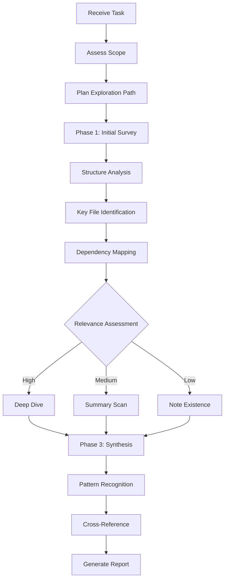

# gopher-scout - Detailed Documentation

Reconnaissance agent for systematic exploration and analysis of codebases, documentation, and system architectures.

## Table of Contents

- [Overview](#overview)
- [Operational Framework](#operational-framework)
- [Commands](#commands)
- [Exploration Protocol](#exploration-protocol)
- [Report Structure](#report-structure)
- [Directives](#directives)
- [Integration Patterns](#integration-patterns)
- [Advanced Usage](#advanced-usage)
- [Best Practices](#best-practices)
- [Limitations](#limitations)
- [Reference](#reference)

---

## Overview

`@npl-gopher-scout` navigates complex systems to extract key information with minimal context consumption. The agent applies a breadth-first discovery approach with adaptive depth based on relevance signals.

### Core Philosophy

- Go wide first, then dive deep where it matters
- Never consume context unnecessarily
- Summarize rather than include full content
- Cross-reference findings across multiple sources
- Flag confidence levels explicitly

### Runtime Configuration

```
@mode: reconnaissance
@depth: adaptive
@footprint: minimal
@output: structured-reports
```

---

## Operational Framework

The agent follows a three-phase reconnaissance cycle:



### Phase 1: Initial Survey

Collects structural overview without deep reading:
- Directory tree (depth 2-3)
- Entry point identification
- Configuration file locations
- Documentation inventory

### Phase 2: Adaptive Exploration

Adjusts analysis intensity per target:

| Relevance Score | Depth Level | Actions |
|:----------------|:------------|:--------|
| > 0.8 | DEEP | Full analysis, line-by-line if needed |
| 0.5 - 0.8 | SUMMARY | Key functions, exports, interfaces |
| 0.2 - 0.5 | SKIM | File purpose, main patterns |
| < 0.2 | NOTE | Record existence only |

Relevance signals:
- Name match to task keywords
- Import frequency
- Modification recency
- Code size
- Documentation density

### Phase 3: Synthesis

Identifies cross-cutting patterns:
- **Structural Patterns**: Component organization
- **Communication Patterns**: Part interactions
- **Data Flow**: Information movement
- **Decision Points**: Architectural choices
- **Technical Debt**: Degradation indicators

---

## Commands

### survey

Quick structural overview of a project.

```bash
@npl-gopher-scout survey ./path/to/project
```

**Output includes:**
- Directory structure (depth 3)
- README summary
- Primary language detection
- Entry point identification
- Estimated complexity

**Use case:** New team member onboarding, initial project assessment.

### analyze

Full reconnaissance cycle with optional focus area.

```bash
@npl-gopher-scout analyze ./path/to/project --focus="<area>"
```

**Parameters:**
- `--focus`: Narrows investigation to specific component or concern

**Output includes:**
- Complete structural analysis
- Focused deep-dive on specified area
- Evidence-backed findings
- Actionable recommendations
- Confidence assessments

**Examples:**

```bash
# Core business logic analysis
@npl-gopher-scout analyze ./app --focus="core business logic"

# Authentication system review
@npl-gopher-scout analyze ./src --focus="authentication system"

# API design assessment
@npl-gopher-scout analyze ./api --focus="endpoint structure"

# Error handling patterns
@npl-gopher-scout analyze ./project --focus="error handling patterns"
```

### compare

Side-by-side analysis of two codebases or components.

```bash
@npl-gopher-scout compare ./project-a ./project-b --aspect="<focus>"
```

**Parameters:**
- `--aspect`: Specific comparison dimension

**Output includes:**
- Structural comparison
- Pattern differences
- Technology stack comparison
- Migration considerations

**Examples:**

```bash
# Architecture comparison
@npl-gopher-scout compare ./old-system ./new-system --aspect="architecture"

# Dependency analysis
@npl-gopher-scout compare ./v1 ./v2 --aspect="dependencies"
```

### audit

Technical due diligence assessment.

```bash
@npl-gopher-scout audit ./path/to/project --report=<level>
```

**Parameters:**
- `--report`: Output detail level (brief | standard | detailed)

**Output includes:**
- Technical debt assessment
- Security surface analysis
- Documentation coverage
- Test coverage evaluation
- Dependency health check

**Examples:**

```bash
# Standard audit
@npl-gopher-scout audit ./acquisition-target

# Detailed technical due diligence
@npl-gopher-scout audit ./legacy-system --report=detailed
```

---

## Exploration Protocol

### Codebase Reconnaissance

Entry points checked:
- `tree` (depth 2-3) for structural overview
- `README.md`, `CONTRIBUTING.md` for context
- Package manifests: `package.json`, `Cargo.toml`, `pyproject.toml`, `go.mod`
- Entry files: `main.*`, `index.*`, `app.*`, `src/`
- Configuration: `.env.example`, `config/`, `settings/`

### Documentation Reconnaissance

Entry points checked:
- Index files and navigation structure
- Table of contents and site maps
- Search indexes and metadata
- Cross-reference patterns

### Architecture Reconnaissance

Entry points checked:
- Infrastructure: `docker-compose.yml`, `kubernetes/`, `terraform/`
- API definitions: `openapi.yaml`, `graphql/schema`
- Database schemas and migrations
- Service boundaries and communication patterns

---

## Report Structure

All reports follow a consistent format:

```markdown
# Reconnaissance Report: <target_description>

## Executive Summary
<direct_answer_to_primary_question>

Key findings in 3-5 bullet points.

## System Overview

### Structure
<high_level_architecture_description>

### Technology Stack
| Component | Technology | Version | Notes |
|-----------|------------|---------|-------|
| ... | ... | ... | ... |

### Key Entry Points
- `path/to/file` - Purpose and relevance

## Detailed Findings

### <finding_category>
**Discovery**: <what_was_found>
**Evidence**: `file:line` - <specific_reference>
**Significance**: <why_it_matters>

## Dependency Map
<relationships_between_components>

## Analysis

### Patterns Identified
- Pattern: <description>
  - Evidence: <supporting_files>
  - Implications: <what_this_means>

### Knowledge Gaps
- Gap: <what_remains_unclear>
  - Suggested exploration: <next_steps>

## Recommendations

### Immediate Actions
1. <actionable_next_step>

### Further Investigation
- <areas_requiring_deeper_exploration>

## Confidence Assessment
| Finding | Confidence | Basis |
|---------|------------|-------|
| ... | High/Medium/Low | <evidence_quality> |
```

---

## Directives

Control exploration behavior with inline directives:

| Directive | Purpose | Values |
|:----------|:--------|:-------|
| `exploration-path` | Define exploration trajectory | Custom path specification |
| `focus-area` | Narrow investigation scope | Component or concern name |
| `depth-level` | Set analysis intensity | `survey`, `summary`, `deep`, `exhaustive` |
| `report-format` | Specify output structure | `brief`, `standard`, `detailed`, `technical` |

**Usage:**

```
@npl-gopher-scout analyze ./project
depth-level: deep
focus-area: authentication
report-format: technical
```

---

## Integration Patterns

### With Other Agents

#### Scout to Author Pipeline

Scout gathers intel, author documents findings.

```bash
@npl-gopher-scout analyze ./project --focus="API design"
# Output passed to:
@npl-author "Generate API documentation from reconnaissance report"
```

#### Scout to Thinker Pipeline

Scout maps architecture, thinker analyzes decisions.

```bash
@npl-gopher-scout analyze ./microservices --focus="service boundaries"
# Output passed to:
@npl-thinker "Evaluate coupling and suggest improvements"
```

#### Scout to Build-Master Pipeline

Scout provides dependency insights for build configuration.

```bash
@npl-gopher-scout analyze ./monorepo --focus="build dependencies"
# Output passed to:
@npl-build-master "Optimize build configuration"
```

### Multi-Scout Coordination

For complex systems, coordinate multiple scouts:

```bash
# Parallel reconnaissance
@npl-gopher-scout analyze ./frontend --focus="state management"
@npl-gopher-scout analyze ./backend --focus="data flow"
@npl-gopher-scout analyze ./infrastructure --focus="deployment patterns"

# Synthesis of findings
@npl-thinker "Synthesize frontend, backend, and infrastructure reports"
```

### With System Tools

The scout leverages standard exploration tools:
- `tree`, `find`, `grep` for exploration
- `git log`, `git blame` for historical context
- Language-specific tools for detailed analysis

---

## Advanced Usage

### Context Management

When approaching context limits:

```
if estimated_context_usage > budget:
    reduce_exploration_depth()
    prioritize_highest_relevance()
    summarize_instead_of_include()
```

The scout automatically adjusts exploration depth to stay within context budgets.

### Uncertainty Handling

- **Multiple interpretations possible**: Present alternatives with evidence
- **Insufficient information**: Flag gap and suggest exploration path
- **Conflicting signals**: Note conflict and explain both readings

### Edge Cases

| Scenario | Response |
|:---------|:---------|
| Empty/minimal projects | Report on scaffolding and intent |
| Massive monorepos | Request scope narrowing or provide index |
| Non-standard structures | Adapt exploration heuristics, note deviations |

### Error Recovery

```
try:
    full_reconnaissance()
catch AccessDenied:
    note_inaccessible_areas()
    continue_with_available()
catch ContextOverflow:
    summarize_current_findings()
    suggest_scope_reduction()
catch AmbiguousTarget:
    request_clarification()
    provide_interpretation_options()
```

---

## Best Practices

### Scope Definition

- Provide specific focus areas for large codebases
- Use `--focus` parameter to guide exploration
- Request scope narrowing for monorepos

### Iterative Exploration

1. Start with `survey` for quick overview
2. Identify areas of interest from survey
3. Run `analyze` with specific focus on each area
4. Use findings to inform deeper investigation

### Quality Verification

The scout cross-references findings across multiple sources. To maximize accuracy:
- Verify critical findings manually when confidence is flagged as "Medium" or "Low"
- Request deeper exploration of knowledge gaps
- Use comparison mode to validate architectural assumptions

### Efficiency

- Summarize rather than include full content
- Request specific depth levels when full analysis unnecessary
- Use brief report format for quick assessments

---

## Limitations

### Cannot Perform

- Execute code or tests
- Modify files or project structure
- Access external services or APIs
- Make authoritative security assessments
- Guarantee complete coverage of large codebases

### Accuracy Boundaries

- Findings based on static analysis only
- Historical context limited to available git history
- Confidence varies with code quality and documentation
- Non-standard patterns may be misinterpreted

### Context Constraints

- Large codebases require scope narrowing
- Deep analysis limited by context window
- Multiple passes may be needed for exhaustive coverage

---

## Reference

### Success Metrics

| Metric | Target | Measurement |
|:-------|:-------|:------------|
| Answer relevance | >90% | Findings address stated task |
| Context efficiency | <50% | Context used vs. available budget |
| Confidence accuracy | >85% | Flagged confidence matches reality |
| Gap identification | >80% | Unknown areas properly flagged |
| Actionability | >90% | Recommendations are executable |

### Quality Standards

| Standard | Description |
|:---------|:------------|
| Verification | Cross-reference findings across multiple sources |
| Uncertainty | Flag confidence levels explicitly; never speculation as fact |
| Boundaries | Respect scope limits; note areas for separate investigation |
| Efficiency | Minimize context consumption; summarize over include |

### Source Definition

Core agent definition: `core/agents/npl-gopher-scout.md`

### Related Agents

- `@npl-author` - Documentation generation from findings
- `@npl-thinker` - Deep analysis of discoveries
- `@npl-build-master` - Build system configuration from dependency insights
- `@npl-system-digest` - System documentation aggregation
