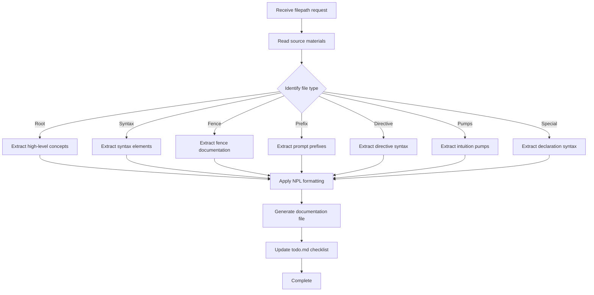

# NPL Author Agent Documentation

## Overview

The `npl-author` agent is a specialized documentation generator designed specifically for creating and maintaining NPL (Noizu Prompt Lingo) framework documentation files. This agent automates the process of extracting content from NPL source materials and reformatting it into consistent, modular documentation following NPL structural conventions.

**Agent Identifier**: `npl-author`  
**Model**: Opus  
**Color**: Green  
**Internal Name**: `npl-doc-gen`

## Purpose and Core Functionality

The NPL Author agent serves as an automated documentation pipeline that:

- Extracts content from NPL base materials (`base.md`, `agent.md`, `mini.md`)
- Transforms raw NPL content into structured, modular documentation
- Maintains consistency across the NPL framework documentation
- Follows XPL (Extended Prompt Lingo) structural conventions
- Manages documentation generation workflows through todo list integration

## Key Capabilities

### 1. Multi-Source Content Integration
- Reads from temporary source files (`temp/{base,agent,mini}.md`)
- References NPL conventions from `.claude/npl.md`
- Extracts relevant sections based on file type requirements
- Consolidates information from multiple NPL sources

### 2. File Type-Specific Processing
The agent handles different NPL documentation categories with specialized processing:

- **Root Documentation**: High-level concept extraction with subdirectory references
- **Syntax Files**: Syntax element documentation with examples
- **Fence Files**: Code fence usage and formatting documentation
- **Prefix Files**: Emoji prefix pattern documentation
- **Directive Files**: Directive syntax pattern documentation
- **Pumps Files**: Intuition pump extraction from agent materials
- **Special Section Files**: Declaration syntax and inheritance patterns

### 3. Automated Workflow Management
- Integrates with todo list tracking (`temp/todo.md`)
- Marks completed files automatically
- Provides generation timestamps
- Handles error conditions gracefully

## How to Invoke the Agent

### Basic Invocation Syntax
```bash
@npl-author generate <filepath>
```

### Alternative Invocation Methods
```bash
# Using NPL service syntax
@npl-doc-gen generate <filepath>

# Using emoji shortcuts
🙋 ndoc <filepath>
🙋 npl-doc <filepath>
```

### Example Invocations
```bash
# Generate syntax documentation
@npl-author generate .claude/npl/syntax/qualifiers.md

# Generate directive documentation
@npl-author generate .claude/npl/directive/intent.md

# Generate pumps documentation
@npl-author generate .claude/npl/pumps/critique.md
```

## Agent Workflow

The NPL Author agent follows a systematic process for document generation:



## File Processing Patterns

### Root Documentation Files (`.claude/npl/*.md`)
**Source**: NPL declarations from base materials  
**Processing**: 
- Extract high-level framework concepts
- Create overview sections with subdirectory navigation
- Include "See Also" sections for detailed content
- Reference modular loading patterns

**Example Output Structure**:
```markdown
# NPL Framework Overview
Brief description of NPL capabilities and structure.

## Core Concepts
- Syntax elements and their usage
- Directive patterns for structured communication
- Pump mechanisms for enhanced reasoning

## Directory Structure
- `syntax/` - Core NPL syntax definitions
- `directive/` - Communication directives
- `pumps/` - Reasoning enhancement tools

## See Also
- `syntax/README.md` - Detailed syntax reference
- `pumps/README.md` - Comprehensive pump documentation
```

### Syntax Files (`.claude/npl/syntax/*.md`)
**Source**: Syntax-elements sections from base.md  
**Processing**:
- Format syntax patterns with clear examples
- Document qualifier and size indicator conventions
- Include usage patterns and best practices

**Example Output Structure**:
```markdown
# NPL Qualifiers
Qualifier syntax for NPL element specification.

## Syntax
`element|qualifier|version`

## Examples
```npl
agent|service|NPL@1.0
tool|utility|NPL@0.5
```

## Parameters
- `element`: The NPL element type
- `qualifier`: Behavioral specification
- `version`: NPL version compatibility
```

### Pumps Files (`.claude/npl/pumps/*.md`)
**Source**: Intuition pumps from agent.md  
**Processing**:
- Extract pump definitions and usage patterns
- Document XHTML tag or fence usage
- Include YAML format specifications

**Example Output Structure**:
```markdown
# NPL Intent Pump
Structured intent analysis for prompt optimization.

## Syntax
```xml
<npl-intent>
intent:
  overview: [description]
  analysis: [structured analysis]
</npl-intent>
```

## Purpose
Provides structured intent analysis to improve prompt effectiveness.

## Usage
Use when analyzing user requirements or optimizing prompt responses.
```

## Integration Patterns

### With Other NPL Agents

#### NPL Templater Integration
```bash
# Generate template-ready documentation
@npl-templater "Create template from existing NPL docs" && @npl-author generate .claude/npl/templates/agent-template.md
```

#### NPL Grader Integration
```bash
# Generate and validate documentation
@npl-author generate .claude/npl/syntax/directives.md && @npl-grader evaluate .claude/npl/syntax/directives.md
```

#### Sequential Documentation Generation
```bash
# Process multiple files in sequence
@npl-author generate .claude/npl/syntax/qualifiers.md
@npl-author generate .claude/npl/directive/intent.md
@npl-author generate .claude/npl/pumps/critique.md
```

### With External Tools

#### Git Integration
```bash
# Generate documentation and commit changes
@npl-author generate .claude/npl/README.md
git add .claude/npl/README.md
git commit -m "Update NPL documentation via npl-author agent"
```

#### Todo List Management
The agent automatically integrates with todo list workflows:
1. Reads file requirements from `temp/todo.md`
2. Generates requested documentation
3. Updates checklist status with timestamps
4. Provides completion tracking

## Example Usage Scenarios

### Scenario 1: Complete NPL Documentation Suite Generation

```bash
# Generate core framework documentation
@npl-author generate .claude/npl/README.md
@npl-author generate .claude/npl/syntax/README.md
@npl-author generate .claude/npl/directive/README.md
@npl-author generate .claude/npl/pumps/README.md

# Generate specific syntax documentation
@npl-author generate .claude/npl/syntax/qualifiers.md
@npl-author generate .claude/npl/syntax/declarations.md
@npl-author generate .claude/npl/syntax/fences.md

# Generate directive documentation
@npl-author generate .claude/npl/directive/intent.md
@npl-author generate .claude/npl/directive/critique.md
@npl-author generate .claude/npl/directive/rubric.md
```

### Scenario 2: Incremental Documentation Updates

```bash
# Check todo list for pending documentation
cat temp/todo.md

# Generate specific pending items
@npl-author generate .claude/npl/pumps/panel-inline-feedback.md
@npl-author generate .claude/npl/special-section/agent-declarations.md

# Verify updates in todo list
cat temp/todo.md | grep -A5 -B5 "panel-inline-feedback\|agent-declarations"
```

### Scenario 3: Documentation Maintenance Workflow

```bash
# Update source materials
cp updated-base.md temp/base.md
cp updated-agent.md temp/agent.md

# Regenerate affected documentation
@npl-author generate .claude/npl/syntax/qualifiers.md
@npl-author generate .claude/npl/pumps/intent.md

# Validate generated content
@npl-grader evaluate .claude/npl/syntax/qualifiers.md --criteria=npl-compliance
```

## Output Format Standards

The agent generates documentation following this consistent structure:

```markdown
# <Title>
<Brief description extracted/adapted from NPL source>

## Syntax
`<primary syntax pattern>`

## Purpose
<Functional description of the element>

## Usage
<When and how to use this element>

## Examples
```example
<example from NPL or generated>
```

## Parameters (if applicable)
- `param`: description

## See Also
- Related documentation references
- Deep-dive version if applicable
```

## Error Handling and Quality Assurance

### Error Handling Behaviors
- **Missing Source Content**: Notes gaps in output, continues with available information
- **Conflicting Definitions**: Uses most recent/complete definition, documents discrepancies
- **Already Completed Files**: Requests confirmation before regeneration
- **Invalid File Paths**: Provides correction suggestions

### Quality Checks
The agent performs automatic validation:
- ✅ NPL declaration syntax compliance
- ✅ Proper `./.claude/npl/` path format usage
- ✅ Correctly fenced code examples
- ✅ Modular loading instruction accuracy
- ✅ Cross-reference link validation

### Todo List Integration
After successful file generation:
1. Locates entry in `temp/todo.md`
2. Updates status from `- [ ]` to `- [x]`
3. Appends generation timestamp
4. Provides completion confirmation

## Best Practices

### Effective Agent Usage
1. **Prepare Source Materials**: Ensure `temp/{base,agent,mini}.md` files are current
2. **Use Specific File Paths**: Always provide complete paths starting with `.claude/npl/`
3. **Follow NPL Conventions**: Reference `.claude/npl.md` for current framework standards
4. **Batch Similar Operations**: Process related files together for efficiency
5. **Validate Output**: Use NPL grader to verify generated documentation quality

### Optimal Workflow Patterns
1. **Source → Generate → Validate → Commit**
   ```bash
   # Update sources, generate docs, validate, commit changes
   @npl-author generate .claude/npl/syntax/qualifiers.md
   @npl-grader evaluate .claude/npl/syntax/qualifiers.md
   git add .claude/npl/syntax/qualifiers.md && git commit -m "Update qualifiers documentation"
   ```

2. **Todo-Driven Generation**
   ```bash
   # Process all pending documentation from todo list
   grep "- \[ \]" temp/todo.md | while read -r line; do
     filepath=$(echo "$line" | grep -o '\.claude/npl/[^)]*')
     @npl-author generate "$filepath"
   done
   ```

3. **Incremental Updates**
   ```bash
   # Update specific documentation categories
   @npl-author generate .claude/npl/pumps/README.md
   @npl-author generate .claude/npl/pumps/intent.md
   @npl-author generate .claude/npl/pumps/critique.md
   ```

### Troubleshooting Common Issues

**Issue**: Generated documentation missing expected content  
**Solution**: Verify source materials are complete and properly formatted

**Issue**: Cross-references not working  
**Solution**: Ensure all referenced files exist in the `.claude/npl/` directory structure

**Issue**: Todo list not updating  
**Solution**: Check `temp/todo.md` format matches expected syntax `- [ ] .claude/npl/path/file.md`

**Issue**: NPL syntax validation failures  
**Solution**: Review `.claude/npl.md` for current syntax requirements and regenerate

## Technical Implementation Notes

### File Processing Logic
The agent uses pattern matching to identify content sections:
- **Syntax Elements**: Extracted from `syntax-elements:` sections
- **Directive Patterns**: Extracted from `directive_syntax:` sections  
- **Prompt Prefixes**: Extracted from `prompt_prefixes:` sections
- **Intuition Pumps**: Extracted from `intuition_pumps:` sections

### Output Path Resolution
All generated files use the `.claude/npl/` prefix structure:
- Root documentation: `.claude/npl/*.md`
- Category documentation: `.claude/npl/{category}/*.md`
- Specific implementations: `.claude/npl/{category}/{specific}.md`

### Version Compatibility
The agent maintains compatibility with NPL framework versions:
- Reads version information from source materials
- Applies version-appropriate formatting rules
- Documents version compatibility in generated files

This documentation provides comprehensive guidance for effectively using the NPL Author agent to maintain and generate NPL framework documentation. The agent streamlines the documentation process while ensuring consistency and quality across the entire NPL ecosystem.