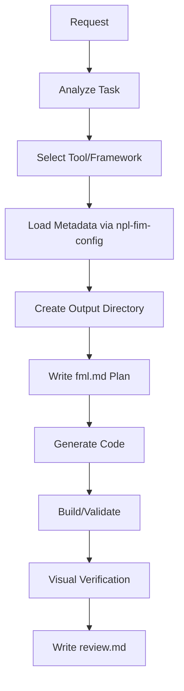

# npl-fim Detailed Reference

Fill-in-the-middle code generation agent for visualizations and artifacts across 150+ frameworks.

**Source**: `core/agents/npl-fim.md`

---

## Table of Contents

- [Overview](#overview)
- [Capabilities](#capabilities)
- [Loading Architecture](#loading-architecture)
- [Framework Categories](#framework-categories)
- [Response Process](#response-process)
- [Commands Reference](#commands-reference)
- [Configuration Options](#configuration-options)
- [Output Structure](#output-structure)
- [Usage Examples](#usage-examples)
- [Integration Patterns](#integration-patterns)
- [Best Practices](#best-practices)
- [Limitations](#limitations)

---

## Overview

The `@npl-fim` agent transforms natural language into working code across diverse visualization ecosystems. It uses hierarchical metadata loading with environment-aware path resolution to generate implementation-ready artifacts.



### Core Functions

| Function | Description |
|:---------|:------------|
| Code Generation | Produces implementation-ready HTML/JS/Python/etc. |
| Metadata Loading | Fetches framework-specific patterns via `npl-fim-config` |
| Visual Validation | Screenshots output for verification |
| Multi-language | Supports JavaScript, Python, Elixir, LaTeX, R, Julia |

---

## Capabilities

### Primary Categories

| Category | Description | Example Frameworks |
|:---------|:------------|:-------------------|
| Data Visualization | Charts, graphs, dashboards | D3.js, Plotly.js, Chart.js, Vega-Lite |
| Network Graphs | Node-link diagrams, force layouts | Cytoscape.js, Sigma.js, Vis.js, NetworkX |
| Diagram Generation | Flowcharts, UML, architecture | Mermaid, PlantUML, Graphviz |
| 3D Graphics | WebGL scenes, models, animations | Three.js, Babylon.js, A-Frame |
| Creative Animation | Generative art, motion graphics | P5.js, Paper.js, GSAP, Anime.js |
| Music Notation | Sheet music, tablature | VexFlow, OSMD, LilyPond, ABCjs |
| Mathematical/Scientific | Equations, plots, diagrams | LaTeX/TikZ, MathJax, KaTeX, Matplotlib |
| Geospatial Mapping | Interactive maps, GIS | Leaflet, Mapbox GL, Deck.gl, Cesium |
| Document Processing | PDF, DOCX, Markdown conversion | Pandoc, jsPDF, PDFKit |
| Engineering Diagrams | Circuit, timing, rack diagrams | CircuiTikZ, WaveDrom, KiCad |
| Elixir/LiveBook | Interactive notebook components | Kino, VegaLite, Mermaid widgets |
| Prototyping | UI mockups, component demos | React, Vue, HTML/Tailwind |

### Tool Count Summary

```
Categories: 15
Tools: 150+
Output Formats: 80+
Primary Languages: JavaScript, Python, Elixir, LaTeX
Secondary: R, Julia, Java, C++
```

---

## Loading Architecture

Before generating artifacts, npl-fim loads framework-specific metadata to ensure correct output patterns.

### Metadata Loading Flow

```
ON REQUEST(user_input):
  1. ANALYZE request -> identify task_category
  2. DETERMINE tool_selection OR use_default_for_category
  3. REQUIRED: LOAD metadata for solution.tool before generating content
     npl-fim-config {solution}.{task} --load
  4. Generate code following loaded patterns
```

### Environment Variables

| Variable | Purpose | Default |
|:---------|:--------|:--------|
| `NPL_FIM_ARTIFACTS` | Output directory for generated artifacts | `./artifacts` |
| `NPL_META` | Metadata search path | `./.npl/meta`, `~/.npl/meta`, `/etc/npl/meta` |

### Metadata Search Paths

The agent searches for framework metadata in order:

1. `$NPL_META/fim/` (if set)
2. `./.npl/meta/fim/` (project)
3. `~/.npl/meta/fim/` (user)
4. `/etc/npl/meta/fim/` (system)

---

## Framework Categories

### Data Visualization

| Tool | Description | Best For |
|:-----|:------------|:---------|
| `d3_js` | Data-driven documents library | Custom interactive visualizations |
| `plotly_js` | Interactive scientific charts | 3D plots, statistical graphics |
| `chart_js` | Simple responsive charts | Quick dashboards, basic charts |
| `vega-lite` | High-level visualization grammar | Declarative specifications |
| `apache-echarts` | Enterprise-grade charting | Large datasets, complex dashboards |
| `google-charts` | Google's charting service | Simple embeddable charts |
| `highcharts` | Commercial charting library | Business applications |

### Network Graphs

| Tool | Description | Best For |
|:-----|:------------|:---------|
| `cytoscape_js` | Graph/network visualization | Biological networks, complex graphs |
| `d3-force` | Force-directed layout module | Custom force simulations |
| `sigma_js` | Graph drawing library | Large-scale networks |
| `vis_js` | Dynamic visualization toolkit | Timeline + network combos |
| `go_js` | Interactive diagram library | Organizational charts, BPMN |
| `cola_js` | Constraint-based layout | Hierarchical layouts |

### Diagram Generation

| Tool | Description | Best For |
|:-----|:------------|:---------|
| `mermaid` | Markdown-based diagrams | Documentation, quick diagrams |
| `plantuml` | Text-based UML | Sequence, class diagrams |
| `graphviz` | Graph visualization software | DOT language graphs |
| `drawio-xml` | Draw.io file format | Editable diagram files |
| `nomnoml` | UML drawing tool | Simple UML diagrams |
| `structurizr-dsl` | Architecture DSL | C4 model diagrams |

### 3D Graphics

| Tool | Description | Best For |
|:-----|:------------|:---------|
| `three_js` | JavaScript 3D graphics | General 3D scenes, WebGL |
| `babylon_js` | 3D game engine | Game-like experiences |
| `a-frame` | WebVR/AR framework | VR/AR content |
| `vtk_js` | 3D visualization toolkit | Scientific visualization |
| `cesium_js` | 3D globe mapping | Geospatial 3D |
| `spline` | 3D design tool | Design collaboration |

### Music Notation

| Tool | Description | Best For |
|:-----|:------------|:---------|
| `vexflow` | Music notation rendering | Web-based sheet music |
| `osmd` | Open Sheet Music Display | MusicXML rendering |
| `abcjs` | ABC notation renderer | Folk/traditional music |
| `lilypond` | Music engraving program | Publication-quality scores |
| `alphatab` | Guitar tablature engine | Tab notation |
| `tone_js` | Web audio synthesis | Interactive audio |

### Mathematical/Scientific

| Tool | Description | Best For |
|:-----|:------------|:---------|
| `latex` | Professional typesetting | Academic documents |
| `tikz-pgf` | TeX graphics package | Technical diagrams |
| `mathjax` | Math notation rendering | Web math display |
| `katex` | Fast math typesetting | Performance-critical math |
| `matplotlib` | Python plotting | Scientific plots |
| `sympy` | Symbolic mathematics | Equation solving |

### Geospatial Mapping

| Tool | Description | Best For |
|:-----|:------------|:---------|
| `leaflet_js` | Mobile-friendly maps | Basic interactive maps |
| `mapbox-gl-js` | Vector map rendering | Custom styled maps |
| `deck_gl` | WebGL data visualization | Large-scale geospatial |
| `cesium_js` | 3D globe | 3D terrain, time-dynamic |
| `openlayers` | High-performance mapping | Enterprise GIS |
| `turf_js` | Geospatial analysis | Spatial operations |

### Elixir/LiveBook

| Tool | Description | Best For |
|:-----|:------------|:---------|
| `kino-vegalite` | Vega-Lite charts | Data exploration |
| `kino-mermaid` | Mermaid diagrams | Documentation |
| `kino-maplibre` | Map visualization | Geospatial notebooks |
| `kino-js` | Custom JavaScript | Interactive widgets |
| `kino-datatable` | Data tables | Data inspection |

---

## Response Process

### Standard Workflow

1. **Task Analysis**: Identify optimal tool for the request
2. **Metadata Loading**: Required step via `npl-fim-config {solution}.{task} --load`
3. **Directory Setup**: Create subfolder in artifact output dir
4. **Planning**: Write `fml.md` implementation plan
5. **Generation**: Produce code following loaded patterns
6. **Build Validation**: For complex projects, verify builds succeed
7. **Visual Verification**: Screenshot or inspect output
8. **Review**: Document findings in `review.md`

### TypeScript Preference

For multi-file JavaScript solutions, prefer TypeScript setup:

- Configure `tsconfig.json`
- Use strict type checking
- Include CDN dependencies where applicable

### Screenshot Capture

Use `wkhtmltoimage` for visual validation:

```bash
wkhtmltoimage --javascript-delay 1000 path/to/index.html screenshot.png
```

Options:

| Option | Description |
|:-------|:------------|
| `--javascript-delay <ms>` | Wait for JS execution |
| `--width <pixels>` | Viewport width |
| `--height <pixels>` | Viewport height |
| `--quality <0-100>` | JPEG quality |

---

## Commands Reference

### npl-fim-config

Configuration and query tool for NPL-FIM agent.

#### Load Metadata

```bash
npl-fim-config {solution}.{task} --load
```

Loads framework-specific patterns. Delegates to `npl-load` with derived entries.

#### Natural Language Query

```bash
npl-fim-config --query "interactive org chart for React app"
```

Returns ranked tool recommendations based on keyword matching.

#### Display Compatibility Matrix

```bash
npl-fim-config --table
npl-fim-config --table solution.d3_js
```

Shows tool-task compatibility matrix.

#### Get Artifact Path

```bash
npl-fim-config --artifact-path
```

Returns current artifact output directory.

#### Preferred Solutions

```bash
npl-fim-config --preferred-solution network-graphs
```

Lists recommended tools for a use case.

#### Local Overrides

```bash
# List override files
npl-fim-config --overrides

# Edit local override
npl-fim-config --local solution.d3_js.charts --edit

# Patch override
npl-fim-config --local solution.d3_js.charts --patch --prompt "Additional instructions"
```

---

## Configuration Options

### npl-fim-config Options

| Option | Description |
|:-------|:------------|
| `--load [ENTRY]` | Delegate to npl-load for metadata |
| `--verbose`, `-v` | Enable verbose output |
| `--skip` | Forward skip flag to npl-load |
| `--query`, `-q` | Natural language query |
| `--table` | Display compatibility matrix |
| `--artifact-path` | Show artifact directory |
| `--preferred-solution` | Get preferred tools |
| `--style-guide` | Get style guide command |
| `--overrides` | List local override files |
| `--local` | Work with local overrides |
| `--patch` | Patch local override |
| `--replace` | Replace local override |
| `--edit` | Edit local override in $EDITOR |

### Environment Variables

| Variable | Default | Description |
|:---------|:--------|:------------|
| `NPL_FIM_ARTIFACTS` | `./artifacts` | Output directory |
| `NPL_META` | (search paths) | Metadata location |
| `EDITOR` | `vi` | Editor for --edit |

---

## Output Structure

Generated artifacts follow this directory structure:

```
{artifact-path}/{slug}/
  fml.md        # Implementation plan
  index.html    # Generated artifact (or main entry)
  review.md     # Validation notes and findings
  screenshot.png  # Visual verification (if captured)
  package.json  # For npm-based projects
  src/          # Source files for complex projects
```

### fml.md Contents

```markdown
# Implementation Plan

## Request
[Original user request]

## Solution
[Selected framework and approach]

## Implementation Details
[Technical decisions and patterns]

## Dependencies
[Required libraries and CDN links]
```

### review.md Contents

```markdown
# Review

## Output Verification
[Visual inspection results]

## Issues Found
[Any problems encountered]

## Patches Applied
[Corrections made during generation]

## Recommendations
[Suggestions for instruction improvements]
```

---

## Usage Examples

### Force-Directed Network Graph

```bash
npl-fim-config d3_js.network.graph --load
@npl-fim "create a force-directed network diagram showing social connections"
```

Output: D3.js HTML with interactive force layout.

### Bar Chart Visualization

```bash
@npl-fim "bar chart showing quarterly revenue" --library=chart_js
```

Output: Chart.js responsive bar chart.

### 3D Particle System

```bash
@npl-fim "particle system with 10K points orbiting a center" --library=three_js
```

Output: Three.js WebGL scene with particle animation.

### Music Notation

```bash
@npl-fim "render Bach's Cello Suite No. 1 Prelude" --library=vexflow
```

Output: VexFlow sheet music rendering.

### Architecture Diagram

```bash
@npl-fim "C4 context diagram for e-commerce system" --library=structurizr-dsl
```

Output: Structurizr DSL specification.

### LaTeX Mathematical Document

```bash
@npl-fim "proof of quadratic formula with TikZ diagram" --library=latex
```

Output: LaTeX document with TikZ visualization.

### Interactive Map

```bash
@npl-fim "map showing earthquake data with magnitude-based markers" --library=leaflet_js
```

Output: Leaflet.js map with GeoJSON layer.

### Elixir LiveBook Chart

```bash
@npl-fim "Kino VegaLite scatter plot of iris dataset"
```

Output: LiveBook cell with Kino.VegaLite visualization.

---

## Integration Patterns

### Chain with Grader

```bash
@npl-fim "D3 network visualization" && @grader evaluate output.html
```

Generate artifact, then validate quality.

### Guided Generation with Thinker

```bash
@npl-thinker "analyze data structure requirements" && @npl-fim create --guided
```

Plan with thinker, then generate with context.

### Template Extraction

```bash
@npl-fim "create reusable chart component" && @npl-templater "extract template"
```

Generate once, templatize for reuse.

### CI/CD Integration

```bash
# Build and validate visualization
@npl-fim "generate quarterly report charts"
wkhtmltoimage --javascript-delay 2000 artifacts/report-charts/index.html report.png
```

### Batch Generation

```bash
for chart in bar line pie scatter; do
  @npl-fim "create $chart chart example" --library=chart_js
done
```

---

## Best Practices

### Metadata Loading

1. **Always load metadata first**: Framework patterns prevent common errors
2. **Use verbose flag on errors**: `--verbose` provides detailed patterns
3. **Check local overrides**: Project-specific adjustments may exist

### Output Organization

1. **Use descriptive slugs**: `annual-report-bar-chart` not `chart1`
2. **Write fml.md before code**: Planning prevents rework
3. **Capture screenshots**: Visual verification catches rendering issues

### Framework Selection

1. **Match complexity to tool**: Chart.js for simple charts, D3.js for custom
2. **Consider deployment**: CDN dependencies for quick demos, bundled for production
3. **Check browser support**: WebGL tools require modern browsers

### Error Handling

1. **Verify builds**: For npm projects, ensure `npm run build` succeeds
2. **Test JavaScript delays**: Interactive content needs render time
3. **Document issues in review.md**: Helps improve instructions

### TypeScript Projects

1. **Default to TypeScript**: Better error detection during development
2. **Configure strict mode**: Catches type issues early
3. **Include declaration files**: For IDE support

---

## Limitations

### Scope Constraints

- Code generation only; does not execute or deploy artifacts
- Visual verification requires `wkhtmltoimage` or similar tool
- Complex animations may need manual delay tuning for screenshots

### Framework Limitations

- Some commercial libraries (Highcharts, yFiles) require licenses
- WebGL tools require GPU-capable browsers
- Large datasets may exceed browser memory limits

### Generation Boundaries

- Cannot test interactivity automatically
- Print/PDF output quality varies by tool
- Real-time data connections not validated

### Metadata Coverage

- Not all 150+ tools have detailed metadata
- New frameworks may lack task-specific patterns
- Local overrides may be needed for edge cases

### Platform Dependencies

- Screenshot capture requires external tools
- Some LaTeX packages need system installation
- Elixir/LiveBook features require Erlang/Elixir runtime
