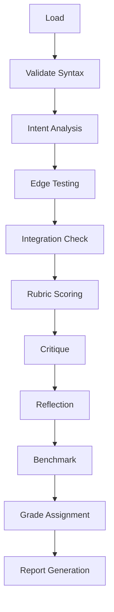

# npl-grader Detailed Reference

NPL validation and QA agent for syntax checking, edge testing, integration verification, and rubric-based scoring.

**Source**: `core/agents/npl-grader.md`

---

## Table of Contents

- [Overview](#overview)
- [Validation Types](#validation-types)
- [NPL Pumps Integration](#npl-pumps-integration)
- [Commands Reference](#commands-reference)
- [Report Format](#report-format)
- [Configuration Options](#configuration-options)
- [Usage Examples](#usage-examples)
- [Integration Patterns](#integration-patterns)
- [Best Practices](#best-practices)
- [Limitations](#limitations)

---

## Overview

The `@grader` agent validates NPL framework compliance through a multi-stage pipeline:



### Core Functions

| Function | Description |
|:---------|:------------|
| Syntax Validation | NPL compliance checking against specification |
| Edge Testing | Boundary condition and failure mode analysis |
| Integration | Multi-component workflow verification |
| Performance | Resource usage benchmarking |
| QA | Production readiness assessment |

---

## Validation Types

### Syntax Validation

Checks NPL compliance at three levels:

| Level | Checks |
|:------|:-------|
| `basic` | Unicode symbols, bracket matching |
| `standard` | + template syntax, agent references |
| `strict` | + nesting depth, style conventions |

**Validated elements:**

- Unicode symbols: `[...]`, `[...]`, `[...]`
- Nesting hierarchy and proper closure
- Template syntax (`{{if}}`, `{{foreach}}`)
- Agent references (`@agent-name`)
- Placeholder formats (`<term>`, `{term}`)

**Algorithm:**

```
validateNPLSyntax(content)
  INPUT: content string
  PROCESS:
    Check Unicode symbols
    Verify nesting hierarchy and closure
    Validate templates and @agent references
  OUTPUT:
    valid: boolean
    errors: list with line numbers
    warnings: style issues
    suggestions: improvements
```

### Edge Case Testing

Tests boundary conditions and failure recovery:

**Input Categories:**

- Empty content
- Malformed syntax
- Mixed encoding (UTF-8, UTF-16, ASCII)
- Excessive nesting (>10 levels)
- Large files (>10MB)
- High placeholder density (>1000)

**Recovery Assessment:**

- Graceful degradation behavior
- Error message clarity
- Suggestion quality
- Fallback path availability

### Integration Verification

Validates multi-component workflows:

**Handoff Testing:**

- Data flow between components
- Context preservation
- Error propagation
- Resource cleanup

**Workflow Modes:**

- Sequential execution
- Parallel execution
- Collaboration patterns
- Synchronization points

**System Checks:**

- Filesystem interactions
- Dependency resolution
- Compatibility verification
- Load handling

### Performance Benchmarking

Measures resource consumption:

| Metric | Target | Description |
|:-------|:-------|:------------|
| P95 Latency | <100ms | 95th percentile response time |
| Memory | <50MB | Peak memory usage |
| CPU | <70% | Average CPU utilization |

**Measurement Categories:**

- Parsing time
- Validation overhead
- Edge case processing
- Batch operation throughput

---

## NPL Pumps Integration

The grader uses NPL intuition pumps for structured analysis:

### npl-intent

Establishes validation scope and focus areas:

```xml
<npl-intent>
Overview: Validate NPL compliance, templates, agents, error handling
Edge focus: Boundary handling, malformed recovery, stress performance
</npl-intent>
```

### npl-critique

Evaluates quality with structured feedback:

```xml
<npl-critique>
NPL: syntax quality, edge handling, integration readiness
Standard: [strengths|weaknesses|suggestions]
</npl-critique>
```

### npl-reflection

Synthesizes findings and prioritizes recommendations:

```xml
<npl-reflection>
Assess: NPL validation, edge coverage, integration status
Analyze: performance, production readiness
Output: priority recommendations
</npl-reflection>
```

### npl-rubric

Applies weighted scoring criteria:

| Criterion | Weight | Validator |
|:----------|-------:|:----------|
| NPL Syntax | 20% | syntax_validator |
| Edge Cases | 15% | edge_tester |
| Integration | 15% | integration_checker |
| Performance | 10% | benchmarker |
| Standard criteria | 40% | various |

**Grade Scale:** A-F with confidence indicator (High/Medium/Low)

---

## Commands Reference

### Syntax Validation

```bash
@grader validate-syntax <file> [--level=basic|standard|strict|production]
```

Validates NPL syntax compliance for a single file.

### Check (Multi-mode)

```bash
@grader check <path> [--syntax-only|--edge-case|--comprehensive]
```

| Flag | Scope |
|:-----|:------|
| `--syntax-only` | NPL syntax validation only |
| `--edge-case` | Boundary condition testing |
| `--comprehensive` | Full validation suite |

### QA Assessment

```bash
@grader qa-assessment <path> --qa-level=<level> [--comprehensive]
```

**QA Levels:**

| Level | Description |
|:------|:------------|
| `lenient` | Basic checks, warnings only |
| `standard` | Default validation suite |
| `strict` | Enhanced checks, stricter thresholds |
| `production` | Full suite, zero-tolerance for errors |

### Regression Testing

```bash
@grader regression-test <current> <baseline> --compare
```

Compares current state against a baseline for quality regression detection.

### Custom Rubric Evaluation

```bash
@grader evaluate <path> --rubric=<rubric-file> [--focus=<area>]
```

Applies domain-specific evaluation criteria from a custom rubric file.

---

## Report Format

QA reports follow this structure:

```
# QA Report

## Summary
Quality assessment with metrics (1 paragraph)

## Validation
Valid: [X/Y] | Warnings: [N] | Errors: [N]

[Table: File, Errors, Warnings, Complexity, Status]

## Edge Testing [Coverage %]
- Tested scenario 1
- Tested scenario 2
- ...

## Integration
- Handoffs: Pass/Fail
- Performance: metrics

## Benchmarks
| Metric | Value | Target |
|:-------|------:|:------:|
| P95    | Xms   | <100ms |
| Memory | XMB   | <50MB  |
| CPU    | X%    | <70%   |

## Scores
[Table: Category, Score, Grade, Trend]

Overall: [A-F] (Confidence: High|Medium|Low)

## Recommendations

### Critical
- Issue with fix

### Improvements
- Optimization suggestion

### Next Steps
- Priority action
```

---

## Configuration Options

| Option | Values | Description |
|:-------|:-------|:------------|
| `--validate-syntax` | basic, standard, strict | Syntax check level |
| `--edge-case-testing` | flag | Enable comprehensive edge analysis |
| `--integration-check` | flag | Enable multi-component validation |
| `--performance-bench` | flag | Enable resource measurements |
| `--qa-level` | lenient, standard, strict, production | Overall strictness |
| `--npl-version` | version string | Target NPL version |
| `--test-mode` | quick, standard, comprehensive, production | Test thoroughness |
| `--rubric` | file path | Custom rubric file |
| `--focus` | area name | Evaluation focus area |

---

## Usage Examples

### Basic Syntax Validation

```bash
@grader validate-syntax src/prompt.md
```

Validates a single file with default settings.

### Production-Ready Assessment

```bash
@grader qa-assessment project/ --qa-level=production --comprehensive
```

Full validation suite with production-level strictness.

### Custom Rubric Evaluation

```bash
@grader evaluate src/ --rubric=security.md --focus=security
```

Applies security-focused evaluation criteria.

### Regression Testing

```bash
@grader regression-test current/ baseline/ --compare
```

Detects quality degradation between versions.

### Edge Case Focus

```bash
@grader check src/ --edge-case
```

Tests boundary conditions and failure recovery.

### Integration Validation

```bash
@grader check workflows/ --comprehensive
```

Validates multi-component interactions.

---

## Integration Patterns

### Chain with Writer

```bash
@writer generate readme > README.md && @grader evaluate README.md
```

Generate documentation, then validate quality.

### Parallel Evaluation

```bash
@grader evaluate src/ --rubric=code-quality.md
@grader evaluate test/ --rubric=test-coverage.md
@grader evaluate docs/ --rubric=documentation.md
```

Evaluate different directories with appropriate rubrics.

### CI/CD Integration

```bash
# Pre-commit hook
@grader validate-syntax . --level=strict

# Build pipeline
@grader qa-assessment . --qa-level=production --test-mode=comprehensive
```

### Review Workflow

```bash
# Review changed files
@grader check $(git diff --name-only) --comprehensive
```

---

## Best Practices

### Validation Strategy

1. **Progressive validation**: Start with syntax, then edge cases, then integration
2. **Early detection**: Run basic checks frequently during development
3. **Clear reporting**: Use production mode for final validation

### Error Handling

1. **Graceful degradation**: System continues with reduced functionality on partial failures
2. **Context preservation**: Error messages include file, line, and surrounding context
3. **Recovery guidance**: Suggestions accompany all error reports

### Quality Assurance

1. **Consistent standards**: Use the same QA level across similar projects
2. **Trend tracking**: Compare reports over time to detect regression
3. **Actionable insights**: Focus on recommendations that improve quality

### Custom Rubrics

Structure custom rubric files with:

- Weighted criteria definitions
- Pass/fail thresholds
- Category groupings
- Priority rankings

---

## Limitations

### Scope Constraints

- NPL syntax validation only; does not validate underlying code execution
- Edge testing simulates conditions but cannot guarantee real-world behavior
- Performance benchmarks are indicative, not absolute

### Resource Limits

- Large files (>10MB) may require extended processing time
- Deep nesting (>20 levels) triggers warnings regardless of validity
- Parallel evaluation limited by system resources

### Validation Boundaries

- Cannot validate semantic correctness of prompt content
- Does not assess output quality of generated responses
- Template logic validation is syntactic only

### Integration Constraints

- Requires NPL-compliant input files
- Custom rubrics must follow expected format
- Baseline comparisons require matching directory structures
