# NPL Grader Agent Documentation

## Overview

The NPL Grader Agent is a specialized evaluation system that provides structured, comprehensive assessment of code, documentation, pull requests, and other work products. Built on the Noizu Prompt Lingo (NPL) framework, it leverages intent analysis, systematic critique, reflective evaluation, and rubric-based scoring to deliver consistent, objective assessments.

## Purpose and Core Value

The npl-grader agent transforms subjective evaluation processes into structured, repeatable assessments. It serves as an automated quality assurance tool that can:

- Standardize evaluation criteria across teams and projects
- Provide consistent feedback regardless of reviewer availability
- Generate detailed, actionable improvement recommendations
- Scale quality assessment processes across large codebases
- Maintain evaluation standards over time

## Key Capabilities

### Structured Evaluation Framework
- **Intent Analysis**: Understands the purpose and goals of evaluated work
- **Rubric-Based Assessment**: Applies weighted criteria for systematic scoring
- **Multi-Dimensional Critique**: Provides balanced feedback on strengths and weaknesses
- **Reflective Synthesis**: Generates actionable insights and recommendations
- **Custom Rubric Support**: Integrates domain-specific evaluation standards

### Evaluation Categories
The agent excels at assessing:

- **Code Quality**: Architecture, implementation, standards compliance, testing
- **Documentation**: Completeness, clarity, organization, accuracy
- **Pull Requests**: Scope appropriateness, description quality, impact assessment
- **Project Deliverables**: Requirements alignment, technical feasibility, resource planning

## How to Invoke the Agent

### Basic Usage
```bash
# Evaluate a single file with default rubric
@npl-grader evaluate src/component.py

# Evaluate with custom rubric
@npl-grader evaluate src/component.py --rubric=.claude/rubrics/code-quality.md

# Evaluate a pull request
@npl-grader evaluate PR#123 --rubric=.claude/rubrics/pr-review.md

# Evaluate documentation
@npl-grader evaluate docs/api.md --rubric=.claude/rubrics/documentation.md
```

### Advanced Usage Options
```bash
# Focus on specific aspects
@npl-grader evaluate test/ --focus=coverage --rubric=.claude/rubrics/testing.md

# Adjust strictness level
@npl-grader evaluate src/ --severity=strict --rubric=.claude/rubrics/production-ready.md

# Compare against baseline
@npl-grader evaluate src/ --compare=v1.0 --rubric=.claude/rubrics/improvement.md

# Generate different output formats
@npl-grader evaluate src/ --format=json --rubric=.claude/rubrics/ci-integration.md
```

## Integration Patterns

### Continuous Integration Integration
```yaml
# GitHub Actions example
name: Code Quality Assessment
on: [pull_request]
jobs:
  quality-check:
    runs-on: ubuntu-latest
    steps:
      - uses: actions/checkout@v2
      - name: Evaluate PR Quality
        run: |
          @npl-grader evaluate ${{ github.event.pull_request.number }} \
            --rubric=.claude/rubrics/pr-quality.md \
            --format=json > quality-report.json
```

### Multi-Agent Workflows
```bash
# Parallel comprehensive evaluation
parallel:
  - @npl-grader evaluate src/ --rubric=.claude/rubrics/code-quality.md
  - @npl-grader evaluate test/ --rubric=.claude/rubrics/test-coverage.md
  - @npl-grader evaluate docs/ --rubric=.claude/rubrics/documentation.md

# Sequential improvement workflow
@npl-grader evaluate feature-branch --rubric=.claude/rubrics/initial-review.md
# Address issues, then:
@npl-grader evaluate feature-branch --compare=initial --rubric=.claude/rubrics/improvement-check.md
```

### Integration with Other NPL Agents
```bash
# Template-driven evaluation
@npl-templater generate rubric --type=security-review > security-rubric.md
@npl-grader evaluate src/ --rubric=security-rubric.md

# Persona-specific evaluation
@npl-persona create reviewer --expertise=security
@npl-grader evaluate --reviewer=security-expert --rubric=.claude/rubrics/security.md

# Complex analysis workflow
@npl-thinker analyze codebase-complexity src/
@npl-grader evaluate src/ --context=complexity-analysis --rubric=.claude/rubrics/maintainability.md
```

## Evaluation Process Workflow

```mermaid
flowchart TD
    A[📋 Receive Evaluation Request] --> B[🔍 Load Target Content]
    B --> C[📄 Load Custom Rubric]
    C --> D[🎯 Analyze Intent]
    D --> E[📊 Apply Rubric Criteria]
    E --> F[⚖️ Generate Scores]
    F --> G[🔍 Perform Critique]
    G --> H[💭 Reflect on Findings]
    H --> I[📝 Generate Report]
    I --> J[🎯 Provide Recommendations]
    
    subgraph "NPL Pump Integration"
        K[npl-intent: Purpose Analysis]
        L[npl-rubric: Scoring Framework]
        M[npl-critique: Strengths/Weaknesses]
        N[npl-reflection: Synthesis]
    end
    
    D --> K
    E --> L
    G --> M
    H --> N
```



## Example Usage Scenarios

### Scenario 1: Code Review Automation

**Context**: Automating code review for pull requests in a Python web application.

```bash
# Create custom rubric for the project
cat > .claude/rubrics/python-web-app.md << EOF
# Python Web Application Code Review Rubric

## Criteria
- **Functionality** (30%): Code works as intended with proper error handling
- **Security** (25%): No security vulnerabilities, proper input validation  
- **Performance** (20%): Efficient algorithms, proper caching strategies
- **Maintainability** (15%): Clear structure, good naming, appropriate comments
- **Testing** (10%): Adequate test coverage with meaningful test cases

## Scoring Scale
- 5: Exceptional - Exceeds all standards
- 4: Proficient - Meets all standards  
- 3: Developing - Meets most standards with minor issues
- 2: Basic - Meets some standards, significant improvements needed
- 1: Inadequate - Does not meet standards
EOF

# Evaluate pull request
@npl-grader evaluate PR#456 --rubric=.claude/rubrics/python-web-app.md --format=markdown
```

**Expected Output**:
```markdown
# Evaluation Report: Pull Request #456 - User Authentication Feature

## Executive Summary
The authentication implementation demonstrates solid technical approach with good security practices. Minor improvements needed in error handling and test coverage.

## Intent Analysis
The PR implements OAuth2-based user authentication with JWT tokens, addressing the requirement for secure user sessions while maintaining scalability.

## Rubric Scores
| Criterion | Weight | Score | Weighted Score | Rationale |
|-----------|--------|-------|----------------|-----------|
| Functionality | 30% | 4/5 | 24/30 | Works correctly, handles edge cases well, minor logging improvement needed |
| Security | 25% | 5/5 | 25/25 | Excellent security practices: proper token handling, HTTPS enforcement, input validation |
| Performance | 20% | 3/5 | 12/20 | Good caching strategy but database queries could be optimized |
| Maintainability | 15% | 4/5 | 12/15 | Clear code structure, good naming, adequate documentation |
| Testing | 10% | 2/5 | 4/10 | Basic unit tests present but missing integration tests for auth flow |

**Total Score**: 77/100 (B+)

## Detailed Critique
### Strengths
- Comprehensive security implementation with industry best practices
- Clear separation of concerns between authentication and authorization
- Well-structured middleware integration
- Good error message standardization

### Areas for Improvement
- Add integration tests for complete authentication flow
- Optimize database queries in user lookup functions
- Enhance error logging for debugging production issues
- Add rate limiting for login attempts

## Next Steps
1. **Priority 1**: Implement integration tests for auth flow
2. **Priority 2**: Add database query optimization  
3. **Priority 3**: Enhance production logging and monitoring
```

### Scenario 2: Documentation Quality Assessment

**Context**: Evaluating API documentation before release.

```bash
# Evaluate comprehensive documentation
@npl-grader evaluate docs/api/ --rubric=.claude/rubrics/api-documentation.md --focus=completeness
```

**Custom Rubric** (`.claude/rubrics/api-documentation.md`):
```markdown
# API Documentation Quality Rubric

## Evaluation Criteria
- **Completeness** (35%): All endpoints documented with parameters and responses
- **Clarity** (25%): Clear explanations, proper formatting, logical organization
- **Examples** (20%): Practical, working examples for all major use cases  
- **Accuracy** (15%): Documentation matches actual API behavior
- **Usability** (5%): Easy navigation, searchable, proper linking

## Standards
- All public endpoints must have complete documentation
- Examples must be executable and current
- Response schemas must match actual API responses
- Error responses must be documented with codes and messages
```

### Scenario 3: Test Coverage Evaluation

**Context**: Ensuring test quality meets project standards.

```bash
# Multi-dimensional test evaluation
@npl-grader evaluate test/ --rubric=.claude/rubrics/test-quality.md --severity=standard

# Generate improvement roadmap
@npl-grader evaluate test/ --rubric=.claude/rubrics/test-quality.md --format=roadmap
```

**Test Quality Rubric Example**:
```markdown
# Test Quality Assessment Rubric

## Core Criteria
- **Coverage** (40%): Line coverage, branch coverage, edge case coverage
- **Quality** (30%): Meaningful assertions, proper test data, clear test intent
- **Maintainability** (20%): DRY principles, helper functions, clear naming
- **Performance** (10%): Fast execution, proper mocking, resource cleanup

## Coverage Standards
- Unit tests: >90% line coverage
- Integration tests: >80% critical path coverage  
- End-to-end tests: >70% user workflow coverage
```

## Custom Rubric Development

### Creating Effective Rubrics

**Structure Template**:
```markdown
# [Evaluation Subject] Rubric

## Overview
Brief description of what this rubric evaluates and when to use it.

## Criteria
### [Criterion Name] ([Weight]%)
**Definition**: What this criterion measures
**Standards**: Specific requirements or expectations
**Scoring Guide**:
- 5: Exceptional - [specific description]
- 4: Proficient - [specific description]  
- 3: Developing - [specific description]
- 2: Basic - [specific description]
- 1: Inadequate - [specific description]

## Scoring Calculation
- Total Score = Σ(criterion_score × weight)
- Grade Assignment: A(90-100), B(80-89), C(70-79), D(60-69), F(<60)

## Special Considerations
- [Context-specific notes]
- [Exception handling rules]
- [Integration requirements]
```

### Best Practice Rubric Examples

**Code Security Rubric**:
```bash
cat > .claude/rubrics/security-review.md << EOF
# Security Review Rubric

## Criteria
- **Input Validation** (30%): Proper sanitization, type checking, bounds validation
- **Authentication** (25%): Secure auth implementation, session management
- **Authorization** (20%): Proper access controls, principle of least privilege
- **Data Protection** (15%): Encryption at rest/transit, sensitive data handling
- **Error Handling** (10%): No information leakage, proper error responses

## Security Standards
- OWASP Top 10 compliance required
- No hardcoded credentials or secrets
- All user inputs must be validated and sanitized
- Sensitive operations require proper authorization
- Security headers must be implemented
EOF
```

## Configuration and Customization

### Available Parameters

| Parameter | Description | Values | Default |
|-----------|-------------|--------|---------|
| `--rubric` | Path to custom rubric file | File path | Built-in rubric |
| `--focus` | Specific evaluation focus | `quality`, `security`, `performance`, `maintainability` | `quality` |
| `--severity` | Evaluation strictness | `lenient`, `standard`, `strict` | `standard` |
| `--format` | Output format | `markdown`, `json`, `html`, `roadmap` | `markdown` |
| `--compare` | Comparison baseline | Version tag, branch name | None |

### Scoring Modes

**Absolute Scoring**: Evaluates against ideal standards
```bash
@npl-grader evaluate src/ --mode=absolute --rubric=gold-standard.md
```

**Relative Scoring**: Compares against baseline or previous version
```bash
@npl-grader evaluate src/ --mode=relative --baseline=v1.0
```

**Progressive Scoring**: Focuses on improvement over time
```bash
@npl-grader evaluate src/ --mode=progressive --compare=last-review
```

## Output Formats

### Standard Markdown Report
Comprehensive evaluation with executive summary, detailed scores, critique, and recommendations.

### JSON Format
Structured data suitable for CI/CD integration and automated processing:
```json
{
  "evaluation": {
    "subject": "src/component.py",
    "timestamp": "2024-01-15T10:30:00Z",
    "rubric": "code-quality.md",
    "total_score": 85,
    "grade": "B",
    "criteria": [
      {
        "name": "Functionality",
        "weight": 30,
        "score": 4,
        "weighted_score": 24,
        "rationale": "Works correctly with minor edge case issues"
      }
    ],
    "recommendations": [
      "Add input validation for edge cases",
      "Improve error handling specificity"
    ]
  }
}
```

### HTML Report
Web-formatted output suitable for sharing and archiving.

### Roadmap Format
Action-oriented output focusing on improvement priorities:
```markdown
# Improvement Roadmap

## Immediate Actions (Score Impact: +15 points)
1. **Add Integration Tests** - Will improve Testing score from 2→4
2. **Optimize Database Queries** - Will improve Performance score from 3→4

## Short-term Goals (Score Impact: +8 points)  
1. **Enhance Error Logging** - Will improve Maintainability score from 4→5
2. **Add Rate Limiting** - Will improve Security score from 4→5

## Long-term Improvements (Score Impact: +5 points)
1. **Refactor Legacy Components** - Will improve Architecture score from 3→4
```

## Best Practices

### Effective Rubric Design
1. **Specific Criteria**: Use measurable, observable criteria rather than subjective judgments
2. **Balanced Weighting**: Distribute weights according to project priorities and risk factors  
3. **Clear Scoring Guides**: Provide specific descriptions for each score level
4. **Context Awareness**: Include project-specific considerations and constraints
5. **Regular Updates**: Refine rubrics based on evaluation outcomes and changing standards

### Evaluation Process
1. **Consistent Application**: Use the same rubric version for comparable evaluations
2. **Documentation**: Record evaluation context, decisions, and rationale
3. **Feedback Integration**: Use evaluation results to improve code and processes
4. **Calibration**: Periodically review rubric effectiveness and scoring consistency
5. **Stakeholder Alignment**: Ensure rubrics reflect team and organizational priorities

### Integration Workflow
1. **Automated Triggers**: Integrate with CI/CD pipelines for consistent evaluation
2. **Progressive Enhancement**: Use evaluations to guide incremental improvements
3. **Team Coordination**: Share evaluation results and improvement plans across team
4. **Historical Tracking**: Maintain evaluation history for trend analysis
5. **Continuous Refinement**: Update evaluation criteria based on lessons learned

## Troubleshooting Common Issues

### Low Scores Despite Good Code
- **Issue**: High-quality code receiving unexpectedly low scores
- **Solutions**: 
  - Review rubric criteria alignment with project goals
  - Adjust weights based on project priorities
  - Check for overly strict scoring guidelines
  - Consider context-specific evaluation parameters

### Inconsistent Evaluations
- **Issue**: Similar code receiving different scores
- **Solutions**:
  - Ensure consistent rubric application
  - Document evaluation context and decisions
  - Use the same rubric version across evaluations
  - Calibrate scoring with team reviews

### Missing Context in Evaluations
- **Issue**: Evaluations don't consider project constraints or requirements
- **Solutions**:
  - Include project-specific context in rubric
  - Use custom rubrics for different project phases
  - Add evaluation parameters for specific contexts
  - Document assumptions and constraints

The NPL Grader Agent provides a powerful framework for systematic, consistent evaluation of technical work. By leveraging structured rubrics, NPL pumps, and comprehensive reporting, it transforms subjective review processes into objective, actionable assessments that drive continuous improvement and maintain quality standards across projects and teams.