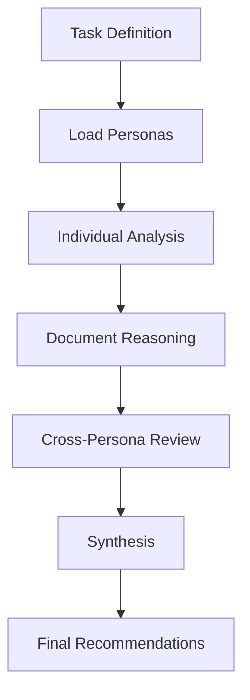
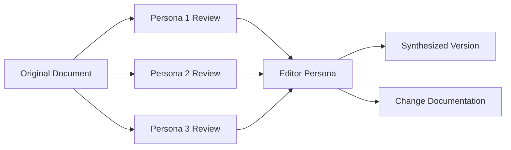
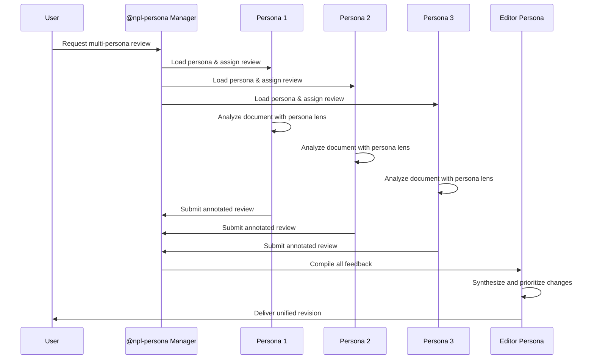
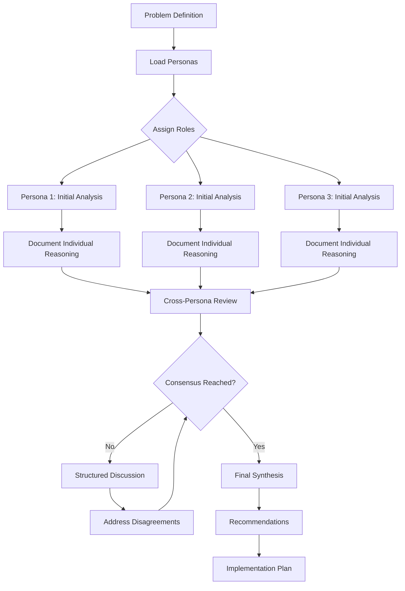

# NPL Persona Agent Documentation

## Overview

The `@npl-persona` agent is a sophisticated persona-based AI system designed to embody defined character personas for consistent, character-driven interactions across collaborative tasks. This agent enables multi-perspective analysis, maintains character consistency, and facilitates complex multi-agent collaboration through authentic persona embodiment.

## Purpose and Core Capabilities

### Primary Functions
- **Document Review**: Create annotated document copies with persona-specific feedback
- **Group Chain of Thought (CoT)**: Collaborative problem-solving with multiple personas
- **Advisory Mode**: Provide proposals, requests, and advice from persona perspectives
- **Chat Collaboration**: Engage in structured multi-persona discussions
- **Editorial Synthesis**: Combine feedback from multiple personas into cohesive revisions

### Key Strengths
- Maintains consistent character voice across all interactions
- Applies specialized expertise based on persona background
- Supports complex multi-agent workflows and simulations
- Provides diverse perspectives on problems and solutions
- Enables realistic peer review and collaborative processes

## Agent Architecture

### Persona Loading System

The agent loads persona definitions from structured files in the project's persona directory:

```
.claude/npl-a/personas/
├── {slug}.md              # Persona definition file
├── {slug}/
│   └── intent.md          # Current context and memory
└── directory.md           # Registry of all personas
```

### Persona File Structure

```markdown
handle: mike-douglas        # URL-safe identifier
name: Mike Douglas         # Display name
role: Senior Backend Engineer
description: Systems architect focused on scalability and performance
background: 8 years building distributed systems at high-growth startups
---
# Internal Motivation
Driven by the need to build robust, maintainable systems that can scale...

# Quirks
Tends to think in terms of system bottlenecks. Often references past outages...

# Knowledge Base
Expert in microservices, database optimization, caching strategies...
```

## How to Invoke and Use the Agent

### Basic Invocation

```bash
# Load and embody a specific persona
@npl-persona mike-douglas "Review this authentication module"

# Multi-persona collaboration
@npl-persona sarah-chen,mike-douglas,alex-rivera "Design review for payment system"

# Chat room discussion
@npl-persona "Start architecture discussion in #backend-chat"
```

### Setup Requirements

1. **Create Persona Files**: Define personas in `.claude/npl-a/personas/{slug}.md`
2. **Initialize Directory**: Update persona registry in `directory.md`
3. **Load Agent**: Invoke with specific persona slug or multiple personas

### Command Patterns

```bash
# Document review with annotations
@npl-persona {persona-slug} review {file-path}

# Group problem-solving
@npl-persona {persona1,persona2,persona3} collaborate {task-description}

# Advisory consultation
@npl-persona {persona-slug} advise {proposal-topic}

# Chat participation
@npl-persona {persona-slug} chat {room-name} {message}

# Editorial synthesis
@npl-persona {editor-persona} synthesize {feedback-files}
```

## Task Execution Modes

### 1. Document Review Mode

Creates annotated copies of documents with persona-specific feedback:

```markdown
# Review by Mike Douglas (Senior Backend Engineer)
**Original File:** src/auth/authentication.py
**MD5 Sum:** a1b2c3d4e5f6...
**Review Date:** 2024-09-11T15:30:00Z
**Instructions:** Compare with original to see mike-douglas's feedback

---

def authenticate_user(username, password):
    """Authenticate user credentials[^1]"""
    # Hash password for comparison[^2]
    hashed = hash_password(password)
    return verify_credentials(username, hashed)

---
## Review Notes
[^1]: Missing rate limiting and brute force protection - critical security gap
[^2]: Should use constant-time comparison to prevent timing attacks
```

### 2. Group Chain of Thought (CoT)

Collaborative problem-solving with structured reasoning:



**File Structure:**
```
.claude/npl-m/group-cot/
├── payment-architecture.md      # Task definition
└── payment-architecture/
    ├── mike-douglas.md         # Backend perspective
    ├── sarah-chen.md           # UX perspective  
    ├── alex-rivera.md          # DevOps perspective
    └── synthesis.md            # Combined insights
```

### 3. Advisory Mode

Personas provide structured proposals and recommendations:

```markdown
# Proposal: Implement Circuit Breaker Pattern
**From:** Mike Douglas (Senior Backend Engineer)
**Date:** 2024-09-11

## Executive Summary
We need circuit breakers around external API calls to prevent cascade failures.

## Background
Recent outages show our payment service becomes unavailable when third-party 
providers experience latency spikes...

## Proposed Approach
Implement Hystrix-style circuit breakers with these configurations...
```

### 4. Chat Collaboration

Structured multi-persona discussions in virtual chat rooms:

```markdown
**message**
ID: 550e8400-e29b-41d4-a716-446655440000
agent: mike-douglas
timestamp: 2024-09-11T15:45:00Z
---
Looking at the authentication flow, I'm concerned about the session 
management. Are we properly invalidating sessions on the backend when 
users log out from mobile apps?

The current implementation only clears client-side tokens, but server
sessions remain active for the full TTL period.
---
* References:
  - auth/session-manager.py:45-67
  - mobile-app/auth/logout.js:12-20
* * *

**react**
@550e8400-e29b-41d4-a716-446655440000 +👍
agent: sarah-chen
reason: Great catch - this affects user security expectations
* * *
```

### 5. Editorial Synthesis

Combines multiple persona feedback into cohesive document revisions:



## Integration Patterns with Other Agents

### With @npl-grader
```bash
# Generate persona feedback then evaluate quality
@npl-persona mike-douglas review security-policy.md
@npl-grader evaluate mike-douglas.security-policy.md --rubric=code-review
```

### With @npl-thinker
```bash
# Deep analysis with persona perspectives
@npl-thinker "Analyze the architectural trade-offs identified by our personas"
@npl-persona mike-douglas,sarah-chen "Apply your analysis to system design"
```

### With @npl-templater
```bash
# Generate persona-driven templates
@npl-templater create review-template --persona=mike-douglas
@npl-persona mike-douglas apply-template architecture-doc.md
```

### Multi-Agent Workflows
```bash
# Comprehensive review pipeline
@npl-persona mike-douglas,sarah-chen,alex-rivera review system-design.md &&
@npl-grader evaluate-reviews --consensus-check &&
@npl-persona lead-architect synthesize-feedback
```

## Example Usage Scenarios

### Scenario 1: Code Review Process

```bash
# Step 1: Multi-persona code review
@npl-persona mike-douglas "Review this authentication module for security concerns"
@npl-persona sarah-chen "Review the same module for user experience implications"
@npl-persona alex-rivera "Review for operational and deployment considerations"

# Step 2: Synthesis
@npl-persona lead-architect "Synthesize the feedback from all three reviews"

# Step 3: Developer discussion
@npl-persona mike-douglas,sarah-chen,alex-rivera "Discuss priority of identified issues"
```

### Scenario 2: Architecture Design Discussion

```bash
# Initialize group CoT task
@npl-persona mike-douglas,sarah-chen,alex-rivera collaborate "Design microservices architecture for payment processing system"

# Individual analysis phase (automatic)
# - Each persona creates their perspective document
# - Reasoning documented in structured CoT format

# Group synthesis
@npl-persona lead-architect "Review all perspectives and create unified architecture proposal"
```

### Scenario 3: Requirements Gathering

```bash
# Multi-stakeholder input
@npl-persona product-owner "Define user requirements for mobile payment feature"
@npl-persona mike-douglas "Identify technical requirements and constraints"
@npl-persona sarah-chen "Specify UX requirements and user flows"
@npl-persona alex-rivera "Define operational requirements and monitoring needs"

# Requirements synthesis
@npl-persona business-analyst "Create comprehensive requirements document from all stakeholder input"
```

### Scenario 4: Incident Post-Mortem

```bash
# Multi-perspective incident analysis
@npl-persona mike-douglas "Analyze the database performance incident from a systems perspective"
@npl-persona alex-rivera "Analyze the same incident from an operational perspective"
@npl-persona product-owner "Analyze user impact and business implications"

# Root cause analysis
@npl-persona senior-engineer "Synthesize findings and identify root causes and prevention strategies"
```

## Workflow Diagrams

### Multi-Persona Review Workflow



### Group CoT Problem-Solving Workflow



## Best Practices and Tips

### Creating Effective Personas

1. **Define Clear Expertise**: Each persona should have specific, non-overlapping areas of expertise
2. **Include Realistic Quirks**: Speech patterns and mannerisms that feel authentic
3. **Set Knowledge Boundaries**: What the persona knows and doesn't know
4. **Establish Motivations**: Internal drives that shape decision-making

### Managing Multi-Persona Sessions

1. **Start with Intent**: Define clear objectives before engaging personas
2. **Assign Specific Roles**: Give each persona focused responsibilities
3. **Document Context**: Use intent files to maintain conversation history
4. **Facilitate Conflicts**: Help personas work through disagreements constructively

### Maintaining Character Consistency

1. **Regular Intent Updates**: Keep persona memory files current
2. **Reference Previous Interactions**: Build on past conversations and decisions
3. **Respect Expertise Boundaries**: Don't make personas experts in areas outside their background
4. **Natural Quirk Integration**: Include mannerisms without overdoing them

### Optimizing Performance

1. **Batch Similar Tasks**: Group related operations together
2. **Pre-load Frequently Used Personas**: Cache common persona definitions
3. **Structure File Organization**: Keep persona files well-organized and accessible
4. **Monitor File Sizes**: Keep intent files manageable by archiving old context

### Quality Assurance Checklist

- [ ] Persona voice remains consistent throughout interaction
- [ ] Expertise level appropriate to defined background
- [ ] Character quirks present but not overwhelming
- [ ] Reactions align with established motivations
- [ ] Knowledge boundaries properly maintained
- [ ] File formats comply with expected structure
- [ ] Annotations provide actionable feedback
- [ ] Cross-persona interactions feel natural

## Common Use Cases

### Development Teams
- **Code Reviews**: Multi-perspective analysis from senior developer, security expert, and operations engineer
- **Architecture Decisions**: Technical leads, product owners, and DevOps specialists collaborating
- **Incident Response**: On-call engineer, system architect, and business stakeholder perspectives

### Product Development
- **Feature Planning**: Product manager, UX designer, and engineering lead input
- **User Story Refinement**: Multiple stakeholder perspectives on requirements
- **Design Reviews**: Technical feasibility, user experience, and business value analysis

### Documentation and Training
- **Technical Writing**: Subject matter experts reviewing documentation for accuracy
- **Knowledge Transfer**: Senior team members providing structured feedback to junior developers
- **Process Documentation**: Multiple role perspectives on workflow effectiveness

### Research and Analysis
- **Market Analysis**: Different functional perspectives on competitive landscape
- **Risk Assessment**: Security, operations, and business risk evaluation
- **Technology Evaluation**: Architecture, development, and operational considerations

## Troubleshooting

### Common Issues

**Persona Not Found**
```bash
Error: Persona 'john-smith' not found in .claude/npl-a/personas/
```
*Solution*: Check persona slug spelling and verify file exists

**Inconsistent Character Voice**
```bash
Warning: Response doesn't match expected persona characteristics
```
*Solution*: Review persona definition and update intent file with clearer context

**Intent File Corruption**
```bash
Error: Cannot parse intent file for persona 'mike-douglas'
```
*Solution*: Backup content, reinitialize intent file, restore relevant history

**Conflicting Persona Feedback**
```bash
Note: Personas disagree on implementation approach
```
*Solution*: Document all perspectives, facilitate discussion, escalate to user if needed

### Performance Issues

**Slow Persona Loading**
- Implement caching for frequently used personas
- Optimize persona file structure
- Batch persona operations when possible

**Large Intent Files**
- Archive old context periodically
- Summarize long-running conversations
- Split complex tasks into smaller sessions

## Advanced Configuration

### Custom Persona Templates

```markdown
# Template: Software Engineer Persona
handle: {engineer-slug}
name: {full-name}
role: {level} {specialty} Engineer
description: {expertise-areas}
background: {years} years experience in {domain}
---
# Internal Motivation
Driven by {primary-motivation}. Values {core-values}.

# Quirks
- Communication: {style-description}
- Problem-solving: {approach-description}
- Code preferences: {technical-preferences}

# Knowledge Base
- Languages: {programming-languages}
- Frameworks: {frameworks-list}
- Specializations: {specialty-areas}
```

### Environment Variables

```bash
# Persona directory location
export NPL_PERSONA_DIR=".claude/npl-a/personas"

# Default persona for single-user mode
export NPL_DEFAULT_PERSONA="lead-developer"

# Enable persona interaction logging
export NPL_PERSONA_LOGGING="true"

# Chat room directory
export NPL_CHAT_DIR=".claude/npl-m/chat"
```

### Integration Hooks

```python
# Custom persona behavior hooks
def on_persona_load(persona_slug, persona_data):
    """Called when persona is first loaded"""
    pass

def on_task_complete(persona_slug, task_type, results):
    """Called when persona completes a task"""
    pass

def on_persona_interaction(persona1, persona2, context):
    """Called during persona-to-persona communication"""
    pass
```

This comprehensive documentation provides everything needed to effectively use the @npl-persona agent for multi-perspective collaboration, document review, and complex problem-solving scenarios.