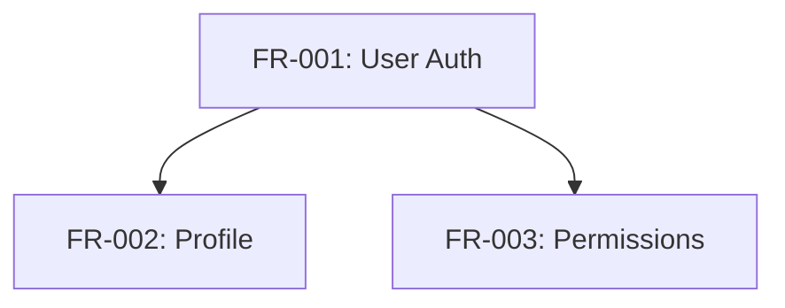

# npl-prd-manager - Detailed Reference

PRD lifecycle manager for preparing, revising, auditing, and tracking Product Requirements Documents.

**Agent Definition**: `core/agents/npl-prd-manager.md`
**PRD Specification**: `core/specifications/prd-spec.md`

---

## Table of Contents

- [Overview](#overview)
- [Capabilities](#capabilities)
  - [Prepare Mode](#prepare-mode)
  - [Revise Mode](#revise-mode)
  - [Audit Mode](#audit-mode)
  - [Progress Mode](#progress-mode)
  - [Extract Mode](#extract-mode)
- [Project Context Discovery](#project-context-discovery)
- [SMART Criteria Validation](#smart-criteria-validation)
- [Traceability Model](#traceability-model)
- [Integration Patterns](#integration-patterns)
- [Command Reference](#command-reference)
- [Output Formats](#output-formats)
- [Error Handling](#error-handling)
- [Best Practices](#best-practices)
- [Limitations](#limitations)

---

## Overview

`@npl-prd-manager` manages the complete PRD lifecycle from initial creation through implementation tracking. Core functions:

1. Generate PRDs from product vision, user research, or stakeholder input
2. Validate requirements against SMART criteria
3. Enforce traceability chains (persona -> story -> requirement -> acceptance criteria)
4. Track implementation progress against codebase
5. Extract structured data (dependencies, risks, traceability matrices)

The agent loads these NPL dependencies:

```bash
npl-load c "syntax,agent,fences,directive,pumps.intent,pumps.critique,pumps.rubric,formatting.template,instructing.handlebars"
npl-load s "prd-spec"
```

---

## Capabilities

### Prepare Mode

Generate new PRDs from input sources.

**Input Sources**:
- Product vision documents
- User research findings
- Stakeholder requirements
- Competitive analysis

**Workflow**:

```
1. DISCOVER project context (architecture, layout, existing docs)
2. ANALYZE inputs to extract:
   - Product identity and value proposition
   - Target users and personas
   - Core problems and pain points
   - Success criteria and metrics
   - Constraints and assumptions
3. STRUCTURE using prd-spec template
4. GENERATE requirements with:
   - Unique identifiers (FR-XXX, NFR-XXX, US-XXX)
   - Priority assignments (P0-P3)
   - Acceptance criteria
   - Dependency declarations
5. VALIDATE against SMART criteria
6. OUTPUT PRD with traceability matrix
```

**Usage**:

```bash
# From product vision
@npl-prd-manager prepare --vision="docs/product-vision.md"

# From multiple sources
@npl-prd-manager prepare --vision="vision.md" --research="user-research.md"

# From template with product name
@npl-prd-manager prepare --from-template --product="MyProduct"
```

**Output Structure**:

Main PRD file (`PRD.md`) contains:
- Executive summary
- Problem statement with gap analysis
- Goals, non-goals
- Success metrics
- Persona summaries
- Requirement overviews

Sub-files created in `docs/PRD/` when sections exceed thresholds:
- `personas.md` - Detailed persona definitions
- `user-stories.md` - Complete story catalog
- `functional-requirements.md` - FR details
- `non-functional-requirements.md` - NFR details

---

### Revise Mode

Update existing PRDs with change tracking.

**Change Categories**:

| Category | Examples |
|:---------|:---------|
| Scope Changes | New features, removed features, boundary adjustments |
| Priority Shifts | Requirement priority changes, timeline adjustments |
| Clarifications | Ambiguity resolution, acceptance criteria refinement |
| Dependency Updates | New dependencies, resolved blockers |
| Risk Updates | New risks, updated mitigations |

**Workflow**:

```
1. LOAD existing PRD and sub-files
2. PARSE structure and extract all requirements
3. CATEGORIZE changes (additions, modifications, deletions)
4. VALIDATE changes don't break traceability
5. CHECK for dependency conflicts
6. APPLY changes maintaining:
   - Requirement ID stability
   - Version history
   - Audit trail
7. REVALIDATE against SMART criteria
8. GENERATE change log
9. UPDATE revision history
```

**Usage**:

```bash
# Add new requirement
@npl-prd-manager revise PRD.md --add-requirement="FR-045: Export to PDF"

# Update priority
@npl-prd-manager revise PRD.md --update-priority="FR-012:P0"

# Bulk changes from file
@npl-prd-manager revise PRD.md --changes="changelog.md"
```

**Output**:

Revision summary includes:
- Added/Modified/Removed items
- Affected requirements list
- Dependencies updated count
- Timeline impact assessment
- Validation status

---

### Audit Mode

Assess PRD quality and completeness.

**Scoring Rubric**:

| Criterion | Weight | Checks |
|:----------|:-------|:-------|
| Structural Completeness | 20% | All mandatory sections present |
| Requirement Quality (SMART) | 25% | Each requirement passes SMART criteria |
| Traceability Coverage | 20% | Stories->requirements->criteria linked |
| Risk Assessment | 15% | Risks identified with mitigations |
| Clarity and Consistency | 10% | Unambiguous language, consistent terms |
| Actionability | 10% | Testable criteria, sufficient detail |

**Grade Scale**:

| Score | Grade |
|:------|:------|
| >90% | Excellent |
| 75-90% | Good |
| 60-74% | Acceptable |
| <60% | Needs Work |

**Usage**:

```bash
# Standard audit
@npl-prd-manager audit PRD.md

# Strict mode (fails if score < 80%)
@npl-prd-manager audit PRD.md --strict

# Focus on specific aspect
@npl-prd-manager audit PRD.md --focus="traceability"

# Output to file
@npl-prd-manager audit PRD.md --strict --output=report.md
```

**Report Contents**:

1. Executive Summary with overall score
2. Score breakdown by criterion
3. Completeness analysis (present/missing sections)
4. SMART criteria failures with recommendations
5. Ambiguous requirements flagged
6. Traceability gaps (orphaned requirements, broken dependencies)
7. Unmitigated risks
8. Prioritized recommendations (Critical/Important/Suggested)

---

### Progress Mode

Track implementation status against codebase.

**Status Definitions**:

| Status | Definition | Indicators |
|:-------|:-----------|:-----------|
| Not Started | No implementation evidence | No matching code, tests, or commits |
| In Progress | Partial implementation | WIP branches, incomplete features |
| Implemented | Code complete | Feature code exists, may lack tests |
| Verified | Tested | Unit/integration tests passing |
| Deployed | In production | Released and monitored |

**Workflow**:

```
1. LOAD PRD and extract all requirements
2. REQUEST @npl-gopher-scout to analyze codebase:
   - Identify implemented features
   - Map code to requirements
   - Detect test coverage
3. CORRELATE findings to requirements:
   - Match by naming conventions
   - Match by feature descriptions
   - Match by acceptance criteria keywords
4. CLASSIFY implementation status
5. CALCULATE progress metrics
6. IDENTIFY blockers and dependencies
7. GENERATE progress report
```

**Usage**:

```bash
# Track against codebase
@npl-prd-manager progress PRD.md --codebase=./src

# Filter by priority
@npl-prd-manager progress PRD.md --filter="priority:P0,P1"

# Track specific sprint
@npl-prd-manager progress PRD.md --sprint="Sprint-15"
```

**Report Contents**:

1. Progress summary with overall completion percentage
2. Status breakdown by priority (P0-P3)
3. Detailed status per requirement with:
   - Code location
   - Test coverage percentage
   - Active blockers
4. At-risk requirements
5. Acceptance criteria coverage matrix

---

### Extract Mode

Pull specific data from PRDs.

**Query Types**:

| Type | Description | Filters |
|:-----|:------------|:--------|
| requirements | All requirements | priority, status, category |
| dependencies | Requirement dependency graph | - |
| risks | Risk register | impact, likelihood, unmitigated |
| questions | Open questions | overdue, blocking |
| traceability | Traceability matrix | from/to endpoints |

**Usage**:

```bash
# Requirements by priority
@npl-prd-manager extract PRD.md --type=requirements --filter="priority:P0"

# Dependency graph as Mermaid
@npl-prd-manager extract PRD.md --type=dependencies --format=mermaid

# High-impact risks
@npl-prd-manager extract PRD.md --type=risks --filter="impact:high"

# Overdue open questions
@npl-prd-manager extract PRD.md --type=questions --filter="overdue"

# Traceability from stories to requirements
@npl-prd-manager extract PRD.md --type=traceability --from=stories --to=requirements
```

**Output Formats**:

Dependency graph (Mermaid):


Requirements list:
```
## P0 Requirements (4)
- **FR-001**: User Authentication
  - Acceptance: 5 criteria
  - Dependencies: None
```

Risk register:
```
| Risk | Likelihood | Impact | Score | Mitigation | Owner |
|:-----|:-----------|:-------|:------|:-----------|:------|
| API limits | M | H | 6 | Caching layer | Eng |
```

---

## Project Context Discovery

Before PRD operations, the agent searches for context files:

**Architecture Context**:
- `docs/PROJECT-ARCH.md`
- `PROJECT-ARCH.md`
- `ARCHITECTURE.md`
- `docs/architecture.md`

**Layout Context**:
- `docs/PROJECT-LAYOUT.md`
- `PROJECT-LAYOUT.md`
- `docs/structure.md`

**Existing PRD**:
- `PRD.md`
- `docs/PRD.md`
- `docs/PRD/index.md`

Context informs requirement generation and validation against existing architecture decisions.

---

## SMART Criteria Validation

Each requirement is validated against SMART criteria:

| Criterion | Validation |
|:----------|:-----------|
| **Specific** | Single, clear interpretation. No ambiguous terms. |
| **Measurable** | Quantifiable success criteria. Testable outcomes. |
| **Achievable** | Technically feasible. Resource-appropriate. |
| **Relevant** | Links to business objectives or user needs. |
| **Traceable** | Connected to stories and acceptance criteria. |

Failures are flagged with specific recommendations in audit reports.

---

## Traceability Model

The agent enforces bidirectional traceability:

```
Business Objectives
       |
       v
   User Personas
       |
       v
   User Stories (US-XXX)
       |
       v
Functional Requirements (FR-XXX)
       |
       v
 Acceptance Criteria
       |
       v
   Test Cases
```

**Requirement Identifiers**:

| Prefix | Type |
|:-------|:-----|
| US-XXX | User Story |
| FR-XXX | Functional Requirement |
| NFR-XXX | Non-Functional Requirement |
| NFR-PERF-XXX | Performance Requirement |
| NFR-SEC-XXX | Security Requirement |
| NFR-SCALE-XXX | Scalability Requirement |
| NFR-REL-XXX | Reliability Requirement |
| NFR-A11Y-XXX | Accessibility Requirement |

---

## Integration Patterns

### With @npl-gopher-scout

Used for progress tracking. Scout analyzes codebase and returns:
- File locations for implemented features
- Test coverage information
- Code patterns matching requirements
- Unimplemented acceptance criteria

```bash
@npl-prd-manager progress PRD.md --codebase=./src
# Internally delegates to:
# @npl-gopher-scout analyze ./src --focus="feature implementation matching PRD requirements"
```

### With @npl-technical-writer

Collaborate on PRD language quality:

```bash
@npl-technical-writer review PRD.md --check="clarity,consistency,terminology"
```

Writer provides:
- Language clarity improvements
- Terminology consistency checks
- Format and structure recommendations

### With @npl-project-coordinator

Provide planning inputs from PRD:

```bash
@npl-project-coordinator plan --from-prd=PRD.md
```

Coordinator receives:
- Dependency graph for sequencing
- Requirements mapped to tasks
- Resource requirements from NFRs
- Milestone definitions from phases

### Pipeline Example

```bash
@npl-prd-manager prepare --vision="vision.md" && \
@npl-prd-manager audit PRD.md --strict && \
@npl-project-coordinator plan --from-prd=PRD.md
```

---

## Command Reference

| Command | Description |
|:--------|:------------|
| `prepare --vision=<file>` | Generate PRD from product vision |
| `prepare --research=<file>` | Generate PRD from user research |
| `prepare --from-template --product=<name>` | Generate PRD from template |
| `revise <prd> --add-requirement=<spec>` | Add new requirement |
| `revise <prd> --update-priority=<id:priority>` | Change requirement priority |
| `revise <prd> --changes=<file>` | Apply bulk changes |
| `audit <prd>` | Assess PRD quality |
| `audit <prd> --strict` | Audit with pass/fail threshold |
| `audit <prd> --focus=<aspect>` | Focus on specific criterion |
| `progress <prd> --codebase=<path>` | Track implementation status |
| `progress <prd> --filter=<filter>` | Track filtered requirements |
| `extract <prd> --type=<type>` | Extract specific data |
| `extract <prd> --type=dependencies --format=mermaid` | Extract as Mermaid diagram |

---

## Output Formats

### PRD Structure

Main file sections (per `prd-spec.md`):
- Executive Summary
- Problem Statement (with Gap Analysis)
- Goals and Objectives (including Non-Goals)
- Success Metrics
- User Personas
- User Stories and Use Cases
- Functional Requirements
- Non-Functional Requirements
- Constraints and Assumptions
- Dependencies
- Risks and Mitigations
- Timeline and Milestones
- Open Questions
- Appendix (Glossary, References, Revision History)

### Directive Syntax

PRDs use NPL directives for structured metadata:

| Directive | Format |
|:----------|:-------|
| Product Overview | `product-overview: name \| audience \| value-prop` |
| Problem Statement | `problem: summary \| impact \| affected-users` |
| Success Metrics | `success: metric \| target \| measurement` |
| Requirement | `req: id \| priority \| category` |
| Dependency | `depends: id \| type \| blocking-status` |
| Risk | `risk: name \| likelihood \| impact \| mitigation` |

---

## Error Handling

| Error | Handling |
|:------|:---------|
| PRDNotFound | In prepare mode: continue. Otherwise: error with guidance. |
| SpecificationViolation | Report violations with correction suggestions. |
| TraceabilityBreak | Warn and suggest reconnections. |
| AmbiguousRequirement | Flag for review with interpretation options. |

---

## Best Practices

**PRD Creation**:
1. Start with clear problem statement before requirements
2. Define personas before user stories
3. Use P0 sparingly (truly critical items only)
4. Every requirement needs at least one acceptance criterion
5. Keep main file under 400 lines; use sub-files

**Requirement Writing**:
1. One requirement per item (no compound requirements)
2. Active voice, present tense
3. Avoid "should" - use "must" for requirements
4. Include rationale for non-obvious requirements
5. Declare dependencies explicitly

**Maintenance**:
1. Audit before major revisions
2. Update revision history with every change
3. Resolve open questions before implementation
4. Track progress weekly during active development

---

## Limitations

1. **Codebase Analysis**: Progress tracking accuracy depends on `@npl-gopher-scout` pattern matching. Complex implementations may require manual correlation.

2. **SMART Validation**: Automated checks catch structural issues. Domain-specific feasibility assessment requires human review.

3. **Priority Conflicts**: Agent flags conflicts but does not resolve stakeholder disputes.

4. **Template Constraints**: Generated PRDs follow `prd-spec.md` structure. Custom section requirements need manual adjustment.

5. **Sub-file Thresholds**: Default threshold (50-100 lines) may need adjustment for complex products.

---

## See Also

- [npl-prd-manager](./npl-prd-manager.md) - Concise reference
- [npl-gopher-scout](./npl-gopher-scout.md) - Codebase analysis agent
- [npl-technical-writer](./npl-technical-writer.md) - Documentation agent
- [npl-project-coordinator](./npl-project-coordinator.md) - Planning agent
