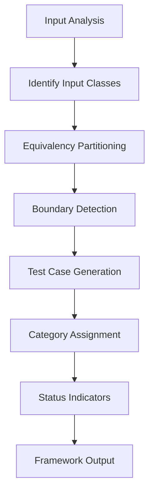

# npl-qa Detailed Reference

Test case generation agent using equivalency partitioning methodology. Produces categorized test cases with visual organization and validation status indicators.

**Source**: `core/agents/npl-qa.md`

---

## Table of Contents

- [Overview](#overview)
- [Equivalency Partitioning](#equivalency-partitioning)
- [Test Categories](#test-categories)
- [Glyph System](#glyph-system)
- [Commands Reference](#commands-reference)
- [Output Formats](#output-formats)
- [Usage Examples](#usage-examples)
- [Integration Patterns](#integration-patterns)
- [Best Practices](#best-practices)
- [Limitations](#limitations)

---

## Overview

The `@npl-qa` agent transforms manual test planning into structured, repeatable test coverage analysis. It systematically identifies input classes, boundary conditions, and generates organized test cases across multiple categories.



### Core Functions

| Function | Description |
|:---------|:------------|
| Input Analysis | Parse function signatures, API endpoints, component props |
| Equivalency Partitioning | Group inputs into valid/invalid equivalence classes |
| Boundary Detection | Identify edge values at partition boundaries |
| Test Generation | Create test cases for each partition and boundary |
| Categorization | Assign category glyphs and priority levels |

---

## Equivalency Partitioning

Equivalency partitioning divides input data into classes where all values in a class are expected to produce equivalent behavior. This reduces test count while maintaining coverage.

### Partition Types

| Type | Description | Example |
|:-----|:------------|:--------|
| Valid | Inputs that should succeed | User age: 18-120 |
| Invalid | Inputs that should fail | User age: -1, 999 |
| Boundary | Values at partition edges | User age: 17, 18, 120, 121 |
| Special | Null, empty, whitespace | `null`, `""`, `"   "` |

### Partition Analysis Algorithm

```
analyzePartitions(input_spec)
  INPUT: function signature, API spec, or component props
  PROCESS:
    1. Identify all input parameters
    2. For each parameter:
       - Determine valid value range
       - Identify invalid value classes
       - Extract boundary values
       - Note special cases (null, empty)
    3. Generate representative values for each class
  OUTPUT:
    partitions: list of equivalence classes
    boundaries: list of edge values
    special_cases: list of exceptional inputs
```

### Boundary Value Analysis

For each partition boundary, generate test cases at:

| Position | Description |
|:---------|:------------|
| Below boundary | Value just outside valid range |
| At boundary | Exact boundary value |
| Above boundary | First value inside valid range |

**Example**: For age range 18-65:
- Below: 17 (invalid)
- At lower: 18 (valid)
- At upper: 65 (valid)
- Above: 66 (invalid)

---

## Test Categories

The agent generates test cases across multiple categories to ensure comprehensive coverage.

### Happy Path

Standard successful execution scenarios.

**Characteristics:**
- Valid inputs within expected ranges
- Normal operational conditions
- Expected successful outcomes

**Coverage targets:**
- Primary use cases
- Common user flows
- Documented functionality

### Negative Cases

Error conditions and invalid input handling.

**Characteristics:**
- Invalid data types
- Out-of-range values
- Missing required fields
- Malformed input formats

**Coverage targets:**
- Input validation logic
- Error message generation
- Graceful failure behavior

### Security

Security-focused test scenarios.

**Characteristics:**
- Authentication/authorization checks
- Injection attack vectors (SQL, XSS, command)
- Data exposure risks
- Session management

**Coverage targets:**
- Access control enforcement
- Input sanitization
- Sensitive data handling

### Performance

Performance and optimization scenarios.

**Characteristics:**
- Large input volumes
- Concurrent requests
- Resource exhaustion attempts
- Timeout conditions

**Coverage targets:**
- Response time thresholds
- Memory usage limits
- Throughput capacity

### E2E/Integration

End-to-end and integration test scenarios.

**Characteristics:**
- Multi-component workflows
- External service interactions
- Data flow across boundaries
- State management across calls

**Coverage targets:**
- System integration points
- Data consistency
- Error propagation

---

## Glyph System

Visual indicators for quick test case identification and categorization.

### Category Glyphs

| Glyph | Category | Description |
|:------|:---------|:------------|
| `[green circle]` | Happy Path | Standard successful execution |
| `[red circle]` | Negative Case | Error conditions, invalid inputs |
| `[warning sign]` | Security | Security-focused scenarios |
| `[wrench]` | Performance | Performance and optimization |
| `[globe]` | E2E/Integration | End-to-end testing |

### Status Indicators

| Indicator | Meaning |
|:----------|:--------|
| `[check]` | Test case expected to pass |
| `[x]` | Test case expected to fail |
| `[?]` | Behavior unknown, requires investigation |

### Priority Markers

| Marker | Priority | Description |
|:-------|:---------|:------------|
| `[P0]` | Critical | Must pass for release |
| `[P1]` | High | Should pass for release |
| `[P2]` | Medium | Nice to have passing |
| `[P3]` | Low | Future consideration |

---

## Commands Reference

### Generate Test Cases

```bash
@npl-qa generate <target> [--category=<cat>] [--framework=<fw>]
```

| Parameter | Description |
|:----------|:------------|
| `<target>` | Function, endpoint, or component to test |
| `--category` | Focus on specific category (happy, negative, security, perf, e2e) |
| `--framework` | Output format (pytest, jest, mocha, rspec, generic) |

### Analyze Coverage

```bash
@npl-qa coverage <target> [--existing=<tests>]
```

Analyzes existing test coverage and identifies gaps.

### Partition Analysis

```bash
@npl-qa partitions <spec>
```

Displays equivalency partitions without generating full test cases.

### Boundary Analysis

```bash
@npl-qa boundaries <spec>
```

Identifies boundary values for test case generation.

---

## Output Formats

### Generic Format

```
1. [green circle] Test Name: Description. [check]
   - Input: input values
   - Expected: expected outcome
   - Preconditions: setup requirements

2. [red circle] Test Name: Description. [check]
   - Input: invalid input
   - Expected: error response
```

### pytest Format

```python
import pytest

class TestUserAuthentication:
    """Generated test cases for user authentication module."""

    def test_valid_credentials_returns_token(self):
        """[green circle] Valid login with correct credentials."""
        # Arrange
        credentials = {"username": "user@example.com", "password": "valid123"}

        # Act
        result = authenticate(credentials)

        # Assert
        assert result.status_code == 200
        assert "token" in result.json()

    def test_invalid_password_returns_401(self):
        """[red circle] Invalid password returns unauthorized."""
        # Arrange
        credentials = {"username": "user@example.com", "password": "wrong"}

        # Act
        result = authenticate(credentials)

        # Assert
        assert result.status_code == 401
```

### Jest Format

```javascript
describe('UserAuthentication', () => {
  // [green circle] Happy Path
  test('valid credentials returns token', async () => {
    const credentials = { username: 'user@example.com', password: 'valid123' };
    const result = await authenticate(credentials);
    expect(result.status).toBe(200);
    expect(result.data).toHaveProperty('token');
  });

  // [red circle] Negative Case
  test('invalid password returns 401', async () => {
    const credentials = { username: 'user@example.com', password: 'wrong' };
    const result = await authenticate(credentials);
    expect(result.status).toBe(401);
  });
});
```

---

## Usage Examples

### Function Testing

```bash
@npl-qa "Analyze the user authentication module and generate comprehensive test cases"
```

**Output:**

```
## Equivalency Partitions

### Username Parameter
- Valid: email format (user@domain.com)
- Invalid: missing @, missing domain, empty string
- Boundary: max length (255 chars)

### Password Parameter
- Valid: 8-128 chars, meets complexity
- Invalid: < 8 chars, no special chars, empty
- Boundary: exactly 8 chars, exactly 128 chars

## Test Cases

1. [green circle] Valid User Login: POST /auth/login with valid credentials. [check]
   - Input: {"username": "user@example.com", "password": "SecurePass123!"}
   - Expected: 200 with JWT token

2. [green circle] Valid User with Max Length Username: Email at 255 char boundary. [check]
   - Input: {"username": "<254chars>@x.com", "password": "SecurePass123!"}
   - Expected: 200 with JWT token

3. [red circle] Invalid Email Format: Missing @ symbol. [check]
   - Input: {"username": "userexample.com", "password": "SecurePass123!"}
   - Expected: 400 with "Invalid email format"

4. [red circle] Password Too Short: 7 characters. [check]
   - Input: {"username": "user@example.com", "password": "Short1!"}
   - Expected: 400 with "Password must be at least 8 characters"

5. [warning sign] SQL Injection Attempt: Malicious username. [check]
   - Input: {"username": "' OR '1'='1", "password": "anything"}
   - Expected: 400 with "Invalid email format" (not SQL error)

6. [wrench] Rate Limiting: 100 requests in 1 minute. [check]
   - Input: 100 rapid login attempts
   - Expected: 429 after threshold exceeded
```

### API Endpoint Testing

```bash
@npl-qa "Generate test cases for the /users/{id}/profile endpoint"
```

**Output:**

```
## Equivalency Partitions

### Path Parameter: id
- Valid: positive integers (1-2147483647)
- Invalid: negative, zero, non-numeric, floating point
- Boundary: 1, 2147483647
- Special: null, empty, very large (>2147483647)

### HTTP Methods
- Allowed: GET
- Disallowed: POST, PUT, DELETE (unless authenticated)

## Test Cases

1. [green circle] Valid User Profile Retrieval: GET /users/123/profile with valid JWT. [check]
   - Expected: 200 with complete user profile JSON

2. [green circle] Boundary ID Value: GET /users/1/profile. [check]
   - Expected: 200 with first user profile

3. [red circle] Invalid User ID (Not Found): GET /users/999999/profile. [check]
   - Expected: 404 with "User not found"

4. [red circle] Invalid ID Format: GET /users/abc/profile. [check]
   - Expected: 400 with "Invalid user ID format"

5. [red circle] Negative ID: GET /users/-1/profile. [check]
   - Expected: 400 with "Invalid user ID"

6. [warning sign] Authentication Required: GET /users/123/profile without JWT. [check]
   - Expected: 401 with "Authentication required"

7. [warning sign] Authorization Check: GET /users/456/profile with user 123's JWT. [check]
   - Expected: 403 with "Access denied" (if private profile)

8. [globe] Profile with Related Data: GET /users/123/profile?include=posts,followers. [check]
   - Expected: 200 with profile + related entities
```

### Component Testing

```bash
@npl-qa "Create test cases for UserCard component with props: user, onEdit, onDelete"
```

**Output:**

```
## Props Analysis

### user (required)
- Valid: {id, name, email, avatar}
- Invalid: null, undefined, missing fields
- Boundary: name at max length, missing optional fields

### onEdit (optional callback)
- Valid: function
- Invalid: non-function values
- Boundary: async function, throws error

### onDelete (optional callback)
- Valid: function
- Invalid: non-function values
- Boundary: async function, throws error

## Test Cases

1. [green circle] Renders with Complete User Data: All fields populated. [check]
   - Input: {id: 1, name: "John Doe", email: "john@example.com", avatar: "url"}
   - Expected: Renders name, email, avatar image

2. [green circle] Renders without Optional Avatar: Missing avatar field. [check]
   - Input: {id: 1, name: "John Doe", email: "john@example.com"}
   - Expected: Renders with placeholder avatar

3. [green circle] Edit Button Calls onEdit: Click edit button. [check]
   - Input: user + onEdit mock
   - Expected: onEdit called with user object

4. [green circle] Delete Button Calls onDelete: Click delete button. [check]
   - Input: user + onDelete mock
   - Expected: onDelete called with user.id

5. [red circle] Handles Null User: user prop is null. [check]
   - Input: null
   - Expected: Renders empty state or error boundary

6. [red circle] Missing Required Fields: user without email. [check]
   - Input: {id: 1, name: "John"}
   - Expected: Renders gracefully, shows placeholder

7. [wrench] Long Name Handling: Name exceeds display area. [check]
   - Input: {id: 1, name: "<200 char name>", email: "a@b.com"}
   - Expected: Truncates with ellipsis, no overflow

8. [globe] Edit Flow Integration: Edit updates parent state. [check]
   - Input: Component in parent with state management
   - Expected: onEdit triggers re-render with updated data
```

---

## Integration Patterns

### Complete QA Workflow

```bash
# Generate test cases
@npl-qa "Generate test cases for payment processing"

# Evaluate coverage completeness
@npl-grader "Evaluate test coverage completeness"

# Document testing strategy
@npl-technical-writer "Document the testing strategy"
```

### Iterative Refinement

```bash
# Initial generation
@npl-qa "Generate initial tests for user registration"

# Analyze effectiveness
@npl-thinker "Analyze test effectiveness and identify gaps"

# Refine based on feedback
@npl-qa "Refine tests based on feedback: add boundary cases for email validation"
```

### Coverage-Driven Testing

```bash
# Analyze existing coverage
@npl-qa coverage src/auth/ --existing=tests/auth/

# Generate missing tests
@npl-qa generate src/auth/ --gaps-only
```

### Framework-Specific Output

```bash
# Python pytest
@npl-qa "Generate tests for login endpoint" --framework=pytest

# JavaScript Jest
@npl-qa "Generate tests for UserCard component" --framework=jest

# Ruby RSpec
@npl-qa "Generate tests for UserService" --framework=rspec
```

### CI/CD Integration

```bash
# Pre-commit: quick partition check
@npl-qa partitions src/new-module.py

# PR review: generate suggested tests
@npl-qa generate $(git diff --name-only main) --category=negative

# Release gate: verify coverage
@npl-qa coverage src/ --threshold=80
```

---

## Best Practices

### Test Case Quality

1. **One assertion per test**: Each test case validates a single behavior
2. **Descriptive names**: Names indicate input and expected outcome
3. **Independent tests**: No test depends on another test's state
4. **Reproducible**: Same inputs always produce same results

### Partition Selection

1. **Representative values**: Choose values that represent entire partition
2. **Boundary focus**: Test at partition boundaries, not just middle
3. **Special cases first**: Null, empty, and edge cases have high defect rates
4. **Avoid redundancy**: One test per equivalence class is sufficient

### Category Balance

| Category | Recommended Coverage |
|:---------|:---------------------|
| Happy Path | 20-30% |
| Negative Cases | 30-40% |
| Security | 15-20% |
| Performance | 10-15% |
| E2E/Integration | 10-15% |

### Framework Selection

| Framework | Best For |
|:----------|:---------|
| pytest | Python backends, data pipelines |
| Jest | React components, Node.js services |
| Mocha | Node.js with custom assertions |
| RSpec | Ruby/Rails applications |
| Generic | Documentation, manual testing |

---

## Limitations

### Scope Constraints

- Generates test specifications, not executable tests without context
- Requires clear input/output specifications for accurate partitioning
- Cannot determine business logic correctness, only structural coverage

### Generation Limits

- Complex state machines may require manual partition refinement
- Async/concurrent behavior testing requires additional specification
- UI interaction sequences limited to component-level analysis

### Framework Constraints

- Generated code requires project-specific imports and setup
- Mock/stub generation depends on available dependency information
- Integration tests require environment configuration details

### Coverage Boundaries

- Cannot guarantee 100% code coverage from specification alone
- Hidden dependencies may not appear in partition analysis
- Runtime-only behaviors (race conditions, memory leaks) require additional tooling

---

## See Also

- `@npl-grader` - Evaluate test coverage and quality
- `@npl-technical-writer` - Document testing approach
- `@npl-thinker` - Analyze test effectiveness
