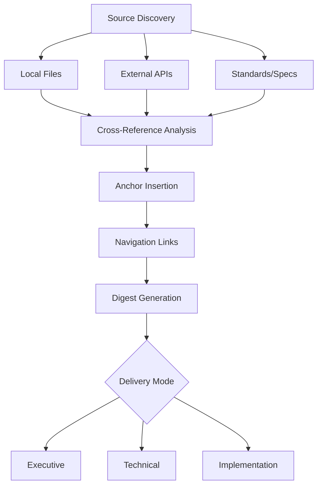

# npl-system-digest Detailed Reference

Multi-source intelligence aggregator for comprehensive system documentation with IDE-compatible navigation.

**Source**: `skeleton/agents/npl-system-digest.npl-template.md`

---

## Table of Contents

- [Overview](#overview)
- [Intelligence Gathering](#intelligence-gathering)
- [Reference Patterns](#reference-patterns)
- [Digest Structure](#digest-structure)
- [Anchor Management](#anchor-management)
- [Delivery Modes](#delivery-modes)
- [Commands Reference](#commands-reference)
- [Configuration Options](#configuration-options)
- [Usage Examples](#usage-examples)
- [Integration Patterns](#integration-patterns)
- [Best Practices](#best-practices)
- [Limitations](#limitations)

---

## Overview

The `@npl-system-digest` agent aggregates documentation, code, and external sources into cross-referenced system documentation. It solves scattered documentation problems by creating navigable, attributed output with IDE-compatible links.



### Core Functions

| Function | Description |
|:---------|:------------|
| Aggregation | Multi-source information gathering |
| Cross-referencing | File:line attribution with symbol resolution |
| Navigation | IDE-compatible links (`file://` with line numbers) |
| Synthesis | Merge local and external sources into insights |
| Anchoring | Insert navigation anchors in documentation |

---

## Intelligence Gathering

The agent gathers information from multiple source types:

### Local Sources

```
docs/*      - Documentation files (Markdown, RST, AsciiDoc)
src/*       - Source code and implementation
tests/*     - Test files and specifications
configs/*   - Configuration files (YAML, JSON, TOML)
```

### External Sources

- **APIs**: REST/GraphQL endpoint documentation
- **Libraries**: Dependency documentation and types
- **Standards**: Protocol specifications and RFCs

### Synthesis Process

```
function synthesize(sources[]):
  local = gather_local_sources()
  external = fetch_external_refs()
  merged = cross_reference(local, external)
  anchored = insert_navigation(merged)
  return generate_digest(anchored)
```

The agent merges local and external sources to produce cross-referenced insights with navigation support.

---

## Reference Patterns

The digest uses consistent reference patterns for different content types:

| Type | Format | Example |
|:-----|:-------|:--------|
| Code | `` [`file:line`](file://./path#Lnn) `` | [`auth.ts:42`](file://./src/auth.ts#L42) |
| Docs | `` [`doc#section`](doc#anchor) `` | [`README#setup`](README.md#setup) |
| External | `[title](url)` | [OAuth 2.0 Spec](https://oauth.net/2/) |
| Architecture | `ServiceA -> ServiceB` | AuthService -> Database |
| Symbol | `` [`name()`](file://./path#symbol) `` | [`validateUser()`](file://./src/auth.ts#validateUser) |
| IDE | `file://./path:line:column` | `file://./src/auth.ts:42:8` |

### IDE Compatibility

Links use the `file://` protocol with optional line and column numbers:

```
file://./relative/path.ts#L42        # Line number anchor
file://./relative/path.ts:42:8       # Line:column format
file:///absolute/path.ts#symbol      # Absolute with symbol
```

Most IDEs (VS Code, JetBrains, etc.) recognize these formats for direct navigation.

---

## Digest Structure

Generated digests follow this structure:

```markdown
# System: {name}

## Executive Summary
[1 paragraph high-level purpose and architecture]

## Architecture

### {Component Name}
- **Location**: `path:lines`
- **Purpose**: Component description
- **Dependencies**: List of dependencies
- **Key Files**:
  - [`file:line`](file://./file#Lnn) - File purpose

## Documentation Map
- [`doc`](doc) -> [`impl`](file://./impl)

## Integration Points
[System integration details with external services]
```

### Section Details

| Section | Content |
|:--------|:--------|
| Executive Summary | 1 paragraph overview for non-technical readers |
| Architecture | Per-component breakdown with file locations |
| Documentation Map | Doc-to-implementation cross-references |
| Integration Points | External service connections and APIs |

---

## Anchor Management

The agent inserts and manages navigation anchors in documentation.

### Permissions

The agent has authority to INSERT, MODIFY, and CREATE anchors in documentation files.

### Anchor Patterns

| Type | Pattern | Example |
|:-----|:--------|:--------|
| Function | `<a id="func-{slug}"></a>` | `<a id="func-validate-user"></a>` |
| Class | `<a id="class-{slug}"></a>` | `<a id="class-auth-service"></a>` |
| Section | `<a id="{slug}"></a>` | `<a id="configuration"></a>` |
| GitHub | `# Header -> #{anchor}` | `# Setup -> #setup` |
| IDE | `file://./path#{symbol}` | `file://./auth.ts#validateUser` |

### Anchor Insertion

When generating documentation, the agent:
1. Identifies key symbols, classes, and sections
2. Generates slugified anchor IDs
3. Inserts anchor tags at appropriate locations
4. Creates navigation links pointing to anchors

---

## Delivery Modes

Output adapts to audience needs:

| Mode | Audience | Length | Focus |
|:-----|:---------|:-------|:------|
| `executive` | C-suite, stakeholders | 1 page | Business impact, high-level architecture |
| `technical` | Developers | Detailed | Implementation details, code references |
| `implementation` | Engineers | Comprehensive | Full specifications, all cross-references |

### Mode Selection

```bash
@npl-system-digest analyze --mode=executive
@npl-system-digest analyze --mode=technical
@npl-system-digest analyze --mode=implementation
```

### Mode Characteristics

**Executive Mode**
- Single page output
- No code snippets
- Focus on capabilities and dependencies
- Business terminology

**Technical Mode**
- Full component breakdown
- Code references with line numbers
- Architecture diagrams
- API documentation

**Implementation Mode**
- Complete file listings
- All cross-references
- Test coverage mapping
- Deployment configurations

---

## Commands Reference

### analyze

```bash
@npl-system-digest analyze [path] [options]
```

Generate system documentation for the specified path.

| Option | Description |
|:-------|:------------|
| `--mode=<mode>` | Output mode: executive, technical, implementation |
| `--format=<fmt>` | Output format: markdown, html, json |
| `--focus=<area>` | Focus on specific area: architecture, api, security |

### update

```bash
@npl-system-digest update [options]
```

Incremental update based on recent changes.

| Option | Description |
|:-------|:------------|
| `--since-commit=<ref>` | Update based on changes since commit |
| `--since-date=<date>` | Update based on changes since date |
| `--incremental` | Only update changed sections |

### generate-nav

```bash
@npl-system-digest generate-nav [options]
```

Generate IDE workspace navigation files.

| Option | Description |
|:-------|:------------|
| `--format=<fmt>` | Format: vscode-workspace, jetbrains, generic |
| `--output=<path>` | Output file path |

### health

```bash
@npl-system-digest health [path]
```

Assess documentation health and coverage.

Output includes:
- Coverage percentage
- Stale documentation
- Missing cross-references
- Broken links

---

## Configuration Options

| Option | Values | Default | Description |
|:-------|:-------|:--------|:------------|
| `--mode` | executive, technical, implementation | technical | Output detail level |
| `--format` | markdown, html, json | markdown | Output format |
| `--focus` | architecture, api, security, all | all | Analysis focus area |
| `--coverage-threshold` | 0-100 | 80 | Minimum coverage percentage |
| `--max-depth` | 1-10 | 5 | Maximum directory depth |
| `--include-external` | true, false | true | Include external references |
| `--validate-links` | true, false | true | Verify all links resolve |

---

## Usage Examples

### Basic Analysis

```bash
@npl-system-digest analyze
```

Generate technical documentation for the current directory.

### Executive Summary

```bash
@npl-system-digest analyze --mode=executive --format=markdown
```

Generate a one-page executive summary.

### Incremental Update

```bash
@npl-system-digest update --since-commit=HEAD~10
```

Update documentation based on the last 10 commits.

### IDE Navigation

```bash
@npl-system-digest generate-nav --format=vscode-workspace
```

Generate VS Code workspace file with navigation links.

### Focused Analysis

```bash
@npl-system-digest analyze --focus=security --mode=technical
```

Generate security-focused technical documentation.

### Health Check

```bash
@npl-system-digest health docs/
```

Assess documentation health and identify gaps.

---

## Integration Patterns

### Chain with Grader

```bash
@npl-system-digest analyze && @npl-grader evaluate generated-docs/
```

Generate documentation, then validate quality.

### Parallel Analysis

```bash
@npl-system-digest analyze --focus=architecture &
@security-agent analyze --focus=vulnerabilities &
wait
```

Run architecture and security analysis in parallel.

### CI/CD Integration

```bash
# Post-merge hook
@npl-system-digest update --incremental

# Nightly documentation build
@npl-system-digest analyze --mode=comprehensive --validate-links
```

### Template Hydration

Create project-specific digest agents:

```bash
@npl-templater hydrate system-digest.npl-template.md \
  --agent_name="api-digest" \
  --system_name="RestAPI" \
  --source_language="python" \
  --doc_directories="docs/" \
  --source_directories="src/" \
  --config_files="config.yaml"
```

### Writer Integration

```bash
# Generate digest, then transform for specific audience
@npl-system-digest analyze --mode=technical > system.md
@npl-technical-writer transform system.md --audience=onboarding
```

---

## Best Practices

### Source Organization

1. **Consistent structure**: Maintain predictable directory layouts
2. **Clear naming**: Use descriptive file and directory names
3. **Colocation**: Keep docs near related code when possible

### Cross-Reference Quality

1. **Symbol resolution**: Ensure function and class names are unique enough for linking
2. **Anchor stability**: Use stable IDs that survive refactoring
3. **Link validation**: Run with `--validate-links` before publishing

### Output Management

1. **Version control**: Commit generated documentation
2. **Incremental updates**: Use `update` for frequent changes
3. **Mode selection**: Match output mode to audience needs

### Documentation Health

1. **Coverage targets**: Aim for >80% component documentation
2. **Reference density**: Target >5 cross-refs per component
3. **Freshness**: Update documentation with code changes
4. **Validation**: Verify all paths resolve correctly

---

## Limitations

### Scope Constraints

- **Static analysis only**: Does not execute code or trace runtime behavior
- **Public content**: Limited to publicly accessible documentation and code
- **Version stability**: Assumes stable code versions during analysis

### Resource Limits

- Large codebases may require segmented analysis
- External API documentation fetching subject to rate limits
- Deep nesting (>10 levels) may produce incomplete references

### Reference Accuracy

- Symbol resolution depends on unique naming
- Refactored code may break existing anchors
- External links may become stale

### Integration Dependencies

- IDE navigation requires compatible editor
- Workspace file formats vary by editor
- Some formats require editor extensions

### Quality Metrics

| Metric | Target | Description |
|:-------|:-------|:------------|
| Coverage | >80% | Components with documentation |
| References | >5/component | Cross-references per component |
| Validation | 100% | Paths verified as valid |
| Freshness | Current context | Updated within analysis session |
