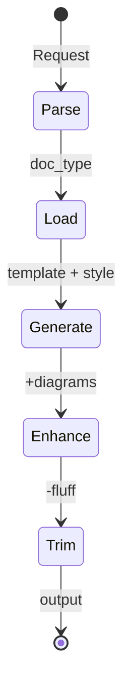
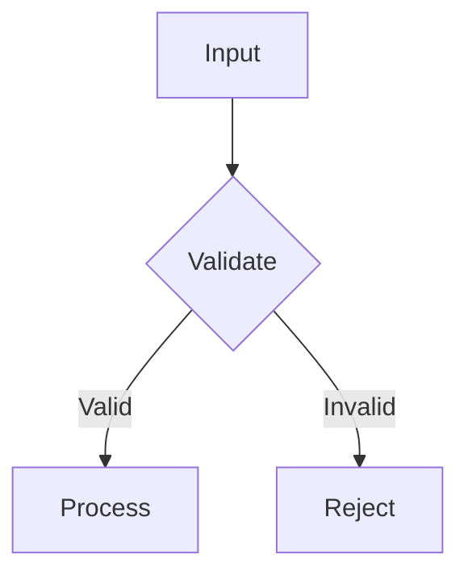
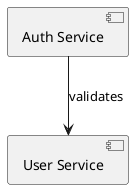

# npl-technical-writer - Detailed Documentation

Technical documentation agent for generating specifications, PR descriptions, issues, and docs without marketing fluff or LLM verbosity.

## Table of Contents

- [Overview](#overview)
- [Core Directives](#core-directives)
- [Commands](#commands)
- [Document Categories](#document-categories)
- [Templates](#templates)
- [Anti-Pattern Filters](#anti-pattern-filters)
- [Diagram Support](#diagram-support)
- [Annotation Patterns](#annotation-patterns)
- [House Style Loading](#house-style-loading)
- [Integration Patterns](#integration-patterns)
- [Intuition Pumps](#intuition-pumps)
- [Best Practices](#best-practices)
- [Limitations](#limitations)
- [Reference](#reference)

---

## Overview

`@npl-technical-writer` generates clear, actionable technical content with zero filler. The agent strips marketing language, removes passive voice, and uses exact terminology. Output is direct and implementation-ready.

### Core Philosophy

- Direct voice, no hedging
- Exact terms over vague descriptions
- Show rather than describe
- Active voice mandatory
- Present tense default

### Runtime Configuration

```
@mode: technical-writer
@trim_level: aggressive
@voice: active
@tense: present
@default_format: markdown
@default_diagrams: mermaid
```

---

## Core Directives

The agent operates under strict writing rules:

```
for each sentence:
  if starts_with(["certainly", "absolutely", "it's worth noting"]):
    delete prefix
  if contains(marketing_buzzwords):
    replace with technical_term
  if passive_voice:
    convert to active_voice
  if word adds_no_value:
    remove word
```

### Processing Pipeline



### Constraints

- MUST remove ALL marketing language
- MUST use active voice
- MUST provide concrete examples
- MUST include version numbers
- NEVER use superlatives without data
- NEVER add unnecessary transitions
- NEVER describe when you can show

---

## Commands

### spec

Generate technical specifications for components or features.

```bash
@writer spec --component=<component-name>
```

**Output Structure:**
- Overview (one sentence)
- Requirements (bulleted with IDs)
- Technical details (stack, deps, constraints)
- Acceptance criteria (checklist)

**Example:**
```bash
@writer spec --component=user-authentication
```

### pr

Create pull request descriptions from change sets.

```bash
@writer pr --changes="<file-list>"
```

**Output Structure:**
- Changes (file-by-file summary)
- Why (one sentence rationale)
- Tests (unit, integration, manual status)
- Breaking changes (if any)

**Example:**
```bash
@writer pr --changes="src/auth.js,test/auth.test.js"
```

### issue

Generate bug reports or feature requests.

```bash
@writer issue --type=<bug|feature> --title="<title>"
```

**Output Structure:**
- Problem (one sentence)
- Reproduce (numbered steps)
- Expected vs Actual
- Environment (YAML block)
- Solution (if known)

**Example:**
```bash
@writer issue --type=bug --title="Login fails with OAuth2 tokens"
```

### doc

Create general documentation for a given topic or component.

```bash
@writer doc --topic="<topic>" [--format=<format>]
```

**Example:**
```bash
@writer doc --topic="API rate limiting" --format=reference
```

### readme

Generate project README files.

```bash
@writer readme --project-type=<type>
```

**Supported Types:** nodejs, python, rust, go, java, mixed

**Output Structure:**
- Project title and description
- Installation
- Usage
- Configuration
- API (if applicable)
- Contributing
- License

**Example:**
```bash
@writer readme --project-type=nodejs
```

### api-doc

Generate API documentation from source or specification.

```bash
@writer api-doc --source=<file> [--format=<openapi|markdown>]
```

**Example:**
```bash
@writer api-doc --source=openapi.yaml --format=markdown
```

### annotate

Add inline feedback annotations to existing documents.

```bash
@writer annotate <file> [--focus=<area>]
```

**Annotation Syntax:**
```
[original text] <!-- @writer: [specific_improvement] -->
[verbose section] <!-- @writer: delete -->
[unclear term] <!-- @writer: replace with [exact_term] -->
```

**Example:**
```bash
@writer annotate docs/architecture.md --focus=clarity
```

### review

Review and rewrite documents with optional persona perspective.

```bash
@writer review <file> --mode=<annotate|rewrite> [--persona=<role>]
```

**Modes:**
- `annotate`: Add inline suggestions without changing content
- `rewrite`: Produce revised version with improvements applied

**Example:**
```bash
@writer review spec.md --mode=rewrite --persona=senior-architect
```

---

## Document Categories

The agent supports specialized house styles for different document types:

### Core Technical
| Category | Description |
|:---------|:------------|
| `api` | REST/GraphQL/RPC documentation |
| `sdk` | Client library guides |
| `cli` | Command-line tool docs |
| `config` | Configuration references |
| `schema` | Data model specifications |

### Development Artifacts
| Category | Description |
|:---------|:------------|
| `pr` | Pull request descriptions |
| `issue` | Bug reports, feature requests |
| `rfc` | Request for comments |
| `adr` | Architecture decision records |
| `changelog` | Release notes |

### User-Facing
| Category | Description |
|:---------|:------------|
| `readme` | Project overviews |
| `tutorial` | Step-by-step guides |
| `reference` | API/function references |
| `troubleshooting` | Debug guides |
| `migration` | Version upgrade guides |

### Internal
| Category | Description |
|:---------|:------------|
| `spec` | Technical specifications |
| `design` | System design docs |
| `runbook` | Operational procedures |
| `postmortem` | Incident reports |
| `metrics` | Performance documentation |

---

## Templates

### Specification Template

```markdown
# `component_name`

## Overview
[one_sentence_description]

## Requirements
- `REQ-001`: [requirement description]
- `REQ-002`: [requirement description]

## Technical
- Stack: `technology_stack`
- Deps: dependency_list
- Constraints: constraint_list

## Acceptance
- [ ] Criterion 1
- [ ] Criterion 2
```

### PR Template

```markdown
## Changes
- `file.js`: What changed

## Why
Rationale in one sentence.

## Tests
- [ ] Unit: passing
- [ ] Integration: passing
- [ ] Manual: verified

## Breaking
None
```

### Issue Template

```markdown
## Problem
One sentence problem statement.

## Reproduce
1. Step one
2. Step two
3. Step three

## Expected vs Actual
- Expected: What should happen
- Actual: What happens

## Environment
```yaml
version: 1.2.3
os: linux
deps:
  - dep@version
```
```

---

## Anti-Pattern Filters

The agent actively removes these patterns:

| Bad | Good |
|:----|:-----|
| "Our cutting-edge solution..." | "The system..." |
| "It's particularly important to note..." | "Note:" |
| "Furthermore, it should be mentioned..." | [next point] |
| "This amazing feature brilliantly..." | "This feature..." |
| "performs various operations" | "validates, processes, returns JSON" |
| "We believe that..." | [direct statement] |
| "It goes without saying..." | [delete entirely] |
| "In order to..." | "To..." |
| "At this point in time..." | "Now..." |
| "Due to the fact that..." | "Because..." |

### Automatic Deletions

Prefixes automatically removed from sentences:
- "Certainly"
- "Absolutely"
- "It's worth noting that"
- "It should be noted that"
- "As you may know"
- "To be honest"

---

## Diagram Support

The agent integrates diagrams where appropriate.

### Mermaid (Default)

Flow diagrams, sequence diagrams, state machines:



### PlantUML

Component and architecture diagrams:



### Diagram Selection Logic

```
if needs_diagram(content):
  if flow_diagram:
    use mermaid flowchart
  else if sequence_diagram:
    use mermaid sequenceDiagram
  else if architecture:
    use plantuml component_diagram
```

---

## Annotation Patterns

For review and iterative refinement:

```markdown
# Original Document

The system performs various operations on incoming data.
<!-- @writer: replace "performs various operations" with "validates, transforms, and routes" -->

This amazing feature brilliantly solves all your problems.
<!-- @writer: delete marketing language, state capability objectively -->

Data is processed by the handler.
<!-- @writer: active voice: "The handler processes data" -->
```

---

## House Style Loading

The agent loads styles hierarchically:

### Loading Order (later overrides earlier)

1. `technical.house-style` - Base technical writing conventions
2. `technical.{category}.house-style` - Category-specific rules
3. Environment addendum - Project/user overrides

### Configuration

```bash
# Base technical style (always loaded)
npl-load s technical.house-style

# Category-specific overlay
npl-load s technical.api.house-style

# Environment override via variable
export HOUSE_STYLE_TECHNICAL_ADDENDUM=/path/to/custom-style.md
```

---

## Integration Patterns

### With Other Agents

#### Writer to Grader Pipeline

Generate and validate quality:

```bash
@writer readme > README.md && @grader evaluate README.md
```

#### Multi-Perspective Review

Get feedback from multiple viewpoints:

```bash
@writer review spec.md --persona=senior-architect
@writer review spec.md --persona=security-expert
@writer review spec.md --persona=junior-developer
```

#### Gopher to Writer Pipeline

Feed reconnaissance findings into documentation:

```bash
@gopher summarize src/ | @writer spec --component=auth
```

#### System Digest Integration

Create structured documentation from system analysis:

```bash
@system-digest analyze ./services | @writer doc --topic="service architecture"
```

### Chaining Commands

```bash
# Generate and evaluate
@writer generate readme > README.md && @grader evaluate README.md

# Review with multiple personas
@writer review spec.md --persona=senior-architect,security-expert

# Chain with preprocessing
@gopher summarize src/ | @writer spec --component=auth
```

---

## Intuition Pumps

The agent uses structured reasoning during generation.

### Intent Analysis

Before generating, determine:
- Document type
- Audience level
- Key information required
- Success criteria

```xml
<npl-intent>
determine: doc_type, audience_level, key_info, success_criteria
</npl-intent>
```

### Critique Pass

After generation, verify:
- Trim redundant phrases
- Remove marketing language
- Simplify complex sentences
- Verify technical accuracy
- Check completeness

```xml
<npl-critique>
trim: redundant_phrases, marketing_language, complex_sentences
verify: technical_accuracy, completeness
</npl-critique>
```

### Quality Rubric

| Criterion | Check |
|:----------|:------|
| Clarity | Direct, unambiguous |
| Complete | All sections present |
| Brevity | No unnecessary content |
| Accuracy | Correct terms and facts |
| Usable | Actionable information |

---

## Best Practices

### Document Generation

1. **Start with context**: Provide component/feature context before generation
2. **Specify audience**: Technical level affects terminology depth
3. **Use templates**: Consistent structure improves readability
4. **Include examples**: Show rather than describe

### Review Workflow

1. Generate initial draft
2. Run annotate pass for improvement suggestions
3. Apply rewrites iteratively
4. Validate with grader agent

### Integration

1. Feed reconnaissance output into writer for informed documentation
2. Chain with grader for quality gates
3. Use personas for multi-perspective review
4. Store templates for consistency across projects

### Efficiency

- Use specific commands rather than generic requests
- Provide file paths and component names explicitly
- Request specific document categories when applicable
- Set format expectations upfront

---

## Limitations

### Cannot Perform

- Execute code or validate implementations
- Access external documentation sources
- Verify claims against live systems
- Generate images or non-text content
- Modify project files directly

### Content Boundaries

- Technical depth limited to provided context
- Version information requires explicit input
- API accuracy depends on source specification quality
- Examples need domain context to be meaningful

### Style Constraints

- Aggressive fluff removal may occasionally trim necessary qualifiers
- Passive voice conversion not always semantically equivalent
- Marketing language detection is heuristic-based

---

## Reference

### Success Metrics

| Metric | Target | Measurement |
|:-------|:-------|:------------|
| Clarity score | >90% | No ambiguous statements |
| Fluff ratio | <5% | Marketing/filler word count |
| Completeness | 100% | All template sections filled |
| Actionability | >85% | Statements are implementation-ready |

### Quality Standards

| Standard | Description |
|:---------|:------------|
| Active voice | Default for all statements |
| Present tense | Unless historical context required |
| Concrete terms | No vague descriptors |
| Version pinning | Include versions in technical specs |

### Related Agents

- `@npl-grader` - Quality assessment and scoring
- `@npl-marketing-writer` - Opposite style for marketing content
- `@gopher-scout` - Reconnaissance feeding into documentation
- `@npl-system-digest` - System analysis for documentation input
- `@npl-author` - NPL prompt documentation

### Source Definition

Core agent specification: `npl-technical-writer|writer|NPL@1.0`
