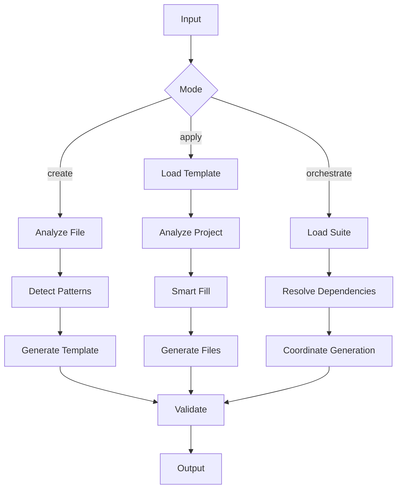

# npl-templater Detailed Reference

Template creation and hydration agent with progressive complexity tiers and project-aware generation.

**Agent Definition**: `core/agents/npl-templater.md`

---

## Table of Contents

- [Overview](#overview)
- [Template Tiers](#template-tiers)
  - [Tier 0: Zero-Config](#tier-0-zero-config)
  - [Tier 1: Simple Placeholders](#tier-1-simple-placeholders)
  - [Tier 2: Smart Templates](#tier-2-smart-templates)
  - [Tier 3: Advanced NPL](#tier-3-advanced-npl)
- [Commands Reference](#commands-reference)
  - [Quick Start](#quick-start)
  - [Create](#create)
  - [Apply](#apply)
  - [Analyze](#analyze)
  - [Validate](#validate)
  - [Orchestrate](#orchestrate)
  - [Gallery](#gallery)
  - [Publish](#publish)
- [Template Syntax](#template-syntax)
  - [Placeholders](#placeholders)
  - [Control Structures](#control-structures)
  - [Named Templates](#named-templates)
  - [Directives](#directives)
- [Intelligence Layer](#intelligence-layer)
- [Interactive Builder](#interactive-builder)
- [Community Features](#community-features)
- [Configuration](#configuration)
- [Integration Patterns](#integration-patterns)
- [Best Practices](#best-practices)
- [Limitations](#limitations)

---

## Overview

`@templater` provides progressive template management from basic placeholder substitution to full NPL syntax. Core functions:

1. Convert existing files into reusable templates with dynamic placeholders
2. Hydrate templates using detected project context (framework, database, auth)
3. Validate template syntax and test in sandbox environments
4. Coordinate multi-template orchestration for project scaffolding
5. Discover and share templates via community marketplace



The agent loads these NPL dependencies:

```bash
npl-load c "syntax,agent,directive,formatting,pumps.intent,pumps.cot,pumps.reflection,instructing.handlebars,instructing.alg,instructing.annotation,special-sections.agent,special-sections.runtime-flags,special-sections.named-template,special-sections.secure-prompt,fences.artifact,fences.template,fences.alg-pseudo"
```

---

## Template Tiers

The agent supports four complexity tiers. Skill level is auto-detected but can be specified explicitly.

### Tier 0: Zero-Config

Full automation with no user configuration. Agent analyzes project and generates appropriate output.

**Syntax**:
```
Project: {auto-detect}
Stack: {auto-analyze}
[...|generate based on project structure]
```

**Use Cases**:
- Quick project scaffolding
- Auto-generated configs for detected frameworks
- First-time users

**Behavior**:
1. Scans project directory for framework signatures
2. Identifies configuration patterns
3. Generates files matching detected conventions

### Tier 1: Simple Placeholders

Basic variable substitution with optional defaults.

**Syntax**:
```
Project: {name}
Author: {author|current-user}
Created: {date|today}
Version: {version|1.0.0}
```

**Placeholder Format**: `{variable}` or `{variable|default}`

**Built-in Variables**:

| Variable | Description |
|:---------|:------------|
| `name` | Project/file name |
| `author` | Current user |
| `date` | Current date |
| `year` | Current year |
| `version` | Version number |
| `license` | License type |

**Use Cases**:
- README templates
- License headers
- Simple config files

### Tier 2: Smart Templates

Conditional logic and iteration using handlebars syntax.

**Syntax**:
```handlebars
{{#if framework=="Django"}}
  # Django Configuration
  {{#each installed_apps}}
    - {{this}}
  {{/each}}
{{elif framework=="React"}}
  # React Configuration
  {{#each dependencies}}
    "{{name}}": "{{version}}"
  {{/each}}
{{/if}}
```

**Control Structures**:

| Structure | Purpose |
|:----------|:--------|
| `{{#if condition}}` | Conditional rendering |
| `{{#elif condition}}` | Alternative condition |
| `{{else}}` | Default branch |
| `{{/if}}` | Close conditional |
| `{{#each collection}}` | Iterate collection |
| `{{#unless condition}}` | Negative conditional |

**Use Cases**:
- Framework-specific configs
- Multi-environment deployments
- Dynamic documentation

### Tier 3: Advanced NPL

Full NPL syntax with named templates, directives, and complex formatting.

**Syntax**:
```npl
@with NPL@1.0
stack-config

| Framework | Version | Status |
|:----------|--------:|:------:|
{{#each stack}}
| `{{name}}` | {{version|latest}} | {{status}} |
{{/each}}

deploy:
  {{#env production}}
    optimized|minified|cached
  {{else}}
    debug|verbose|hot-reload
  {{/env}}
```

**NPL Features Available**:

| Feature | Description |
|:--------|:------------|
| Named templates | Reusable template blocks with `🧱` |
| Table directives | Structured tables with alignment |
| NPL directives | Custom processing instructions |
| Nested control flow | Complex conditional logic |
| Transformers | Value formatting pipelines |

**Use Cases**:
- Complex project scaffolding
- Multi-file generation suites
- Enterprise configuration management

---

## Commands Reference

### Quick Start

Auto-detect project type and suggest appropriate templates.

```bash
@templater quick-start
```

**Workflow**:
1. Analyze project directory
2. Detect framework and structure
3. Suggest matching templates
4. Apply with confirmation

**Output**: List of suggested templates with relevance scores.

### Create

Generate template from existing file.

```bash
@templater create --from={file} [--tier={0-3}] [--output={path}]
```

**Arguments**:

| Argument | Description |
|:---------|:------------|
| `--from` | Source file to templatize |
| `--tier` | Target complexity tier (auto-detect if omitted) |
| `--output` | Output path (default: `{name}.npl.md`) |

**Process**:
1. Analyze file structure
2. Identify hardcoded values
3. Suggest placeholder replacements
4. Generate template with metadata

**Example**:

```bash
@templater create --from=docker-compose.yml --tier=2
```

Output: `docker-compose.npl.md` with service names, ports, and environment variables converted to placeholders.

### Apply

Hydrate template with project-specific values.

```bash
@templater apply {template} [--smart-fill] [--interactive] [--dry-run]
```

**Arguments**:

| Argument | Description |
|:---------|:------------|
| `template` | Template file or gallery ID |
| `--smart-fill` | Auto-detect values from project context |
| `--interactive` | Prompt for each placeholder |
| `--dry-run` | Preview output without writing files |

**Smart Fill Detection**:
- Framework version from `package.json`, `requirements.txt`, etc.
- Database type from existing configs
- Auth method from existing implementation
- Project name from directory or git

**Example**:

```bash
@templater apply react-app.npl --smart-fill
```

### Analyze

Examine existing files for templatization opportunities.

```bash
@templater analyze {path} [--suggest-tier] [--report]
```

**Arguments**:

| Argument | Description |
|:---------|:------------|
| `path` | File or directory to analyze |
| `--suggest-tier` | Recommend appropriate tier |
| `--report` | Generate detailed analysis report |

**Output**:
- Detected patterns
- Suggested placeholders
- Recommended tier
- Estimated complexity

### Validate

Check template syntax and test rendering.

```bash
@templater validate {template} [--sandbox] [--strict]
```

**Arguments**:

| Argument | Description |
|:---------|:------------|
| `template` | Template file to validate |
| `--sandbox` | Test with sample data |
| `--strict` | Fail on warnings |

**Validation Checks**:
1. Syntax correctness
2. Placeholder resolution
3. Control flow logic
4. Output format validity
5. Performance metrics

**Sandbox Testing**:

Provides sample data matching detected variable types and renders template in isolated environment.

### Orchestrate

Coordinate multi-template generation for project scaffolding.

```bash
@templater orchestrate {suite} [--coordinate] [--parallel]
```

**Arguments**:

| Argument | Description |
|:---------|:------------|
| `suite` | Suite name or component list |
| `--coordinate` | Resolve cross-template dependencies |
| `--parallel` | Generate independent files in parallel |

**Suite Format**:

```bash
@templater orchestrate frontend:react backend:django infra:docker
```

**Coordination**:
- Resolves shared variables across templates
- Orders generation by dependency graph
- Validates cross-file consistency

**Example Suite Definition**:

```yaml
# fullstack.npl-suite
name: fullstack
components:
  - frontend: react-app.npl
  - backend: django-api.npl
  - database: postgres.npl
  - infra: docker-compose.npl
shared:
  project_name: {name}
  db_host: postgres
  api_port: 8000
```

### Gallery

Browse and search template marketplace.

```bash
@templater gallery [--category={cat}] [--tier={0-3}] [--search={query}]
```

**Arguments**:

| Argument | Description |
|:---------|:------------|
| `--category` | Filter by category (web, api, mobile, data, devops) |
| `--tier` | Filter by complexity tier |
| `--search` | Full-text search |

**Categories**:

| Category | Description |
|:---------|:------------|
| `web` | Frontend frameworks, SPAs |
| `api` | REST, GraphQL, RPC services |
| `mobile` | iOS, Android, React Native |
| `data` | Databases, ETL, analytics |
| `devops` | CI/CD, infrastructure, containers |

### Publish

Share template to community marketplace.

```bash
@templater publish {template} [--community] [--private]
```

**Arguments**:

| Argument | Description |
|:---------|:------------|
| `template` | Template to publish |
| `--community` | Publish to public marketplace |
| `--private` | Publish to private organization registry |

**Process**:
1. Validate template
2. Generate metadata
3. Submit for moderation (community)
4. Index and notify

---

## Template Syntax

### Placeholders

**Basic Placeholder**:
```
{variable}
```

**With Default**:
```
{variable|default-value}
```

**Typed Placeholder**:
```
<<type>:variable>
```

Types: `string`, `int`, `float`, `bool`, `date`, `enum`, `list`

**Constrained Placeholder**:
```
<<enum>:environment|production|staging|development>
<<range>:port|1024-65535>
<<pattern>:email|[a-z]+@[a-z]+\.[a-z]+>
```

### Control Structures

**Conditional**:
```handlebars
{{#if condition}}
  content
{{elif other_condition}}
  alternative
{{else}}
  default
{{/if}}
```

**Iteration**:
```handlebars
{{#each collection as item}}
  {{item.name}}: {{item.value}}
{{/each}}
```

**Loop Context Variables**:

| Variable | Description |
|:---------|:------------|
| `@index` | Current iteration index (0-based) |
| `@first` | True if first iteration |
| `@last` | True if last iteration |
| `@key` | Key name for object iteration |

**Unless**:
```handlebars
{{#unless disabled}}
  enabled content
{{/unless}}
```

### Named Templates

Define reusable blocks:

```npl
🧱 service-config
@with NPL@1.0
```template
service_name: {name}
replicas: {{replicas|1}}
ports:
  - {{port}}:{{port}}
```

```

**Usage**:
```npl
service-template | with database settings
```

### Directives

**Table Directive**:
```npl
(left|center|right) Col1|Col2|Col3
```

**Import Directive**:
```npl
partial-name | with context
```

**Transform Directive**:
```npl
value|uppercase
value|lowercase
value|capitalize
value|slug
```

---

## Intelligence Layer

### Pattern Recognition

The agent analyzes projects to identify:

| Pattern | Detection Method |
|:--------|:-----------------|
| Framework | Package files, directory structure, file extensions |
| Database | Connection strings, ORM configs, migration files |
| Auth | JWT tokens, OAuth configs, session management |
| Environment | `.env` files, config hierarchies |
| Team size | Commit history, contributor count |
| Maturity | Age, test coverage, documentation |

### Context Analysis Algorithm

```
analyze_context(project):
  frameworks = detect_frameworks(project.files)
  team_size = estimate_team(project.commits)
  maturity = assess_maturity(project.age, test_coverage)
  complexity = calculate_complexity(loc, dependencies)

  return {
    tier: map_complexity_to_tier(complexity),
    templates: rank_by_relevance(frameworks, maturity),
    suggestions: generate_improvements(analysis)
  }
```

### Smart Suggestions

Template recommendations based on:

| Factor | Weight |
|:-------|-------:|
| Framework match | 40% |
| Project structure similarity | 25% |
| Community rating | 20% |
| Download count | 15% |

---

## Interactive Builder

### Component Library

| Component | Symbol | Description |
|:----------|:------:|:------------|
| Text blocks | `text-blocks` | Static content |
| Placeholders | `placeholders` | Dynamic insertion |
| Conditionals | `conditionals` | Logic branches |
| Iterations | `iterations` | Repeating sections |
| Includes | `includes` | Reusable partials |
| Transformers | `transformers` | Value pipelines |
| Validators | `validators` | Rule enforcement |

### Generation Wizard

Step-by-step template creation:

1. **Analyze**: Scan project structure
2. **Suggest**: Present ranked template options
3. **Customize**: Pre-fill form with detected values
4. **Validate**: Check configuration
5. **Apply**: Generate files
6. **Hooks**: Execute post-generation actions

---

## Community Features

### Marketplace

| Action | Description |
|:-------|:------------|
| Submit | Template review and publication |
| Discover | Search, filter, preview |
| Engage | Rate, comment, fork |
| Collaborate | Improve, merge, share |

### Metadata Schema

```yaml
name: template-name
category: web|api|mobile|data|devops
tier: 0-3
rating: 0.0-5.0
downloads: count
dependencies: [framework versions]
tags: [auto-generated tags]
```

### Quality Metrics

| Metric | Target |
|:-------|:-------|
| First-use success | >80% |
| Discovery time | <2min |
| Application success | >90% |
| User satisfaction | >4.5 |

---

## Configuration

### Runtime Flags

| Flag | Values | Description |
|:-----|:-------|:------------|
| `--tier` | 0-3 | Complexity tier (auto-detect default) |
| `--mode` | visual, cli, api | Interface mode |
| `--cache` | local, remote, hybrid | Caching strategy |
| `--telemetry` | on, anonymous, off | Usage tracking |
| `--marketplace` | official, community, private | Template source |

### Preferences

```yaml
ui.complexity: adaptive|fixed
templates.source: [local, community, enterprise]
validation.strictness: lenient|standard|strict
suggestions.frequency: always|smart|manual
```

---

## Integration Patterns

### With @grader

Validate generated templates:

```bash
@templater create --from=config.yml && @grader validate template.npl
```

### With @thinker

Analyze before generating:

```bash
@thinker "Review my template structure" && @templater "Refactor based on analysis"
```

### With @npl-gopher-scout

Analyze project before templating:

```bash
@npl-gopher-scout analyze ./src --focus="configuration patterns" | @templater create
```

### Pipeline Example

```bash
# Full workflow
@templater analyze ./src --report && \
@templater create --from=./src/config --tier=2 && \
@grader validate template.npl --strict && \
@templater publish template.npl --community
```

---

## Best Practices

### Template Design

1. **Naming**: `{category}-{purpose}-{tier}.npl` (e.g., `web-react-config-2.npl`)
2. **Documentation**: Include inline examples and edge case handling
3. **Defaults**: Provide environment-aware smart values
4. **Validation**: Fail fast with helpful error messages
5. **Versioning**: Use semantic versioning with migration guides

### Placeholder Strategy

1. **Minimal placeholders**: Only templatize values that vary
2. **Clear names**: Use descriptive variable names
3. **Sensible defaults**: Always provide reasonable defaults
4. **Type constraints**: Use typed placeholders for validation

### User Experience

1. **Progressive disclosure**: Start simple, add complexity on demand
2. **Visual feedback**: Provide real-time validation
3. **Contextual help**: Include hover tooltips and examples
4. **Learning path**: Offer interactive tutorials

### Performance

1. **Caching**: Enable caching for repeated operations
2. **Lazy loading**: Load advanced features on demand
3. **Batch operations**: Group related file generations

---

## Limitations

### Scope Constraints

- Template syntax validation only; does not validate generated output execution
- Pattern detection based on common conventions; custom structures may not be recognized
- Smart fill accuracy depends on project structure clarity

### Resource Limits

- Large templates (>1MB) may require extended processing
- Deep nesting (>10 levels) triggers warnings
- Complex orchestration suites limited to 50 components

### Syntax Boundaries

- Handlebars syntax only; no embedded scripting
- Control flow limited to conditionals and iteration
- Custom transformers require plugin registration

### Community Features

- Publishing requires template validation pass
- Moderation may delay community publication
- Private registries require organization configuration

---

## See Also

- [npl-templater](./npl-templater.md) - Concise reference
- [Template fence syntax](../../npl/fences/template.md) - Template fence specification
- [Handlebars control flow](../../npl/instructing/handlebars.md) - Control structure syntax
- [Named templates](../../npl/formatting/template.md) - Named template definitions
- [npl-grader](./npl-grader.md) - Template validation agent
