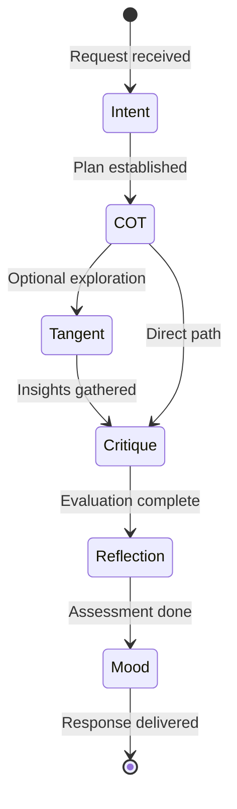

# npl-thinker Detailed Documentation

Multi-cognitive reasoning agent combining six intuition pumps for structured problem-solving with transparent reasoning.

## Table of Contents

- [Overview](#overview)
- [Cognitive Architecture](#cognitive-architecture)
- [Pump Specifications](#pump-specifications)
- [Response Modes](#response-modes)
- [Processing Pipeline](#processing-pipeline)
- [Usage Examples](#usage-examples)
- [Integration Patterns](#integration-patterns)
- [Configuration](#configuration)
- [Best Practices](#best-practices)
- [Limitations](#limitations)

---

## Overview

`npl-thinker` orchestrates six cognitive pumps to produce transparent, well-reasoned responses:

| Pump | Function | Output |
|:-----|:---------|:-------|
| Intent | Plan approach before execution | Goals, steps, constraints |
| COT | Step-by-step reasoning | Thought process, execution, outcome |
| Critique | Evaluate strengths/weaknesses | Balanced analysis with alternatives |
| Reflection | Assess response quality | Quality rating, confidence, improvements |
| Mood | Contextualize emotional state | Tone arc, energy level |
| Tangent | Surface related insights | Connections, explorations, value |

**Core pattern**:
```
analyze(request) -> intent.plan() -> cot.reason() -> [tangent.explore()] -> critique.evaluate() -> reflection.assess() -> mood.contextualize() -> respond()
```

---

## Cognitive Architecture

### Pump Cascade Flow



### Adaptive Complexity

The agent scales pump usage based on task complexity:

```
simple request    -> [intent, cot]
moderate request  -> [intent, cot, reflection]
complex request   -> [all pumps + tangent exploration]
```

Complexity indicators:
- Multi-step requirements
- Ambiguous constraints
- Trade-off analysis needed
- Multiple valid approaches
- Domain expertise required

---

## Pump Specifications

### Intent Pump

Plans approach before execution. Appears at response start.

**Structure**:
```yaml
<npl-intent>
intent:
  goal: <primary objective>
  approach: <strategy>
  steps:
    - <action 1>
    - <action 2>
  constraints: [<boundaries>]  # optional
</npl-intent>
```

**Purpose**:
- Document decision rationale
- Enable debugging of agent reasoning
- Build transparency into process
- Structure complex operations

**Example**:
```yaml
<npl-intent>
intent:
  goal: Evaluate microservices vs monolith for 10K concurrent users
  approach: Compare on scalability, complexity, operational cost
  steps:
    - Define evaluation criteria
    - Analyze each architecture against criteria
    - Consider team expertise constraints
    - Recommend with trade-offs
  constraints:
    - 3-month delivery timeline
    - 4-person engineering team
</npl-intent>
```

### Chain-of-Thought (COT) Pump

Step-by-step reasoning with visible thought process.

**Structure**:
```yaml
<npl-cot>
thought_process:
  - thought: <initial consideration>
    understanding: <comprehension of problem>
    theory_of_mind: <insight into questioner's intent>
    plan: <approach strategy>
    rationale: <justification>
    execution:
      - process: <step execution>
        reflection: <progress check>
        correction: <adjustments>
outcome: <conclusion>
</npl-cot>
```

**Purpose**:
- Break complex problems into steps
- Show reasoning transparency
- Enable self-correction during analysis
- Build confidence through visible logic

**Example**:
```yaml
<npl-cot>
thought_process:
  - thought: "User needs database selection for read-heavy workload"
    understanding: "High read throughput with occasional writes"
    theory_of_mind: "Likely building analytics or reporting system"
    plan: "Compare PostgreSQL, MySQL, and purpose-built analytics DBs"
    rationale: "Different engines optimize for different access patterns"
    execution:
      - process: "PostgreSQL: strong for complex queries, MVCC handles reads well"
        reflection: "Good option but may need read replicas at scale"
        correction: "Note replica complexity in recommendation"
      - process: "ClickHouse: columnar storage optimized for analytics"
        reflection: "Better fit if workload is truly analytical"
        correction: "Ask about query patterns to confirm"
outcome: "Recommend ClickHouse for pure analytics, PostgreSQL with replicas for mixed workload"
</npl-cot>
```

### Critique Pump

Evaluates strengths, weaknesses, assumptions, and alternatives.

**Structure**:
```yaml
<npl-critique>
critique:
  subject: <what is being critiqued>
  perspective: <analytical framework>
  strengths:
    - <positive 1>
    - <positive 2>
  weaknesses:
    - <limitation 1>
    - <limitation 2>
  assumptions:
    - <underlying assumption 1>
  alternatives:
    - <other approach 1>
  verdict: <overall assessment>
</npl-critique>
```

**Purpose**:
- Balanced evaluation of solutions
- Surface hidden assumptions
- Identify unexplored options
- Prevent overconfidence in single approach

**Example**:
```yaml
<npl-critique>
critique:
  subject: "Proposed Redis caching layer"
  perspective: "Performance vs operational complexity"
  strengths:
    - Sub-millisecond reads for cached data
    - Reduces database load by 80%
    - Mature ecosystem with good tooling
  weaknesses:
    - Cache invalidation complexity
    - Additional infrastructure to maintain
    - Memory costs at scale
  assumptions:
    - Cache hit rate will exceed 70%
    - Data freshness of 5 minutes is acceptable
  alternatives:
    - Application-level memoization
    - Database query optimization
    - CDN for static content
  verdict: "Implement with careful invalidation strategy; monitor hit rates before scaling"
</npl-critique>
```

### Reflection Pump

Self-assessment of response quality. Appears at response end.

**Structure**:
```yaml
<npl-reflection>
reflection:
  overview: <response assessment>
  observations:
    - <emoji> <observation 1>
    - <emoji> <observation 2>
</npl-reflection>
```

**Emoji categories**:
| Emoji | Meaning |
|:------|:--------|
| Pass | Success |
| Fail | Error identified |
| Wrench | Improvement needed |
| Bulb | Insight gained |
| Warning | Caution advised |
| Plus | Positive aspect |
| Minus | Negative aspect |
| Books | Reference opportunity |

**Example**:
```yaml
<npl-reflection>
reflection:
  overview: |
    Provided architecture comparison with concrete trade-offs.
    Analysis covers technical factors but could expand on team dynamics.
  observations:
    - Pass Successfully compared three architecture patterns
    - Bulb Identified timeline as key decision factor
    - Wrench Should have asked about existing team expertise
    - Warning Estimates assume greenfield; migration costs not covered
    - Plus Included operational cost considerations
</npl-reflection>
```

### Mood Pump

Contextualizes emotional state during response.

**Structure**:
```yaml
<npl-mood>
agent: <agent identifier>
mood: <emoji>
context: <situation>
expression: <emotional description>
duration: <temporary|persistent|contextual>
triggers: [<what caused this>]
</npl-mood>
```

**Mood categories**:
- **Positive**: Content, Relieved, Excited, Motivated
- **Contemplative**: Thoughtful, Reflective, Focused, Deliberating
- **Challenge**: Confused, Overwhelmed, Determined, Investigating
- **Social**: Disappointed, Neutral, Playful, Collaborative

**Example**:
```yaml
<npl-mood>
agent: "@npl-thinker"
mood: "Thinking"
context: "Analyzing complex trade-offs with incomplete information"
expression: "Focused and methodical, working through multiple factors"
duration: "contextual"
triggers: ["multi-criteria decision", "ambiguous requirements"]
</npl-mood>
```

### Tangent Pump

Surfaces related insights and connections.

**Structure**:
```yaml
<npl-tangent>
tangent:
  trigger: <what sparked thought>
  connection: <how it relates>
  exploration:
    - <related concept 1>
    - <related concept 2>
  value: <potential benefit>
</npl-tangent>
```

**Purpose**:
- Capture serendipitous insights
- Document unexpected connections
- Provide broader context
- Identify future exploration areas

**Example**:
```yaml
<npl-tangent>
tangent:
  trigger: "Microservices communication patterns"
  connection: "Similar challenges exist in distributed systems from 1970s"
  exploration:
    - Actor model from Erlang addresses same coordination issues
    - Event sourcing patterns parallel database replication
    - Biological systems use similar messaging patterns
  value: "Historical patterns inform modern architecture decisions"
</npl-tangent>
```

---

## Response Modes

### Quick Mode (Default for simple queries)

**Prefix**: None or simple query indicator
**Pumps**: `intent(brief) -> cot(core) -> response`
**Target**: <5s processing

```bash
@npl-thinker "What's the time complexity of quicksort?"
```

Output includes minimal intent and direct COT to answer.

### Deep Mode

**Prefix**: `Deep`
**Pumps**: Full cascade with all components
**Use case**: Complex multi-faceted problems

```bash
Deep @npl-thinker "Compare REST vs GraphQL vs gRPC for mobile apps with 10K concurrent users"
```

Output includes:
- Detailed intent with constraints
- Systematic COT with multiple execution steps
- Critique evaluating each option
- Tangent exploring related patterns
- Comprehensive reflection

### Creative Mode

**Prefix**: `Creative`
**Pumps**: `intent(flexible) -> tangent(explore) -> cot(divergent) -> mood(dynamic)`
**Use case**: Innovation-focused tasks

```bash
Creative @npl-thinker "Design a novel approach to teaching quantum mechanics to children"
```

Emphasizes:
- Multiple tangential explorations
- Divergent reasoning paths
- Playful mood progression
- Alternative solution generation

### Analytical Mode

**Prefix**: `Analytical`
**Pumps**: `intent(precise) -> cot(systematic) -> critique(rigorous) -> reflection(detailed)`
**Use case**: Data-driven decisions

```bash
Analytical @npl-thinker "Evaluate this A/B test result showing 2.3% conversion lift"
```

Emphasizes:
- Precise problem framing
- Systematic evidence analysis
- Rigorous assumption checking
- Quantifiable assessments

---

## Processing Pipeline

### Standard Response Template

```
[mood: <state>]

<npl-intent>
[...planning...]
</npl-intent>

<npl-cot>
[...reasoning...]
</npl-cot>

**Solution**: [<core response>]

<npl-critique optional>
[...evaluation...]
</npl-critique>

<npl-reflection>
[...assessment...]
</npl-reflection>
```

### Exploratory Response Template

```
Initial thoughts... [mood shift indicator]

<npl-tangent>
[...interesting connection...]
</npl-tangent>

Let me approach this systematically:
<npl-cot>
[...main reasoning...]
</npl-cot>

[...solution with integrated insights...]
```

### Error Recovery

| Fault | Recovery |
|:------|:---------|
| Intent-execution mismatch | Realign to stated goals |
| COT logic break | Backtrack and rebuild reasoning |
| Mood incongruence | Recalibrate to context |
| Reflection loops | Trigger external critique |
| Complexity overflow | Simplify to core pumps |
| Time constraint | Switch to quick mode |
| Ambiguity | Request clarification |

---

## Usage Examples

### Simple Query

```bash
@npl-thinker "What's the capital of France?"
```

**Response**:
```yaml
<npl-intent>
intent:
  goal: Answer factual question
  approach: Direct retrieval
  steps:
    - Identify question type (factual geography)
    - Provide answer
</npl-intent>

<npl-cot>
thought_process:
  - thought: "Simple factual question about geography"
    understanding: "Asking for capital city of France"
    plan: "Provide direct answer"
    rationale: "No ambiguity, no analysis needed"
outcome: "Paris is the capital of France"
</npl-cot>

**Answer**: Paris
```

### Complex Analysis

```bash
Deep @npl-thinker "Should we migrate from PostgreSQL to MongoDB for our e-commerce platform?"
```

**Response includes**:
1. Intent planning migration evaluation criteria
2. COT analyzing data model fit, query patterns, team expertise
3. Tangent exploring hybrid approaches
4. Critique of both options with assumptions listed
5. Reflection on analysis completeness

### Architecture Decision

```bash
Analytical @npl-thinker "Evaluate event-driven vs request-response for our payment processing system"
```

**Response includes**:
1. Precise intent around evaluation criteria
2. Systematic COT comparing:
   - Latency requirements
   - Consistency guarantees
   - Failure handling
   - Observability
3. Rigorous critique with compliance assumptions
4. Detailed reflection with confidence levels

### Creative Problem

```bash
Creative @npl-thinker "How might we gamify code review to improve team engagement?"
```

**Response includes**:
1. Flexible intent open to novel approaches
2. Multiple tangent explorations (game theory, psychology, existing tools)
3. Divergent COT generating several ideas
4. Playful mood progression
5. Reflection identifying promising directions

---

## Integration Patterns

### With Other NPL Agents

```bash
# Analysis -> Implementation
@npl-thinker "Analyze requirements for user authentication system"
@npl-templater "Create template from analyzed requirements"

# Evaluation -> Grading
@npl-thinker "Examine code architecture for assessment criteria"
@npl-grader "Grade architecture using identified criteria"

# Multi-round refinement
@npl-thinker "Analyze migration challenges"
@npl-thinker "Focus on data consistency issues identified above"
```

### With Tools

| Tool | Integration |
|:-----|:------------|
| `npl-load` | Dynamic pump loading based on task |
| `npl-validate` | Verify response structure |
| `npl-metrics` | Track performance metrics |

### Pipeline Example

```mermaid
flowchart LR
    A[User Request] --> B[@npl-thinker]
    B --> C{Complex?}
    C -->|Yes| D[Deep Analysis]
    C -->|No| E[Quick Response]
    D --> F[@npl-reviewer]
    F --> G[Refined Output]
```

---

## Configuration

### Runtime Flags

```yaml
Runtime flags:
@verbose: adaptive           # adaptive | minimal | full
@pumps: intent|cot|reflection|mood|critique|tangent
@depth: task-scaled          # shallow | moderate | deep | task-scaled
@format: structured          # structured | conversational
```

### Custom Overrides

```yaml
Runtime flags
@pumps.disable: [tangent]     # Skip tangential exploration
@cot.depth: shallow           # Quick reasoning only
@mood.style: formal           # Professional tone only
@reflection.verbose: true     # Detailed self-assessment
```

### Disabling Specific Pumps

For focused analysis, disable unnecessary pumps:

```yaml
Runtime flags
@pumps.disable: [mood, tangent]  # Technical analysis only
```

---

## Best Practices

### When to Use Each Mode

| Scenario | Recommended Mode |
|:---------|:-----------------|
| Factual questions | Quick (default) |
| Architecture decisions | Deep |
| Code review feedback | Analytical |
| Brainstorming sessions | Creative |
| Debugging complex issues | Deep + Analytical |
| User-facing documentation | Quick + Reflection |

### Maximizing Pump Value

**Intent**: Always verify goals align with execution. Revisit if drift occurs.

**COT**: Keep steps atomic. Each should be verifiable independently.

**Critique**: List assumptions explicitly. Hidden assumptions cause failures.

**Reflection**: Use confidence levels. Low confidence triggers additional analysis.

**Tangent**: Prune aggressively. Only surface tangents with clear value.

**Mood**: Match to context. Technical discussions warrant focused/analytical moods.

### Anti-patterns

| Anti-pattern | Solution |
|:-------------|:---------|
| All pumps for simple queries | Use adaptive scaling |
| Skipping critique for complex decisions | Always critique trade-off analyses |
| Circular reasoning in COT | Break via tangent exploration |
| Mood-content mismatch | Recalibrate to context |
| Excessive tangents | Prune to relevant connections |

---

## Limitations

### Computational Overhead

Full pump cascade increases response time. For latency-sensitive applications, use quick mode or disable non-essential pumps.

### Context Window Consumption

Each pump adds tokens to response. Monitor context usage in long conversations.

### Uncertainty Handling

| Confidence | Agent Behavior |
|:-----------|:---------------|
| >80% | Standard response |
| 60-80% | Add critique pump |
| <60% | Flag in reflection, suggest alternatives |

Ambiguous requests trigger multiple interpretations via tangent. Knowledge gaps are explicitly flagged.

### Not Suitable For

- Real-time streaming responses
- Simple factual lookups (overhead not justified)
- Tasks requiring immediate execution without planning

---

## Performance Metrics

| Metric | Target | Measurement |
|:-------|:-------|:------------|
| Intent alignment | >90% | `intent.goal intersection response` |
| COT coherence | >85% | Logical flow score |
| Reflection accuracy | >80% | Self-assessment validation |
| Mood consistency | >95% | Tone variance check |
| Tangent relevance | >70% | Connection strength |
| Critique validity | >85% | Alternative viability |

---

## See Also

- [npl-thinker.md](/Volumes/OSX-Extended/workspace/ai/npl/docs/agents/npl-thinker.md) - Quick reference
- Core definition: `/Volumes/OSX-Extended/workspace/ai/npl/core/agents/npl-thinker.md`
- Pump specifications: `/Volumes/OSX-Extended/workspace/ai/npl/npl/pumps/`
