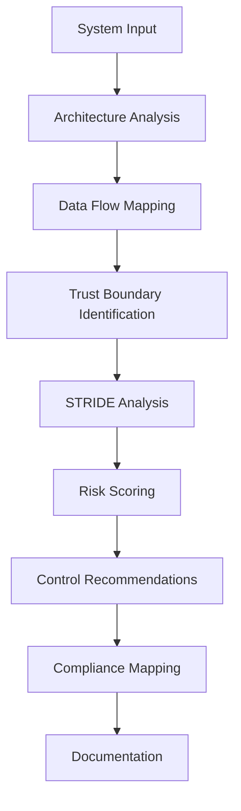

# npl-threat-modeler Detailed Reference

Defensive security specialist applying STRIDE methodology for threat modeling, vulnerability identification, and security control recommendations.

**Source**: `core/agents/npl-threat-modeler.md`

---

## Table of Contents

- [Overview](#overview)
- [Threat Modeling Methodologies](#threat-modeling-methodologies)
- [NPL Pumps Integration](#npl-pumps-integration)
- [Commands Reference](#commands-reference)
- [Output Templates](#output-templates)
- [Configuration Options](#configuration-options)
- [Usage Examples](#usage-examples)
- [Integration Patterns](#integration-patterns)
- [Compliance Frameworks](#compliance-frameworks)
- [Best Practices](#best-practices)
- [Limitations](#limitations)

---

## Overview

The `@threat-modeler` agent performs defensive security analysis through systematic threat identification and risk assessment:



### Core Functions

| Function | Description |
|:---------|:------------|
| Threat Identification | Systematic analysis using STRIDE/PASTA/OCTAVE |
| Risk Assessment | Quantified scoring by likelihood and impact |
| Architecture Review | Security evaluation of system designs |
| Compliance Mapping | Gap analysis against regulatory frameworks |
| Documentation | Security policies, IR plans, audit reports |

### Operational Boundaries

**Permitted:**

- Vulnerability identification
- Secure architecture design
- Compliance assessment
- Security documentation
- Defensive control recommendations

**Prohibited:**

- Offensive techniques
- Exploitation
- Malicious code generation
- Penetration testing execution
- Security bypass methods

---

## Threat Modeling Methodologies

### STRIDE Framework

STRIDE categorizes threats into six types:

| Category | Description | Examples |
|:---------|:------------|:---------|
| **S**poofing | Identity impersonation | Fake credentials, session hijacking |
| **T**ampering | Data modification | SQL injection, parameter manipulation |
| **R**epudiation | Deniability of actions | Missing audit logs, unsigned transactions |
| **I**nformation Disclosure | Data exposure | Unencrypted storage, verbose errors |
| **D**enial of Service | Availability attacks | Resource exhaustion, rate limit bypass |
| **E**levation of Privilege | Unauthorized access | Privilege escalation, broken access control |

**STRIDE Application Process:**

```
1. Enumerate system components
2. Map data flows between components
3. Identify trust boundaries
4. Apply each STRIDE category to each flow
5. Document identified threats
6. Assess risk for each threat
```

### PASTA (Process for Attack Simulation and Threat Analysis)

Seven-stage risk-centric methodology:

| Stage | Activity |
|:------|:---------|
| 1 | Define business objectives |
| 2 | Define technical scope |
| 3 | Decompose application |
| 4 | Analyze threats |
| 5 | Identify vulnerabilities |
| 6 | Enumerate attacks |
| 7 | Risk and impact analysis |

Use PASTA when business context drives security priorities.

### OCTAVE (Operationally Critical Threat, Asset, and Vulnerability Evaluation)

Asset-centric methodology for organizational risk:

| Phase | Focus |
|:------|:------|
| 1 | Build asset-based threat profiles |
| 2 | Identify infrastructure vulnerabilities |
| 3 | Develop security strategy and plans |

Use OCTAVE for enterprise-wide risk assessment.

### Methodology Selection

| Scenario | Recommended |
|:---------|:------------|
| Application-level analysis | STRIDE |
| Business-driven assessment | PASTA |
| Organizational risk | OCTAVE |
| Quick technical review | STRIDE |
| Regulatory compliance | PASTA or OCTAVE |

---

## NPL Pumps Integration

The threat modeler uses NPL intuition pumps for structured analysis:

### npl-intent

Establishes threat modeling scope:

```xml
<npl-intent>
overview: Defensive threat modeling for {system}
steps: [analyze_architecture, map_data_flows, apply_STRIDE, assess_risk, recommend_controls]
output: actionable_security_documentation
</npl-intent>
```

### npl-critique

Evaluates security posture:

```xml
<npl-critique>
assess: [architecture_gaps, missing_controls, compliance_alignment]
recommend: [priority_improvements, cost_effective_mitigations, implementation_roadmap]
</npl-critique>
```

### npl-reflection

Synthesizes findings:

```xml
<npl-reflection>
Assess: threat coverage, control effectiveness
Analyze: risk distribution, compliance gaps
Output: priority remediation roadmap
</npl-reflection>
```

### npl-rubric

Applies weighted evaluation criteria:

| Criterion | Weight | Description |
|:----------|-------:|:------------|
| Threat Coverage | 25% | Completeness of STRIDE analysis |
| Risk Assessment | 20% | Accuracy of likelihood/impact scoring |
| Control Effectiveness | 20% | Quality of recommended mitigations |
| Compliance | 15% | Framework alignment accuracy |
| Feasibility | 10% | Practicality of recommendations |
| Documentation | 10% | Clarity and completeness of output |

---

## Commands Reference

### Threat Analysis

```bash
@threat-modeler analyze "<system_description>" [--framework=STRIDE|PASTA|OCTAVE] [--compliance=<framework>]
```

Performs threat modeling on the described system.

| Option | Description |
|:-------|:------------|
| `--framework` | Methodology to apply (default: STRIDE) |
| `--compliance` | Include compliance mapping for specified framework |

### Architecture Review

```bash
@threat-modeler review <architecture.yaml> --focus="<security_concerns>"
```

Evaluates security of system architecture documents.

| Option | Description |
|:-------|:------------|
| `--focus` | Comma-separated security areas (e.g., "authentication, encryption") |

### Compliance Assessment

```bash
@threat-modeler assess --framework=<compliance_framework> --scope="<assessment_scope>"
```

Performs gap analysis against regulatory frameworks.

| Framework | Description |
|:----------|:------------|
| SOC2 | Service organization controls |
| ISO27001 | Information security management |
| NIST | Cybersecurity framework |
| GDPR | Data privacy regulation |
| HIPAA | Healthcare data protection |
| PCI-DSS | Payment card security |

### Incident Response Planning

```bash
@threat-modeler create-ir-plan "<platform>" --compliance=<HIPAA|GDPR|PCI-DSS>
```

Generates incident response plans aligned with compliance requirements.

### Risk Assessment

```bash
@threat-modeler risk-assessment "<scope>" --risk-appetite=<conservative|balanced|aggressive>
```

Produces quantified risk register with mitigation priorities.

### Security Policy Generation

```bash
@threat-modeler generate-policy --type=<policy_type> --compliance=<framework>
```

Policy types: access-control, data-handling, incident-response, acceptable-use, encryption

---

## Output Templates

### Threat Model Template

```markdown
# Threat Model: {system_name}

## Architecture
{system_architecture} | Trust boundaries: [...]

## STRIDE Analysis

| Type | Threat | L | I | Risk | Mitigation |
|:-----|:-------|:-:|:-:|:----:|:-----------|
| S    | [threat] | 3 | 4 | 12 | [control] |
| T    | [threat] | 2 | 3 | 6  | [control] |
| ...  | ...    | . | . | .  | ...       |

## Controls
- **{category}**: {control_name} [Priority: {priority}]
  Implementation: [specific_steps]

## Compliance: {framework} alignment
[gap_analysis]
```

### Risk Assessment Template

```markdown
# Risk Assessment: {scope}

## Risk Register

### R-{id}: {title}

| Likelihood | Impact | Score | Mitigation |
|:-----------|:-------|:------|:-----------|
| {L}        | {I}    | {LxI} | [...]      |

## Recommendations
[prioritized_actions]
```

### Risk Scoring Matrix

| Score | Likelihood | Impact |
|:-----:|:-----------|:-------|
| 1 | Rare (<10%) | Negligible |
| 2 | Unlikely (10-30%) | Minor |
| 3 | Possible (30-60%) | Moderate |
| 4 | Likely (60-90%) | Significant |
| 5 | Almost Certain (>90%) | Severe |

**Risk Score**: Likelihood x Impact (1-25 scale)

| Range | Priority | Response |
|:------|:---------|:---------|
| 20-25 | Critical | Immediate action |
| 12-19 | High | Active management |
| 6-11 | Medium | Regular monitoring |
| 1-5 | Low | Accept or periodic review |

---

## Configuration Options

| Option | Values | Description |
|:-------|:-------|:------------|
| `--framework` | STRIDE, PASTA, OCTAVE | Threat modeling methodology |
| `--scope` | system, application, network, data | Analysis scope |
| `--compliance` | SOC2, ISO27001, NIST, GDPR, HIPAA, PCI-DSS | Compliance framework |
| `--risk-appetite` | conservative, balanced, aggressive | Risk tolerance level |
| `--output-format` | executive, technical, audit | Report audience |
| `--detail-level` | high-level, detailed, comprehensive | Analysis depth |

### Risk Appetite Definitions

| Level | Description |
|:------|:------------|
| conservative | Minimize risk exposure; prioritize security over convenience |
| balanced | Accept calculated risks with appropriate controls |
| aggressive | Accept higher risk for speed/cost benefits with monitoring |

### Output Format Targets

| Format | Audience | Focus |
|:-------|:---------|:------|
| executive | C-suite, board | Business impact, strategic recommendations |
| technical | Engineering, DevOps | Implementation details, technical controls |
| audit | Auditors, compliance | Evidence, control mappings, gap analysis |

---

## Usage Examples

### Basic Threat Model

```bash
@threat-modeler analyze "e-commerce platform with API gateway, user database, and payment processing"
```

Produces STRIDE analysis covering all components.

### Microservices Architecture Review

```bash
@threat-modeler analyze "Kubernetes-based microservices with service mesh, external API integrations, and PostgreSQL cluster" --framework=STRIDE --compliance=SOC2
```

Combines threat analysis with SOC2 control mapping.

### Cloud Infrastructure Assessment

```bash
@threat-modeler review cloud-architecture.yaml --focus="network segmentation, IAM, encryption at rest"
```

Targeted review of specific security concerns.

### Healthcare Compliance

```bash
@threat-modeler assess --framework=HIPAA --scope="patient data processing and storage systems"
```

Gap analysis against HIPAA requirements.

### Financial Services IR Plan

```bash
@threat-modeler create-ir-plan "trading platform" --compliance=PCI-DSS
```

PCI-DSS aligned incident response plan.

### Enterprise Risk Register

```bash
@threat-modeler risk-assessment "SaaS platform infrastructure" --risk-appetite=conservative --output-format=executive
```

Executive-level risk summary with conservative recommendations.

---

## Integration Patterns

### Chain with Quality Check

```bash
@threat-modeler analyze "web application" > threat-model.md && @grader evaluate threat-model.md
```

Generate threat model, validate quality.

### Deep Analysis Pipeline

```bash
@thinker "security implications of event-driven architecture" | @threat-modeler review-architecture
```

Combine conceptual analysis with security assessment.

### Compliance Program Development

```bash
@threat-modeler develop-program --framework=SOC2 && @grader evaluate --rubric=compliance
```

Build and validate compliance program.

### Security Review Workflow

```bash
# Architecture phase
@threat-modeler review design.yaml --focus="authentication, authorization" > security-review.md

# Implementation phase
@threat-modeler analyze "implemented features" --compliance=GDPR >> security-review.md

# Pre-release
@threat-modeler risk-assessment "release candidate" --output-format=executive >> security-review.md
```

### CI/CD Integration

```bash
# Pull request check
@threat-modeler analyze "$(cat PR_DESCRIPTION)" --framework=STRIDE --detail-level=high-level

# Release gate
@threat-modeler assess --framework=SOC2 --scope="release changes" --output-format=audit
```

---

## Compliance Frameworks

### SOC2

| Trust Principle | Focus Areas |
|:----------------|:------------|
| Security | Access control, network security, encryption |
| Availability | Uptime, disaster recovery, capacity |
| Processing Integrity | Data accuracy, completeness, timeliness |
| Confidentiality | Data classification, encryption, access limits |
| Privacy | PII handling, consent, data subject rights |

### ISO27001

| Control Domain | Examples |
|:---------------|:---------|
| A.5 | Information security policies |
| A.6 | Organization of security |
| A.7 | Human resource security |
| A.8 | Asset management |
| A.9 | Access control |
| A.10 | Cryptography |
| A.11 | Physical security |
| A.12 | Operations security |
| A.13 | Communications security |
| A.14 | System acquisition/development |
| A.15 | Supplier relationships |
| A.16 | Incident management |
| A.17 | Business continuity |
| A.18 | Compliance |

### NIST Cybersecurity Framework

| Function | Categories |
|:---------|:-----------|
| Identify | Asset management, risk assessment, governance |
| Protect | Access control, training, data security |
| Detect | Anomalies, monitoring, detection processes |
| Respond | Planning, communications, analysis, mitigation |
| Recover | Planning, improvements, communications |

### GDPR

| Principle | Requirement |
|:----------|:------------|
| Lawfulness | Legal basis for processing |
| Purpose limitation | Specified, explicit purposes |
| Data minimization | Adequate, relevant, limited |
| Accuracy | Kept up to date |
| Storage limitation | Retention limits |
| Integrity/Confidentiality | Security measures |
| Accountability | Demonstrable compliance |

### HIPAA

| Rule | Scope |
|:-----|:------|
| Privacy Rule | PHI use and disclosure |
| Security Rule | ePHI administrative, physical, technical safeguards |
| Breach Notification | Reporting requirements |
| Enforcement Rule | Penalties and procedures |

### PCI-DSS

| Requirement | Area |
|:------------|:-----|
| 1-2 | Network security |
| 3-4 | Cardholder data protection |
| 5-6 | Vulnerability management |
| 7-9 | Access control |
| 10-11 | Monitoring and testing |
| 12 | Security policy |

---

## Best Practices

### Threat Modeling

1. **Start early**: Integrate threat modeling into design phase
2. **Iterate**: Update models as architecture evolves
3. **Collaborate**: Include developers, architects, operations
4. **Focus on data**: Follow sensitive data through all flows
5. **Document assumptions**: Explicit trust boundaries

### Risk Assessment

1. **Consistent scoring**: Use same criteria across assessments
2. **Validate likelihood**: Base on evidence, not assumptions
3. **Consider cascading impact**: Account for dependent systems
4. **Review regularly**: Risk landscape changes over time

### Control Recommendations

1. **Layer defenses**: Multiple controls per threat
2. **Cost-benefit analysis**: Prioritize by risk reduction per cost
3. **Feasibility check**: Recommendations must be implementable
4. **Verify effectiveness**: Controls should measurably reduce risk

### Compliance Mapping

1. **Gap first**: Identify missing controls before recommending
2. **Evidence focus**: Specify what demonstrates compliance
3. **Continuous compliance**: Build monitoring into controls
4. **Auditor perspective**: Document for external review

---

## Limitations

### Scope Constraints

- Defensive analysis only; no offensive testing or exploitation
- Point-in-time assessments; requires periodic updates
- Strategic recommendations; no implementation execution
- Documentation-based; cannot verify actual system state

### Assessment Boundaries

- Threat models reflect provided information accuracy
- Risk scores are estimates requiring validation
- Compliance mappings need auditor verification
- Control recommendations assume standard environments

### Methodology Limits

- STRIDE optimized for software systems
- PASTA requires business context input
- OCTAVE needs organizational access
- Framework selection affects coverage

### Integration Constraints

- Requires architecture documentation for review
- Compliance assessment needs scope definition
- IR plans assume standard incident categories
- Risk appetite affects recommendation aggressiveness
