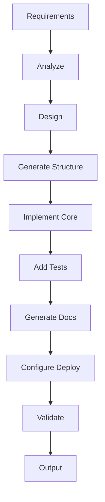

# npl-tool-forge - Detailed Reference

NPL template for generating agents that create CLI tools, utility scripts, and MCP-compatible development tools.

**Agent Template**: `core/agents/npl-tool-forge.md`

---

## Table of Contents

- [Overview](#overview)
- [Capabilities](#capabilities)
  - [CLI Tool Generation](#cli-tool-generation)
  - [MCP Tool Creation](#mcp-tool-creation)
  - [Utility Script Development](#utility-script-development)
  - [Deployment Configuration](#deployment-configuration)
- [Technology Stacks](#technology-stacks)
- [Template Variables](#template-variables)
- [Generation Pipeline](#generation-pipeline)
- [Tool Types](#tool-types)
- [Command Reference](#command-reference)
- [Output Formats](#output-formats)
- [Integration Patterns](#integration-patterns)
- [Quality Standards](#quality-standards)
- [Best Practices](#best-practices)
- [Limitations](#limitations)

---

## Overview

`@npl-tool-forge` is a meta-agent template that generates specialized agents for creating development tools. Each generated agent targets a specific technology stack and produces production-ready tools with:

- Argument parsing and help systems
- Error handling and validation
- Test suites
- Documentation
- Deployment configurations

The template follows a two-stage pattern:

```
npl-templater -> tool-forge agent -> CLI/MCP/utility tool
```

**Stage 1**: Use `@npl-templater` to hydrate a tool-forge agent for your target stack.

**Stage 2**: Use the generated agent to build specific tools.

---

## Capabilities

### CLI Tool Generation

Creates command-line interfaces with full argument parsing and help systems.

**Supported Features**:

| Feature | Description |
|:--------|:------------|
| Argument Parsing | Positional args, flags, options with defaults |
| Subcommands | Nested command structures |
| Help System | Auto-generated from docstrings/metadata |
| Validation | Input validation with error messages |
| Completion | Shell completion scripts (bash, zsh, fish) |
| Config Files | Configuration file loading and merging |
| Environment | Environment variable integration |

**Framework Support**:

| Language | Frameworks |
|:---------|:-----------|
| Python | Click, Typer, argparse, Fire |
| Node.js | Commander.js, yargs, oclif |
| Go | Cobra, urfave/cli |
| Rust | clap, structopt |

**Usage**:

```bash
# Generate Python CLI tool
@python-tool-forge "Create CLI for database migration validation with:
- Subcommands: validate, apply, rollback
- Options: --dry-run, --verbose, --config
- Config file support"
```

**Output Structure**:

```
my-tool/
  src/
    __init__.py
    cli.py           # Entry point with Click/Typer decorators
    commands/        # Subcommand implementations
    validation.py    # Input validation logic
  tests/
    test_cli.py
    test_commands.py
  pyproject.toml     # Dependencies and entry points
  README.md          # Usage documentation
```

### MCP Tool Creation

Generates Model Context Protocol (MCP) compatible tools for extending agent capabilities.

**MCP Tool Types**:

| Type | Description |
|:-----|:------------|
| Resource | Read-only data access (files, APIs, databases) |
| Tool | Actions with side effects (create, update, delete) |
| Prompt | Template-based prompt generation |

**Standard Interface**:

```json
{
  "name": "tool-name",
  "description": "Tool description",
  "inputSchema": {
    "type": "object",
    "properties": { ... },
    "required": [ ... ]
  }
}
```

**Usage**:

```bash
# Generate MCP-compatible tool
@mcp-tool-forge "Create MCP resource server for:
- Reading project documentation
- Listing file structures
- Searching code patterns"
```

**Output Structure**:

```
mcp-tool/
  src/
    server.py        # MCP server implementation
    tools/           # Individual tool handlers
    resources/       # Resource implementations
    schemas.py       # JSON schema definitions
  tests/
  mcp.json           # MCP manifest
  README.md
```

### Utility Script Development

Creates standalone automation scripts for development workflows.

**Script Categories**:

| Category | Examples |
|:---------|:---------|
| Build | Compilation, bundling, asset processing |
| Deploy | Environment setup, artifact publishing |
| Data | Migration, seeding, backup/restore |
| Quality | Linting, formatting, coverage reporting |
| DevOps | Monitoring, alerting, log aggregation |

**Usage**:

```bash
# Generate utility script
@python-tool-forge "Create utility script for:
- Parsing git history
- Generating changelog entries
- Categorizing by conventional commit types"
```

### Deployment Configuration

Generates deployment artifacts for containerized and orchestrated environments.

**Deployment Patterns**:

| Pattern | Artifacts |
|:--------|:----------|
| Standalone | Binary, install script, man pages |
| Docker | Dockerfile, docker-compose.yml |
| Kubernetes | Deployment, Service, ConfigMap manifests |
| Lambda/Serverless | Function configs, SAM/Serverless templates |

**Usage**:

```bash
# Generate with Docker deployment
@go-tool-forge "Create CLI tool with Docker deployment:
- Multi-stage Dockerfile
- Docker Compose for local development
- CI/CD pipeline configuration"
```

---

## Technology Stacks

### Python Stack

| Component | Default | Alternatives |
|:----------|:--------|:-------------|
| CLI Framework | Click | Typer, argparse, Fire |
| Testing | pytest | unittest |
| Packaging | setuptools | poetry, flit |
| Linting | ruff | flake8, pylint |
| Typing | mypy | pyright |

### Node.js Stack

| Component | Default | Alternatives |
|:----------|:--------|:-------------|
| CLI Framework | Commander.js | yargs, oclif |
| Testing | Jest | Mocha, Vitest |
| Packaging | npm | pnpm, yarn |
| Linting | ESLint | - |
| Typing | TypeScript | - |

### Go Stack

| Component | Default | Alternatives |
|:----------|:--------|:-------------|
| CLI Framework | Cobra | urfave/cli |
| Testing | testing | testify |
| Linting | golangci-lint | - |

### Rust Stack

| Component | Default | Alternatives |
|:----------|:--------|:-------------|
| CLI Framework | clap | structopt |
| Testing | cargo test | - |
| Error Handling | anyhow | thiserror |

---

## Template Variables

Variables used when hydrating tool-forge agents:

| Variable | Type | Description |
|:---------|:-----|:------------|
| `primary_language` | string | Target language (python, go, js, rust) |
| `cli_framework` | string | CLI framework for the stack |
| `tool_types` | list | Capabilities: cli, mcp, utility, automation |
| `deployment_pattern` | string | standalone, docker, kubernetes |
| `test_framework` | string | Testing framework preference |
| `package_manager` | string | Package/dependency manager |
| `linting_tools` | list | Code quality tools |
| `output_dir` | string | Generated tool output location |

**Configuration File Example**:

```yaml
# python-tool-forge.yaml
primary_language: python
cli_framework: typer
tool_types:
  - cli
  - utility
deployment_pattern: docker
test_framework: pytest
package_manager: poetry
linting_tools:
  - ruff
  - mypy
```

**Hydration Command**:

```bash
@npl-templater hydrate \
  --template=tool-forge.npl-template.md \
  --config=python-tool-forge.yaml \
  --output=agents/python-tool-forge.md
```

---

## Generation Pipeline

Tool generation follows this pipeline:



### Stage Details

**1. Analyze Requirements**

- Parse tool description and feature list
- Identify command structure and options
- Map to framework-specific patterns

**2. Design Architecture**

- Select appropriate design patterns
- Plan module structure
- Define interfaces and data flow

**3. Generate Structure**

- Create directory layout
- Initialize package files
- Set up dependency manifests

**4. Implement Core**

- Generate CLI entry points
- Implement command handlers
- Add validation logic
- Implement business logic stubs

**5. Add Tests**

- Unit tests for commands
- Integration tests for workflows
- Fixtures and test utilities

**6. Generate Documentation**

- README with usage examples
- API documentation
- Man pages (if applicable)

**7. Configure Deployment**

- Dockerfile (if requested)
- CI/CD configuration
- Release automation

**8. Validate Output**

- Run linting
- Execute test suite
- Verify documentation builds

---

## Tool Types

### CLI Application

Full-featured command-line application with subcommands.

**Structure**:

```
app/
  commands/
    command_a.py
    command_b.py
  core/
    config.py
    errors.py
  main.py
  __init__.py
```

**Entry Point**:

```python
# Python/Click example
@click.group()
@click.option('--verbose', '-v', is_flag=True)
def cli(verbose):
    """Tool description."""
    pass

@cli.command()
@click.argument('target')
def command_a(target):
    """Command A description."""
    pass
```

### MCP Server

Model Context Protocol server exposing tools to AI agents.

**Structure**:

```
server/
  tools/
    tool_a.py
    tool_b.py
  resources/
    resource_a.py
  server.py
  schemas.py
```

**Tool Definition**:

```python
# MCP tool handler
async def handle_tool_a(params: dict) -> dict:
    """Execute tool A with parameters."""
    return {"result": "..."}

TOOLS = [
    {
        "name": "tool_a",
        "description": "Tool A description",
        "inputSchema": {...},
        "handler": handle_tool_a
    }
]
```

### Utility Script

Single-purpose automation script.

**Structure**:

```
script/
  script.py
  tests/
    test_script.py
  README.md
```

### Integration Tool

Tool that connects multiple systems.

**Structure**:

```
integration/
  adapters/
    system_a.py
    system_b.py
  core/
    transformer.py
    validator.py
  cli.py
```

---

## Command Reference

Commands available on generated tool-forge agents:

| Command | Description |
|:--------|:------------|
| `create <description>` | Generate new tool from description |
| `scaffold <type>` | Create tool skeleton (cli, mcp, script) |
| `add-command <name>` | Add subcommand to existing tool |
| `add-test <scope>` | Generate additional test coverage |
| `document` | Generate/update documentation |
| `deploy-config <pattern>` | Add deployment configuration |

**Usage Examples**:

```bash
# Create new CLI tool
@python-tool-forge create "Database migration validator with validate, apply, rollback commands"

# Scaffold MCP server
@python-tool-forge scaffold mcp

# Add command to existing tool
@python-tool-forge add-command "status" --to=migration-tool

# Add deployment config
@python-tool-forge deploy-config docker --to=migration-tool
```

---

## Output Formats

### Project Structure

All generated tools follow this base structure:

```
tool-name/
  src/                # Source code
  tests/              # Test suite
  docs/               # Documentation
  pyproject.toml      # (or package.json, go.mod, Cargo.toml)
  README.md           # Usage documentation
  LICENSE             # License file
  .gitignore          # Git ignore patterns
```

### Test Coverage

Generated tools include:

| Test Type | Coverage Target |
|:----------|:----------------|
| Unit | >80% of functions |
| Integration | Core workflows |
| Edge Cases | Error paths, boundary conditions |

### Documentation

Generated documentation includes:

- Installation instructions
- Quick start guide
- Command reference
- Configuration options
- Examples for each feature
- Troubleshooting section

---

## Integration Patterns

### Chain with Quality Agents

```bash
# Generate and validate
@python-tool-forge create "Migration validator" && \
@npl-grader evaluate migration-tool/ --rubric=cli-quality.md
```

### Chain with Technical Writer

```bash
# Generate and document
@go-tool-forge create "Log aggregator" && \
@npl-technical-writer "Create comprehensive CLI documentation"
```

### Multi-Agent Development

```bash
# Full development workflow
@npl-thinker "Design CLI architecture for log aggregator"
@go-tool-forge create "Log aggregator following design"
@npl-qa "Generate test cases for log aggregator CLI"
@npl-grader evaluate log-aggregator/ --rubric=cli-quality.md
@npl-technical-writer "Document log aggregator usage"
```

### PRD-Driven Development

```bash
# From requirements to tool
@npl-prd-manager extract PRD.md --type=requirements --filter="category:tooling"
@python-tool-forge create "Implement tooling requirements from PRD"
@npl-prd-manager progress PRD.md --codebase=./tools
```

---

## Quality Standards

Generated tools must meet these standards:

### Code Quality

| Criterion | Requirement |
|:----------|:------------|
| Linting | Zero errors, minimal warnings |
| Type Coverage | 100% for public interfaces |
| Documentation | All public functions documented |
| Complexity | Cyclomatic complexity <10 per function |

### Test Quality

| Criterion | Requirement |
|:----------|:------------|
| Coverage | >80% line coverage |
| Edge Cases | Error paths tested |
| Fixtures | Reusable test fixtures |
| Isolation | No test interdependencies |

### Documentation Quality

| Criterion | Requirement |
|:----------|:------------|
| Completeness | All commands documented |
| Examples | Working examples for each feature |
| Accuracy | Examples tested in CI |

### Error Handling

| Criterion | Requirement |
|:----------|:------------|
| Validation | All inputs validated |
| Messages | Clear, actionable error messages |
| Exit Codes | Appropriate exit codes for scripting |
| Recovery | Graceful degradation where possible |

---

## Best Practices

### Tool Design

1. **Single Responsibility**: Each command does one thing well
2. **Composability**: Tools work well in pipelines
3. **Idempotency**: Commands can be run multiple times safely
4. **Discoverability**: Help text explains all options
5. **Consistency**: Follow platform conventions

### Implementation

1. **Fail Fast**: Validate early, fail with clear messages
2. **Progress Feedback**: Show progress for long operations
3. **Dry Run**: Include `--dry-run` for destructive operations
4. **Logging**: Support `--verbose` and `--quiet` modes
5. **Configuration**: Use cascading config (defaults < file < env < flags)

### Testing

1. **Test Commands**: Every subcommand has tests
2. **Test Errors**: Error paths are exercised
3. **Test Help**: Help output is verified
4. **Test Config**: Configuration loading is tested
5. **Test Pipelines**: Piped input/output is tested

### Documentation

1. **Examples First**: Lead with working examples
2. **Copy-Paste Ready**: Examples work without modification
3. **Common Patterns**: Document typical use cases
4. **Troubleshooting**: Include common error solutions

---

## Limitations

### Scope Constraints

- Generated tools require manual business logic implementation for complex features
- Framework-specific optimizations may need manual tuning
- Integration with proprietary systems requires custom adapter code

### Technology Constraints

| Constraint | Impact |
|:-----------|:-------|
| Framework Changes | Generated code targets specific framework versions |
| Platform Specifics | Cross-platform edge cases may need adjustment |
| Performance | Generated code prioritizes correctness over optimization |

### Generation Constraints

- Complex CLI interactions (interactive prompts, TUIs) require manual enhancement
- Non-standard deployment targets need custom configuration
- Language-specific idioms may vary from project conventions

### MCP Constraints

- MCP server implementations follow current protocol version
- Custom transport mechanisms require manual implementation
- Resource caching strategies need project-specific tuning

---

## See Also

- [npl-tool-forge](./npl-tool-forge.md) - Concise reference
- [npl-templater](./npl-templater.md) - Template hydration
- [npl-grader](./npl-grader.md) - Quality validation
- [npl-technical-writer](./npl-technical-writer.md) - Documentation generation
- [tdd-driven-builder](./tdd-driven-builder.md) - TDD implementation patterns
