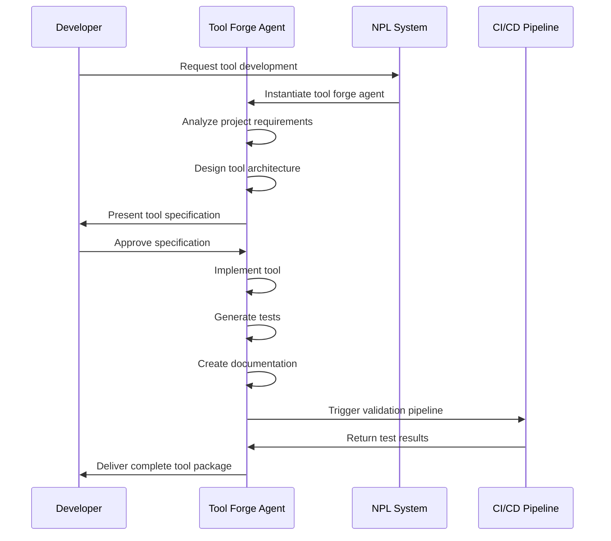

# Tool Forge Agent Template Documentation

## Overview

The `tool-forge.npl-template.md` is a comprehensive NPL agent template designed for creating development tools and productivity enhancers. This template generates specialized agents that can design, implement, and deploy CLI tools, utility scripts, and integration tools that streamline development workflows across various technology stacks.

## Purpose and Core Value Proposition

The Tool Forge template addresses the critical need for custom development tooling by providing a structured framework for creating agents that can:

- Analyze project requirements and identify productivity gaps
- Design appropriate tool architectures for specific technology stacks
- Implement robust, well-tested tools with proper error handling
- Generate comprehensive documentation and deployment strategies
- Integrate seamlessly with existing development workflows

## Key Capabilities

### Tool Creation Specialties
- **CLI Tools**: Standalone command-line utilities with proper argument parsing and user experience
- **MCP-Compatible Tools**: Tools that extend agent capabilities through the Model Context Protocol
- **Utility Scripts**: Quick automation solutions for common development tasks
- **Integration Tools**: Components that bridge different systems and workflows
- **Productivity Enhancers**: Tools specifically designed to accelerate development workflows

### Technology Stack Adaptation
- **Multi-Language Support**: Adapts to Python, JavaScript/Node.js, Go, Rust, and other ecosystems
- **Framework Integration**: Works with Django, FastAPI, Express, Next.js, and other frameworks
- **Container Support**: Includes Docker and Kubernetes deployment patterns
- **CI/CD Integration**: Builds tools that work seamlessly with automation pipelines

### Quality Assurance Features
- **Comprehensive Testing**: Implements unit and integration testing strategies
- **Error Handling**: Includes robust error handling and user-friendly error messages
- **Documentation Generation**: Creates complete usage documentation with examples
- **Performance Optimization**: Considers resource usage and execution efficiency

## Template Structure and Components

### Core Template Variables
```markdown
{agent_name}          - Agent identifier for tool creation
{agent_description}   - Description of capabilities
{model_preference}    - Model to use (sonnet, opus, haiku)
{color_choice}       - Interface color theme
{primary_language}   - Main programming language
{project_name}       - Target project name
{tool_types}         - Types of tools to create
{deployment_pattern} - Deployment strategy
```

### Conditional Sections
- `{{#if load_npl_context}}` - NPL context loading
- `{{#if has_protocol_tools}}` - Protocol-specific tool capabilities
- `{{#if has_integration_patterns}}` - Project-specific integration
- `{{#if has_alternative_languages}}` - Multi-language support
- `{{#if has_protocol_servers}}` - Server-type tool structures

### Dynamic Content Areas
- `{{#each core_functions}}` - Customizable core functionality list
- `{{#each cli_examples}}` - CLI tool examples
- `{{#each script_examples}}` - Script examples
- `{{#each example_tools}}` - Comprehensive tool examples

## How to Hydrate the Template

### Basic Hydration Process

1. **Analyze Target Project**
   ```bash
   @npl-templater "Analyze this Python Django project for tool creation needs"
   ```

2. **Generate Tool Forge Agent**
   ```bash
   @npl-templater "Create a tool-forge agent for Python CLI development"
   ```

### Hydration Examples

#### Python/Django Project
```yaml
# Hydration values for Django project
agent_name: django-tool-forge
agent_description: Django-focused development tool creator
model_preference: sonnet
color_choice: blue
primary_language: Python
project_name: MyDjangoApp
tool_types: CLI, MCP server, utility script
deployment_pattern: Docker
cli_technologies: Click, Typer, argparse
package_manager_preference: pip, poetry
protocol_type: MCP
```

#### Node.js/React Project
```yaml
# Hydration values for React project
agent_name: react-tool-forge
agent_description: React ecosystem tool builder
model_preference: sonnet
color_choice: cyan
primary_language: JavaScript
project_name: MyReactApp
tool_types: CLI, npm package, utility script
deployment_pattern: Docker
cli_technologies: Commander.js, yargs, inquirer
package_manager_preference: npm, yarn, pnpm
```

#### Go Project
```yaml
# Hydration values for Go project
agent_name: go-tool-forge
agent_description: Go-based tool development specialist
model_preference: sonnet
color_choice: orange
primary_language: Go
project_name: MyGoService
tool_types: CLI, standalone binary
deployment_pattern: Kubernetes
cli_technologies: Cobra, flag, pflag
```

## Integration Patterns with Other Agents

### Agent Collaboration Workflows

```mermaid
graph TD
    A[Project Analysis] --> B[@npl-templater]
    B --> C[Generate Tool Forge Agent]
    C --> D[@npl-tool-forge-agent]
    D --> E[Tool Development]
    E --> F[@npl-grader]
    F --> G[Quality Validation]
    G --> H[@npl-technical-writer]
    H --> I[Documentation Generation]
    I --> J[Deployment Ready Tool]
```

### Sequential Agent Usage
```bash
# 1. Analyze project and create tool forge agent
@npl-templater "Create a tool-forge agent for this Python project"

# 2. Use the generated agent to create tools
@my-python-tool-forge "Create a CLI tool for database migration validation"

# 3. Validate the generated tool
@npl-grader "Review the generated CLI tool against best practices"

# 4. Generate documentation
@npl-technical-writer "Create comprehensive documentation for the migration validator CLI"
```

### Parallel Agent Integration
```bash
# Simultaneous development and documentation
@my-tool-forge "Build a deployment automation script" & @npl-technical-writer "Draft API documentation"

# Quality assurance pipeline
@my-tool-forge "Create integration tests" & @npl-grader "Validate code quality standards"
```

## Example Instantiation Scenarios

### Scenario 1: Python Data Science CLI Tools
```bash
# Create specialized tool forge for data science workflows
@npl-templater "Generate a tool-forge agent for Python data science CLI tools"

# Generated agent would focus on:
# - Pandas/NumPy integration tools
# - Jupyter notebook automation
# - Data validation utilities
# - ML model deployment scripts
```

**Expected Agent Capabilities:**
- Create CLI tools using Click or Typer
- Generate data processing pipelines
- Build model validation utilities
- Implement notebook conversion tools

### Scenario 2: DevOps Automation Tools
```bash
# Create DevOps-focused tool forge
@npl-templater "Create a tool-forge agent for Kubernetes DevOps automation"

# Generated agent would specialize in:
# - kubectl wrapper utilities
# - CI/CD pipeline tools
# - Infrastructure validation scripts
# - Monitoring and alerting tools
```

**Expected Agent Capabilities:**
- Build Go-based CLI tools for performance
- Create Docker container utilities
- Generate Kubernetes manifest validators
- Implement deployment automation scripts

### Scenario 3: Frontend Development Tools
```bash
# Create frontend-focused tool forge
@npl-templater "Generate a tool-forge agent for React development productivity"

# Generated agent would create:
# - Component generation tools
# - Build optimization utilities
# - Testing automation scripts
# - Asset processing tools
```

**Expected Agent Capabilities:**
- Create Node.js CLI tools with Commander.js
- Generate React component scaffolding
- Build webpack/Vite optimization tools
- Implement test automation utilities

## Complex Workflow Processes

### Tool Development Lifecycle

```mermaid
flowchart TD
    A[Requirements Analysis] --> B[Technology Selection]
    B --> C[Architecture Design]
    C --> D[Implementation]
    D --> E[Testing Implementation]
    E --> F[Documentation Creation]
    F --> G[Integration Testing]
    G --> H[Deployment Preparation]
    H --> I[Quality Validation]
    I --> J{Quality Check}
    J -->|Pass| K[Tool Complete]
    J -->|Fail| L[Refinement Required]
    L --> D
    
    subgraph "NPL Integration"
        M[@npl-intent] --> N[Requirement Clarification]
        O[@npl-critique] --> P[Code Review]
        Q[@npl-rubric] --> R[Quality Assessment]
    end
    
    A --> M
    I --> O
    I --> Q
```

### Multi-Tool Project Workflow



## Best Practices for Customization and Deployment

### Template Customization Guidelines

#### 1. Technology Stack Alignment
```yaml
# Ensure tool technologies match project ecosystem
cli_technologies: "Choose based on project language"
package_manager_preference: "Use project's existing package manager"
deployment_pattern: "Match existing deployment strategy"
```

#### 2. Project-Specific Integration
```yaml
# Configure integration patterns appropriately
integration_patterns:
  - pattern_name: "Database Migration Tools"
    pattern_description: "Tools that work with existing ORM"
  - pattern_name: "API Testing Utilities"  
    pattern_description: "Tools that integrate with current API framework"
```

#### 3. Quality Standards Configuration
```yaml
# Set appropriate quality targets
coverage_target: "85"  # Test coverage percentage
performance_target: "<500ms"  # Response time requirements
resource_constraints: "container resource limits"
deployment_environment: "staging, production"
```

### Deployment Strategies

#### Development Environment Setup
```bash
# 1. Generate tool forge agent for local development
@npl-templater "Create tool-forge for local Python development tools"

# 2. Configure development dependencies
# Generated agent will include local testing and debugging capabilities

# 3. Set up development workflow integration
# Agent creates tools that work with existing IDE and workflow
```

#### Production Tool Deployment
```bash
# 1. Create production-ready tool forge
@npl-templater "Generate tool-forge for production CLI tools with Docker support"

# 2. Implement production quality standards
# Generated agent includes comprehensive error handling, logging, monitoring

# 3. Configure CI/CD integration
# Agent creates tools with automated testing and deployment pipelines
```

#### Multi-Environment Tool Management
```yaml
# Environment-specific configurations
development:
  testing: comprehensive
  logging: verbose
  error_handling: detailed_stack_traces

staging:  
  testing: integration_focused
  logging: structured
  error_handling: user_friendly

production:
  testing: critical_path_only
  logging: minimal
  error_handling: graceful_degradation
```

### Tool Quality Assurance

#### Code Quality Standards
- **Type Hints**: Full type annotation for strongly-typed languages
- **Error Handling**: Comprehensive exception handling with meaningful messages
- **Testing**: Minimum 85% test coverage for core functionality
- **Documentation**: Complete docstrings and usage examples
- **Performance**: Sub-500ms response time for common operations

#### User Experience Standards
- **CLI Ergonomics**: Intuitive command structure following established conventions
- **Help System**: Comprehensive `--help` output with examples
- **Error Messages**: Clear, actionable error messages with suggested solutions
- **Configuration**: Support for environment variables and configuration files
- **Progress Feedback**: Status updates for long-running operations

#### Integration Standards
- **Container Support**: Docker/Kubernetes deployment configurations
- **CI/CD Ready**: Integration with automated testing and deployment pipelines
- **Monitoring**: Health checks and metrics for production tools
- **Security**: Secure credential handling and input validation

## Advanced Usage Patterns

### Multi-Language Tool Development
```bash
# Create polyglot tool forge
@npl-templater "Generate tool-forge supporting Python, Go, and Node.js tools"

# Generated agent can:
# - Choose optimal language per tool type
# - Create language-specific packaging
# - Implement cross-language integration patterns
```

### Domain-Specific Tool Forges
```bash
# Security-focused tools
@npl-templater "Create security-focused tool-forge for penetration testing utilities"

# Data engineering tools  
@npl-templater "Generate tool-forge for Apache Spark and data pipeline tools"

# Machine learning tools
@npl-templater "Create ML-focused tool-forge for model deployment and monitoring"
```

### Enterprise Integration
```bash
# Enterprise-ready tool forge with compliance features
@npl-templater "Generate enterprise tool-forge with security compliance and audit logging"

# Generated agent includes:
# - RBAC integration
# - audit logging
# - compliance reporting  
# - enterprise authentication
```

## Conclusion

The Tool Forge template provides a powerful foundation for creating specialized development tool generators. Its flexible template system, comprehensive technology stack support, and integration with the NPL ecosystem make it an essential component for organizations looking to standardize and accelerate their development tooling efforts.

By leveraging this template, development teams can quickly create custom agents that understand their specific technology stack, follow their coding standards, and integrate seamlessly with their existing workflows. The result is a more productive development environment with purpose-built tools that address real workflow challenges.