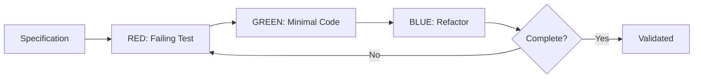

# tdd-driven-builder Detailed Reference

Agent template for implementing features using strict Test-Driven Development methodology with Red-Green-Refactor cycles.

**Source**: `skeleton/agents/npl-tdd-builder.npl-template.md`

---

## Table of Contents

- [Overview](#overview)
- [TDD Methodology](#tdd-methodology)
- [Test Strategy](#test-strategy)
- [Development Workflow](#development-workflow)
- [Commands Reference](#commands-reference)
- [Progress Reporting](#progress-reporting)
- [Integration Patterns](#integration-patterns)
- [Quality Metrics](#quality-metrics)
- [Template Hydration](#template-hydration)
- [Usage Examples](#usage-examples)
- [Agent Collaboration](#agent-collaboration)
- [Best Practices](#best-practices)
- [Limitations](#limitations)

---

## Overview

The `@npl-tdd-builder` (or `@tdd-builder`) implements features through strict Test-Driven Development methodology:



### Core Capabilities

| Capability | Description |
|:-----------|:------------|
| Spec Parsing | Extract testable behaviors from requirements |
| Test Planning | Generate unit, integration, contract, e2e test plans |
| Red Phase | Write failing tests before implementation |
| Green Phase | Implement minimal code to pass tests |
| Refactor Phase | Improve code without changing behavior |
| Validation | Verify coverage targets and conventions |

---

## TDD Methodology

### Red-Green-Refactor Cycle

The agent enforces strict discipline in each phase:

**RED Phase**
- Write test for one requirement
- Verify test fails (no implementation exists)
- Define expected behavior precisely
- Document test purpose and assertion

**GREEN Phase**
- Write minimal code to pass test
- No additional functionality
- No premature optimization
- Focus only on making test pass

**BLUE Phase**
- Improve code structure
- Remove duplication
- Apply design patterns
- Verify all tests still pass

### Cycle Algorithm

```
for requirement in spec:
  test = write_failing_test(requirement)
  assert test.fails()

  code = implement_minimal(requirement)
  assert test.passes()

  refactored = improve(code)
  assert test.still_passes()

  validate(requirement, refactored)
```

---

## Test Strategy

The agent generates tests across multiple layers:

### Test Categories

| Category | Scope | Focus |
|:---------|:------|:------|
| Unit | Functions, methods | Isolated logic |
| Integration | Services, databases | Component interaction |
| Contract | API schemas | Interface compliance |
| Repository | Database operations | Data layer integrity |
| E2E | Complete workflows | User journey validation |

### Test Planning Process

1. **Analyze Specification**: Extract functional requirements
2. **Identify Boundaries**: Determine component interfaces
3. **Map Dependencies**: Understand integration points
4. **Generate Test Plan**: Create structured test hierarchy
5. **Prioritize Execution**: Order by dependency and risk

### Test Quality Standards

- **Isolation**: Tests run independently without shared state
- **Naming**: Behavior-focused descriptive names
- **Speed**: Target <100ms per unit test
- **Coverage**: >90% code coverage
- **Determinism**: Consistent results across runs

---

## Development Workflow

### Phase 1: Specification Analysis

```bash
@tdd-builder plan "User authentication with email/password"
```

Output:
- Parsed requirements list
- Testable behavior breakdown
- Dependency identification
- Test plan structure

### Phase 2: Red Phase Execution

```bash
@tdd-builder red "Validate user credentials"
```

Output:
- Failing test implementation
- Test execution proof
- Expected vs actual assertion
- Ready for green phase

### Phase 3: Green Phase Implementation

```bash
@tdd-builder green "Validate user credentials"
```

Output:
- Minimal implementation
- Test execution passing
- No extra functionality added
- Ready for refactor

### Phase 4: Refactor Phase

```bash
@tdd-builder refactor "Validate user credentials"
```

Output:
- Improved code structure
- Design pattern application
- Test still passing
- Quality improvements documented

### Phase 5: Validation

```bash
@tdd-builder validate "User authentication"
```

Output:
- Coverage report
- Convention compliance
- Regression check
- Final status

---

## Commands Reference

### plan

```bash
@tdd-builder plan <specification> [--framework=<framework>] [--coverage=<target>]
```

Analyzes specification and generates test plan.

| Option | Description |
|:-------|:------------|
| `--framework` | Test framework (pytest, jest, junit, etc.) |
| `--coverage` | Coverage target percentage |

### red

```bash
@tdd-builder red <requirement> [--test-file=<path>]
```

Creates failing test for specified requirement.

| Option | Description |
|:-------|:------------|
| `--test-file` | Target test file location |

### green

```bash
@tdd-builder green <requirement> [--impl-file=<path>]
```

Implements minimal code to pass failing test.

| Option | Description |
|:-------|:------------|
| `--impl-file` | Target implementation file |

### refactor

```bash
@tdd-builder refactor <requirement> [--patterns=<list>]
```

Improves implementation without changing behavior.

| Option | Description |
|:-------|:------------|
| `--patterns` | Design patterns to consider |

### validate

```bash
@tdd-builder validate <feature> [--rubric=<file>]
```

Validates complete implementation against requirements.

| Option | Description |
|:-------|:------------|
| `--rubric` | Custom validation rubric |

---

## Progress Reporting

The agent generates structured progress reports:

```
## Cycle: RED
- Test: `test_user_can_login_with_valid_credentials`
- Status: Failing (expected)
- Progress: 3/12

Requirements:
- [x] Email validation
- [x] Password hashing
- [x] Session creation
- [ ] Token generation
- [ ] Refresh tokens
- [ ] Logout handling
...

Next: Implement minimal code for token generation
```

### Status Indicators

| Symbol | Meaning |
|:-------|:--------|
| `[x]` | Requirement complete |
| `[ ]` | Requirement pending |
| RED | Writing failing test |
| GREEN | Implementing code |
| REFACTOR | Improving structure |

---

## Integration Patterns

### Project Convention Detection

The agent detects and follows project-specific patterns:

```
Project Patterns:
- test_location: tests/
- naming: test_<feature>_<behavior>
- fixtures: conftest.py
- mocks: unittest.mock
```

### Framework Support

| Framework | Language | Configuration |
|:----------|:---------|:--------------|
| pytest | Python | pytest.ini, conftest.py |
| jest | JavaScript/TypeScript | jest.config.js |
| JUnit | Java | build.gradle, pom.xml |
| RSpec | Ruby | .rspec, spec_helper.rb |
| go test | Go | go.mod |

### Database Testing

- Supports transaction rollback patterns
- Fixture management for test data
- Migration-aware testing
- Repository pattern validation

---

## Quality Metrics

### Coverage Targets

| Metric | Target | Description |
|:-------|-------:|:------------|
| Line coverage | >90% | Lines executed by tests |
| Branch coverage | >85% | Decision paths covered |
| Function coverage | >95% | Functions called by tests |

### Performance Standards

| Metric | Target | Description |
|:-------|-------:|:------------|
| Unit test speed | <100ms | Per-test execution time |
| Test isolation | 100% | No shared state between tests |
| Determinism | 100% | Consistent results |

### Success Criteria

```
complete: all-specs-pass AND coverage-met AND no-regressions AND conventions-followed
constraints: maintain-compatibility AND preserve-shared-components AND follow-migrations
```

---

## Template Hydration

The agent is implemented as an NPL template that can be hydrated for project-specific use.

### Hydration Process

```bash
python -m npl.templater hydrate \
  --template skeleton/agents/npl-tdd-builder.npl-template.md \
  --config project-tdd.yaml \
  --output agents/my-project-tdd-builder.md
```

### Configuration Parameters

| Parameter | Description |
|:----------|:------------|
| `agent_name` | Identifier for hydrated agent |
| `agent_description` | Focus description |
| `model_preference` | Model selection (inherit, opus, sonnet) |
| `color_choice` | Interface color |
| `coverage_target` | Coverage percentage target |
| `test_speed` | Per-test time limit |

### Example Configuration

```yaml
agent_name: cart-tdd-builder
agent_description: TDD agent for shopping cart feature development
model_preference: opus
color_choice: green
coverage_target: 95
test_speed: 50ms
patterns:
  - type: repository
    convention: Repository pattern for cart persistence
  - type: service
    convention: Service layer for business logic
```

---

## Usage Examples

### Basic TDD Implementation

```bash
@tdd-builder "Implement user authentication following TDD"
```

### Specific Requirements

```bash
@cart-tdd-builder "Implement shopping cart with:
1. Add items with quantity validation
2. Calculate totals with tax
3. Apply discount codes"
```

### With Test Plan Integration

```bash
@npl-qa-tester generate test-plan spec.md --output=test-plan.md
@tdd-builder implement spec.md --test-plan=test-plan.md --output=implementation/
```

### Security Control Implementation

```bash
@tdd-builder implement-control access-control \
  --test-first \
  --output=implementations/access-control/
```

### Full Feature Development

```bash
# Phase 1: Plan
@tdd-builder plan "Payment processing module" --framework=pytest

# Phase 2-4: Iterative development
@tdd-builder red "Validate card number"
@tdd-builder green "Validate card number"
@tdd-builder refactor "Validate card number"

# Phase 5: Validate
@tdd-builder validate "Payment processing" --rubric=payment-rubric.md
```

---

## Agent Collaboration

### With npl-grader

```bash
@tdd-builder "Implement payment feature" && @npl-grader evaluate --rubric=tdd-rubric.md
```

Validates TDD implementation quality after completion.

### With npl-qa-tester

```bash
@npl-qa-tester generate test-plan spec.md
@tdd-builder implement spec.md --test-plan=test-plan.md
```

Generates comprehensive test plans for TDD execution.

### With npl-persona

```bash
@tdd-builder "Implement auth service"
@npl-persona --role="security-expert" "Audit implementation"
```

Multi-role security review of TDD output.

### With npl-technical-writer

```bash
@tdd-builder "Implement API endpoints"
@npl-technical-writer "Document API implementation and test coverage"
```

Documentation of implemented features.

### With npl-project-coordinator

```bash
@project-coordinator orchestrate "Build web application"
# Coordinator assigns appropriate phases to @tdd-builder
```

Part of larger orchestrated workflows.

---

## Best Practices

### Test Writing

1. **One assertion per test**: Keep tests focused
2. **Descriptive names**: Test name describes behavior
3. **Arrange-Act-Assert**: Clear test structure
4. **Independent tests**: No test dependencies

### Implementation Strategy

1. **Minimal code**: Write only what's needed to pass
2. **No premature optimization**: Optimize in refactor phase
3. **Small iterations**: One requirement at a time
4. **Frequent commits**: Commit after each green phase

### Refactoring Guidelines

1. **Keep tests passing**: Never break existing tests
2. **Extract patterns**: Identify reusable abstractions
3. **Remove duplication**: DRY principle
4. **Improve naming**: Clear, intention-revealing names

### Project Integration

1. **Follow conventions**: Match existing project patterns
2. **Maintain compatibility**: Preserve public interfaces
3. **Use migrations**: Database changes through migrations
4. **Document changes**: Update relevant documentation

---

## Limitations

### Scope Constraints

- Requires clear, testable specifications
- Cannot validate subjective requirements
- Integration tests may require infrastructure setup
- E2E tests need environment configuration

### Framework Dependencies

- Requires test framework in project
- Coverage tools must be configured
- Mock frameworks needed for isolation
- Database fixtures for data layer tests

### Process Boundaries

- Does not replace manual code review
- Cannot guarantee security compliance alone
- Performance testing requires separate tooling
- UI testing needs specialized frameworks

### Template Limitations

- Hydration requires npl-templater
- Project-specific patterns need configuration
- Framework detection may need hints
- Custom conventions require explicit setup
