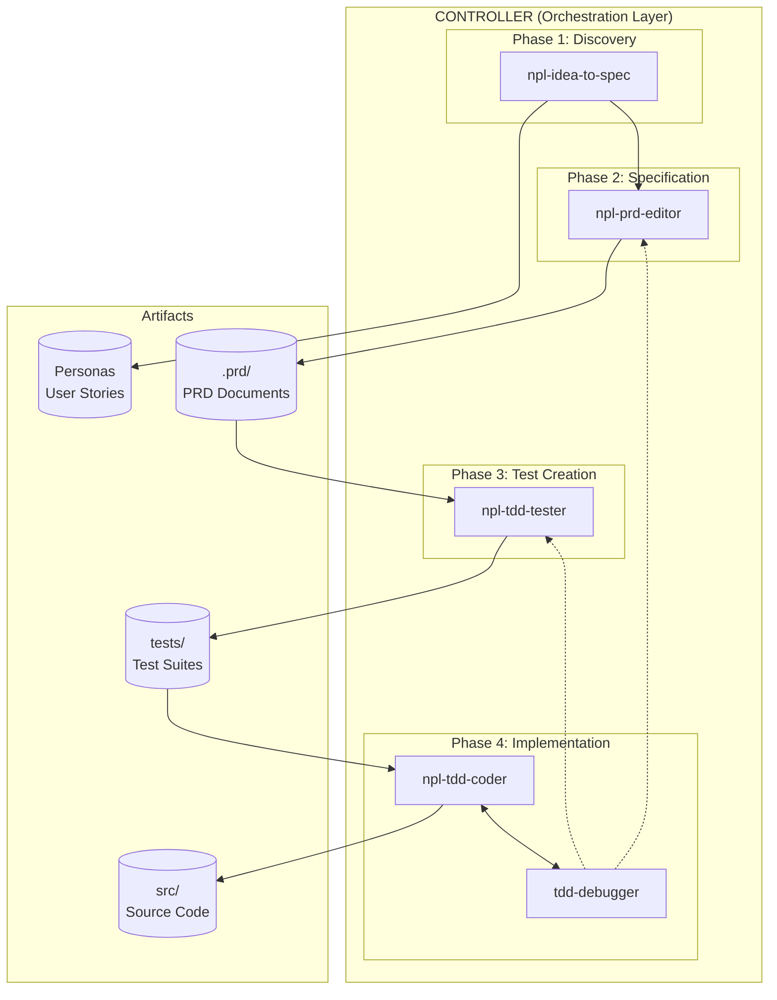
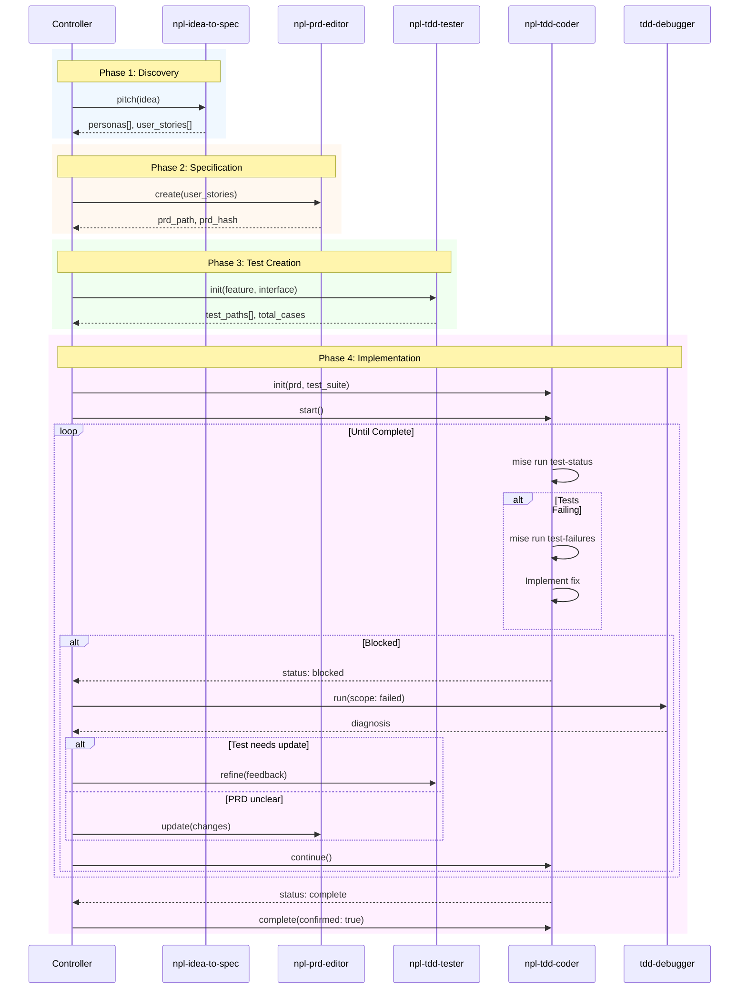
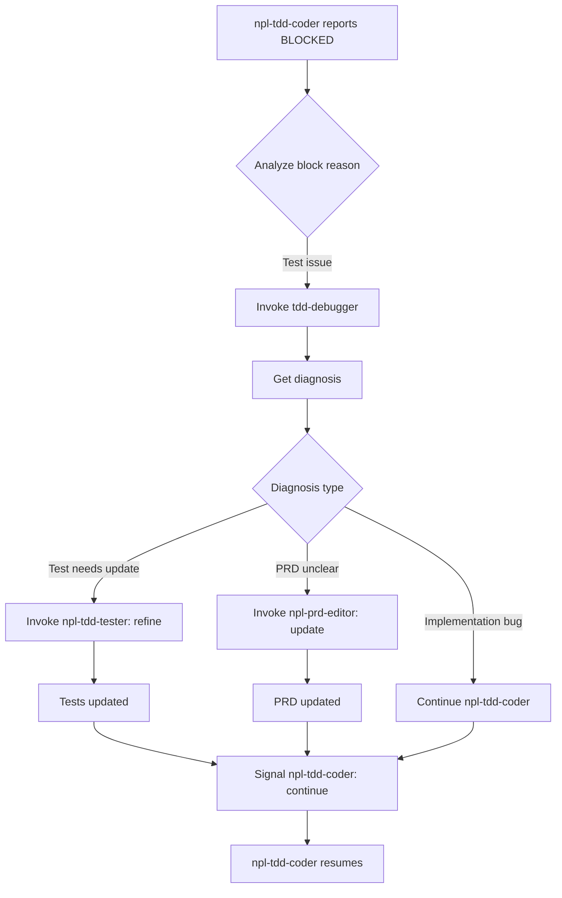

# Agent Orchestration Overview

## System Architecture



## Agent Summary

| Agent | Purpose | Lifecycle | Primary Output |
|-------|---------|-----------|----------------|
| [npl-idea-to-spec](npl-idea-to-spec.md) | Converts ideas to personas/stories | Long-lived | Personas, User Stories |
| [npl-prd-editor](npl-prd-editor.md) | Creates PRD from stories | Long-lived | PRD documents |
| [npl-tdd-tester](npl-tdd-tester.md) | Creates test suites from PRD | Long-lived | Test files |
| [npl-tdd-coder](npl-tdd-coder.md) | Implements PRD autonomously | Long-lived | Production code |
| [tdd-debugger](tdd-debugger.md) | Runs/debugs tests | Long-lived | Diagnostics, fixes |

## Standard Workflow

### Workflow Sequence



### Phase 1: Discovery

```yaml
controller:
  - invoke: npl-idea-to-spec
    command: pitch
    input: "Natural language feature idea"
    
  - receive:
      personas: [created, matched]
      user_stories: [US-XXX, US-YYY, ...]
```

### Phase 2: Specification

```yaml
controller:
  - invoke: npl-prd-editor
    command: create
    input:
      user_stories: [US-XXX, US-YYY]  # From Phase 1
      personas: [matched personas]
      
  - receive:
      prd_path: ".prd/feature-name.md"
      prd_hash: "abc123"
```

### Phase 3: Test Creation

```yaml
controller:
  - invoke: npl-tdd-tester
    command: init
    input:
      feature: (from PRD)
      interface: (from PRD)
      context:
        prd_path: ".prd/feature-name.md"
        test_path: "tests/unit/feature/"
        
  - receive:
      test_paths: [created test files]
      total_cases: N
```

### Phase 4: Implementation

```yaml
controller:
  - invoke: npl-tdd-coder
    command: init
    input:
      prd:
        path: ".prd/feature-name.md"
        hash: "abc123"
      test_suite:
        paths: [test files from Phase 3]
        
  - invoke: npl-tdd-coder
    command: start
    
  # Agent works autonomously, using:
  # - mise run test-status
  # - mise run test-failures
  
  # Controller monitors for:
  - status: implementing  # Progress updates
  - status: blocked       # Needs intervention
  - status: complete      # Ready for confirmation
```

### Phase 5: Debug Loop (when blocked)



```yaml
# When npl-tdd-coder reports blocked on test issues:
controller:
  - invoke: tdd-debugger
    command: run
    input:
      scope: failed
      
  - receive:
      failures: [diagnosed issues]
      
  # Depending on diagnosis:
  - if: test_needs_update
    invoke: npl-tdd-tester
    command: refine
    
  - if: prd_unclear
    invoke: npl-prd-editor
    command: update
    
  - if: implementation_bug
    invoke: npl-tdd-coder
    command: continue
```

### Phase 6: Completion

```yaml
controller:
  - receive: (from npl-tdd-coder)
      status: complete
      tests_passing: all
      
  - invoke: npl-tdd-coder
    command: complete
    input:
      confirmed: true
      
  - receive:
      artifacts: [files created/modified]
      changelog: summary
```

## Directory Structure

```
project/
├── docs/
│   ├── personas/
│   │   ├── index.yaml           # Managed by npl-idea-to-spec
│   │   ├── power-user.md
│   │   └── mobile-field-user.md
│   ├── user-stories/
│   │   ├── index.yaml           # Managed by npl-idea-to-spec
│   │   ├── US-054-offline-editing.md
│   │   └── US-055-auto-sync.md
│   ├── PROJ-ARCH.md
│   └── PROJ-LAYOUT.md
├── .prd/
│   ├── feature-name.md          # Created by npl-prd-editor
│   ├── feature-name.impl.log    # Created by npl-tdd-coder
│   └── archive/
├── tests/
│   ├── unit/
│   │   └── feature/             # Created by npl-tdd-tester
│   └── integration/
├── src/                          # Modified by npl-tdd-coder
└── mise.toml                     # Defines test tasks
```

## Mise Tasks Required

```toml
# mise.toml

[tasks.test-status]
description = "Get pass/fail summary"
run = "npm test -- --reporter=summary"

[tasks.test-failures]
description = "Get detailed failure output"
run = "npm test -- --reporter=verbose --only-failures"

[tasks.test]
description = "Run all tests"
run = "npm test"

[tasks.test-watch]
description = "Run tests in watch mode"
run = "npm test -- --watch"

[tasks.test-coverage]
description = "Run tests with coverage"
run = "npm test -- --coverage"
```

## Controller Responsibilities

1. **Orchestration**: Invoke agents in correct sequence
2. **State Management**: Track PRD hashes, test status, agent states
3. **Routing**: Direct blocked reports to appropriate agent
4. **Decisions**: Make calls agents escalate (architectural, scope)
5. **Confirmation**: Approve completions, archive PRDs

## Error Recovery

| Scenario | Recovery |
|----------|----------|
| npl-tdd-coder blocked on PRD | Update PRD via npl-prd-editor, signal continue |
| Test failures unclear | Invoke tdd-debugger, relay diagnosis |
| Tests need update | Update via npl-tdd-tester, re-run npl-tdd-coder |
| Circular blocks | Controller intervenes with architectural decision |
| Agent crash | Reinitialize with saved state |

## Communication Protocol

All agents use consistent message format:

```yaml
# Request
message:
  command: string
  payload: object

# Response  
response:
  status: ok | blocked | needs_clarification | complete
  # ... command-specific fields
  message: string
```

## State Persistence

Each agent maintains session state for:
- Current context and configuration
- Work progress
- Decision history
- Artifact inventory

State survives across commands within a session. Sessions end explicitly via controller or on completion confirmation.
