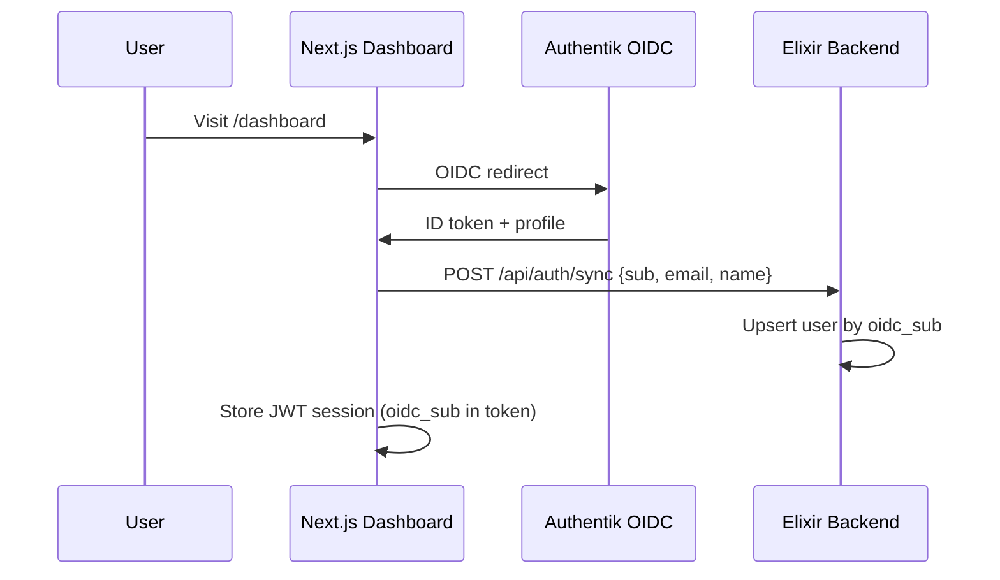

# Authentication & Security

## OIDC Flow

Authentication uses Authentik as the OIDC provider, integrated through NextAuth v5 on the frontend.

## Configuration

| Variable | Purpose |
|----------|---------|
| `AUTHENTIK_ISSUER` | OIDC discovery URL |
| `AUTHENTIK_CLIENT_ID` | OAuth client ID |
| `AUTHENTIK_CLIENT_SECRET` | OAuth client secret |
| `SECRET_KEY_BASE` | Phoenix session signing |

## User Sync

On sign-in, the NextAuth callback POSTs `{sub, email, name}` to `/api/auth/sync`. The backend upserts the user record keyed by `oidc_sub`, ensuring the Elixir side has a local user record for ownership tracking.

## MCP API Keys

For programmatic access (AI agents), users generate API keys via the Settings page:
- Keys are stored as bcrypt hashes with an 8-character prefix for lookup
- The `MCP-API-Key` header authenticates MCP requests
- Keys have optional expiry and status tracking (active/revoked)
- Token generation endpoint: `POST /api/mcp/token`

## Route Protection

- **Frontend**: Next.js middleware (`middleware.js`) redirects unauthenticated users to `/` for all routes except `/` and `/login`
- **Backend**: REST API routes are currently open (no auth middleware); MCP endpoints accept API key auth
- **Authorized callback**: NextAuth's `authorized` callback checks for session presence

## Session Model

NextAuth JWT tokens carry `oidc_sub` from the OIDC profile. The session exposes `user.name`, `user.email`, and `user.oidc_sub` to client components via `useSession()`.
