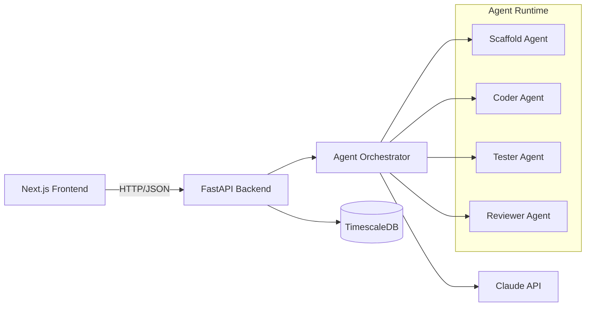

# Backend Integration (Planned)

## Overview

This document outlines the planned integration between the Next.js frontend and the FastAPI backend system.

## Architecture



## API Endpoints (Planned)

### Phase 1: Sketch (Planning)

| Endpoint | Method | Purpose |
|----------|--------|---------|
| `/api/pitch/refine` | POST | AI-refine raw pitch input |
| `/api/personas/generate` | POST | Generate persona suggestions |
| `/api/stories/generate` | POST | Generate user stories from personas |
| `/api/prd/assemble` | POST | Assemble PRD from all inputs |

### Phase 2: Draft (Design)

| Endpoint | Method | Purpose |
|----------|--------|---------|
| `/api/style-guide/generate` | POST | Generate style guide from product type |
| `/api/wireframes/generate` | POST | Generate ASCII wireframes |
| `/api/mockups/render` | POST | Render SVG mockups from wireframes |

### Phase 3: Ink (Build)

| Endpoint | Method | Purpose |
|----------|--------|---------|
| `/api/scaffold/project` | POST | Generate project structure |
| `/api/agents/assign-story` | POST | Assign story to agent |
| `/api/agents/get-status` | GET | Get agent status/output |
| `/api/agents/approve` | POST | Approve agent changes |
| `/api/demo/preview` | GET | Get live preview URL |

### Phase 4: Publish (Ship)

| Endpoint | Method | Purpose |
|----------|--------|---------|
| `/api/deploy/targets` | GET | List deployment targets |
| `/api/deploy/start` | POST | Start deployment |
| `/api/deploy/status` | GET | Get deployment status |

## Data Models

### Project State

```typescript
interface Project {
    id: string;
    userId: string;
    name: string;
    pitch: string;
    personas: Persona[];
    stories: Story[];
    prd: PRDDocument;
    styleGuide: StyleGuide;
    wireframes: Wireframe[];
    mockups: Mockup[];
    scaffold: ProjectStructure;
    currentPhase: 'sketch' | 'draft' | 'ink' | 'publish';
    currentStep: number;
    createdAt: Date;
    updatedAt: Date;
}
```

### Agent Task

```typescript
interface AgentTask {
    id: string;
    projectId: string;
    storyId: string;
    agentType: 'scaffold' | 'coder' | 'tester' | 'reviewer';
    status: 'queued' | 'running' | 'completed' | 'failed';
    output: string;
    changes: FileChange[];
    approved: boolean;
}
```

## Authentication

- **Auth Provider**: NextAuth.js (frontend) → JWT validation (backend)
- **Providers**: Email/password, Google OAuth (planned)
- **Token Strategy**: HTTP-only cookies for session

## Real-Time Communication

For agent dashboard streaming:

- **Tech**: Server-Sent Events (SSE) from FastAPI to Next.js
- **Use Cases**: Agent status updates, streaming code output, deployment logs
- **Fallback**: Polling as backup

## File Storage

| File Type | Storage Location |
|-----------|------------------|
| Project state JSON | TimescaleDB (JSONB column) |
| Generated code | Git repository (one per project) |
| Mockup images | S3-compatible storage |
| Deployed apps | User's chosen platform (Vercel/Railway) |