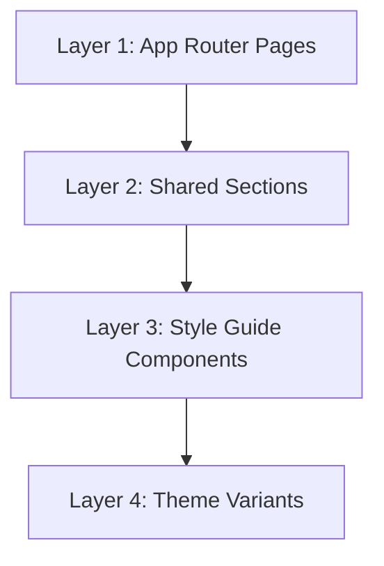

# Component Hierarchy

## Overview

This document describes the **target** component hierarchy for the Next.js application. The current web apps (web/ and web.sumi-e/) are bare scaffolds with no custom components — only the default layout.tsx, page.tsx, and globals.css.

## Current State

```
web/src/app/
├── layout.tsx      # Root layout (default Next.js scaffold)
├── page.tsx        # Homepage (default Next.js scaffold content)
├── globals.css     # Global styles (default)
└── favicon.ico     # Browser icon
```

No custom components, no theme integration, no style guide pages exist yet in the Next.js apps. Design exploration is happening in the static HTML theme directories (see [theme-system.md](theme-system.md)).

## Target: 4-Layer Hierarchy



### Layer 1: App Router Pages (Planned)

**Target location:** `web/src/app/`

Pages will define route structure and phase organization:

- `layout.tsx` — Root layout with metadata and theme provider
- `page.tsx` — Homepage (hero + features)
- `style-guide/{theme}/page.tsx` — Per-theme style guide overview
- Phase routes for the Sketch/Draft/Ink/Publish pipeline

### Layer 2: Shared Sections (Planned)

**Target location:** `web/src/components/sections/`

Reusable page sections: hero, feature lists, CTAs, testimonial cards.

### Layer 3: Style Guide Components (Planned)

**Target location:** `web/src/components/style-guide/`

Documentation components displaying design tokens: color palettes, typography scales, spacing, buttons, cards, inputs, navigation.

### Layer 4: Theme Variants (Planned)

**Target location:** `web/src/components/themes/{variant}/`

Per-theme implementations (14 components x 5 themes = 70 files).

## Target Component Count

| Layer | Components | Unique Files |
|-------|-----------|--------------|
| Layer 1 | 7 | 7 |
| Layer 2 | 8 | 8 |
| Layer 3 | 15 | 15 |
| Layer 4 | 70 (5 themes x 14 components) | 70 |
| **Total** | **100** | **100** |

## Target Theme Resolution

1. `ThemeProvider` reads `data-theme` from `<html>` element
2. Components import from their theme directory based on context
3. CSS variables cascade from the active theme's CSS file
4. Component-specific styles applied via CSS modules
