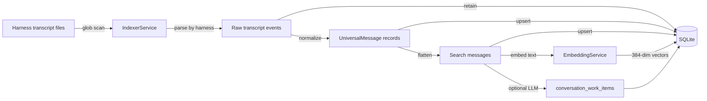
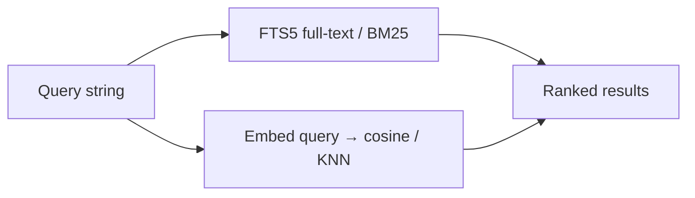

# Data Flow

## Indexing pipeline



1. **Discovery** — IndexerService scans configured harness sources for `*.jsonl`. Defaults: Claude Code (`~/.claude/projects`) and Codex (`~/.codex/sessions`).
2. **Raw retention** — Source records stored as provider-specific `raw_transcript_events`.
3. **Normalization** — Supported importers convert into `UniversalMessage` blocks (transfer / memory / continuation).
4. **Search flattening** — Universal content flattened to text `messages` for FTS + semantic search.
5. **Embedding** — Message text embedded via `all-MiniLM-L6-v2` into sqlite-vec when available.
6. **Work extraction** (optional) — When LlmService is configured, batches of messages may yield `conversation_work_items`.
7. **Watching** — chokidar detects new/changed JSONL; debounced incremental re-index.

Gemini, OpenCode, Aider, and Other source ids are accepted but importer behavior is stubbed until real transcripts exist.

## Search pipeline



- **FTS mode** — SQLite FTS5 with BM25 ranking over message content
- **Semantic mode** — Query embedded; similarity against stored vectors via sqlite-vec

## Client data flow

Web and CLI talk to the API via HTTP `fetch` to `localhost:3100/api/*`. Shared `ensureApi()` auto-starts the API if it is not already healthy. CORS allows the Vite origin `http://localhost:5173`.

`llm-toolkit recent` is a special path: it reads the SQLite DB directly (no API required) for fast recent-session listing.

## Harness transform / session continue

```text
Universal messages
    → harness-transform (Claude / Codex export payloads when supported)
    → session-workflow continuation payload (continue | transfer)
    → memory hook stubs (planned)
```

Cross-harness **transfer** façade still returns pending/warning results until compatibility tests land; transform exporters for Claude and Codex are implemented for continuation readiness.

## skill-manage (out-of-band)

skill-manage does not use the conversation DB. Flow: config + catalog YAML → discover source trees → classify provider install dirs → symlink enable/disable / audit. Invoked via `llm-toolkit skill` or the release binary.

## Record / entity types

Claude JSONL record types (shared): `permission-mode`, `user`, `assistant`, `attachment`, `system`, `file-history-snapshot`, `last-prompt`, `queue-operation`, `custom-title`, `agent-name`.

Canonical: `RawTranscriptEvent`, `UniversalThread`, `UniversalMessage`, `UniversalContentBlock`.

Derived: `Conversation`, `SearchResult`, `ThreadEdit`, `Artifact`, `Dataset`, `DatasetEntry`, `SavedPrompt`, `TagMeta`, `ProjectMeta`, `IndexStatus`, `ConversionCandidate`, `AppConfig`, work items.

Supporting: `SearchOptions` (mode fts|semantic), `TokenUsage`, `QualityLabel` (gold|silver|bronze), `ArtifactType` (agent|skill|command|snippet|runbook).
