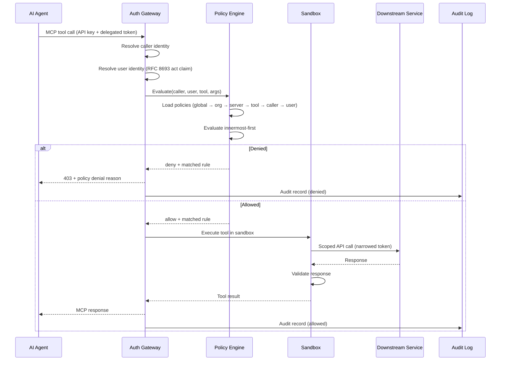

# Data Flow

## Request Lifecycle



## Tool Publishing Flow

```
Define schema → Test in sandbox → Security scan → Publish to registry → Monitor
```

1. **Define** — tool schema (JSON Schema for inputs/outputs), handler, required permissions
2. **Test** — simulation environment with synthetic callers, fuzz testing, permission boundary tests
3. **Scan** — automated checks for injection vectors, credential leaks, unbounded resource access
4. **Publish** — versioned release to registry with rollback
5. **Monitor** — dashboards for latency, error rate, policy denials, anomalous patterns

## Sandbox Isolation

Tools execute in isolated environments with:

- Network policy — explicit allowlist of outbound destinations
- Resource caps — CPU, memory, wall-clock limits per invocation
- Filesystem isolation — no access to host or other tools' state
- Secret injection — credentials injected at runtime via sealed secrets
