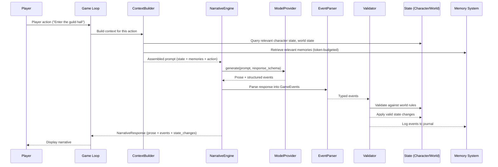

# Data Flow

## Turn Cycle

Every game interaction follows the same cycle: action in, context assembled, LLM called, events parsed, state updated.



## Context Assembly Strategy

The ContextBuilder is the critical path. It selects what context to include in each LLM call:

1. **Always included:** Active character state, current location, active quest objectives
2. **Relevance-scored:** Memories ranked by proximity to current context (location, characters present, active quests)
3. **Token-budgeted:** Total context capped at a configurable token limit; lowest-relevance items dropped first
4. **Recency-biased:** Recent events weighted higher than distant ones

### v0.1 Strategy
Recency-only: last N events + current state. Simple, deterministic, testable.

### v0.2+ Strategy
Hybrid: recency + semantic similarity via vector embeddings. Better for long campaigns where relevant past events may be temporally distant.

## Event Flow

```
Player Action
    ↓
GameEvent (ActionTaken)
    ↓
LLM generates → NarrativeResponse
    ↓
EventParser extracts:
    ├── DialogueStarted(npc="Master Venn")
    ├── QuestProgressed(quest="Iron Silence", stage=2→3)
    └── KnowledgeGained(character="Kael", fact="routes blocked since autumn")
    ↓
Validator checks:
    ├── Does NPC exist at this location? ✓
    ├── Is quest at correct stage for this transition? ✓
    └── Does knowledge contradict world rules? ✓
    ↓
State mutations applied
    ↓
Events appended to Memory journal
```

## State Ownership

| Data | Owner | LLM Access |
|------|-------|------------|
| Character stats, inventory | Character System | Read (via ContextBuilder) |
| World locations, factions | World State Manager | Read (via ContextBuilder) |
| Quest progress | Quest Engine | Read (via ContextBuilder) |
| Narrative prose | LLM | Write (generated per-turn) |
| Game events | EventParser + Validator | Write (extracted from LLM output, validated) |
| Memory summaries | Memory System | Read (via ContextBuilder) |

The LLM never directly mutates state. It proposes state changes via its response; the EventParser extracts them; the Validator approves or rejects them against world rules.
