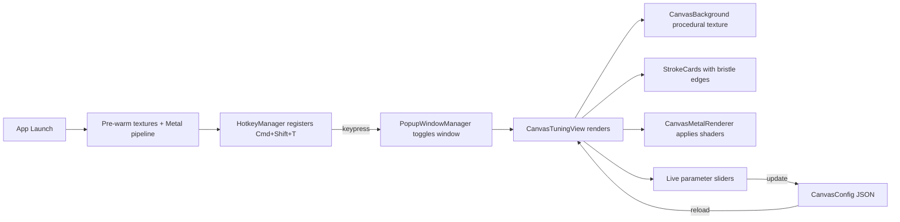
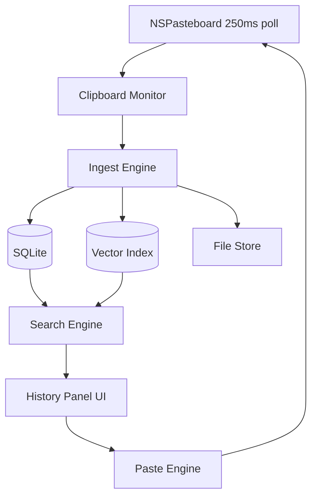

# Data Flow

## Current Implementation (Stage 0.5)

The current build focuses on the canvas render engine tuning UI. The clipboard monitoring and persistence layers are not yet implemented.

## Planned Full Pipeline (Stage 2+)

## Hotkey → Popup Flow

1. `main.swift` — bootstraps `NSApplication` with `.accessory` policy
2. `AppDelegate` — creates `HotkeyManager` and `PopupWindowManager`
3. `HotkeyManager` — installs `CGEventTap` for Cmd+Shift+T, blocks event, fires callback
4. `PopupWindowManager` — creates/toggles a floating `NSWindow` with `CanvasTuningView`
5. Window appears centered, at `.floating` level, on all spaces
