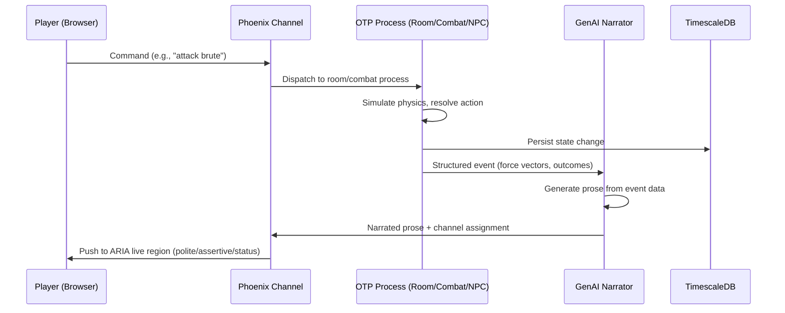

# Data Flow

## Command-to-Narration Pipeline

## Channel Assignment

The backend tags each outbound message with a channel:

| Tag | Client Target | Example |
|-----|--------------|---------|
| `narrative` | `role="log"` polite | "Your blade catches the brute's shoulder..." |
| `alert` | `role="alert"` assertive | "You take 15 damage!" |
| `status` | `role="status"` polite | "Energy restored to full" |

## Real-Time Event Flow

Phoenix Channels (WebSocket) handle all real-time communication:

- **Player commands**: Client pushes to `game:room_id` topic
- **Room events**: Broadcast to all players in the room
- **Private events**: Pushed to player-specific `game:player_id` topic
- **Global events**: Broadcast to `game:world` topic (weather, economy, world events)

## Auth Flow

1. User signs up / logs in via REST (`POST /api/auth/signup`, `POST /api/auth/login`)
2. Backend returns JWT (Guardian-issued)
3. Frontend stores JWT in auth context
4. Subsequent REST calls include `Authorization: Bearer <token>`
5. Channel connections authenticate with token in params
6. Guardian pipeline validates and extracts user on each request

## State Persistence

| Data | Store | Pattern |
|------|-------|---------|
| Player accounts, characters | TimescaleDB | Ecto schemas via contexts (`Boe.Accounts`, `Boe.Game`) |
| Game world state | TimescaleDB | Periodic snapshots from OTP processes |
| NPC memory, relationships | TimescaleDB + AGE | Graph queries via Apache AGE extension |
| Session state | Redis | Ephemeral, TTL-based |
| Real-time pub/sub | Redis | Cross-node event distribution |
